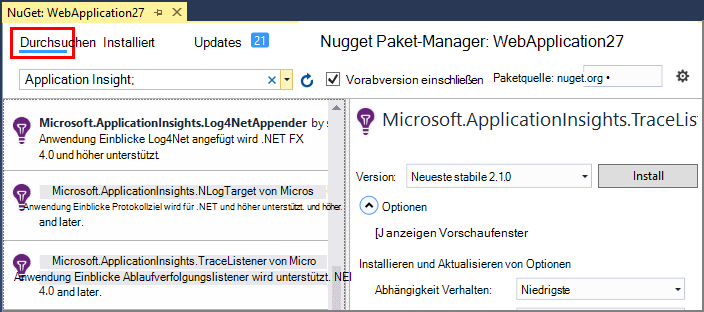
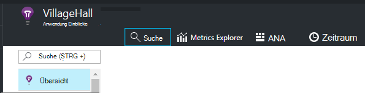
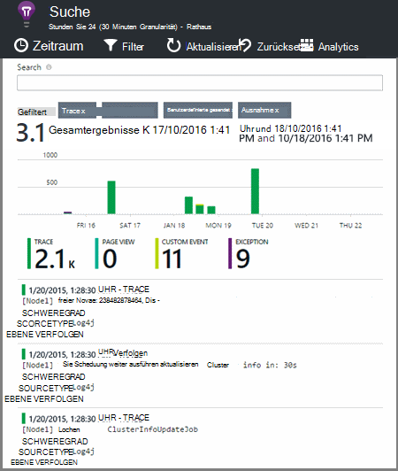

<properties 
    pageTitle="Untersuchen von Ablaufverfolgungsprotokollen Anwendung Einblicke in .NET" 
    description="Suchen Sie mit Trace, NLog oder Log4Net generierten Protokolle." 
    services="application-insights" 
    documentationCenter=".net"
    authors="alancameronwills" 
    manager="douge"/>

<tags 
    ms.service="application-insights" 
    ms.workload="tbd" 
    ms.tgt_pltfrm="ibiza" 
    ms.devlang="na" 
    ms.topic="article" 
    ms.date="07/21/2016" 
    ms.author="awills"/>
 
# <a name="explore-net-trace-logs-in-application-insights"></a>Untersuchen von Ablaufverfolgungsprotokollen Anwendung Einblicke in .NET  

Verwenden Sie NLog, log4Net oder System.Diagnostics.Trace für Diagnoseprotokollierungstypen in Ihrer Anwendung ASP.NET können Sie die Protokolle auf [Visual Studio Application Insights][start], wo Sie durchsuchen und suchen. Die Protokolle werden mit der Anwendung aus, damit jeder Benutzer Anforderung zugeordneten Spuren identifizieren und Korrelation mit anderen Ereignissen und ausnahmeberichte Telemetriedaten zusammengeführt.


> [AZURE.NOTE] Benötigen Erfassung Protokollmoduls? Es ist sinnvoll Adapter für 3rd Party Protokollierungsmodule Sie NLog, log4Net oder System.Diagnostics.Trace bereits verwenden, sollten nur [Anwendung Einblicke TrackTrace()](app-insights-api-custom-events-metrics.md#track-trace) direkt aufzurufen.


## <a name="install-logging-on-your-app"></a>Installieren Sie Ihre Anwendung anmelden

Installieren der gewählten protokollierungsframework im Projekt. Dies sollte ein Eintrag in app.config oder web.config führen.

System.Diagnostics.Trace verwenden, müssen Sie einen Eintrag in web.config hinzuzufügen:

```XML

    <configuration>
     <system.diagnostics>
       <trace autoflush="false" indentsize="4">
         <listeners>
           <add name="myListener" 
             type="System.Diagnostics.TextWriterTraceListener" 
             initializeData="TextWriterOutput.log" />
           <remove name="Default" />
         </listeners>
       </trace>
     </system.diagnostics>
   </configuration>
```

## <a name="configure-application-insights-to-collect-logs"></a>Konfigurieren von Anwendung Berichte Protokolle sammeln

**[Anwendung Erkenntnisse zu Ihrem Projekt hinzufügen](app-insights-asp-net.md)** , wenn Sie dies noch nicht getan haben. Sie sehen eine Option zum Kollektor Protokoll enthalten.

Oder **Anwendung Einblicke konfigurieren** mit der rechten Maustaste auf das Projekt im Projektmappen-Explorer. Wählen Sie die Option **Configure Trace**-Auflistung.

*Keine Anwendung Einblicke Menü oder Log Collector Option?* Versuchen Sie [zur Problembehandlung](#troubleshooting).


## <a name="manual-installation"></a>Manuelle installation

Verwenden Sie diese Methode, wenn Projekttyp vom Application Insights-Installationsprogramm (z. B. ein Windows Desktopprojekt) nicht unterstützt wird. 

1. Wenn Sie log4Net oder NLog verwenden möchten, installieren Sie es in Ihrem Projekt. 
2. Im Projektmappen-Explorer mit der rechten Maustaste des Projekts, und wählen Sie **NuGet-Pakete verwalten**.
3. Suchen Sie nach "Application Insights"

    

4. Wählen Sie das entsprechende Paket - eines:
  + Microsoft.ApplicationInsights.TraceListener (für System.Diagnostics.Trace Anrufe aufzeichnen)
  + Microsoft.ApplicationInsights.NLogTarget
  + Microsoft.ApplicationInsights.Log4NetAppender

NuGet-Paket installiert die erforderlichen Assemblys und ändert auch web.config oder app.config.

## <a name="insert-diagnostic-log-calls"></a>Diagnoseprotokoll Aufrufe einfügen

Verwenden von System.Diagnostics.Trace wäre ein normaler Aufruf:

    System.Diagnostics.Trace.TraceWarning("Slow response - database01");

Bevorzugen Sie log4net oder NLog:

    logger.Warn("Slow response - database01");


## <a name="using-the-trace-api-directly"></a>Trace-API verwenden direkt

Sie können Application Insights Trace API direkt aufrufen. Die Protokollierung Adapter verwenden diese API. 

Zum Beispiel:

    var telemetry = new Microsoft.ApplicationInsights.TelemetryClient();
    telemetry.TrackTrace("Slow response - database01");

Ein Vorteil des TrackTrace ist, dass Sie relativ lange Daten in die Nachricht einfügen können. Beispielsweise konnte Postbackdaten codieren. 

Darüber hinaus können Sie einen Schweregrad zu Ihrer Nachricht hinzufügen. Und wie andere Telemetrie können Sie Eigenschaftswerte, die Sie verwenden können, Filter oder Suche für verschiedene Spuren hinzufügen. Zum Beispiel:


    var telemetry = new Microsoft.ApplicationInsights.TelemetryClient();
    telemetry.TrackTrace("Slow database response",
                   SeverityLevel.Warning,
                   new Dictionary<string,string> { {"database", db.ID} });

Auf diese Weise können Sie [Suche][diagnostic], einfach alle Nachrichten mit einem bestimmten Schweregrad für eine bestimmte Datenbank filtern.

## <a name="explore-your-logs"></a>Untersuchen Sie die Protokolle

Führen Sie die Anwendung im Debugmodus oder Bereitstellen Sie live.

In Ihrer Anwendung Übersicht Blade [Application Insights-Portal][portal], wählen Sie [Suche][diagnostic].





Sie können zum Beispiel:

* Protokoll Spuren oder Elemente mit bestimmten Eigenschaften filtern
* Untersuchen Sie ein bestimmtes Element im Detail.
* Finden andere Telemetriedaten auf der gleichen benutzeranforderung (d. h. mit derselben OperationId) 
* Speichern Sie die Konfiguration dieser Seite als Favorit

> [AZURE.NOTE] **Sampling.** Wenn Ihre Anwendung große Datenmengen sendet und Application Insights SDK für ASP.NET Version 2.0.0-beta3 oder höher verwenden, kann adaptive Sampling-Funktion ausgeführt werden und nur einen Teil der Telemetrie. [Erfahren Sie mehr über Sampling.](app-insights-sampling.md)

## <a name="next-steps"></a>Nächste Schritte

[Diagnostizieren von Fehlern und Ausnahmen in ASP.NET][exceptions]

[Weitere Informationen zur Suche][diagnostic].


## <a name="troubleshooting"></a>Problembehandlung

### <a name="how-do-i-do-this-for-java"></a>Wie mache ich dies für Java?

[Java-Protokoll Adapter](app-insights-java-trace-logs.md)verwenden.

### <a name="theres-no-application-insights-option-on-the-project-context-menu"></a>Keine Anwendung Einblicke Option im Kontextmenü Projekt

* Überprüfen Sie Application Insights-Tools auf dieser Entwicklungscomputer installiert ist. Suchen Sie Tools für Einblicke in Visual Studio im Menü Tools Extensions und Updates. Wenn es nicht in die Registerkarte installiert Registerkarte Online und installieren.
* Möglicherweise ein Application Insights-Tools nicht unterstützt. Verwenden Sie [Manuelle Installation](#manual-installation).

### <a name="no-log-adapter-option-in-the-configuration-tool"></a>Kein Protokoll Adapter Option im Konfigurationsprogramm

* Sie müssen zunächst das protokollierungsframework installieren.
* Wenn Sie System.Diagnostics.Trace verwenden, müssen Sie [konfiguriert in `web.config` ](https://msdn.microsoft.com/library/system.diagnostics.eventlogtracelistener.aspx).
* Haben Sie die neueste Version des Tools Application Insights? Klicken Sie im Visual Studio- **Tools** wählen Sie **Erweiterungen und Updates**und **Updates** zur Registerkarte. Wenn Application Insights-Tools ist es, sie aktualisieren klicken.


### <a name="emptykey"></a>Eine Fehlermeldung "instrumentationsschlüssel darf nicht leer sein"

Sieht aus wie das Protokollierung Adapter Nuget-Paket installiert, ohne Anwendung Einblicke.

Im Projektmappen-Explorer mit der rechten Maustaste `ApplicationInsights.config` , und wählen Sie **Update Application Insights**. Sie erhalten einen Dialog, der lädt Azure anmelden und Application Insights-Ressource erstellen oder eine vorhandene erneut verwenden. Das sollte es beheben.

### <a name="i-can-see-traces-in-diagnostic-search-but-not-the-other-events"></a>Spuren Diagnose suchen, aber nicht die anderen Ereignisse können angezeigt werden.

Es kann manchmal für alle Ereignisse und Anfragen zu Pipeline länger dauern.

### <a name="limits"></a>Wie viele Daten gespeichert?

Bis zu 500 Ereignisse pro Sekunde bei jeder Anwendung. Ereignisse werden sieben Tage lang aufbewahrt.

### <a name="im-not-seeing-some-of-the-log-entries-that-i-expect"></a>Nicht Teil der Protokolleinträge angezeigt, die erwartungsgemäß

Wenn Ihre Anwendung große Datenmengen sendet und Application Insights SDK für ASP.NET Version 2.0.0-beta3 oder höher verwenden, kann adaptive Sampling-Funktion ausgeführt werden und nur einen Teil der Telemetrie. [Erfahren Sie mehr über Sampling.](app-insights-sampling.md)

## <a name="add"></a>Nächste Schritte

* [Verfügbarkeit und Reaktionsfähigkeit Tests einrichten][availability]
* [Problembehandlung][qna]


<!--Link references-->

[availability]: app-insights-monitor-web-app-availability.md
[diagnostic]: app-insights-diagnostic-search.md
[exceptions]: app-insights-asp-net-exceptions.md
[portal]: https://portal.azure.com/
[qna]: app-insights-troubleshoot-faq.md
[start]: app-insights-overview.md

 
