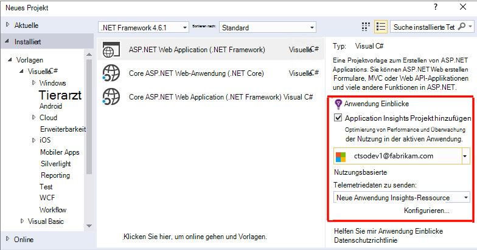
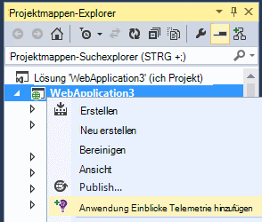
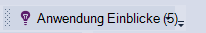
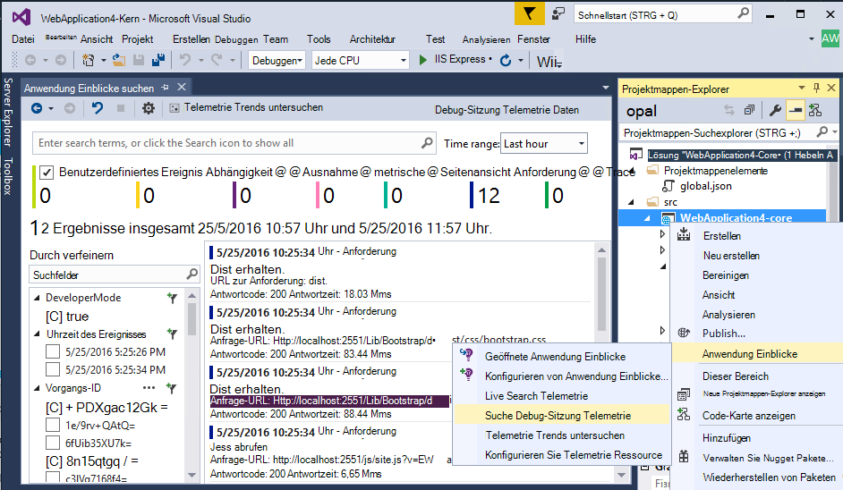
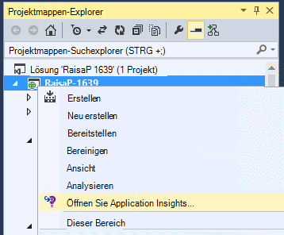
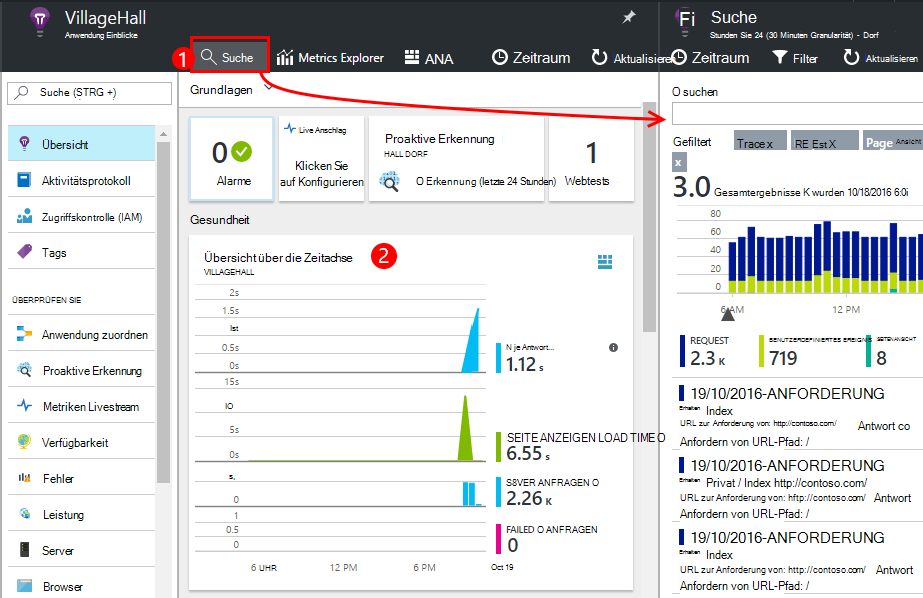
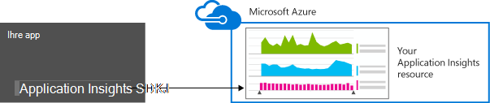
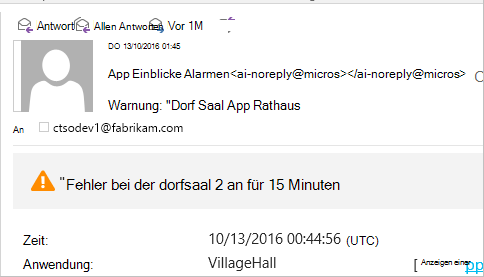
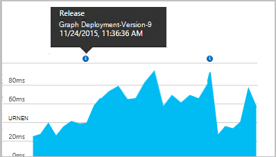
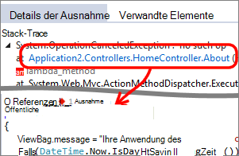

<properties 
    pageTitle="Web app Analytics für ASP.NET Anwendung zum Einrichten | Microsoft Azure" 
    description="Konfigurieren von Performance, Verfügbarkeit und Verwendungsanalyse für die Website ASP.NET lokal gehostet oder in Azure." 
    services="application-insights" 
    documentationCenter=".net"
    authors="NumberByColors" 
    manager="douge"/>

<tags 
    ms.service="application-insights" 
    ms.workload="tbd" 
    ms.tgt_pltfrm="ibiza" 
    ms.devlang="na" 
    ms.topic="get-started-article" 
    ms.date="10/13/2016" 
    ms.author="awills"/>


# <a name="set-up-application-insights-for-aspnet"></a>Einrichten von Application Insights für ASP.NET

[Visual Studio Application Insights](app-insights-overview.md) überwacht die aktiven Anwendung zu [erkennen und zu diagnostizieren, Performance-Probleme und Ausnahmen](app-insights-detect-triage-diagnose.md)und [entdecken Sie, wie Ihre Anwendung verwendet wird](app-insights-overview-usage.md).  Eigenen lokalen IIS-Server oder auf Cloud VMs Azure webapps funktioniert für apps befinden.


## <a name="before-you-start"></a>Bevor Sie beginnen

Du brauchst:

* Visual Studio 2013-Update 3 oder höher. Höher ist besser.
* Ein [Microsoft Azure-](http://azure.com)Abonnement. Hat das Team oder die Organisation Azure-Abonnement, kann der Besitzer Sie hinzufügen, Ihr [Microsoft-Konto](http://live.com). 

Gibt alternative Artikel betrachten, wenn Sie interessiert sind:

* [Instrumentieren einer Webanwendung zur Laufzeit](app-insights-monitor-performance-live-website-now.md)
* [Azure Cloud services](app-insights-cloudservices.md)

## <a name="ide"></a>1. Fügen Sie 1. Application Insights SDK


### <a name="if-its-a-new-project"></a>Ist ein neues Projekt...

Sicherstellen Sie, dass beim Erstellen eines neuen Projekts in Visual Studio Application Insights ausgewählt ist. 





### <a name="-or-if-its-an-existing-project"></a>... oder ein vorhandenes Projekt

Mit der rechten Maustaste im Projektmappen-Explorer des Projekts, und wählen Sie **Anwendung Einblicke Telemetrie hinzufügen** oder **Konfigurieren von Anwendung Einblicke**.



* ASP.NET Core-Projekt? - [Gehen einige Codezeilen zu beheben](https://github.com/Microsoft/ApplicationInsights-aspnetcore/wiki/Getting-Started#add-application-insights-instrumentation-code-to-startupcs). 


## <a name="run"></a>2. Führen Sie Ihre Anwendung

Führen Sie die Anwendung mit F5 und ausprobieren: unterschiedliche Seiten um einige Telemetriedaten zu generieren.

In Visual Studio finden Sie unter Anzahl der Ereignisse, die protokolliert wurden. 



## <a name="3-see-your-telemetry"></a>3. der Telemetrie anzeigen

### <a name="-in-visual-studio"></a>in Visual Studio

Öffnen Sie das Fenster Anwendung Einblicke in Visual Studio: Klicken Sie auf Anwendung Einblicke oder Maustaste im Projektmappen-Explorer:



Diese Ansicht zeigt Telemetrie in der Serverseite der Anwendung generiert. Experimentieren Sie mit den Filtern und auf beliebiges Ereignis, um weitere Details anzuzeigen.

[Erfahren Sie mehr über Application Insights-Tools in Visual Studio](app-insights-visual-studio.md).

<a name="monitor"></a> 
### <a name="-in-the-portal"></a>im Portal...

Wenn *SDK installieren,* haben auch Telemetrie Anwendung Einblicke Webportal angezeigt. 

Das Portal verfügt über mehrere Diagramme Analysetools und Dashboards als Visual Studio. 


Öffnen Sie Application Insights-Ressource in [Azure-Portal](https://portal.azure.com/).



Das Portal in einer Ansicht Telemetriedaten aus Ihrer app wird geöffnet:

* Die erste Telemetrie wird im [Livestream Metriken](app-insights-metrics-explorer.md#live-metrics-stream).
* Einzelne Ereignisse **Suchen** (1) angezeigt. Daten dauert einige Minuten angezeigt werden. Klicken Sie auf ein Ereignis, um seine Eigenschaften anzuzeigen. 
* Aggregierte Metriken werden in Diagrammen (2). Es dauert ein oder zwei Minuten Daten hier angezeigt. Klicken Sie auf Diagramme öffnen eine-Blade mit mehr Details.

[Weitere Informationen über die Anwendung Einblicke in Azure-Portal](app-insights-dashboards.md).

## <a name="4-publish-your-app"></a>4. app veröffentlichen

Veröffentlichen Sie Ihre app auf dem IIS-Server oder in Azure. Beobachten Sie [Metriken Livestream](app-insights-metrics-explorer.md#live-metrics-stream) um sicherzustellen, dass alles läuft.

Sie sehen die Telemetrie im Application Insights-Portal, wo Sie Metriken überwachen, suchen die Telemetrie und [Dashboards](app-insights-dashboards.md)eingerichtet. Sie können auch die leistungsfähige [Analysen Abfragesprache](app-insights-analytics.md) oder bestimmte Ereignisse analysieren, Auslastung und Performance. 

Sie können auch die Telemetrie in [Visual Studio](app-insights-visual-studio.md) mit Diagnose suchen und [Trends](app-insights-visual-studio-trends.md)zu analysieren.

> [AZURE.NOTE] Sendet Ihre app genügend Telemetrie [Drosselung Grenzwerten](app-insights-pricing.md#limits-summary)nähert, schaltet automatisch [Sampling](app-insights-sampling.md) . Probenahme reduziert die Telemetrie Beibehaltung korrelierte Daten um zu Diagnosezwecken von Ihrer Anwendung gesendet.


##<a name="land"></a>Was Insights der hinzufügen-Anwendung?

Application Insights sendet Telemetrie aus Ihrer app Application Insights-Portal (die in Microsoft Azure gehostet wird):



So wurde der Befehl drei Dinge:

1. Das Anwendung Einblicke Web SDK NuGet-Paket zum Projekt hinzufügen Um in Visual Studio angezeigt, Maustaste auf das Projekt und NuGet-Pakete verwalten.
2. Erstellen Sie eine Ressource Anwendung Einblicke in [Azure-Portal](https://portal.azure.com/). Dies ist, wo Ihre Daten sehen. Die *instrumentationsschlüssel* identifiziert die Ressource abgerufen.
3. Fügt den instrumentationsschlüssel in `ApplicationInsights.config`, das SDK Telemetrie zum Portal senden kann.

Wenn Sie möchten, möglich folgendermaßen manuell für [ASP.NET 4](app-insights-windows-services.md) oder [ASP.NET Core](https://github.com/Microsoft/ApplicationInsights-aspnetcore/wiki/Getting-Started).

### <a name="to-upgrade-to-future-sdk-versions"></a>Aktualisierung auf künftige SDK-Versionen

Upgrade auf eine [neue Version des SDK](https://github.com/Microsoft/ApplicationInsights-dotnet-server/releases)NuGet-Paket-Manager erneut öffnen und installierten Pakete filtern. Microsoft.ApplicationInsights.Web und wählen Sie aktualisieren.

Wenn Sie ApplicationInsights.config angepasst haben, Speichern einer Kopie aktualisieren und anschließend die neue Version Zusammenführen ändern

## <a name="add-more-telemetry"></a>Fügen Sie weitere Telemetrie

### <a name="web-pages-and-single-page-apps"></a>Webseiten und einseitigen apps

1. [Hinzufügen der JavaScript-Ausschnitt](app-insights-javascript.md) Webseiten zu Browser und Verwendung klingen Daten Seitenansichten Ladezeiten Browser Ausnahmen, AJAX Aufruf Performance Anzahl Benutzer und Sitzung.
2. [Benutzerdefinierte Ereignisse Code](app-insights-api-custom-events-metrics.md) Count, Zeit oder Benutzeraktionen messen.

### <a name="dependencies-exceptions-and-performance-counters"></a>Abhängigkeiten, Ausnahmen und Leistungsindikatoren

[Statusmonitor installieren](app-insights-monitor-performance-live-website-now.md) auf den Servercomputern zu zusätzlichen Telemetrie über Ihre app. Dies ist das Ergebnis:

* [Leistungsindikatoren für](app-insights-performance-counters.md) - 
CPU, Speicher, Festplatte und andere Leistungsindikatoren für Ihre Anwendung. 
* [Ausnahmen](app-insights-asp-net-exceptions.md) - detailliertere Telemetrie für Ausnahmen.
* [Dependencies](app-insights-asp-net-dependencies.md) - Aufrufe von REST-API oder SQL-Dienste. Herausfinden Sie, ob langsame Antworten von externen Komponenten in Ihrer Anwendung Leistungsprobleme verursacht werden. (Wenn Ihre Anwendung auf .NET 4.6 ausgeführt wird, brauchen Sie nicht diese Telemetrie zu überwachen.)

### <a name="diagnostic-code"></a>Fehlercode

Sie haben ein Problem? Wenn Sie Code in Ihrer Anwendung zu diagnostizieren einfügen möchten, haben Sie mehrere Optionen:

* [Erfassung Protokoll Spuren](app-insights-asp-net-trace-logs.md): Wenn Sie bereits Log4N, NLog oder System.Diagnostics.Trace verwenden Ablaufverfolgungsereignissen anmelden und dann die Ausgabe an Application Insights gesendet werden kann, damit Anfragen korrelieren, durchsuchen und analysieren. 
* [Benutzerdefinierte Ereignisse und Metriken](app-insights-api-custom-events-metrics.md): mit Trackevent()"und TrackMetric() Server oder Webseitencode.
* [Tag Telemetrie mit zusätzlichen Eigenschaften](app-insights-api-filtering-sampling.md#add-properties)

Verwenden Sie [Suche](app-insights-diagnostic-search.md) suchen und Korrelation von Ereignissen und [Analysen](app-insights-analytics.md) für komplexere Abfragen.

## <a name="alerts"></a>Alarme

Werden Sie Wenn Ihre app Probleme informiert. (Warten Sie nicht, bis die Benutzer sagen!) 

* [Webtests erstellen](app-insights-monitor-web-app-availability.md) , stellen Sie sicher, dass Ihre Site im Web angezeigt wird.
* [Proaktive](app-insights-proactive-diagnostics.md) Diagnose automatisch (Wenn Ihre app eine bestimmte minimale Datenmenge). Sie müssen nichts Unternehmen, um diese einrichten. Sie sagen Ihnen, wenn Ihre Anwendung eine ungewöhnliche Anforderungsfehler hat.
* [Metrische Alarm festlegen](app-insights-alerts.md) Sie warnt, wenn eine Metrik einen Schwellenwert überschreitet. Sie können sie benutzerdefinierte Kennzahlen, Code in Ihrer Anwendung festlegen.

Standardmäßig werden Benachrichtigung an den Besitzer der Azure-Abonnement gesendet. 



## <a name="version-and-release-tracking"></a>Versions- und Überwachung

### <a name="track-application-version"></a>Version der Anwendung verfolgen

Stellen Sie sicher, dass `buildinfo.config` von MSBuild-Prozess generiert. Fügen Sie der CSPROJ-Datei hinzu:  

```XML

    <PropertyGroup>
      <GenerateBuildInfoConfigFile>true</GenerateBuildInfoConfigFile>    <IncludeServerNameInBuildInfo>true</IncludeServerNameInBuildInfo>
    </PropertyGroup> 
```

Wenn sie die Build-Informationen enthält, fügt Webmodul Application Insights **Anwendungsversion** als Eigenschaft für jedes Element der Telemetrie. Mit der Sie zum Filtern nach Version bei [Diagnose suchen](app-insights-diagnostic-search.md) oder wenn [Metriken untersuchen](app-insights-metrics-explorer.md). 

Beachten Sie jedoch, dass die Buildnummer der Version von MS-Build nicht vom Entwickler Build in Visual Studio generiert wird.

### <a name="release-annotations"></a>Freigeben von Notizen

Bei Verwendung von Visual Studio Team Services können Sie [einen Anmerkung Marker abrufen](app-insights-annotations.md) zu Diagrammen hinzugefügt werden, wenn eine neue Version.




## <a name="next-steps"></a>Nächste Schritte

| | 
|---|---
|**[Arbeiten mit Anwendung Einblicke in Visual Studio](app-insights-visual-studio.md)**<br/>Debuggen mit Telemetrie Diagnose suchen, drill-through Code.|
|**[Arbeiten mit Application Insights-portal](app-insights-dashboards.md)**<br/>Exportieren von Dashboards, Diagnose- und analytische Werkzeuge, Alarme live Abhängigkeit Übersicht Ihrer Anwendung und Telemetrie. |
|**[Weitere Daten hinzufügen](app-insights-asp-net-more.md)**<br/>Verwendung Verfügbarkeit abhängig, Ausnahmen zu überwachen. Integrieren Sie Spuren von Protokollierung Frameworks. Schreiben Sie benutzerdefinierter Telemetrie. | 


