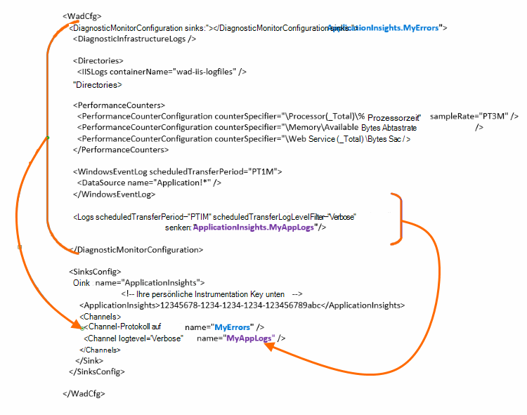

<properties
    pageTitle="Azure Diagnoseprotokolle an Application Insights senden"
    description="Konfigurieren Sie die Details der Diagnoseprotokolle Azure Cloud Services, die Application Insights-Portal an."
    services="application-insights"
    documentationCenter=".net"
    authors="sbtron"
    manager="douge"/>

<tags
    ms.service="application-insights"
    ms.workload="tbd"
    ms.tgt_pltfrm="ibiza"
    ms.devlang="na"
    ms.topic="article"
    ms.date="11/17/2015"
    ms.author="awills"/>

# <a name="configure-azure-diagnostic-logging-to-application-insights"></a>Konfigurieren von Azure Diagnoseprotokolliergrad Anwendung Einblicke

Beim Einrichten eines Cloud-Services oder einen virtuellen Computer in Microsoft Azure [Azure können Diagnoseprotokoll](../vs-azure-tools-diagnostics-for-cloud-services-and-virtual-machines.md). Sie können dies an gesendet Anwendung Einblicke mit Diagnose- und Verwendung Telemetrie vom gesendeten innerhalb der app Application Insights SDK zu analysieren. Das Azure enthält Ereignisse bei der Verwaltung der app wie Start, Stop, Abstürze sowie Leistungsindikatoren. Das Protokoll enthält auch Aufrufe in der app System.Diagnostics.Trace.

Konfiguration der Diagnose Erfassung ausführlich beschrieben.

Sie benötigen Azure SDK 2.8 in Visual Studio installiert.

## <a name="get-an-application-insights-resource"></a>Abrufen einer Application Insights-Ressource

Für die beste Erfahrung, [Application Insights SDK für jede Rolle der app Cloud-Dienste hinzufügen](app-insights-cloudservices.md)oder [Was App Ausführen der virtuellen Computer](app-insights-overview.md). Sie können dann die Diagnosedaten analysiert werden und dieselbe Anwendung Einblicke Ressource angezeigt.

Möchten Sie das SDK - Wenn die app bereits live - Alternativ beispielsweise nur [eine neue Anwendung Einblicke erstellen](app-insights-create-new-resource.md) in Azure-Portal. Wählen Sie den Anwendungstyp **Azure-Diagnose** .


## <a name="send-azure-diagnostics-to-application-insights"></a>Senden von Azure Diagnostics Anwendung Einblicke

Wenn Sie Ihre app-Projekt aktualisieren können, dann in Visual Studio wählen Sie jede Rolle aus wählen Sie seine Eigenschaften und wählen Sie auf der Registerkarte Konfiguration **Senden Diagnose Anwendung Einblicke**.

Wenn Ihre Anwendung bereits aktiv ist, verwenden Sie Visual Studio Server-Explorer oder Clouddienste Explorer Eigenschaften der Anwendung. Wählen Sie **Diagnostics Application Insights senden**.

In jedem Fall ausführliche Application Insights-Ressource müssen Sie erstellten.

[Weitere Informationen zum Einrichten der Anwendung Einblicke für Cloud-Services-Anwendung](app-insights-cloudservices.md).

## <a name="configuring-the-azure-diagnostics-adapter"></a>Konfiguration von Azure Diagnostics-adapter

Lesen Sie nur Teile des Protokolls auswählen, die an Application Insights senden möchten. Standardmäßig alles geht, darunter: Microsoft Azure Ereignisse; Leistungsindikatoren; Aufrufe der App System.Diagnostics.Trace zu verfolgen.

Azure-Diagnose speichert Daten in Azure Tabellen. Allerdings können Sie auch alle Pipe oder eine Teilmenge der Daten Anwendung Einblicke "senken" und "Kanäle" in Ihrer Konfiguration konfigurieren, bei Azure Diagnostics Erweiterung 1.5 oder höher.

### <a name="configure-application-insights-as-a-sink"></a>Konfigurieren von Anwendung Einblicke als Senke

Wenn Sie die Eigenschaften festlegen "Daten an Application Insights senden" verwenden, fügt das Azure SDK (2.8 oder höher) eine `<SinksConfig>` Element in öffentlichen [Azure-Diagnose-Konfigurationsdatei](https://msdn.microsoft.com/library/azure/dn782207.aspx) der Rolle.

`<SinksConfig>`definiert zusätzliche Senke, Azure Diagnostics Daten gesendet werden können.  Beispiel `SinksConfig` wie folgt:

```xml

    <SinksConfig>
     <Sink name="ApplicationInsights">
      <ApplicationInsights>{Insert InstrumentationKey}</ApplicationInsights>
      <Channels>
        <Channel logLevel="Error" name="MyTopDiagData"  />
        <Channel logLevel="Verbose" name="MyLogData"  />
      </Channels>
     </Sink>
    </SinksConfig>

```

Die `ApplicationInsights` Element gibt den instrumentationsschlüssel Application Insights-Ressource identifiziert, die Azure Diagnosedaten gesendet. Wenn Sie die Ressource auswählen, es wird automatisch gefüllt basierend auf den `APPINSIGHTS_INSTRUMENTATIONKEY` Konfiguration. (Wenn Sie manuell festlegen möchten, erhalten Sie den Schlüssel aus der Dropdownliste Essentials Ressource.)

`Channels`Definieren Sie die Daten, die an den Empfänger gesendet werden. Der Kanal verhält sich wie ein Filter. Die `loglevel` Attribut können Sie die Protokollierungsstufe angeben, die der Kanal senden. Mögliche Werte sind: `{Verbose, Information, Warning, Error, Critical}`.

### <a name="send-data-to-the-sink"></a>Senden von Daten an den Empfänger

Senden Sie Daten Einblicke Anwendung durch Hinzufügen des Attributs senken unter dem Knoten DiagnosticMonitorConfiguration sinken. Jeder Knoten senken Element hinzufügen gibt an, dass Sie Daten, und jeder Knoten wird an den angegebenen Empfänger gesendet werden.

Beispielsweise ist der Standardwert von Azure SDK erstellte Azure Diagnosedaten senden:

```xml

    <DiagnosticMonitorConfiguration overallQuotaInMB="4096" sinks="ApplicationInsights">
```

Aber wenn Sie nur Fehlerprotokolle möchten qualifiziert die Senke mit einem Kanalnamen:

```xml

    <DiagnosticMonitorConfiguration overallQuotaInMB="4096" sinks="ApplicationInsights.MyTopDiagdata">
```

Beachten Sie, dass wir den Namen der Empfänger verwenden, die, zusammen mit dem Namen eines Kanals, denen definiert über definiert.

Wenn Sie ausführliche Anwendungsprotokolle an Application Insights senden wollte Attributs senken, Hinzufügen der `Logs` Knoten.

```xml

    <Logs scheduledTransferPeriod="PT1M" scheduledTransferLogLevelFilter="Verbose" sinks="ApplicationInsights.MyLogData"/>
```

In der Konfiguration auf verschiedenen Ebenen in der Hierarchie können Sie Spülbecken auch. In diesem Fall fungiert die Senke auf der obersten Ebene der Hierarchie angegeben als globale Einstellung einzelnes Element Element wirkt wie überschreibt diese globale Einstellung angegeben.

Hier ist ein vollständiges Beispiel öffentliche Datei, die alle Fehler an Application Insights sendet (unter der `DiagnosticMonitorConfiguration` Knoten) und außerdem ausführliche Ebene für die Anwendungsprotokolle (unter der `Logs` Knoten).

```xml

    <WadCfg>
     <DiagnosticMonitorConfiguration overallQuotaInMB="4096"
       sinks="ApplicationInsights.MyTopDiagData"> <!-- All info below sent to this channel -->
      <DiagnosticInfrastructureLogs />
      <PerformanceCounters>
        <PerformanceCounterConfiguration counterSpecifier="\Processor(_Total)\% Processor Time" sampleRate="PT3M" sinks="ApplicationInsights.MyLogData/>
        <PerformanceCounterConfiguration counterSpecifier="\Memory\Available MBytes" sampleRate="PT3M" />
        <PerformanceCounterConfiguration counterSpecifier="\Web Service(_Total)\Bytes Total/Sec" sampleRate="PT3M" />
      </PerformanceCounters>
      <WindowsEventLog scheduledTransferPeriod="PT1M">
        <DataSource name="Application!*" />
      </WindowsEventLog>
      <Logs scheduledTransferPeriod="PT1M" scheduledTransferLogLevelFilter="Verbose"
            sinks="ApplicationInsights.MyLogData"/>
       <!-- This specific info sent to this channel -->
     </DiagnosticMonitorConfiguration>

     <SinksConfig>
      <Sink name="ApplicationInsights">
        <ApplicationInsights>{Insert InstrumentationKey}</ApplicationInsights>
        <Channels>
          <Channel logLevel="Error" name="MyTopDiagData"  />
          <Channel logLevel="Verbose" name="MyLogData"  />
        </Channels>
      </Sink>
     </SinksConfig>
    </WadCfg>
```



Es gibt einige Nachteile über diese Funktionen:

* Kanäle dienen lediglich als Protokolltyp und keine Leistungsindikatoren arbeiten. Wenn Sie einen Kanal mit einem Leistungsindikatorelement angeben werden ignoriert.
* Die Protokollebene für einen Kanal darf nicht überschreiten die Protokollebene für von Azure Diagnostics gesammelt werden. Beispiel: nicht Anwendungsprotokoll Fehler im Element Protokolle sammeln und Verbose senden möchten Protokolle Application Insight synchronisieren. Das ScheduledTransferLogLevelFilter-Attribut muss immer gleich sammeln oder weitere Protokolle als Protokolle soll an einen Empfänger senden.
* BLOB-Daten können nicht an Application Insights von Azure Diagnostics Erweiterung senden. Beispielsweise etwas unter dem Knoten Verzeichnisse angegeben. Für Absturzabbildern tatsächliche Absturzabbild weiterhin erhalten BLOB-Speicher und nur eine Benachrichtigung, dass das Speicherabbild erzeugt wurde an Application Insights gesendet.

## <a name="related-topics"></a>Verwandte Themen

* [Überwachen von Azure Cloud Services Anwendung Einblicke](app-insights-cloudservices.md)
* [Mithilfe von PowerShell Azure Diagnostics an Application Insights senden](app-insights-powershell-azure-diagnostics.md)
* [Azure Diagnostics-Konfigurationsdatei](https://msdn.microsoft.com/library/azure/dn782207.aspx)
