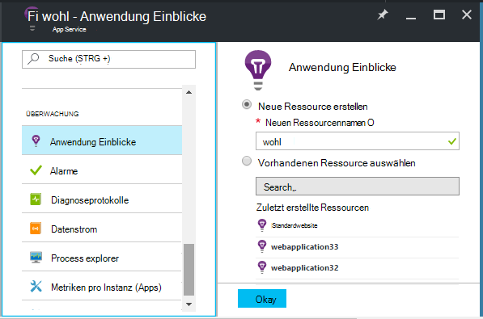
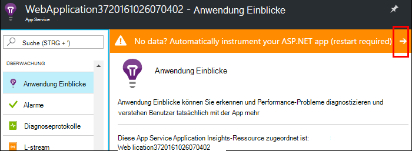
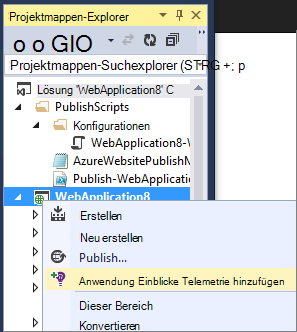
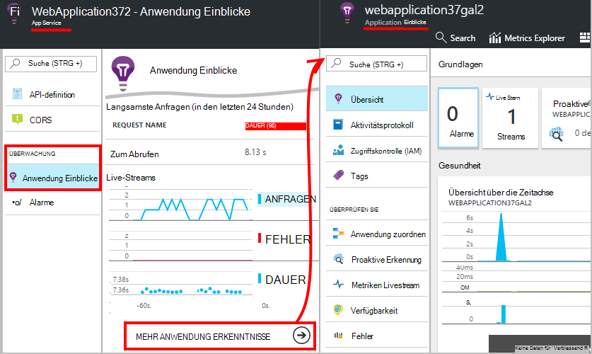
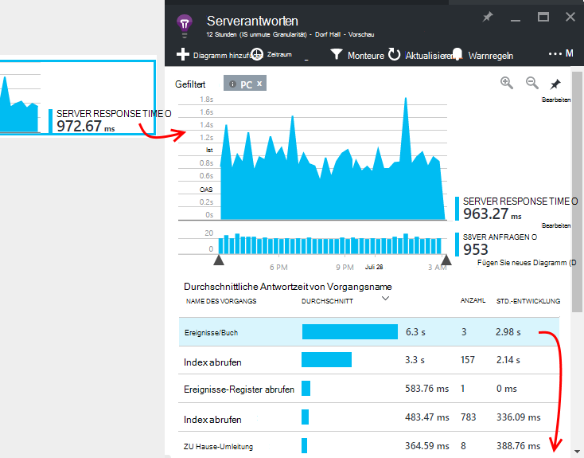
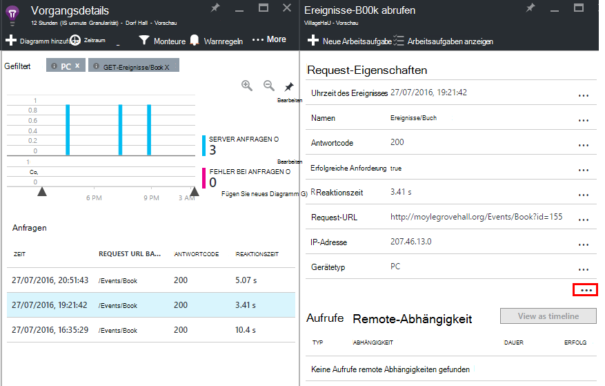

<properties
    pageTitle="Azure Web app Leistung überwachen | Microsoft Azure"
    description="Überwachung von Azure webapps Anwendungsperformance. Diagramm laden und Reaktionszeit Abhängigkeitsinformationen und Alarme Leistung."
    services="application-insights"
    documentationCenter=".net"
    authors="alancameronwills"
    manager="douge"/>

<tags
    ms.service="azure-portal"
    ms.workload="na"
    ms.tgt_pltfrm="na"
    ms.devlang="na"
    ms.topic="article"
    ms.date="10/24/2016"
    ms.author="awills"/>

# Überwachen der Leistung von Azure Web app

In der [Azure-Portal](https://portal.azure.com) können Sie Leistungsindikatoren für [Azure webapps](../app-service-web/app-service-web-overview.md)Anwendung einrichten. [Visual Studio Application Insights](app-insights-overview.md) Instrumente Ihre app Telemetrie über Aktivitäten Service Application Insights senden, wo sie gespeichert und analysiert werden. Dort können metrischen Diagramme und Suchtools Probleme diagnostizieren, Leistung und Verwendung bewerten verwendet werden.

## Laufzeit oder Zeit

Sie können die Überwachung durch das Instrumentieren der Anwendung auf zwei Arten konfigurieren:

* **Laufzeit** - wählen Sie einen der Systemmonitor-Erweiterung bei Ihrer Anwendung bereits aktiv ist. Es ist nicht notwendig, oder installieren Ihre Anwendung. Sie erhalten eine Reihe von Paketen, die Reaktionszeiten Erfolgsraten, Ausnahmen, Abhängigkeiten, und überwachen. 
 
* **Zeit** - Sie können ein Paket in Ihre app Development. Diese Option ist vielseitiger. Neben den gleichen Standardpakete schreiben Sie Code, die Telemetrie anpassen oder eigene Telemetrie. Sie können bestimmte Aktivitäten oder Ereignisse aufzuzeichnen gemäß der Semantik der app-Domäne anmelden. 

## Anwendung zum Zeitpunkt Instrumentation ausführen

Wenn Sie bereits eine Webanwendung in Azure ausführen, bereits erhalten Sie Überwachung: Anforderung und die Fehlerraten. Anwendung Einblicke zu, wie Antwort hinzufügen, Aufrufe Abhängigkeiten Überwachung, Erkennung und leistungsfähigen Analysen Abfragesprache. 

1. **Wählen Sie Application Insights** Azure Systemsteuerungsoption Ihrer Anwendung.

    

 * Wählen Sie eine neue Ressource, wenn Sie bereits eine Application Insights-Ressource für diese Anwendung von einer anderen eingerichtet.

2. **Instrument Ihrer Anwendung** nach der Installation von Application Insights. 

    

3. **Überwachen Ihrer app**.  [Expore Daten](#explore-the-data).

Später können Sie erstellen und die app Anwendung zum ggf. erneut.

*Wie entfernen Sie Anwendung Einblicke, oder wechseln Sie zu einer anderen Ressource senden?*

* Öffnen Sie in Azure das Web app Control Blade und unter Entwicklungstools **Extensions**. Löschen Sie die Anwendung Einblicke Erweiterung Wählen Sie unter Überwachen Application Insights aus und erstellen Sie oder wählen Sie die gewünschte Ressource.

## Erstellen Sie die Anwendung Anwendung Einblicke

Anwendung können weitere Telemetrie Einblicke in Ihre app eine SDK installieren. Insbesondere können Sie Ablaufverfolgungsprotokolle [Schreiben benutzerdefinierter Telemetrie](../application-insights/app-insights-api-custom-events-metrics.md)sammeln und weitere Ausnahme Berichte.

1. **In Visual Studio** (2013 Update 2 oder höher), Application Insights-SDK zum Projekt hinzufügen.

    

    Wenn Sie aufgefordert werden, sich anzumelden, verwenden Sie die Anmeldeinformationen für Ihre Azure-Konto.

    Der Vorgang hat zwei Effekte:

 1. Erstellt eine Ressource Anwendung Einblicke in Azure, wo Telemetrie gespeichert, analysiert und angezeigt.
 2. Der Code das Anwendung Einblicke NuGet-Paket hinzugefügt und konfiguriert Telemetrie Azure Ressource senden.

2. **Test der Telemetrie** durch Ausführen der Anwendung in Ihrem Entwicklungscomputer (F5).

3. **Veröffentlichen der Anwendung** in Azure wie gewohnt. 

*Wie wechsle ich zu einer anderen Anwendung Einblicke Ressource senden?*

* Klicken Sie in Visual Studio das Projekt, wählen Sie **Anwendung Einblicke > Konfigurieren** , und wählen Sie die gewünschte Ressource. Sie erhalten die Möglichkeit, eine neue Ressource erstellen. Neu erstellen und erneut bereitstellen.

## Durchsuchen der Daten

1. Auf die Anwendung Einblicke Web app anzuzeigen, sehen Sie Live Metriken zeigt Anfragen und Fehler innerhalb einer Sekunde zwei auftritt. Wird besonders anzeigen können Sie Ihre app veröffentlichen - Probleme sofort sehen.

2. Klicken Sie auf die vollständige Anwendung Insights-Ressource.

    
    

    Sie können auch dorthin entweder direkt von Azure Ressource Navigation.

2. Klicken Sie auf jede Tabelle genauer zu:

    

    Sie können [Messgrößen Blades anpassen](../application-insights/app-insights-metrics-explorer.md).

3. Klicken Sie auf durch einzelne Ereignisse sehen und deren Eigenschaften:

    

    Beachten Sie "..." link, um alle Eigenschaften zu öffnen.

    Sie können [Suchvorgänge anpassen](../application-insights/app-insights-diagnostic-search.md).

Leistungsfähigere sucht über Ihre Telemetrie verwenden Sie [Analytics Abfragesprache](../application-insights/app-insights-analytics-tour.md).

## Nächste Schritte

* [Aktivieren von Azure Diagnostics](app-insights-azure-diagnostics.md) Anwendung Einblicke an.
* [Monitor Service-Zustandsmetriken](../monitoring-and-diagnostics/insights-how-to-customize-monitoring.md) um sicherzustellen, dass der Dienst verfügbar ist und reagiert wird.
* [Benachrichtigung erhalten](../monitoring-and-diagnostics/insights-receive-alert-notifications.md) , wenn operationelle Ereignisse geschehen oder Metriken cross-Schwellenwert.
* Verwenden Sie [Anwendung Einblicke für JavaScript-apps und Webseiten](app-insights-web-track-usage.md) zu Client Telemetrie vom Browser aus, die eine Webseite besuchen.
* [Einrichten der Verfügbarkeit von Webtests](app-insights-monitor-web-app-availability.md) benachrichtigt werden, wenn Ihre Website.
