<properties
   pageTitle="Anwendung Einblicke für Azure Cloud Services"
   description="Überwachen Sie Ihrer Web- und Workerrollen Rollen mit Anwendung Einblicke"
   services="application-insights"
   documentationCenter=""
   authors="soubhagyadash"
   manager="douge"
   editor="alancameronwills"/>

<tags
   ms.service="application-insights"
   ms.devlang="na"
   ms.tgt_pltfrm="ibiza"
   ms.topic="article"
   ms.workload="tbd"
   ms.date="03/02/2016"
   ms.author="sdash"/>

# <a name="application-insights-for-azure-cloud-services"></a>Anwendung Einblicke für Azure Cloud Services


*Anwendung Informationen ist in der Vorschau*

[Microsoft Azure Cloud Service apps](https://azure.microsoft.com/services/cloud-services/) Überwachen von [Visual Studio Application Insights] [ start] für Verfügbarkeit, Performance und Auslastung Fehler. Das Feedback erhalten Sie über die Leistung und Effektivität Ihrer App im Umlauf, machen Sie überlegen, die Richtung des Entwurfs in jeden Entwicklungszyklus.

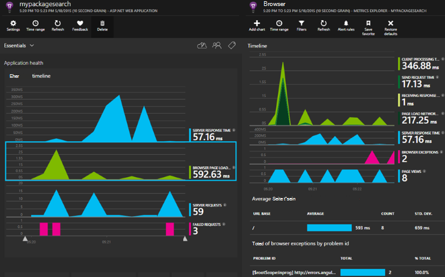

Sie benötigen ein Abonnement mit [Microsoft Azure](http://azure.com). Melden Sie sich mit einem Microsoft-Konto möglicherweise für Windows, XBox Live und anderen Microsoft-Cloud-Diensten. 


#### <a name="sample-application-instrumented-with-application-insights"></a>Instrumentierte Anwendung zum Beispielanwendung

Betrachten Sie dieses [Beispiel](https://github.com/Microsoft/ApplicationInsights-Home/tree/master/Samples/AzureEmailService) in der Anwendung Einblicke Cloud-Dienst mit zwei Workerrollen in Azure gehostet hinzugefügt wird. 

Im folgenden erfahren Sie, wie eigene Cloud-Dienstprojekt auf die gleiche Weise anpassen.

## <a name="create-an-application-insights-resource-for-each-role"></a>Erstellen einer Application Insights-Ressource für jede Rolle

Application Insights-Ressource ist, die Telemetriedaten analysiert und angezeigt werden.  

1.  In der [Azure-Portal][portal], eine neue Application Insights-Ressource erstellen. Anwendungstyp wählen Sie ASP.NET app. 

    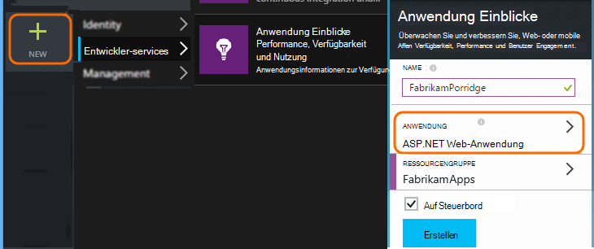

2.  Erstellen Sie eine Kopie der Instrumentation. Sie benötigen diese kurz um das SDK zu konfigurieren.

    


Es empfiehlt sich normalerweise [eine separate Ressource für die Daten aus jeder Rolle Web- und Workerrollen zu erstellen](app-insights-separate-resources.md). 

Als Alternative könnten Sie Daten aus allen Rollen an nur eine Ressource senden, während eine [Standardeigenschaft] festlegen[ apidefaults] damit filtern oder Gruppieren von Ergebnissen aus jeder Rolle.

## <a name="sdk"></a>Installieren Sie das SDK in jedem Projekt


1. Bearbeiten Sie in Visual Studio NuGet-Pakete von der Cloud-app-Projekt.

    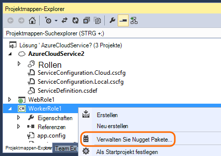


2. Web-Funktionen fügen Sie [Für Web Application Insights](http://www.nuget.org/packages/Microsoft.ApplicationInsights.Web) NuGet-Paket hinzu Diese Version des SDK enthält Module, die Serverkontext wie Informationen hinzufügen. Verwenden Sie für Workerrollen [Anwendung Einblicke für Windows Server](https://www.nuget.org/packages/Microsoft.ApplicationInsights.WindowsServer/).

    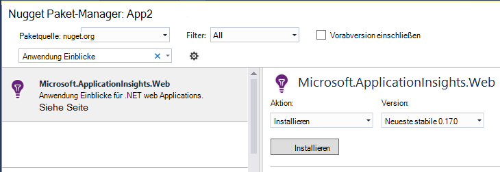


3. Konfigurieren Sie das SDK zum Senden von Daten an Application Insights-Ressource.

    Legen instrumentationsschlüssel als eine Einstellung in der Datei `ServiceConfiguration.Cloud.cscfg`. ([Beispiel](https://github.com/Microsoft/ApplicationInsights-Home/blob/master/Samples/AzureEmailService/AzureEmailService/ServiceConfiguration.Cloud.cscfg)).
 
    ```XML
     <Role name="WorkerRoleA"> 
      <Setting name="APPINSIGHTS_INSTRUMENTATIONKEY" value="YOUR IKEY" /> 
     </Role>
    ```
 
    Legen Sie geeignete Startfunktion instrumentationsschlüssel von der Einstellung:

    ```C#
     TelemetryConfiguration.Active.InstrumentationKey = RoleEnvironment.GetConfigurationSettingValue("APPINSIGHTS_INSTRUMENTATIONKEY");
    ```

    Hinweis, den gleichen Namen `APPINSIGHTS_INSTRUMENTATIONKEY` der Konfiguration Einstellung von Azure Diagnostics reporting verwendet werden. 


    Dies gilt für jede Rolle in der Anwendung. Beispiele:
 
 * [Web-Rolle](https://github.com/Microsoft/ApplicationInsights-Home/blob/master/Samples/AzureEmailService/MvcWebRole/Global.asax.cs#L27)
 * [Worker-Rolle](https://github.com/Microsoft/ApplicationInsights-Home/blob/master/Samples/AzureEmailService/WorkerRoleA/WorkerRoleA.cs#L232)
 * [Für Webseiten](https://github.com/Microsoft/ApplicationInsights-Home/blob/master/Samples/AzureEmailService/MvcWebRole/Views/Shared/_Layout.cshtml#L13)   

4. Legen Sie die ApplicationInsights.config-Datei immer in das Ausgabeverzeichnis kopiert werden. 

    (In der config-Datei werden Nachrichten gefragt zu instrumentationsschlüssel angezeigt. Jedoch empfiehlt sich für Cloudanwendungen aus der Datei .cscfg festgelegt. Dies gewährleistet, dass die Rolle im Portal erkannt wird.)


#### <a name="run-and-publish-the-app"></a>Ausführen und Veröffentlichen der Anwendung

Führen Sie Ihre Anwendung und Azure anmelden. Erstellte Anwendung Einblicke Ressourcen öffnen und sehen einzelne Datenpunkte im [Suchen](app-insights-diagnostic-search.md)und aggregierte Daten im [Metrik-Explorer](app-insights-metrics-explorer.md). 

Fügen Sie mehr Telemetrie - finden Sie in den Abschnitten - und veröffentlichen Sie Ihre app live Diagnose- und Verwendung Feedback zu. 


#### <a name="no-data"></a>Keine Daten?

* Öffnen Sie die [Suche] [ diagnostic] Kachel, um einzelne Ereignisse anzuzeigen.
* Mithilfe der Anwendung verschiedene Seiten öffnen, sodass einige Telemetriedaten generiert.
* Warten Sie einige Sekunden, und klicken Sie auf aktualisieren.
* Siehe [Problembehandlung bei][qna].


## <a name="more-telemetry"></a>Weitere Telemetrie

In den folgenden Abschnitten zeigen, wie verschiedene Aspekte der Anwendung weitere Telemetrie zu.


## <a name="track-requests-from-worker-roles"></a>Track-Anfragen von Worker-Rollen

Web-Rollen sammelt Moduls Anfragen automatisch über HTTP-Anfragen. Finden Sie im [Beispiel Standardsammelverhaltens](https://github.com/Microsoft/ApplicationInsights-Home/tree/master/Samples/AzureEmailService/MvcWebRole) Beispiele wie Auflistung Standardverhalten überschreiben können. 

Die Leistung der Aufrufe von Worker-Rollen kann durch wie HTTP-Anfragen verfolgen. Anwendung Erkenntnisse misst der Anforderungstyp Telemetrie eine Arbeitseinheit benannten Server Seite, die ein Timeout aufgetreten sein können, und können unabhängig voneinander gelingen oder fehlschlagen. Beim HTTP-Anfragen automatisch vom SDK erfasst werden, können Sie Code zum Nachverfolgen von Anfragen Worker-Rollen einfügen.

Anzeigen der zwei Beispiel Arbeitskraft Statusberichtsanfragen instrumentiert: [WorkerRoleA](https://github.com/Microsoft/ApplicationInsights-Home/tree/master/Samples/AzureEmailService/WorkerRoleA) und [WorkerRoleB](https://github.com/Microsoft/ApplicationInsights-Home/tree/master/Samples/AzureEmailService/WorkerRoleB)

## <a name="azure-diagnostics"></a>Azure-Diagnose

[Azure](../vs-azure-tools-diagnostics-for-cloud-services-and-virtual-machines.md) -Diagnosedaten enthält Rolle Ereignisse, Leistungsindikatoren und Anwendungsprotokollen. Sie können diese Anwendung Einblicke an, damit Sie neben den Rest der Telemetrie sehen Problemdiagnose erleichtern.

Azure-Diagnose sind besonders nützlich, wenn eine Rolle unerwartet fehlschlägt oder nicht gestartet werden.

1. Maustaste Rolle (nicht das Projekt!), um dessen Eigenschaften zu öffnen, und wählen Sie **Aktivieren Diagnose**, **Diagnose Application Insights senden**.

    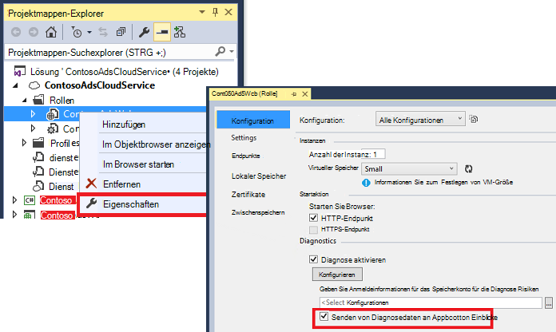

    **Oder wenn Ihre Anwendung bereits veröffentlichten und ausgeführt wird**, Öffnen von Server-Explorer oder Cloud Explorer Maustaste Ihrer app und dieselbe Option wählen.

3.  Wählen Sie dieselbe Anwendung Einblicke Ressource als der Telemetrie.

    Wenn Sie möchten, können Sie eine andere Ressource in verschiedenen Konfigurationen (Cloud, lokal) zu helfen, die Daten unabhängig von Daten festlegen.

3. Optional [einige Azure Diagnostics ausschließen](app-insights-azure-diagnostics.md) Anwendung Einblicke weitergeleitet werden. Die Standardeinstellung ist alles.

### <a name="view-azure-diagnostic-events"></a>Azure Ereignisse anzeigen

Die Diagnose zu finden:

* Leistungsindikatoren werden als benutzerdefinierte Messgrößen angezeigt. 
* Windows-Ereignisprotokolle werden als Spuren und benutzerdefinierte Ereignisse angezeigt.
* Anwendung anmeldet, ETW-Protokolle und Protokolle Infrastruktur Diagnose als Spuren angezeigt.

Um Leistungsindikatoren und Anzahl der Ereignisse, [Metrik-Explorer](app-insights-metrics-explorer.md) öffnen und ein neues Diagramm hinzuzufügen:


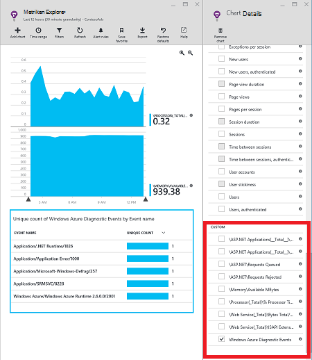

[Suchen](app-insights-diagnostic-search.md) mithilfe von durchsuchen die verschiedenen Ablaufverfolgungsprotokolle von Azure Diagnostics gesendet. Beispielsweise hat eine unhanded Ausnahme eine Rolle verursacht die Rolle zum Absturz gebracht und wiederverwenden, Informationen im Ereignisprotokoll der Anwendung Kanal von Windows angezeigt wird. Die Suchfunktion können Sie das Windows-Ereignisprotokoll auf Fehler und vollständige Stapelrahmen für die Ausnahme aktivieren Sie die Ursache des Problems zu finden.


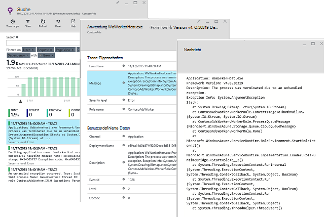

## <a name="app-diagnostics"></a>App-Diagnose

Azure-Diagnose enthält automatisch Ihre app generiert bei System.Diagnostics.Trace Protokolleinträge. 

Wenn Sie Log4N oder NLog-Frameworks verwenden, Sie können aber auch [Spuren Protokoll aufzeichnen][netlogs].

[Nachverfolgen von benutzerdefinierten Ereignissen und Metriken] [ api] Client Server oder beides Weitere Informationen zu Leistung und Nutzung der Anwendung.

## <a name="dependencies"></a>Abhängigkeit

Application Insights-SDK können Aufrufe melden, die externe Abhängigkeiten REST-apis wie SQL Server Ihre app macht. So können Sie erkennen, ob eine bestimmte Abhängigkeit langsam Antworten oder Fehler verursacht.

Wenn die Anwendung .NET Framework 4.6 oder höher verwendet, müssen Sie anders. 

Andernfalls richten Sie die Web-Worker-Rolle mit [Anwendung Einblicke Agent](app-insights-monitor-performance-live-website-now.md) auch "Status Monitor".

Ihre Web-Worker-Rollen der Anwendung Einblicke Agent mit

* [AppInsightsAgent](https://github.com/Microsoft/ApplicationInsights-Home/tree/master/Samples/AzureEmailService/WorkerRoleA/AppInsightsAgent) Ordner und zwei Dateien darin Ihre Web-Worker-Rolle Projekten hinzufügen. Achten Sie darauf, dass ihre Buildeigenschaften festlegen, sodass sie immer in das Ausgabeverzeichnis kopiert werden. Diese Dateien installieren Sie den Agent.
* Fügen Sie Start Task CSDEF Datei als Siehe [hier](https://github.com/Microsoft/ApplicationInsights-Home/tree/master/Samples/AzureEmailService/AzureEmailService/ServiceDefinition.csdef#L18).
* Hinweis: *Worker-Rollen* müssen drei Umgebungsvariablen als Siehe [hier](https://github.com/Microsoft/ApplicationInsights-Home/tree/master/Samples/AzureEmailService/AzureEmailService/ServiceDefinition.csdef#L44). Dies ist nicht erforderlich für Webrollen.

### <a name="dependency-reports"></a>Abhängigkeit Berichte

Hier ist ein Beispiel Sie Application Insights-Portal sehen:

* Umfassende Diagnose automatisch korrelierte Anfragen und abhängig:

    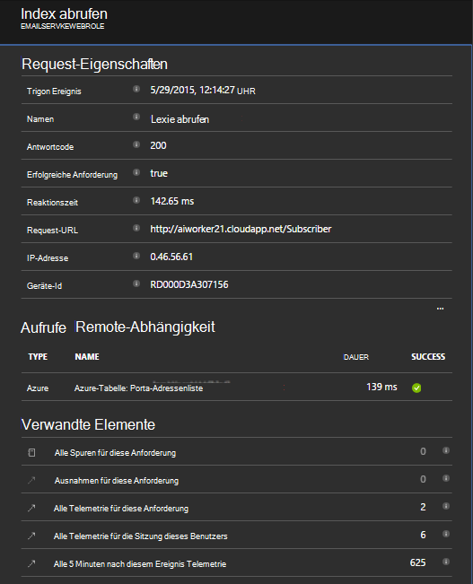

* Leistung der Webrolle mit Abhängigkeitsinformationen:

    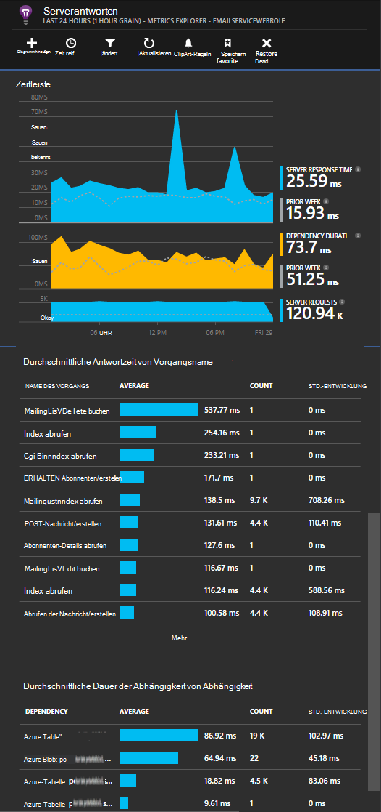

* Hier ist ein Screenshot auf Anfragen und Abhängigkeitsinformationen für eine Worker-Rolle:

    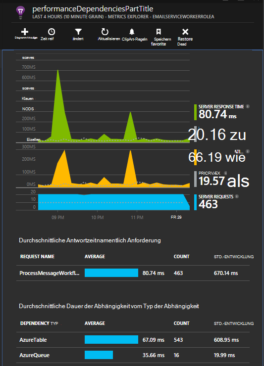

## <a name="exceptions"></a>Ausnahmen

Informationen wie Sie nicht behandelte Ausnahmen von Webs Anwendungstypen sammeln finden Sie unter [Ausnahmen Anwendung Erkenntnisse überwachen](app-insights-asp-net-exceptions.md) .

Webrolle Beispiel hat MVC5 und Web API 2 Controller. Nicht behandelten Ausnahmen vom 2 werden durch folgenden aufgezeichnet:

* [AiHandleErrorAttribute](https://github.com/Microsoft/ApplicationInsights-Home/blob/master/Samples/AzureEmailService/MvcWebRole/Telemetry/AiHandleErrorAttribute.cs) richten Sie [hier](https://github.com/Microsoft/ApplicationInsights-Home/blob/master/Samples/AzureEmailService/MvcWebRole/App_Start/FilterConfig.cs#L12) MVC5 Controller
* [AiWebApiExceptionLogger](https://github.com/Microsoft/ApplicationInsights-Home/blob/master/Samples/AzureEmailService/MvcWebRole/Telemetry/AiWebApiExceptionLogger.cs) einrichten [hier](https://github.com/Microsoft/ApplicationInsights-Home/blob/master/Samples/AzureEmailService/MvcWebRole/App_Start/WebApiConfig.cs#L25) für Web API 2 Controller

Für Workerrollen zweierlei Ausnahmen zu verfolgen.

* TrackException(ex)
* Wenn Sie das Anwendung Einblicke Trace Listener NuGet-Paket hinzugefügt haben, können Sie System.Diagnostics.Trace, zum Protokollieren von Ausnahmen. [Codebeispiel.](https://github.com/Microsoft/ApplicationInsights-Home/blob/master/Samples/AzureEmailService/WorkerRoleA/WorkerRoleA.cs#L107)

## <a name="performance-counters"></a>Leistungsindikatoren

Standardmäßig werden die folgenden Leistungsindikatoren gesammelt:

    * \Process(??APP_WIN32_PROC??)\% Prozessorzeit
    * \Memory\Available bytes
    * \.NET CLR Exceptions(??APP_CLR_PROC??)\# der ausgelösten Ausnahmen / Sek.
    * \Process (?) APP_WIN32_PROC?) \Private bytes
    * \Process (?) APP_WIN32_PROC?) \IO Datenbytes/Sek.
    * \Processor(_Total)\% Prozessorzeit

Darüber hinaus werden die folgenden für Webrollen gesammelt:

    * \ASP.NET Applikationen (?) APP_W3SVC_PROC?) \Requests/SEC    
    * \ASP.NET Applikationen (?) APP_W3SVC_PROC?) \Request Zeit
    * \ASP.NET Applikationen (?) APP_W3SVC_PROC?) \Requests in der Anwendungswarteschlange

Sie können zusätzliche benutzerdefinierte oder andere Windows-Leistungsindikatoren als Siehe [hier](https://github.com/Microsoft/ApplicationInsights-Home/blob/master/Samples/AzureEmailService/WorkerRoleA/ApplicationInsights.config#L14) angeben.

  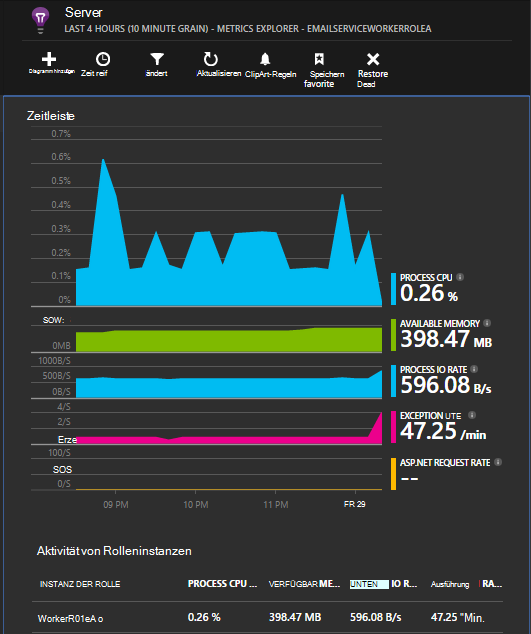

## <a name="correlated-telemetry-for-worker-roles"></a>Korrelierte Telemetrie für Worker-Rollen

Wird eine diagnostische Erfahrung, Sie sehen eine fehlgeschlagene oder hohe Latenz Anforderung führte. Web-Rollen richtet das SDK automatisch Korrelation zwischen verknüpften Telemetrie. Worker-Rollen können Sie für benutzerdefinierte Telemetrie Initialisierung ein gemeinsames Operation.Id Kontext-Attribut für alle Telemetrie dafür festlegen. Dadurch können Sie feststellen, ob eine Abhängigkeit oder Code auf einen Blick Wartezeit-Fehler Ursache wurde! 

Hier ist wie:

* Legen Sie die Korrelations-Id in einer CallContext als Siehe [hier](https://github.com/Microsoft/ApplicationInsights-Home/blob/master/Samples/AzureEmailService/WorkerRoleA/WorkerRoleA.cs#L36). In diesem Fall verwenden-ID anfordern wir als Bezugs-id
* Hinzufügen einer benutzerdefinierten TelemetryInitializer Implementierung, die die Operation.Id oben CorrelationId festgelegt wird. Hier: [ItemCorrelationTelemetryInitializer](https://github.com/Microsoft/ApplicationInsights-Home/blob/master/Samples/AzureEmailService/WorkerRoleA/Telemetry/ItemCorrelationTelemetryInitializer.cs#L13)
* Hinzufügen der benutzerdefinierten Telemetrie-Initialisierung. Die möglich in der Datei ApplicationInsights.config oder im Code als Siehe [hier](https://github.com/Microsoft/ApplicationInsights-Home/blob/master/Samples/AzureEmailService/WorkerRoleA/WorkerRoleA.cs#L233)

Das wars! Bereits ist der Portalfunktionalität verkabelt, können Sie alle zugehörigen Telemetrie auf einen Blick sehen:

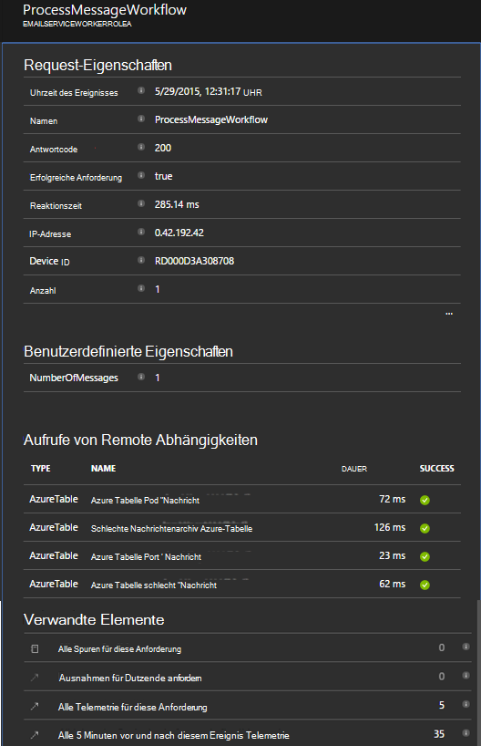


## <a name="client-telemetry"></a>Client Telemetrie

[JavaScript-SDK zu Ihren Webseiten hinzufügen] [ client] zu browserbasierte Telemetrie Seitenzahlen anzeigen, Seitenladezeiten Skript Ausnahmen und benutzerdefinierte Telemetrie Seite Skripts schreiben können.

## <a name="availability-tests"></a>Verfügbarkeitstests

[Einrichten von Webtests] [ availability] um sicherzustellen, dass Ihre Anwendung bleibt live und Reaktionsfähigkeit.


## <a name="example"></a>Beispiel

[Im Beispiel](https://github.com/Microsoft/ApplicationInsights-Home/tree/master/Samples/AzureEmailService) werden einen Dienst mit einer Webrolle und zwei Workerrollen überwacht.

## <a name="exception-method-not-found-on-running-in-azure-cloud-services"></a>Ausnahme "Methode nicht gefunden" auf in Azure Cloud Services

Erstellen .NET 4.6? 4.6 wird nicht automatisch in Azure Cloud Services Rollen unterstützt. [4.6 jeder Rolle installieren](../cloud-services/cloud-services-dotnet-install-dotnet.md) bevor Sie Ihre App.

## <a name="related-topics"></a>Verwandte Themen

* [Konfigurieren der Azure-Diagnose an Application Insights senden](app-insights-azure-diagnostics.md)
* [Mithilfe von PowerShell Azure Diagnostics an Application Insights senden](app-insights-powershell-azure-diagnostics.md)


[api]: app-insights-api-custom-events-metrics.md
[apidefaults]: app-insights-api-custom-events-metrics.md#default-properties
[apidynamicikey]: app-insights-separate-resources.md#dynamic-ikey
[availability]: app-insights-monitor-web-app-availability.md
[azure]: app-insights-azure.md
[client]: app-insights-javascript.md
[diagnostic]: app-insights-diagnostic-search.md
[netlogs]: app-insights-asp-net-trace-logs.md
[portal]: http://portal.azure.com/
[qna]: app-insights-troubleshoot-faq.md
[redfield]: app-insights-monitor-performance-live-website-now.md
[start]: app-insights-overview.md 
