<properties 
    pageTitle="Exemplarische Vorgehensweise: Telemetrie SQL Datenbank Exportieren von Anwendung" 
    description="Exportieren Sie Application Insights Daten kontinuierlich in SQL mit Stream Analytics." 
    services="application-insights" 
    documentationCenter=""
    authors="noamben" 
    manager="douge"/>

<tags 
    ms.service="application-insights" 
    ms.workload="tbd" 
    ms.tgt_pltfrm="ibiza" 
    ms.devlang="na" 
    ms.topic="article" 
    ms.date="03/06/2015" 
    ms.author="awills"/>
 
# <a name="walkthrough-export-to-sql-from-application-insights-using-stream-analytics"></a>Exemplarische Vorgehensweise: Exportieren von Anwendung mit Stream Analytics in SQL

Dieser Artikel beschreibt die Telemetriedaten von [Visual Studio Anwendung] verschieben[ start] in einer Azure SQL-Datenbank mit [Fortlaufenden Export] [ export] und [Azure Stream Analytics](https://azure.microsoft.com/services/stream-analytics/). 

Fortlaufende Export verschiebt die Telemetriedaten in Azure Storage im JSON-Format. Wir analysieren die JSON-Objekte mit Azure Stream Analytics und Zeilen in einer Datenbanktabelle erstellen.

(Im Allgemeinen ist fortlaufende exportieren so Ihre Analyse der Telemetriedaten Application Insights Ihre apps an. Sie können dieses Codebeispiel andere Dinge mit exportierten Telemetrie wie Aggregation von Daten anpassen.)

Wir beginnen mit der Annahme, dass Sie bereits die app zu überwachen.


In diesem Beispiel wir verwenden die Seitendaten aber dasselbe Muster kann problemlos in andere Datentypen wie benutzerdefinierte Ereignisse und Ausnahmen erweitert werden. 


## <a name="add-application-insights-to-your-application"></a>Anwendung Erkenntnisse zur Anwendung hinzufügen


Erste Schritte:

1. [Anwendung Einblicke für Ihre Webseiten festlegen](app-insights-javascript.md). 

    (In diesem Beispiel konzentrieren wir uns auf der Seite Ansicht Daten aus dem Browser jedoch könnten Sie auch einrichten Anwendung Einblicke für die Serverseite von [Java](app-insights-java-get-started.md) oder [ASP.NET](app-insights-asp-net.md) app prozessanforderung, Abhängigkeit und andere Server Telemetrie.)


5. Veröffentlichen Sie Ihre app und sehen Sie Telemetriedaten in Ihre Anwendung Einblicke Ressource.


## <a name="create-storage-in-azure"></a>Speicher in Azure erstellen

Fortlaufende Export gibt immer Daten in Azure Storage-Konto müssen Sie zunächst den Speicher.

1. Erstellen Sie ein Speicherkonto in Ihrem Abonnement im [Azure-Portal][portal].

    

2. Erstellen eines Containers

    

3. Die Zugriffstaste Speicher kopieren

    Sie benötigen sie um die Eingabe für den Stream Analytics-Dienst einrichten.

    

## <a name="start-continuous-export-to-azure-storage"></a>Fortlaufende Export starten Azure-Speicher

1. Suchen Sie in Azure-Portal Application Insights-Ressource, die für die Anwendung erstellt.

    

2. Erstellen einer kontinuierlichen exportieren.

    


    Wählen Sie das Speicherkonto, das Sie zuvor erstellt haben:

    
    
    Legen Sie die gewünschten Ereignistypen:

    


3. Lassen Sie Daten sammeln. Zurücklehnen Sie und Personen, die Ihre Anwendung für eine Weile. Telemetrie kommt, und Sie sehen statistische Diagramme in [metrischen Explorer](app-insights-metrics-explorer.md) und Ereignisse in [Diagnose suchen](app-insights-diagnostic-search.md). 

    Und auch exportieren die Daten in den Speicher. 

4. Überprüfen Sie die exportierten Daten entweder im Portal - wählen Sie **Durchsuchen**, wählen Sie Ihr Konto und **Container** - oder im Visual Studio. Wählen Sie in Visual Studio **Anzeigen / Cloud Explorer**, und Azure öffnen / speichern. (Haben Sie diese Menüoption, müssen das Azure SDK installieren: Öffnen Sie das Dialogfeld Neues Projekt und Visual C# / Cloud / Microsoft Azure SDK für .NET erhalten.)

    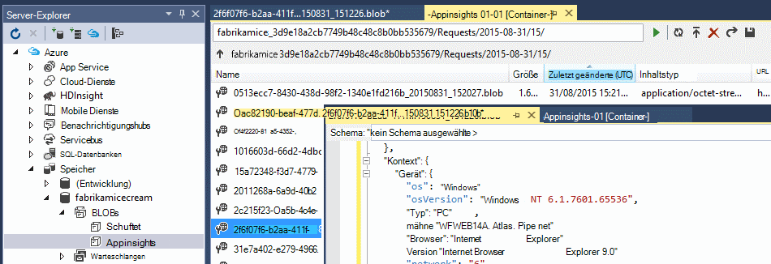

    Notieren Sie sich häufig Teil der Pfadname die ANWENDUNGSTASTE Namen und Instrumentation abgeleitet. 

Die Ereignisse werden auf BLOB-Dateien im JSON-Format geschrieben. Jede Datei kann ein oder mehrere Ereignisse enthalten. So möchten wir Daten lesen und die gewünschten Felder filtern. Gibt es Dinge, die wir mit den Daten konnte aber unser Plan besteht Stream Analytics mit um Daten in einer SQL-Datenbank zu verschieben. Das ist viel interessanter Abfragen erleichtern.

## <a name="create-an-azure-sql-database"></a>Erstellen Sie eine SQL Azure-Datenbank

Ihr Abonnement in [Azure-Portal]wieder ab[portal], erstellen Sie die Datenbank (und einen neuen Server, wenn bereits eines haben) die Daten geschrieben werden.


Stellen Sie sicher, dass der Datenbankserver Azure Services zuzugreifen:


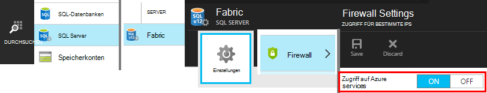

## <a name="create-a-table-in-azure-sql-db"></a>Erstellen Sie eine Tabelle in Azure SQL-Datenbank

Verbinden Sie mit der Datenbank im vorherigen Abschnitt mit Ihrem bevorzugten erstellt. In dieser exemplarischen Vorgehensweise wird [SQL Server-Verwaltungstools](https://msdn.microsoft.com/ms174173.aspx) (SSMS) verwenden.

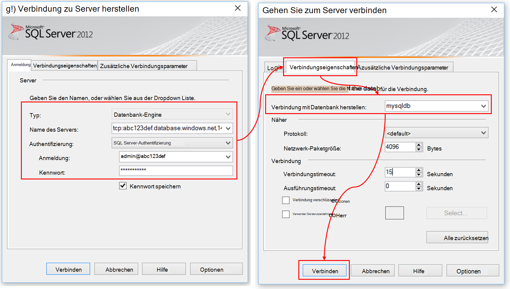

Erstellen Sie eine neue Abfrage und führen Sie der folgenden T-SQL aus:

```SQL

CREATE TABLE [dbo].[PageViewsTable](
    [pageName] [nvarchar](max) NOT NULL,
    [viewCount] [int] NOT NULL,
    [url] [nvarchar](max) NULL,
    [urlDataPort] [int] NULL,
    [urlDataprotocol] [nvarchar](50) NULL,
    [urlDataHost] [nvarchar](50) NULL,
    [urlDataBase] [nvarchar](50) NULL,
    [urlDataHashTag] [nvarchar](max) NULL,
    [eventTime] [datetime] NOT NULL,
    [isSynthetic] [nvarchar](50) NULL,
    [deviceId] [nvarchar](50) NULL,
    [deviceType] [nvarchar](50) NULL,
    [os] [nvarchar](50) NULL,
    [osVersion] [nvarchar](50) NULL,
    [locale] [nvarchar](50) NULL,
    [userAgent] [nvarchar](max) NULL,
    [browser] [nvarchar](50) NULL,
    [browserVersion] [nvarchar](50) NULL,
    [screenResolution] [nvarchar](50) NULL,
    [sessionId] [nvarchar](max) NULL,
    [sessionIsFirst] [nvarchar](50) NULL,
    [clientIp] [nvarchar](50) NULL,
    [continent] [nvarchar](50) NULL,
    [country] [nvarchar](50) NULL,
    [province] [nvarchar](50) NULL,
    [city] [nvarchar](50) NULL
)

CREATE CLUSTERED INDEX [pvTblIdx] ON [dbo].[PageViewsTable]
(
    [eventTime] ASC
)WITH (PAD_INDEX = OFF, STATISTICS_NORECOMPUTE = OFF, SORT_IN_TEMPDB = OFF, DROP_EXISTING = OFF, ONLINE = OFF, ALLOW_ROW_LOCKS = ON, ALLOW_PAGE_LOCKS = ON)

```

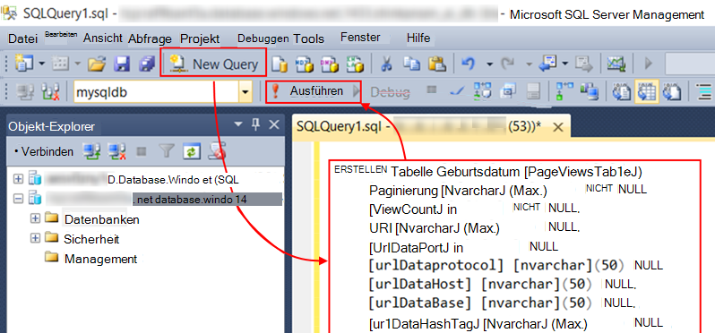

In diesem Beispiel verwenden wir Daten aus Seitenansichten. Die anderen Daten verfügbar überprüfen Sie die JSON-Ausgabe, und finden Sie unter [Exportieren Datenmodell](app-insights-export-data-model.md).

## <a name="create-an-azure-stream-analytics-instance"></a>Erstellen Sie eine Instanz von Azure Stream Analytics

[Azure-Verwaltungsportal](https://manage.windowsazure.com/)Azure Stream Analytics Service auswählen und einen neuen Auftrag für Stream Analytics erstellen:


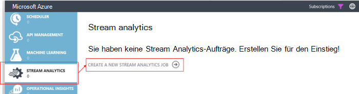


Wenn das neue Projekt erstellt wird, erweitern Sie dessen Details:

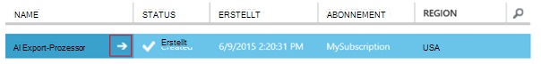

#### <a name="set-blob-location"></a>BLOB-Position festlegen

Festlegen von Ihrem fortlaufenden Export Blob zu:

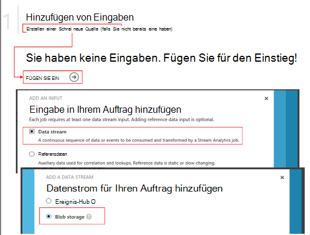

Jetzt benötigen den Primärschlüssel Zugriff aus das Speicherkonto Sie bereits erwähnt. Als Speicherschlüssel Konto festlegen.

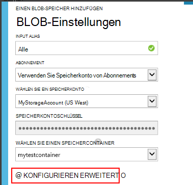

#### <a name="set-path-prefix-pattern"></a>Set Pfad Präfixmuster 

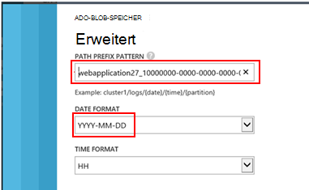

Achten Sie darauf, dass das Datumsformat **JJJJ-MM-TT** (mit **Bindestrichen**) fest.

Pfad-Präfix Muster gibt an, wie Stream Analytics Eingabedateien im Speicher gefunden. Legen sie entsprechen, wie fortlaufende exportieren die Daten gespeichert werden müssen. Wie folgt festlegen:

    webapplication27_12345678123412341234123456789abcdef0/PageViews/{date}/{time}

In diesem Beispiel:

* `webapplication27`ist der Name der Ressource Anwendung Einblicke **in Kleinbuchstaben**. 
* `1234...`ist der Schlüssel Instrumentierung der Anwendung Einblicke Ressource **mit entfernt**. 
* `PageViews`ist der zu analysierenden Daten. Die verfügbaren Typen hängen in fortlaufenden Export festgelegten Filter. Überprüfen Sie die exportierten Daten die verfügbaren Typen und finden Sie unter [Exportieren Datenmodell](app-insights-export-data-model.md).
* `/{date}/{time}`ein Muster wird wörtlich geschrieben werden.

Um die Namen und iKey Application Insights-Ressource, Essentials auf der Übersichtsseite öffnen oder öffnen.

#### <a name="finish-initial-setup"></a>Anfängliche Setup Fertig stellen

Überprüfen Sie das Format:

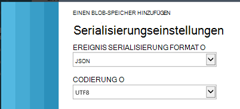

Schließen Sie den Assistenten, und warten Sie, bis die Installation abgeschlossen.

>[AZURE.TIP] Verwenden der Beispielfunktion überprüfen Sie Eingabepfad richtig festgelegt haben. Schlägt: Überprüfen Sie die Daten im Speicher für die gewählte Beispiel Zeitraum. Bearbeiten Sie input Definition und überprüfen Sie das Speicherkonto, Pfad-Präfix und Datumsformat korrekt.

## <a name="set-query"></a>Abfrage festlegen

Öffnen Sie den Abfrage-Abschnitt:

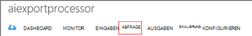

Ersetzen Sie die Standardabfrage mit:

```SQL

    SELECT flat.ArrayValue.name as pageName
    , flat.ArrayValue.count as viewCount
    , flat.ArrayValue.url as url
    , flat.ArrayValue.urlData.port as urlDataPort
    , flat.ArrayValue.urlData.protocol as urlDataprotocol
    , flat.ArrayValue.urlData.host as urlDataHost
    , flat.ArrayValue.urlData.base as urlDataBase
    , flat.ArrayValue.urlData.hashTag as urlDataHashTag
      ,A.context.data.eventTime as eventTime
      ,A.context.data.isSynthetic as isSynthetic
      ,A.context.device.id as deviceId
      ,A.context.device.type as deviceType
      ,A.context.device.os as os
      ,A.context.device.osVersion as osVersion
      ,A.context.device.locale as locale
      ,A.context.device.userAgent as userAgent
      ,A.context.device.browser as browser
      ,A.context.device.browserVersion as browserVersion
      ,A.context.device.screenResolution.value as screenResolution
      ,A.context.session.id as sessionId
      ,A.context.session.isFirst as sessionIsFirst
      ,A.context.location.clientip as clientIp
      ,A.context.location.continent as continent
      ,A.context.location.country as country
      ,A.context.location.province as province
      ,A.context.location.city as city
    INTO
      AIOutput
    FROM AIinput A
    CROSS APPLY GetElements(A.[view]) as flat


```

Beachten Sie, dass die ersten paar Eigenschaften Ansichtsdaten beziehen. Ausfuhren von anderem Telemetrie haben unterschiedliche Eigenschaften. Siehe die [detaillierte Daten Modellreferenz für die Typen und Werte.](app-insights-export-data-model.md)

## <a name="set-up-output-to-database"></a>Ausgabe in Datenbank einrichten

Wählen Sie SQL als Ausgabe.

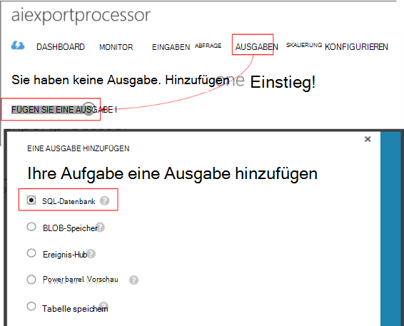

Geben Sie die SQL-Datenbank.


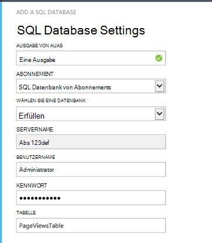

Schließen Sie den Assistenten, und warten Sie eine Benachrichtigung, die die Ausgabe eingerichtet.

## <a name="start-processing"></a>Verarbeitung starten

Startet den Auftrag auf der Aktionsleiste:

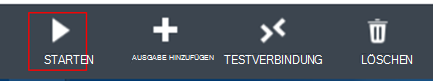

Sie können auswählen, ob verarbeiten die Daten jetzt oder zu früheren Daten ab. Letzteres ist nützlich, wenn Sie fortlaufende exportieren bereits eine Weile ausgeführt haben.


Nach einigen Minuten zurück zu SQL Server und Daten ansehen. Verwenden Sie beispielsweise eine Abfrage wie folgt:

    SELECT TOP 100 *
    FROM [dbo].[PageViewsTable]


## <a name="related-articles"></a>Verwandte Artikel

* [Exportieren Sie in eine Worker-Rolle mit SQL](app-insights-code-sample-export-telemetry-sql-database.md)
* [PowerBI mit Stream Analytics exportieren](app-insights-export-power-bi.md)
* [Detaillierte Datenmodell für Typen und Werte.](app-insights-export-data-model.md)
* [Fortlaufende Export Anwendung Einblicke](app-insights-export-telemetry.md)
* [Anwendung Einblicke](https://azure.microsoft.com/services/application-insights/)

<!--Link references-->

[diagnostic]: app-insights-diagnostic-search.md
[export]: app-insights-export-telemetry.md
[metrics]: app-insights-metrics-explorer.md
[portal]: http://portal.azure.com/
[start]: app-insights-overview.md

 