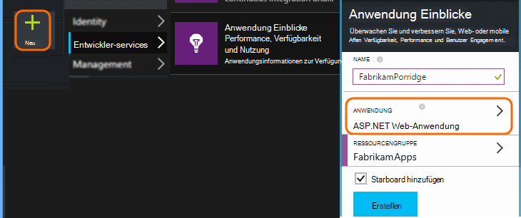
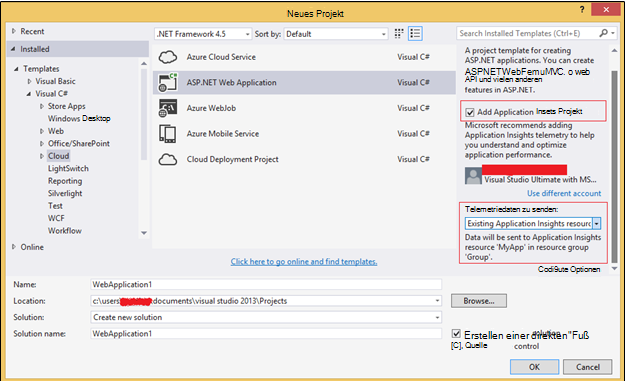
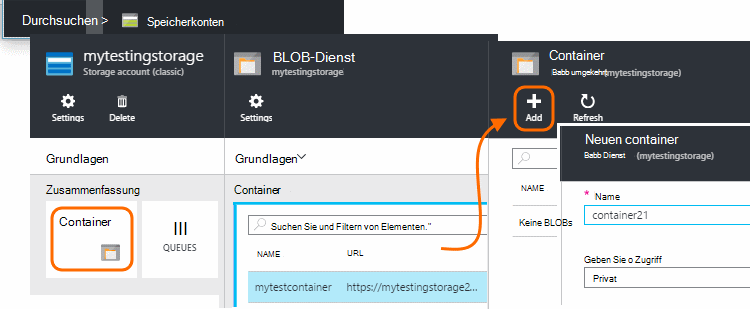
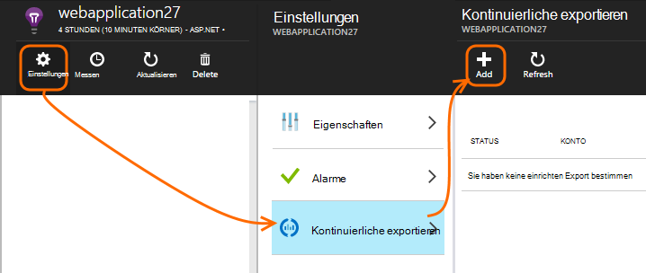
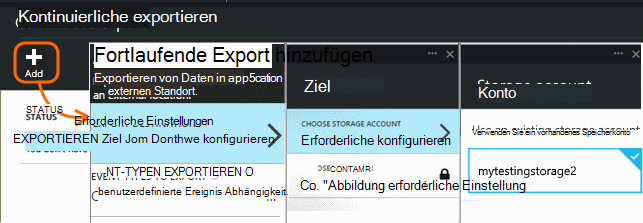
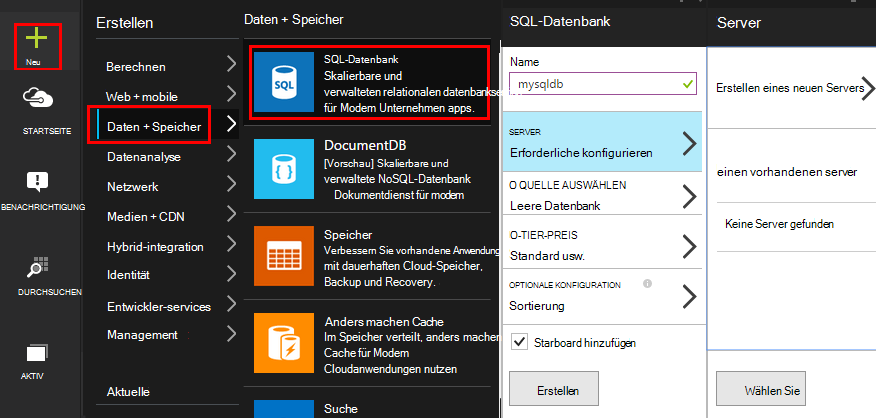
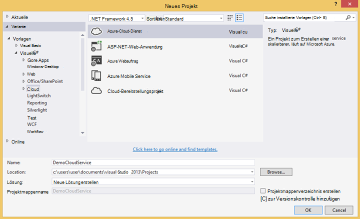
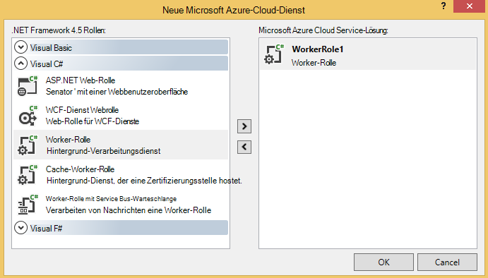
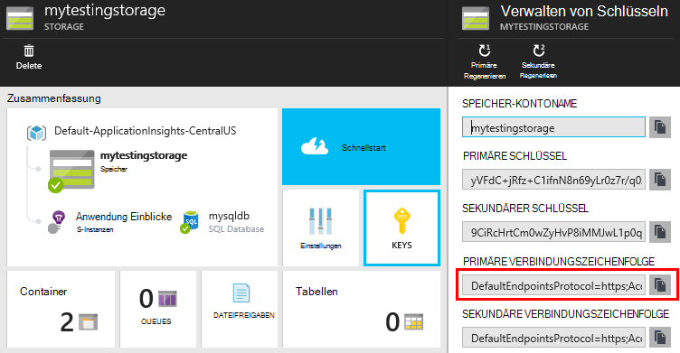

<properties 
    pageTitle="Beispiel: Daten von Anwendung analysieren" 
    description="Die Codeanalyse eigene Telemetrie Anwendung Erkenntnisse mit der kontinuierlichen exportieren. Speichern von Daten in SQL." 
    services="application-insights" 
    documentationCenter=""
    authors="mazharmicrosoft" 
    manager="douge"/>

<tags 
    ms.service="application-insights" 
    ms.workload="tbd" 
    ms.tgt_pltfrm="ibiza" 
    ms.devlang="na" 
    ms.topic="article" 
    ms.date="01/05/2016" 
    ms.author="awills"/>
 
# Beispiel: Daten von Anwendung analysieren

Dieser Artikel beschreibt, wie JSON-Daten von Anwendung exportiert. Beispielsweise schreiben Code zum Verschieben der Telemetriedaten von [Visual Studio Application] [ start] in einer Azure SQL-Datenbank mit [Fortlaufenden Export][export]. (Auch erreichen diese [mit Stream Analytics](app-insights-code-sample-export-sql-stream-analytics.md), aber hier soll Code anzeigen.) 

Fortlaufende Export verschiebt die Telemetrie in Azure Storage im JSON-Format wir schreiben Code zum Analysieren von JSON-Objekten und Zeilen in einer Datenbanktabelle erstellen.

Kontinuierliche exportieren ist allgemein so Ihre Analyse der Telemetriedaten Application Insights Ihre apps an. Sie können dieses Codebeispiel andere Dinge mit exportierten Telemetrie anpassen.

Wir beginnen mit der Annahme, dass Sie bereits die app zu überwachen.

## Application Insights SDK hinzufügen

Überwachen der Anwendung, [eine Anwendung Insights SDK hinzufügen] [ start] der Anwendung. Es gibt verschiedene SDKs und Helper-Tools für unterschiedliche Plattformen, IDEs und Sprachen. Sie können Webseiten, Java oder ASP.NET Webserver und verschiedene mobile Geräte überwachen. Alle SDKs Telemetriedaten [Application Insights-Portal]senden[portal], wobei Sie können unsere leistungsstarken Analyse Diagnose-Tools und, und exportieren Sie die Daten in den Speicher.

Erste Schritte:

1. Ein [Konto in Microsoft Azure](https://azure.microsoft.com/pricing/)zu erhalten.
2. In der [Azure-Portal][portal], eine neue Anwendung Einblicke Ressource für Ihre Anwendung:

    

    (Die Anwendungstyp und Abonnement können abweichen.)
3. Schnellstart zum Einrichten der SDK für Ihre Anwendung zu öffnen.

    

    Wenn Ihre Anwendung nicht aufgeführt, betrachten Sie den [Einstieg] [ start] Seite.

4. In diesem Beispiel sind wir Web app überwachen, damit wir Azure Tools in Visual Studio können das SDK installieren. Wir sagen sie unsere Anwendung Einblicke Ressourcennamen:

    

## Speicher in Azure erstellen

Daten von Anwendung werden immer in Azure Storage-Konto im JSON-Format exportiert. Werden aus diesem Speicher Code die Daten gelesen werden.

1. Erstellen Sie ein "klassische" Speicherkonto in Ihrem Abonnement im [Azure-Portal][portal].

    

2. Erstellen eines Containers

    

## Fortlaufende Export starten Azure-Speicher

1. Suchen Sie in Azure-Portal Application Insights-Ressource, die für die Anwendung erstellt.

    

2. Erstellen einer kontinuierlichen exportieren.

    

    Wählen Sie das Speicherkonto, das Sie zuvor erstellt haben:

    
    
    Legen Sie die gewünschten Ereignistypen:

    

3. Lassen Sie Daten sammeln. Zurücklehnen Sie und Personen, die Ihre Anwendung für eine Weile. Telemetrie kommt, und Sie sehen statistische Diagramme in [metrischen Explorer](app-insights-metrics-explorer.md) und Ereignisse in [Diagnose suchen](app-insights-diagnostic-search.md). 

    Und auch exportieren die Daten in den Speicher. 

4. Überprüfen Sie die exportierten Daten. Wählen Sie in Visual Studio **Anzeigen / Cloud Explorer**, und Azure öffnen / speichern. (Haben Sie diese Menüoption, müssen das Azure SDK installieren: Öffnen Sie das Dialogfeld Neues Projekt und Visual C# / Cloud / Microsoft Azure SDK für .NET erhalten.)

    

    Notieren Sie sich häufig Teil der Pfadname die ANWENDUNGSTASTE Namen und Instrumentation abgeleitet. 

Die Ereignisse werden auf BLOB-Dateien im JSON-Format geschrieben. Jede Datei kann ein oder mehrere Ereignisse enthalten. So möchten wir Daten lesen und die gewünschten Felder filtern. Gibt es Dinge, die wir mit den Daten konnte aber unser Plan besteht darin, Code zum Verschieben der Daten in eine SQL-Datenbank schreiben. Das ist viel interessanter Abfragen erleichtern.

## Erstellen Sie eine SQL Azure-Datenbank

Für dieses Beispiel werden wir Code drücken Sie Daten in eine Datenbank schreiben.

Ihr Abonnement in [Azure-Portal]wieder ab[portal], erstellen Sie die Datenbank (und einen neuen Server, wenn bereits eines haben) die Daten geschrieben werden.

Stellen Sie sicher, dass der Datenbankserver Azure Services zuzugreifen:

## Erstellen Sie eine Worker-Rolle 

Jetzt können endlich wir schreiben Sie [Code](https://sesitai.codeplex.com/) zum Analysieren von JSON in exportierten Blobs und Datensätze in der Datenbank erstellen. Speicher exportieren und die Datenbank in Azure sind, werden wir den Code in Azure Worker-Rolle ausführen.

Dieser Code extrahiert automatisch beliebige Eigenschaften in JSON vorhanden sind. Beschreibung der Eigenschaften finden Sie unter [Exportieren Datenmodell](app-insights-export-data-model.md).

#### Worker-Rolle Projekt erstellen

Erstellen Sie in Visual Studio ein neues Projekt für die Worker-Rolle:

#### Das Speicherkonto verbinden

Das Speicherkonto in Azure erhalten Sie Verbindungszeichenfolge:

In Visual Studio Konfigurieren der Arbeitskraft Rolle mit der Verbindungszeichenfolge Storage-Konto:

#### Pakete

Im Projektmappen-Explorer mit der rechten Maustaste Worker-Rolle Projekt, und wählen Sie NuGet-Pakete verwalten.
Suchen und diese Pakete installieren: 

 * EntityFramework 6.1.2 oder höher - verwenden wir das Tabellenschema DB dynamisch generiert anhand von JSON im Blob.
 * JsonFx - diese verwenden wir für JSON C# Klasseneigenschaften reduzieren.

Mit diesem Tool können C# aus unserer JSON-Dokument generieren. Es erfordert einige geringfügige wie Reduzierung von JSON-Arrays in einzelne C#-Eigenschaft in aktivieren einzelne Spalte in der Datenbanktabelle (Ex. UrlData_port) 

 * [Generator für JSON C#-Klasse](http://jsonclassgenerator.codeplex.com/)

## Code 

Fügen Sie diesen Code in `WorkerRole.cs`.

#### Einfuhren

    using Microsoft.WindowsAzure.Storage;

    using Microsoft.WindowsAzure.Storage.Blob;

#### Abrufen der Verbindungszeichenfolge Speicher

    private static string GetConnectionString()
    {
      return Microsoft.WindowsAzure.CloudConfigurationManager.GetSetting("StorageConnectionString");
    }

#### Die Arbeitskraft regelmäßig ausführen

Ersetzen der vorhandenen run-Methode, und wählen Sie das gewünschte Intervall. Es sollte mindestens eine Stunde, weil die Exportfunktion ein JSON-Objekt in einer Stunde abgeschlossen.

    public override void Run()
    {
      Trace.TraceInformation("WorkerRole1 is running");

      while (true)
      {
        Trace.WriteLine("Sleeping", "Information");

        Thread.Sleep(86400000); //86400000=24 hours //1 hour=3600000
                
        Trace.WriteLine("Awake", "Information");

        ImportBlobtoDB();
      }
    }

#### Jede JSON-Objekt als Zeile in einer Tabelle einfügen

    public void ImportBlobtoDB()
    {
      try
      {
        CloudStorageAccount account = CloudStorageAccount.Parse(GetConnectionString());

        var blobClient = account.CreateCloudBlobClient();
        var container = blobClient.GetContainerReference(FilterContainer);

        foreach (CloudBlobDirectory directory in container.ListBlobs())//Parent directory
        {
          foreach (CloudBlobDirectory subDirectory in directory.ListBlobs())//PageViewPerformance
          {
            foreach (CloudBlobDirectory dir in subDirectory.ListBlobs())//2015-01-31
            {
              foreach (CloudBlobDirectory subdir in dir.ListBlobs())//22
              {
                foreach (IListBlobItem item in subdir.ListBlobs())//3IAwm6u3-0.blob
                {
                  itemname = item.Uri.ToString();
                  ParseEachBlob(container, item);
                  AuditBlob(container, directory, subDirectory, dir, subdir, item);
                } //item loop
              } //subdir loop
            } //dir loop
          } //subDirectory loop
        } //directory loop
      }
      catch (Exception ex)
      {
        //handle exception
      }
    }

#### Jedes Blob analysieren

    private void ParseEachBlob(CloudBlobContainer container, IListBlobItem item)
    {
      try
      {
        var blob = container.GetBlockBlobReference(item.Parent.Prefix + item.Uri.Segments.Last());
    
        string json;
    
        using (var memoryStream = new MemoryStream())
        {
          blob.DownloadToStream(memoryStream);
          json = System.Text.Encoding.UTF8.GetString(memoryStream.ToArray());
    
          IEnumerable<string> entities = json.Split('\n').Where(s => !string.IsNullOrWhiteSpace(s));
    
          recCount = entities.Count();
          failureCount = 0; //resetting failure count
    
          foreach (var entity in entities)
          {
            var reader = new JsonFx.Json.JsonReader();
            dynamic output = reader.Read(entity);
    
            Dictionary<string, object> dict = new Dictionary<string, object>();
    
            GenerateDictionary((System.Dynamic.ExpandoObject)output, dict, "");
    
            switch (FilterType)
            {
              case "PageViewPerformance":
    
              if (dict.ContainsKey("clientPerformance"))
                {
                  GenerateDictionary(((System.Dynamic.ExpandoObject[])dict["clientPerformance"])[0], dict, "");
                }
    
              if (dict.ContainsKey("context_custom_dimensions"))
              {
                if (dict["context_custom_dimensions"].GetType() == typeof(System.Dynamic.ExpandoObject[]))
                {
                  GenerateDictionary(((System.Dynamic.ExpandoObject[])dict["context_custom_dimensions"])[0], dict, "");
                }
              }
    
            PageViewPerformance objPageViewPerformance = (PageViewPerformance)GetObject(dict);
    
            try
            {
              using (var db = new TelemetryContext())
              {
                db.PageViewPerformanceContext.Add(objPageViewPerformance);
                db.SaveChanges();
              }
            }
            catch (Exception ex)
            {
              failureCount++;
            }
            break;
    
            default:
            break;
          }
        }
      }
    }
    catch (Exception ex)
    {
      //handle exception 
    }
    }

#### Ein Wörterbuch für jedes JSON-Dokument vorbereiten

    private void GenerateDictionary(System.Dynamic.ExpandoObject output, Dictionary<string, object> dict, string parent)
        {
            try
            {
                foreach (var v in output)
                {
                    string key = parent + v.Key;
                    object o = v.Value;

                    if (o.GetType() == typeof(System.Dynamic.ExpandoObject))
                    {
                        GenerateDictionary((System.Dynamic.ExpandoObject)o, dict, key + "_");
                    }
                    else
                    {
                        if (!dict.ContainsKey(key))
                        {
                            dict.Add(key, o);
                        }
                    }
                }
            }
            catch (Exception ex)
            {
            //handle exception 
            }
        }

#### In C#-Klasse Telemetrie Objekteigenschaften Umwandeln Sie JSON-Dokument

     public object GetObject(IDictionary<string, object> d)
        {
            PropertyInfo[] props = null;
            object res = null;

            try
            {
                switch (FilterType)
                {
                    case "PageViewPerformance":

                        props = typeof(PageViewPerformance).GetProperties();
                        res = Activator.CreateInstance<PageViewPerformance>();
                        break;

                    default:
                        break;
                }

                for (int i = 0; i < props.Length; i++)
                {
                    if (props[i].CanWrite && d.ContainsKey(props[i].Name))
                    {
                        props[i].SetValue(res, d[props[i].Name], null);
                    }
                }
            }
            catch (Exception ex)
            {
            //handle exception 
            }

            return res;
        }

#### PageViewPerformance-Klassendatei aus JSON-Dokument generiert

    public class PageViewPerformance
    {
        [DatabaseGenerated(DatabaseGeneratedOption.Identity)]
        public Guid Id { get; set; }

        public string url { get; set; }

        public int urlData_port { get; set; }

        public string urlData_protocol { get; set; }

        public string urlData_host { get; set; }

        public string urlData_base { get; set; }

        public string urlData_hashTag { get; set; }

        public double total_value { get; set; }

        public double networkConnection_value { get; set; }

        public double sendRequest_value { get; set; }

        public double receiveRequest_value { get; set; }

        public double clientProcess_value { get; set; }

        public string name { get; set; }

        public string internal_data_id { get; set; }

        public string internal_data_documentVersion { get; set; }

        public DateTime? context_data_eventTime { get; set; }

        public string context_device_id { get; set; }

        public string context_device_type { get; set; }

        public string context_device_os { get; set; }

        public string context_device_osVersion { get; set; }

        public string context_device_locale { get; set; }

        public string context_device_userAgent { get; set; }

        public string context_device_browser { get; set; }

        public string context_device_browserVersion { get; set; }

        public string context_device_screenResolution_value { get; set; }

        public string context_user_anonId { get; set; }

        public string context_user_anonAcquisitionDate { get; set; }

        public string context_user_authAcquisitionDate { get; set; }

        public string context_user_accountAcquisitionDate { get; set; }

        public string context_session_id { get; set; }

        public bool context_session_isFirst { get; set; }

        public string context_operation_id { get; set; }

        public double context_location_point_lat { get; set; }

        public double context_location_point_lon { get; set; }

        public string context_location_clientip { get; set; }

        public string context_location_continent { get; set; }

        public string context_location_country { get; set; }

        public string context_location_province { get; set; }

        public string context_location_city { get; set; }
    }

#### DBcontext SQL Interaktion von Entity Framework

    public class TelemetryContext : DbContext
    {
        public DbSet<PageViewPerformance> PageViewPerformanceContext { get; set; }
        public TelemetryContext()
            : base("name=TelemetryContext")
        {
        }
    }

Hinzufügen die DB-Verbindungszeichenfolge mit dem Namen `TelemetryContext` in `app.config`.

## Schema (nur Daten)

Dies ist das Schema für die Tabelle, die für die Seite generiert wird.

> [AZURE.NOTE] Sie müssen dieses Skript ausführen. Die Attribute in JSON bestimmen die Spalten in der Tabelle.

    CREATE TABLE [dbo].[PageViewPerformances](
    [Id] [uniqueidentifier] NOT NULL,
    [url] [nvarchar](max) NULL,
    [urlData_port] [int] NOT NULL,
    [urlData_protocol] [nvarchar](max) NULL,
    [urlData_host] [nvarchar](max) NULL,
    [urlData_base] [nvarchar](max) NULL,
    [urlData_hashTag] [nvarchar](max) NULL,
    [total_value] [float] NOT NULL,
    [networkConnection_value] [float] NOT NULL,
    [sendRequest_value] [float] NOT NULL,
    [receiveRequest_value] [float] NOT NULL,
    [clientProcess_value] [float] NOT NULL,
    [name] [nvarchar](max) NULL,
    [User] [nvarchar](max) NULL,
    [internal_data_id] [nvarchar](max) NULL,
    [internal_data_documentVersion] [nvarchar](max) NULL,
    [context_data_eventTime] [datetime] NULL,
    [context_device_id] [nvarchar](max) NULL,
    [context_device_type] [nvarchar](max) NULL,
    [context_device_os] [nvarchar](max) NULL,
    [context_device_osVersion] [nvarchar](max) NULL,
    [context_device_locale] [nvarchar](max) NULL,
    [context_device_userAgent] [nvarchar](max) NULL,
    [context_device_browser] [nvarchar](max) NULL,
    [context_device_browserVersion] [nvarchar](max) NULL,
    [context_device_screenResolution_value] [nvarchar](max) NULL,
    [context_user_anonId] [nvarchar](max) NULL,
    [context_user_anonAcquisitionDate] [nvarchar](max) NULL,
    [context_user_authAcquisitionDate] [nvarchar](max) NULL,
    [context_user_accountAcquisitionDate] [nvarchar](max) NULL,
    [context_session_id] [nvarchar](max) NULL,
    [context_session_isFirst] [bit] NOT NULL,
    [context_operation_id] [nvarchar](max) NULL,
    [context_location_point_lat] [float] NOT NULL,
    [context_location_point_lon] [float] NOT NULL,
    [context_location_clientip] [nvarchar](max) NULL,
    [context_location_continent] [nvarchar](max) NULL,
    [context_location_country] [nvarchar](max) NULL,
    [context_location_province] [nvarchar](max) NULL,
    [context_location_city] [nvarchar](max) NULL,
    CONSTRAINT [PK_dbo.PageViewPerformances] PRIMARY KEY CLUSTERED 
    (
     [Id] ASC
    )WITH (PAD_INDEX = OFF, STATISTICS_NORECOMPUTE = OFF, IGNORE_DUP_KEY = OFF, ALLOW_ROW_LOCKS = ON, ALLOW_PAGE_LOCKS = ON) ON [PRIMARY]
    ) ON [PRIMARY] TEXTIMAGE_ON [PRIMARY]

    GO

    ALTER TABLE [dbo].[PageViewPerformances] ADD  DEFAULT (newsequentialid()) FOR [Id]
    GO

Dieses Beispiel in Aktion [herunterladen](https://sesitai.codeplex.com/) abgeschlossen Arbeitscode ändern die `app.config` Einstellung und Worker-Rolle in Azure veröffentlichen.

## Verwandte Artikel

* [Exportieren Sie in eine Worker-Rolle mit SQL](app-insights-code-sample-export-telemetry-sql-database.md)
* [Fortlaufende Export Anwendung Einblicke](app-insights-export-telemetry.md)
* [Anwendung Einblicke](https://azure.microsoft.com/services/application-insights/)
* [Export-Datenmodell](app-insights-export-data-model.md)
* [Beispiele und exemplarische Vorgehensweisen](app-insights-code-samples.md)

<!--Link references-->

[diagnostic]: app-insights-diagnostic-search.md
[export]: app-insights-export-telemetry.md
[metrics]: app-insights-metrics-explorer.md
[portal]: http://portal.azure.com/
[start]: app-insights-overview.md

 
