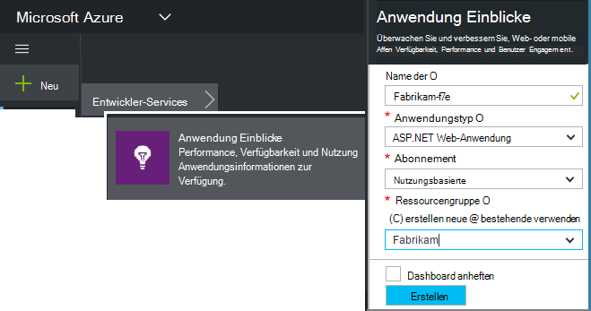
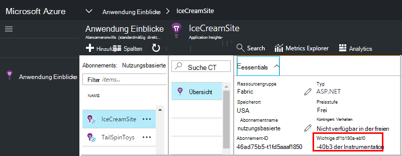

<properties 
    pageTitle="Erstellen einer neuen Anwendung Einblicke Ressource | Microsoft Azure" 
    description="Einrichten der Anwendung Einblicke Überwachung eine neue live-Anwendung. Web-basierten Ansatz." 
    services="application-insights" 
    documentationCenter=""
    authors="alancameronwills" 
    manager="douge"/>

<tags 
    ms.service="application-insights" 
    ms.workload="tbd" 
    ms.tgt_pltfrm="ibiza" 
    ms.devlang="na" 
    ms.topic="article" 
    ms.date="08/26/2016" 
    ms.author="awills"/>

# Erstellen einer Application Insights-Ressource

Visual Studio Application Insights zeigt Daten über die Anwendung in Microsoft Azure- *Ressource*. Erstellen einer neuen Ressource ist daher Teil der [Einrichtung der Anwendung Einblicke, um eine neue Anwendung][start]. In vielen Fällen kann dies automatisch durch die IDE, und zwar empfohlen wird. Aber in einigen Fällen eine Ressource manuell erstellt.

Nach dem Erstellen der Ressource die Instrumentation Schlüssel zu verwenden, um das SDK in die Anwendung konfigurieren. Die Telemetrie an die Ressource gesendet.

## Microsoft Azure anmelden

Wenn Sie ein [Microsoft-Konto, melden Sie sich jetzt](http://live.com)haben. (Wenn Sie Dienste wie Outlook.com, OneDrive, Windows Phone oder XBox Live verwenden, verfügen Sie bereits über ein Microsoft-Konto.)

Sie benötigen außerdem [Microsoft Azure-](http://azure.com)Abonnement. Hat das Team oder die Organisation Azure-Abonnement, kann der Besitzer, hinzufügen zu mit Ihrer Windows Live ID

Oder ein neues Abonnement erstellen. Kostenlose Konto können Sie alles in Azure. Nach Ablauf des Testzeitraums finden Sie Bedarfsbasis Abonnement erforderlich, wie Sie kostenlos Services belastet werden. 

Sie haben Zugriff auf ein Abonnement bei Anwendung Einblicke in [http://portal.azure.com](https://portal.azure.com)und Ihre Live ID anmelden.

## Erstellen einer Application Insights-Ressource
  

Fügen Sie im [portal.azure.com](https://portal.azure.com)eine Anwendung Insights-Ressource:

* **Anwendungstyp** wirkt sich auf Blade-Übersicht und in [metrischen Explorer]verfügbaren Eigenschaften finden Sie auf[metrics]. Wenn Ihre app-Typ nicht angezeigt wird, wählen Sie ASP.NET.
* **Ressourcengruppe** ist eine benutzerfreundliche Möglichkeit zum Verwalten von Eigenschaften wie Zugriffskontrolle. Wenn Sie bereits andere Azure-Ressourcen erstellt haben, können Sie diese Ressource in derselben Gruppe platzieren.
* **Abonnement** ist Dein Konto in Azure.
* **Speicherort** ist, in dem Ihre Daten gespeichert. Zurzeit kann er geändert werden.
* **Zum Startmenü hinzufügen** fügt Schnellzugriff Kacheln für die Ressource auf der Azure-Startseite. Empfohlen.

Erstellung Ihrer Anwendung öffnet ein neues Blatt. Dies ist die Leistung und Daten über Ihre app Sie finden. 

Zu zurück, das nächste Mal bei Azure suchen für Ihre app Schnellstart Kachel Bord Start (Startseite). Oder klicken Sie auf Durchsuchen, um danach zu suchen.

## Kopieren Sie den instrumentationsschlüssel

Instrumentationsschlüssel identifiziert die Ressource, die Sie erstellt haben. Sie benötigen sie das SDK zu.

## Installieren Sie das SDK in Ihrer Anwendung

Installieren Sie Application Insights SDK in Ihrer Anwendung. Dieser Schritt hängt stark von der Art der Anwendung. 

Taste Instrumentation [SDK die Installation der Anwendung]konfigurieren[start].

Das SDK enthält Standardmodule, die Telemetriedaten, ohne dass senden Sie Code schreiben. Benutzeraktionen nachverfolgen oder analysieren Probleme ausführlicher [mithilfe der API] [ api] eigene Telemetrie senden.

## Siehe Daten

Schnellstart-Blade Ihre Anwendung Blade im Azure-Portal wieder zu schließen.

Klicken um [Diagnose]Suche Suche[diagnostic], dem ersten angezeigt wird. 

Klicken Sie auf Aktualisierung nach wenigen Sekunden, wenn mehr Daten erwarten.

## Ressourcen erstellen automatisch

Sie können ein [PowerShell-Skript](app-insights-powershell-script-create-resource.md) zum Erstellen einer Ressource automatisch schreiben.

## Nächste Schritte

* [Erstellen eines Dashboards](app-insights-dashboards.md)
* [Diagnose suchen](app-insights-diagnostic-search.md)
* [Untersuchen von Metriken](app-insights-metrics-explorer.md)
* [Analytics Abfragen schreiben](app-insights-analytics.md)

<!--Link references-->

[api]: app-insights-api-custom-events-metrics.md
[diagnostic]: app-insights-diagnostic-search.md
[metrics]: app-insights-metrics-explorer.md
[start]: app-insights-overview.md

 