<properties
    pageTitle="Dashboards und Navigation in Application Insights-Portal | Microsoft Azure"
    description="Erstellen Sie Ansichten der wichtigsten APM Diagramme und Abfragen."
    services="application-insights"
    documentationCenter=""
    authors="alancameronwills"
    manager="douge"/>

<tags
    ms.service="application-insights"
    ms.workload="tbd"
    ms.tgt_pltfrm="ibiza"
    ms.devlang="multiple"
    ms.topic="article" 
    ms.date="10/18/2016"
    ms.author="awills"/>

# Navigation und Dashboards in Application Insights-portal

Nachdem Sie [Anwendung Einblicke in das Projekt eingerichtet](app-insights-overview.md)haben, werden in Ihrem Projekt Anwendung Einblicke Ressource in [Azure-Portal](https://portal.azure.com)Telemetriedaten zu Leistung und Nutzung Ihrer app angezeigt.

## Suchen der Telemetrie

[Azure-Portal](https://portal.azure.com) melden Sie an und navigieren Sie zum Application Insights-Ressource, die Sie für Ihre Anwendung erstellt.

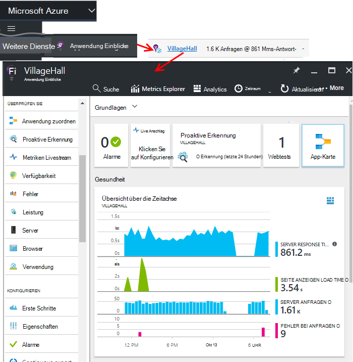

Übersicht-Blade (Seite) für Ihre Anwendung zeigt eine Zusammenfassung der Diagnose Kennzahlen Ihrer app und andere Funktionen des Portals ist.

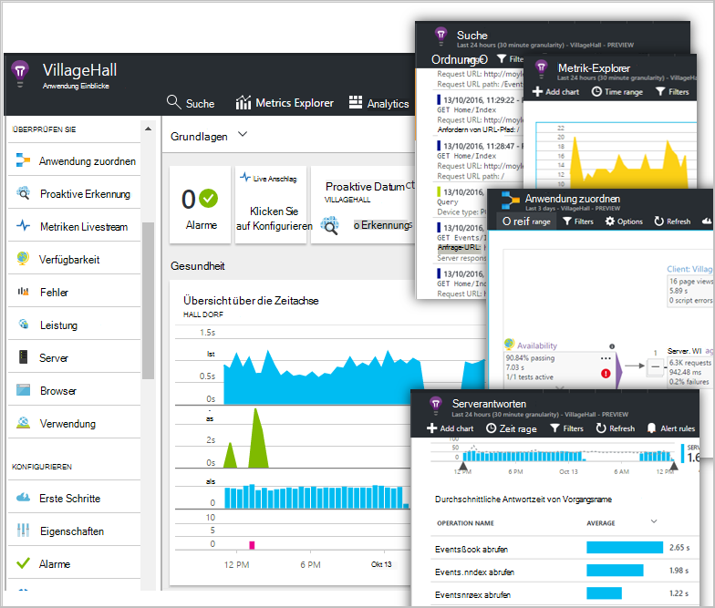

Andere Diagramme anpassen können und einem Dashboard pinnen. So können Sie die wichtigsten Diagramme von anderen apps zusammenführen.

## Dashboards

Als erstes angezeigt, nachdem Sie [Microsoft Azure-Portal](https://portal.azure.com) Anmelden ist ein Dashboard. Hier können Sie Diagramme zusammenführen, die Sie über alle Ihre Azure-Ressourcen, einschließlich Telemetriedaten aus [Visual Studio Application Insights](app-insights-overview.md).
 

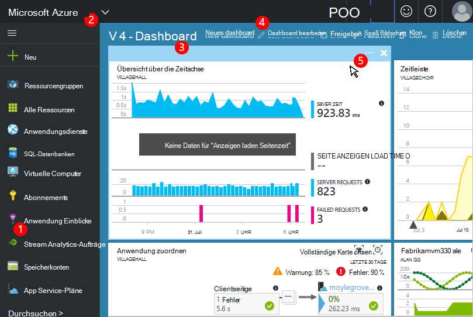

1. **Navigieren zu bestimmten Ressourcen** wie Ihre app Anwendung Erkenntnisse: die linke Leiste.
2. **Zurück zu aktuellen Dashboards**oder wechseln Sie zu anderen aktuellen Ansichten: Verwenden Sie das Dropdown-Menü oben links.
3. **Switch-Dashboards**: verwenden im Dropdown-Menü auf der Dashboard-Titel
4. **Erstellen, bearbeiten und freigeben Dashboards** auf Dashboard.
5. **Das Dashboard bearbeiten**: über einen Spielstein bewegen und dann die obere Leiste verschieben, anpassen oder entfernen.

## Fügen zu einem Dashboard hinzu

Beim Suchen auf einer-Blade oder Diagramme, die besonders interessant ist, können Sie eine Kopie der Dashboard anheften. Sie sehen es beim nächsten Sie es erneut.

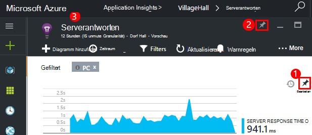

1. PIN-Diagramm Dashboard. Eine Kopie des Diagramms wird im Schaltpult angezeigt.
2. PIN ganze Blade die Dashboard - angezeigt wird als eine Fläche, der Sie durch Klicken auf das Dashboard.
3. Klicken Sie auf der oberen linken Ecke der aktuellen Dashboard wieder. Klicken Sie im Dropdown-Menü können Sie dann zur aktuellen Ansicht zurückzukehren.

Beachten Sie, dass Diagramme in Kacheln unterteilt sind: eine Kachel kann mehrere Diagramme enthalten. Die gesamte Kachel Dashboard angeheftet werden.

### Jede Abfrage in Analytics fixieren

Sie können auch [gemeinsame](#share-dashboards-with-your-team) Armaturenbrett [Pin Analytics](app-insights-analytics-using.md#pin-to-dashboard) Diagramme. Dadurch können Sie einer beliebigen Abfrage neben der standard-Metriken Diagramme hinzufügen. (Es ist kostenlos dazu.)

## Eine Kachel auf dem Dashboard anpassen

Wenn eine Kachel auf dem Dashboard ist, können Sie sie anpassen.

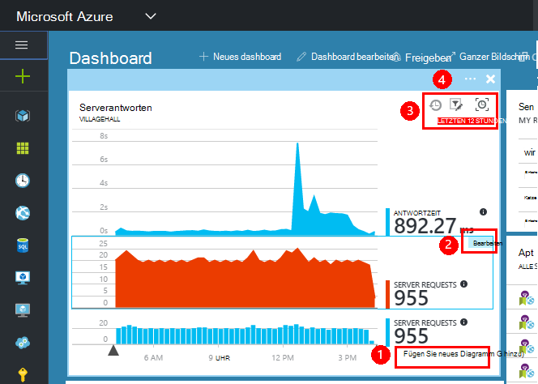

1. Hinzufügen eines Diagramms zu der Kachel. 
2. Metrisch, Gruppe von Dimension und Stil (Tabelle, Diagramm) eines Diagramms festgelegt.
3. Ziehen Sie über das Diagramm zu vergrößern. Klicken Sie auf Rückgängig, um die Zeitspanne zurückgesetzt; Filtereigenschaften für Diagramme auf der Kachel fest
4. Festlegen Sie Kachel Titel.

Fliesen aus Metrik Explorer fixiert haben mehr Bearbeitungsoptionen als Kacheln fixiert eine Übersicht Blatt.

Die Bearbeitung ist nicht die ursprüngliche Fläche, die Sie angeheftet betroffen.

## Wechseln zwischen dashboards

Sie können mehrere Dashboard speichern und zwischen ihnen wechseln. Wenn Sie ein Diagramm oder ein Blade festhalten, sie aktuelle Dashboard hinzugefügt.

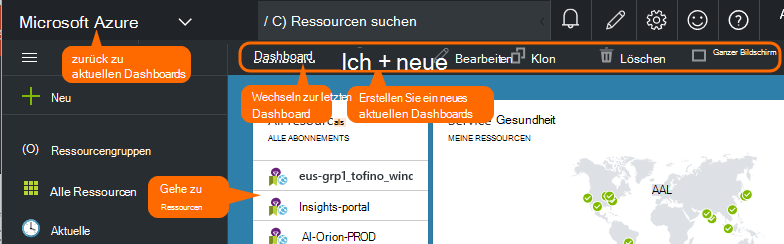

Beispielsweise müssen Sie ein Dashboard zum Vollbild Team, und weitere allgemeine Entwicklung anzeigen.

Klicken Sie im Schaltpult eine-Blade wird als Kachel: Klicken Sie auf das Blatt zu. Ein Diagramm wird das Diagramm am ursprünglichen Speicherort repliziert.

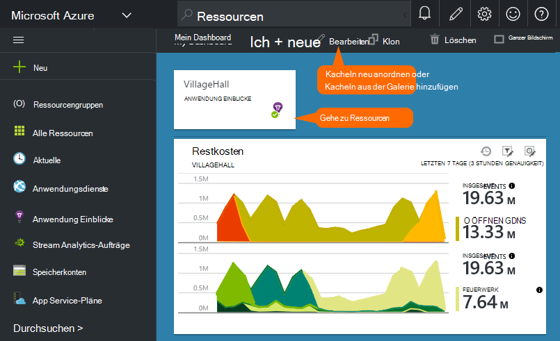

## Freigeben von dashboards

Wenn Sie ein Dashboard erstellt haben, können Sie mit anderen Benutzern gemeinsam nutzen.

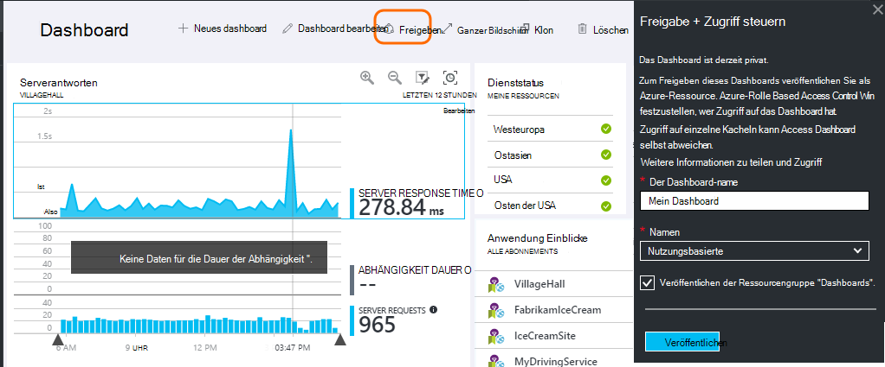

Informationen Sie zu [Rollen und Zugriffskontrolle](app-insights-resources-roles-access-control.md).

## App-navigation

Übersicht über Blade ist das Gateway Informationen Ihrer app.

* **Diagramm oder nebeneinander** auf nebeneinander oder Diagramm, um es zeigt Einzelheiten anzuzeigen.

### Übersicht über Blade-Schaltflächen

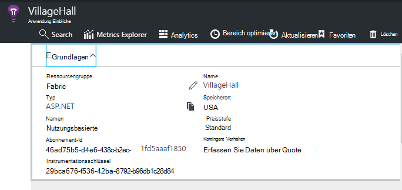

* [**Metrik-Explorer**](app-insights-metrics-explorer.md) - Erstellen von Diagrammen und Verwendung.
* [**Suche**](app-insights-diagnostic-search.md) - bestimmte Instanzen von Ereignissen wie Anfragen, Ausnahmen überprüfen bzw. Spuren.
* [**Analytics**](app-insights-analytics.md) - leistungsstarke Abfragen über Ihre Telemetrie.
* **Zeitraum** - anpassen aller Diagramme auf dem Blatt angezeigt.
* **Löschen** : Löschen der Application Insights-Ressource für diese Anwendung. Sie sollten auch Ihr Anwendungscode Application Insights-Pakete entfernen oder [instrumentationsschlüssel](app-insights-create-new-resource.md#copy-the-instrumentation-key) in Ihrer app Telemetrie zu einer anderen Anwendung Einblicke Ressource direkt bearbeiten.

### Essentials-Registerkarte

* [Instrumentation-Schlüssel](app-insights-create-new-resource.md#copy-the-instrumentation-key) – identifiziert diese app Ressource. 
* Preisgestaltung - Features verfügbar und festgelegte Volume Groß stellen.

### App-Navigationsleiste

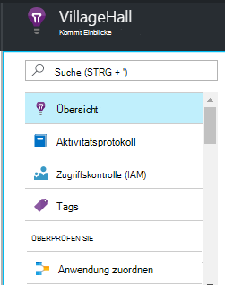

* **Übersicht** - Rückgabe an die Anwendung Übersicht Blade.
* **Aktivitätsprotokoll** - Alarme und Azure administrative Ereignisse.
* [**Access Control**](app-insights-resources-roles-access-control.md) - Teammitgliedern und anderen Personen Zugriff gewähren.
* [**Tags**](../resource-group-using-tags.md) - Tags Ihrer app mit anderen Gruppieren verwenden.

ÜBERPRÜFEN SIE

* [**Anwendung Map**](app-insights-app-map.md) - aktive Karte zeigt die Komponenten der Anwendung von Abhängigkeitsinformationen abgeleitet.
* [**Proaktive Diagnose**](app-insights-proactive-diagnostics.md) - Überprüfung letzten Performance.
* [**Live-Stream**](app-insights-metrics-explorer.md#live-stream) - eine feste sofortige Metriken nützlich, wenn Sie einen neuen Build bereitstellen oder Debuggen.
* [**Verfügbarkeit / Webtests**](app-insights-monitor-web-app-availability.md) -regelmäßige Anfragen für Ihre Webanwendung um die Welt 
* [**Fehler und Performance**](app-insights-web-monitor-performance.md) - Ausnahmen, Fehlerraten und Reaktionszeiten für Ihre App und Anfragen von Ihrer Anwendung [abhängig](app-insights-asp-net-dependencies.md).
* [**Performance**](app-insights-web-monitor-performance.md) - Reaktionszeit, Abhängigkeit Reaktionszeiten. 
* [Server](app-insights-web-monitor-performance.md) - Leistungsindikatoren. Verfügbar, wenn Sie [Statusmonitor installieren](app-insights-monitor-performance-live-website-now.md).

* **Browser** - Seite und AJAX-Leistung. Verfügbar, wenn Sie [Webseiten Instrumentieren](app-insights-javascript.md).
* **Verwendung** - Seite, Benutzer und Sitzung zählt. Verfügbar, wenn Sie [Webseiten Instrumentieren](app-insights-javascript.md).

KONFIGURIEREN

* **Erste Schritte** - Inline-Lernprogramm.
* **Eigenschaften** - instrumentationsschlüssel, Abonnements und Ressourcennr.
* [Alerts](app-insights-alerts.md) - Metrik Warnungskonfiguration.
* [Kontinuierliche exportieren](app-insights-export-telemetry.md) - Export Telemetrie Azure-Speicher konfigurieren.
* [Leistungstests](app-insights-monitor-web-app-availability.md#performance-tests) - richten Sie eine synthetische Last auf Ihrer Website.
* [Kontingent Preise](app-insights-pricing.md) und [Aufnahme Sampling](app-insights-sampling.md).
* **API-Zugriff** – erstellen Sie [Notizen freigeben](app-insights-annotations.md) und die Datenzugriffs-API.
* [**Arbeitsaufgaben**](app-insights-diagnostic-search.md#create-work-item) - Herstellen einer Arbeitsaufgabe Überwachungssystem, sodass Fehler erstellen und Telemetrie.

Einstellungen

* [**Sperren**](..\resource-group-lock-resources.md) - Azure Ressourcen Sperren
* [**Automatisierungsskript**](app-insights-powershell.md) - Definition Azure Ressource exportieren, sodass Sie sie als Vorlage verwenden können, neue Ressourcen erstellen.

UNTERSTÜTZUNG

* **Anfrage** - erfordert ein Abonnement. Siehe auch [Hilfe](app-insights-get-dev-support.md).

## Was kommt als nächstes?

||
|---|---
|[Metrik-explorer](app-insights-metrics-explorer.md) Filter und Segment Metriken|
|[Diagnose suchen](app-insights-diagnostic-search.md) Finden Sie, überprüfen Sie verwandte Ereignisse Ereignisse und erstellen Fehler |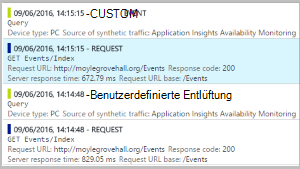
|[Analytics](app-insights-analytics.md) Leistungsfähige Abfragesprache| 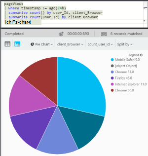

