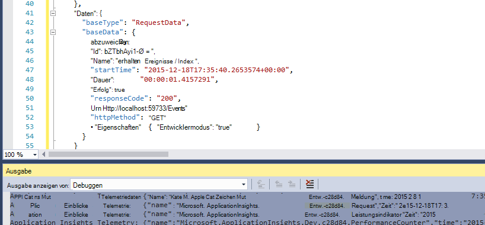
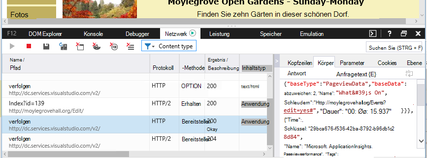

<properties 
    pageTitle="Datenaufbewahrung und Speicher in Anwendung Einblicke" 
    description="Aufbewahrung und Privacy Policy-Anweisung" 
    services="application-insights" 
    documentationCenter=""
    authors="alancameronwills" 
    manager="douge"/>

<tags 
    ms.service="application-insights" 
    ms.workload="tbd" 
    ms.tgt_pltfrm="ibiza" 
    ms.devlang="na" 
    ms.topic="article" 
    ms.date="05/17/2016" 
    ms.author="awills"/>

# Datensammlung, Aufbewahrung und Speicherung in Anwendung Einblicke 

*Anwendung Informationen ist in der Vorschau.*

Bei der Installation von [Visual Studio Application Insights] [ start] SDK in Ihrer Anwendung sendet Telemetrie über Ihre app in die Cloud. Natürlich wollen zuständige Entwicklern, genau welche Daten, was mit den Daten geschieht und wie sie Kontrolle halten. Insbesondere sensible Daten gesendet werden können, wird es gespeichert und wie sicher ist es? 

Zunächst die Antwort:

* Die standard Telemetrie-Module "" ausgeführt werden Daten an den Dienst senden. Die Telemetrie betrifft laden, Leistung und Auslastung Metriken ausnahmeberichte und andere Diagnosedaten. Der Hauptthread in die Diagnoseberichte sichtbar werden URLs; aber Ihre app sollte nicht in jedem Fall Daten in Klartext in einem URL.
* Sie können Code schreiben, der zusätzliche benutzerdefinierte Telemetrie zu Diagnose und Überwachung sendet. (Diese Erweiterbarkeit ist ein großartiges Feature von Application Insights.) Es wäre möglich, versehentlich dieser Code schreiben, um persönliche und andere Daten enthält. Wenn Ihre Anwendung Daten arbeitet, sollten Sie starke Prüfprozesse den Code installieren, die Sie schreiben.
* Beim Entwickeln und Testen Ihrer Anwendung, ist es einfach überprüfen, was mit dem SDK gesendet wird. Die Daten im Debugfenster Ausgabe der IDE und Browser angezeigt. 
* Die Daten werden in [Microsoft Azure](http://azure.com) -Server in den USA gespeichert. (Aber Ihre app kann überall ausführen.) Azure hat [hohe Sicherheit verarbeitet und eine Vielzahl von Compliance-Standards erfüllt](https://azure.microsoft.com/support/trust-center/). Nur Sie und Ihr Team festgelegten haben Zugriff auf Ihre Daten. Microsoft-Mitarbeiter können Zugriff darauf nur unter bestimmten eingeschränkten Umständen mit Ihrem Wissen beschränkt. Es ist zwar nicht auf den Servern in Transit verschlüsselt.

Der Rest dieses Artikels erläutert mehr Antworten. Es soll unabhängig sein, damit Sie es Kollegen anzeigen können, die nicht Teil Ihres Teams.

## Was ist Application Insights?

[Visual Studio Application Insights] [ start] Dienste von Microsoft, mit der Sie verbessern die Leistung und Verwendbarkeit der aktiven Anwendung. Überwacht die Anwendung Zeit Ausführung während Tests und nachdem Sie veröffentlicht oder bereitgestellt. Application Insights erstellt Diagramme und Tabellen, die Sie z. B. anzeigen, welche Tageszeit die meisten Benutzer erhalten wie reagiert die Anwendung und wie es durch externe Dienste bereitgestellt werden, von denen es abhängt. Gibt abstürzen, Fehlern oder Leistungsproblemen, können Sie Telemetriedaten ausführlich die Ursache diagnostizieren durchsuchen. Und der Dienst senden Sie e-Mails gibt es keine Änderung der Verfügbarkeit und Performance Ihrer Anwendung.

Um diese Funktionalität zu erhalten, installieren Sie Application Insights-SDK in der Anwendung, die Teil des Codes. Ausführung Ihrer Anwendung überwacht die SDK und Telemetrie Application Insights-Dienst sendet. Dies ist ein Cloud-Dienst von [Microsoft Azure](http://azure.com)gehostet wird. (Aber Anwendung Einblicke für jede Anwendung, nicht nur diejenigen, die in Azure gehostet werden.)

Application Insights-Dienst speichert und analysiert die Telemetrie. Analyse oder Suche gespeicherte Telemetrie finden Ihre Azure-Konto anmelden und Application Insights-Ressource für die Anwendung zu öffnen. Sie können auch Zugriff auf die Daten mit anderen Mitgliedern Ihres Teams oder angegebenen Azure Abonnenten freigeben.

Sie können Daten aus dem Dienst Anwendung Einblicke z. B. einer Datenbank oder externe Tools. Jedes Tool wird mit einem speziellen Schlüssel den Dienst erhalten bereitstellen. Der Schlüssel kann gegebenenfalls widerrufen werden. 

Anwendung Einblicke SDKs sind für zahlreiche Anwendungstypen verfügbar: web-Dienste in Ihre eigenen Server J2EE oder ASP.NET und Azure; Webclients - also den Code auf einer Webseite ausgeführt; Desktop-apps und -Dienste. apps wie Android, Windows Phone und iOS Gerät. Alle senden Telemetriedaten auf denselben Dienst.

## Welche Daten werden sie gesammelt?

### Die Daten werden gesammelt?

Es gibt drei Datenquellen:

* Das SDK in Ihre Anwendung integrieren [in der Entwicklung](app-insights-asp-net.md) oder [zur Laufzeit](app-insights-monitor-performance-live-website-now.md). Es gibt verschiedene SDKs für verschiedene Anwendungstypen. Es gibt auch ein [SDK für Webseiten](app-insights-javascript.md)in den Browser des Endbenutzers zusammen mit der Seite geladen.

 * Jede SDK enthält eine Anzahl von [Modulen](app-insights-configuration-with-applicationinsights-config.md), die Techniken verwenden, um verschiedene Arten von Telemetriedaten sammeln.
 * Bei der Installation des SDK in der Entwicklung können die API Sie eigene Telemetrie neben den Standardmodulen senden. Diese benutzerdefinierte Telemetrie kann Daten enthalten, die Sie senden möchten.
* In einigen Webservern sind auch Agents, die zusammen mit der Anwendung ausführen und Telemetrie über CPU, Speicher und Netzwerk-Belegung. Beispielsweise können Azure VMs, Andockfenster Hosts und [Server J2EE](app-insights-java-agent.md) Akteuren.
* [Verfügbarkeitstests](app-insights-monitor-web-app-availability.md) sind Prozesse Ausführen von Microsoft, die Anfragen an Ihrer Anwendung in regelmäßigen Abständen. Die Ergebnisse werden an Application Insights-Dienst gesendet.

### Welche Daten werden gesammelt?

Die Hauptkategorien sind:

* [Web Server Telemetrie](app-insights-asp-net.md) - HTTP-Anfragen.  URI, Verarbeitungszeit für die Anforderung, Antwortcode, IP-Adresse. Sitzungsbezeichner.
* [Webseiten](app-insights-javascript.md) - Seite, Benutzer und Sitzung zählt. Ladezeiten. Ausnahmen. AJAX-Aufrufe.
* Leistung Leistungsindikatoren - Speicher, CPU, EA, Netzwerk-Auslastung.
* Client und Server Kontext - OS Gebietsschema Gerätetyp, Browser, Auflösung.
* [Ausnahmen](app-insights-asp-net-exceptions.md) und Abstürze - **Stapel dumps**, erstellen CPU-Typ-Id. 
* [Dependencies](app-insights-asp-net-dependencies.md) - Aufrufe an externe Dienste wie REST, SQL, AJAX. URI oder die Verbindungszeichenfolge Dauer Erfolg, Befehl.
* [Verfügbarkeitstests](app-insights-monitor-web-app-availability.md) - Dauer des Tests, Schritte und Antworten.
* [Überwachungsprotokolle](app-insights-search-diagnostic-logs.md) und [benutzerdefinierte Telemetrie](app-insights-api-custom-events-metrics.md) - **was in Ihre Protokolle oder Telemetrie Code**.

[Weitere Details](#data-sent-by-application-insights).

## Wie kann ich überprüfen, was gesammelt werden?

Wenn Sie die Anwendung mit Visual Studio entwickeln, führen Sie die Anwendung im Debugmodus (F5). Die Telemetrie wird im Fenster Ausgabe angezeigt. Von dort kopieren und als JSON für Inspektion formatieren. 

Im Fenster Diagnose ist auch besser lesbaren anzeigen.

Öffnen Sie für Web-Seiten Ihres Browsers Debuggen.

### Schreibe ich Code Telemetriedaten filtern, bevor sie gesendet wird?

Dies wäre möglich durch [Telemetrie-Prozessor-Plug-in](app-insights-api-filtering-sampling.md)schreiben.

## Wie lange werden die Daten gespeichert? 

7 Tage bleiben Rohdaten Punkte (Elemente, die Diagnose Suche überprüfen können). Ggf. länger Daten können [kontinuierlich exportieren](app-insights-export-telemetry.md) Sie in ein Speicherkonto kopieren.

Aggregierte Daten (d. h. zählt Mittelwerte und andere statistischen Daten Metrik Explorer) werden auf eine Körnung von 1 Minute 30 Tagen und 1 Stunde oder Tag (je nach) für mindestens 90 Tage beibehalten.

## Wer kann auf die Daten zugreifen?

Wird Sie gelöscht und ein Unternehmenskonto Teammitglieder haben. 

Es können Sie und Ihre Teammitglieder exportiert werden konnte werden in anderen Speicherorten kopiert und an andere Personen weitergegeben werden.

#### Was tut Microsoft Informationen meiner app Application Insights sendet?

Microsoft verwendet die Daten, um den Dienst anbieten.

## Wo werden die Daten gespeichert? 

* In den USA. 

#### Können sie irgendwo, beispielsweise in Europa werden gespeichert? 

* Derzeit nicht. 

#### Bedeutet dies, dass meine app in den USA gehostet werden muss?

* Nein. Die Anwendung kann überall lokalen Hosts oder in der Cloud ausgeführt.

## Wie sicher sind meine Daten?  

Application Insights ist ein Azure-Dienst in der Vorschau. Während in der Vorschau wir zum Schutz Ihrer Daten in [Azure-Sicherheit, Datenschutz und Compliance-Whitepaper](http://go.microsoft.com/fwlink/?linkid=392408)beschriebenen Richtlinien arbeiten.

Die Daten werden in Microsoft Azure-Server gespeichert. Konten in der Azure-Portal werden Kontenbeschränkungen in [Azure-Sicherheit, Datenschutz und Compliance-Dokument](http://go.microsoft.com/fwlink/?linkid=392408)beschrieben. Konten in der Visual Studio Team Services wendet [Visual Studio Team Services Datenschutz](http://download.microsoft.com/download/8/E/E/8EE6A61C-44C2-4F81-B870-A267F1DF978C/MicrosoftVisualStudioOnlineDataProtection.pdf) Dokument. 

Zugriff auf die Daten von Microsoft Personal beschränkt. Wir Ihren Daten nur mit Ihrer Erlaubnis und ggf. zur Unterstützung der Anwendung Einblicke. 

Daten insgesamt anwendungsübergreifend unserer Kunden (wie Datenraten und durchschnittliche Größe der Spuren) zur Anwendung Einblicke zu verbessern.

#### Beeinträchtigen fremder Telemetrie Daten Einblicke Anwendung könnte?

Sie können per zusätzliche Telemetrie zu Ihrem Konto der Instrumentation Taste in den Code Ihrer Webseite finden. Mit genügend zusätzlichen Daten würde die Metriken nicht korrekt Performance und Nutzung Ihrer Anwendung dar.

Wenn Sie Code für andere Projekte freigeben, sollten Sie den instrumentationsschlüssel entfernen.

## Werden die Daten verschlüsselt? 

Innerhalb der Server derzeit nicht.

Alle Daten werden verschlüsselt zwischen Rechenzentren.

#### Werden die Daten bei der Übertragung von Anwendung zu Anwendung Einblicke Servern verschlüsselt?

Ja, wir Https zum Senden von Daten an das Portal aus fast alle SDKs, einschließlich Web-, Geräte und HTTPS-Webseiten verwenden. Die einzige Ausnahme ist Daten einfacher HTTP-Webseiten. 

## Persönlich identifizierbare Informationen

#### Persönlich identifizierbare Informationen (PII) an Application Insights gesendet werden konnten? 

Ja, das geht. 

Als Faustregel:

* Die meisten Telemetrie (d. h. ohne Schreiben von Code gesendet Telemetrie) enthält keine explizite PII. Jedoch können durch Ableitung aus einer Sammlung von Ereignissen identifizieren möglich.
* Ausnahme und Trace Nachrichten können personenbezogene Informationen enthalten.
* Benutzerdefinierte Telemetrie -, z. B. Aufrufe wie TrackEvent Schreiben in Code mit Spuren API oder Protokoll - kann Daten enthalten, die Sie auswählen.

Die Tabelle am Ende dieses Dokuments enthält ausführlichere Beschreibung der gesammelten Daten.

#### Bin ich verantwortlich für die Einhaltung von Gesetzen und Vorschriften in Bezug auf personenbezogene Informationen?

Ja. Es liegt in Ihrer Verantwortung sicherzustellen, dass die Erfassung und Verwendung der Daten mit rechts- und Verwaltungsvorschriften und mit den Microsoft Online Services.

Informieren Sie Ihre Kunden entsprechend Ihrer Anwendung sammelt Daten und wie die Daten verwendet werden.

#### Werden Benutzer können Anwendung Einblicke deaktiviert?

Nicht direkt. Wir bieten einen Switch keine Benutzer Einblicke Anwendung deaktiviert sind.

Allerdings können Sie diese Funktion in der Anwendung implementieren. Die SDKs enthalten eine API-Einstellung Telemetrie Auflistung deaktiviert. 

#### Die Anwendung sammelt unbeabsichtigt vertrauliche Informationen. Kann Anwendung Einblicke Daten bereinigen, damit übernommen wird?

Application Insights nicht filtern oder löschen. Die Daten entsprechend verwalten sollten und vermeiden Sie das Senden dieser Daten Anwendung Erkenntnisse.

## Daten Anwendung Einblicke

Die SDKs zwischen Plattformen variieren und sind mehrere Komponenten, die Sie installieren können. ( [Application Insights - Einstieg]finden Sie unter[start].) Jede Komponente sendet unterschiedliche Daten.

#### Klassen von Daten in verschiedenen Szenarien

Die Aktion  | Datenklassen erfasst (siehe folgende Tabelle)
---|---
[Ein Webprojekt .NET Application Insights-SDK hinzufügen][greenbrown] | ServerContext Abgeleitet Leistungsindikatoren Anfragen **Ausnahmen** Sitzung Benutzer
[Überwachen auf IIS installieren][redfield]|Abhängigkeit ServerContext Abgeleitet Leistungsindikatoren
[Java Web app Application Insights-SDK hinzufügen][java]|ServerContext Abgeleitet Anforderung Sitzung Benutzer
[JavaScript-SDK Webseite hinzufügen][client]|ClientContext  Abgeleitet Seite ClientPerf AJAX
[Standardeigenschaften definieren][apiproperties]|**Eigenschaften** für alle Standard- und benutzerdefinierten Ereignisse
[TrackMetric aufrufen][api]|Numerische Werte **Eigenschaften**
[Rufen Sie verfolgen *][api]|Ereignisname **Eigenschaften**
[TrackException aufrufen][api]|**Ausnahmen** Stapeldumps **Eigenschaften**
SDK kann keine Daten. Zum Beispiel:   -Leistungsindikatoren kann nicht zugegriffen werden  -Ausnahme Telemetrie Initialisierung | SDK-Diagnose
 

Für [SDKs für andere Plattformen,][platforms], ihre Dokumente sehen.

#### Die Klassen von Daten

Daten-Klasse | Enthält (keine vollständige Liste) 
---|---
**Eigenschaften**|**Daten - Code bestimmt**
Gerätekontext |ID, IP, Gebietsschema, Modell Netzwerk Netzwerktyp, OEM-Name, Auflösung Rolleninstanz Rollenname, Gerätetyp
ClientContext |Betriebssystem, Gebietsschema, Sprache, Netzwerk, Auflösung
Sitzung | Sitzung-id
ServerContext |Computername, Gebietsschema, OS Gerät Sitzung, Benutzerkontext, Vorgang 
Abgeleitet |IP-Adresse, Zeitstempel, Betriebssystem, Browser GeoLocation
Metriken | Metrische Name und Wert
Ereignisse | Namen und Wert
Seitenzugriffe | URL und Seite oder Pseudonym
Client-Leistung | URL-Seite Namen, Ladezeit browser
AJAX | HTTP-Aufrufe von Webseite server
Anfragen |URL, Dauer, Antwortcode
Abhängigkeit|(SQL, HTTP,...), Zeichenfolge oder URI synchrone/asynchrone Dauer Erfolg, SQL-Anweisung (Statusmonitor)
**Ausnahmen** | Typ **Nachricht**Aufruflisten, Datei- und Nummern, Thread-id
Stürzt ab | Prozess-Id, übergeordnete Prozess-Id, Threadkennung Absturz. anwendungspatch-Id, erstellen;  Ausnahmetyp, Adresse, Grund; verborgene Symbole und Register, binäre Start- und Adressen binärer Name und Pfad, CPU-Typ
Trace | **Meldung** und dem Schweregrad
Leistungsindikatoren | Prozessorzeit, Arbeitsspeicher Anforderungsrate, Exception-Rate, privaten Bytes, e/a-Rate, Anforderungsdauer Länge der Anforderungswarteschlange
Verfügbarkeit | Antwort Webtestcode, Dauer jeder Testschritt Testname, Zeitstempel, Erfolg, Reaktionszeit, Testverzeichnis
SDK-Diagnose | Trace-Nachricht oder eine Ausnahme 

Sie können [Daten durch Bearbeitung ApplicationInsights.config ausschalten][config]

## Gutschriften

Dieses Produkt enthält GeoLite2 Daten von [http://www.maxmind.com](http://www.maxmind.com)MaxMind.

## Videos

#### Einführung

> [AZURE.VIDEO application-insights-introduction]

#### Erste Schritte

> [AZURE.VIDEO getting-started-with-application-insights]

<!--Link references-->

[api]: app-insights-api-custom-events-metrics.md
[apiproperties]: app-insights-api-custom-events-metrics.md#properties
[client]: app-insights-javascript.md
[config]: app-insights-configuration-with-applicationinsights-config.md
[greenbrown]: app-insights-asp-net.md
[java]: app-insights-java-get-started.md
[platforms]: app-insights-platforms.md
[pricing]: http://azure.microsoft.com/pricing/details/application-insights/
[redfield]: app-insights-monitor-performance-live-website-now.md
[start]: app-insights-overview.md

 