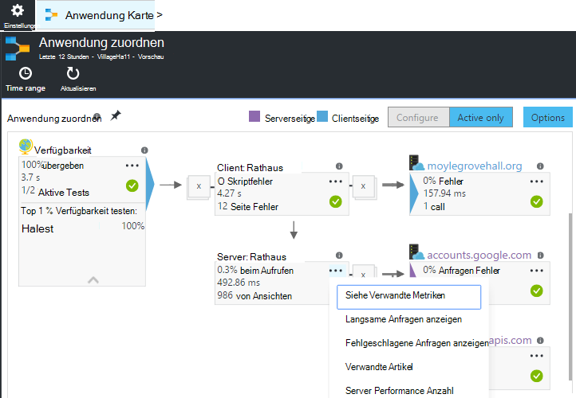
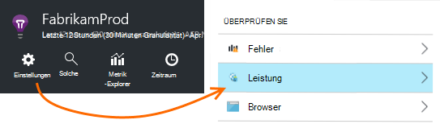
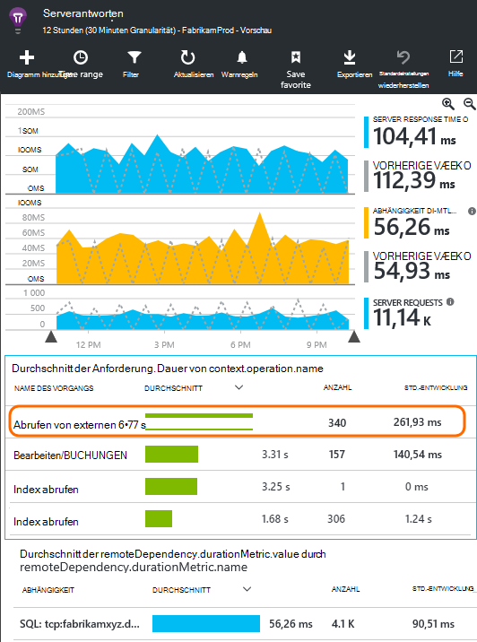
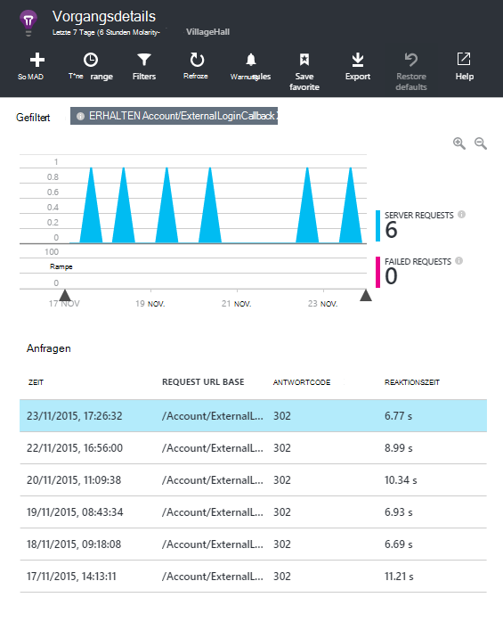
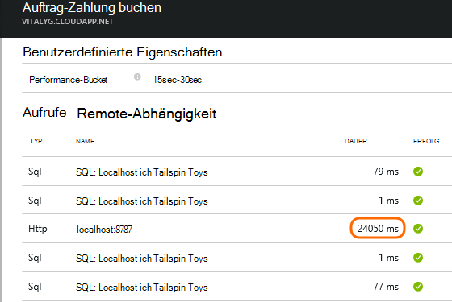
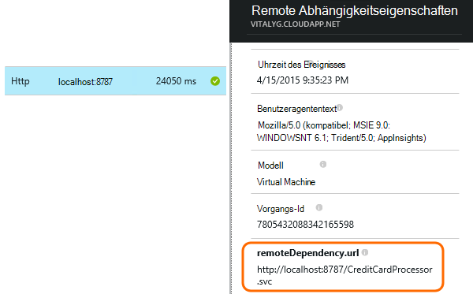
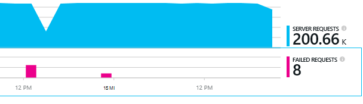
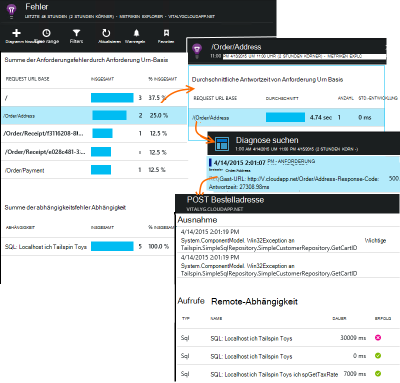

<properties 
    pageTitle="Diagnose von Problemen mit Abhängigkeiten Anwendung Erkenntnisse" 
    description="Suchen Sie Fehler und langsam Abhängigkeiten zurückzuführen" 
    services="application-insights" 
    documentationCenter=""
    authors="alancameronwills" 
    manager="douge"/>

<tags 
    ms.service="application-insights" 
    ms.workload="tbd" 
    ms.tgt_pltfrm="ibiza" 
    ms.devlang="na" 
    ms.topic="article" 
    ms.date="05/12/2016" 
    ms.author="awills"/>
 
# <a name="diagnosing-issues-with-dependencies-in-application-insights"></a>Diagnose von Problemen mit Abhängigkeiten Anwendung Erkenntnisse


Eine *Abhängigkeit* ist eine externe Komponente, die von der Anwendung aufgerufen wird. Es ist normalerweise ein Dienst mit HTTP, einer Datenbank oder eines Dateisystems. Oder in Ihrem Skript Webseite ein AJAX-Aufruf an den Server. In Visual Studio Application Insights können Sie leicht erkennen, wie lange Ihre Anwendung Abhängigkeiten wartet, und wie oft ein Abhängigkeit-Aufruf fehlschlägt.

## <a name="where-you-can-use-it"></a>Wo können Sie

Standardmäßig kann abhängigkeitsüberwachung aktuell:

* ASP.NET webapps und Dienste auf einem IIS-Server oder auf Azure
* [Java webapps](app-insights-java-agent.md)
* [Webseiten](https://azure.microsoft.com/blog/ajax-collection-in-application-insights/)

Für andere Typen wie Gerät apps können Sie Ihre eigenen Monitor mit der [TrackDependency-API](app-insights-api-custom-events-metrics.md#track-dependency)schreiben.

Die vordefinierten abhängigkeitsmonitor meldet derzeit ruft diese Typen von Abhängigkeiten:

* ASP.NET
 * SQL-Datenbanken
 * ASP.NET Web und WCF-Dienste, die HTTP-basierte Bindungen verwenden
 * Lokale oder remote-HTTP-Aufrufe
 * Azure DocumentDb, Tabelle BLOB-Speicher und Warteschlangen
* Java
 * Aufrufe von einer Datenbank über einen [JDBC](http://docs.oracle.com/javase/7/docs/technotes/guides/jdbc/) -Treiber wie MySQL, SQL Server, PostgreSQL und SQLite.
* Webseiten
 * [AJAX-Aufrufe](app-insights-javascript.md)

Erneut schreiben Sie Ihre eigenen SDK-Aufrufe für andere überwachen.

## <a name="to-set-up-dependency-monitoring"></a>Abhängigkeitsüberwachung einrichten

Der entsprechenden Agent für Host-Server installiert.

Plattform | Installieren
---|---
IIS-Server | Entweder [Überwachen auf Ihrem Server installieren](app-insights-monitor-performance-live-website-now.md) oder [Aktualisieren Sie Ihre Anwendung auf .NET Framework 4.6 oder höher](http://go.microsoft.com/fwlink/?LinkId=528259) und installieren [Application Insights-SDK](app-insights-asp-net.md) in Ihrer Anwendung.
Azure WebApp | [Anwendung Einblicke Erweiterung](app-insights-azure-web-apps.md)
Java-Webserver | [Java webapps](app-insights-java-agent.md)
Webseiten | [JavaScript-monitor](app-insights-javascript.md) (Kein zusätzliches Setup über Webseite überwachen)
Azure-Cloud-Dienst |  [Startaufgabe verwenden](app-insights-cloudservices.md#dependencies) oder [Installieren Sie .NET Framework 4.6 +](../cloud-services/cloud-services-dotnet-install-dotnet.md)  

Überwachen des IIS-Servern benötigt kein das Quellprojekt SDK Einblicke Anwendung neu erstellen. 

## <a name="application-map"></a>Anwendung zuordnen

Anwendung Zuordnung dient als visuelle Hilfe zur Erfassung von Abhängigkeit zwischen Komponenten der Anwendung. 



In den Feldern können Sie relevante Abhängigkeit und andere Diagramme navigieren.

Klicken Sie auf den kleinen [X] um eine Teilstruktur zu reduzieren.

PIN der Karte, um das [Dashboard](app-insights-dashboards.md), wo sie voll funktionsfähig sind.

[Erfahren Sie mehr](app-insights-app-map.md).

## <a name="diagnosis"></a>Analyse von Leistungsproblemen Abhängigkeit auf dem Webserver

Bewerten Sie die Leistung der Anforderung an den server



Scrollen Sie betrachten das Raster Anfragen:



Der oberste Eintrag dauert sehr lange. Sehen Sie, wo die Zeit finden.

Klicken Sie auf, um einzelne Ereignisse finden Sie unter:




Klicken Sie auf jede Instanz langer näher untersuchen.

> [AZURE.NOTE] Scrollen Sie etwas eine Instanz auswählen. Wartezeit in der Pipeline kann bedeuten, dass die Daten für die oberen Instanzen unvollständig ist.

Scrollen Sie remote Abhängigkeit ruft diese Anfrage:



Es sieht aus wie die Zeit Service, die einen Aufruf an einen lokalen Dienst diese Anfrage aufgewendet wurde. 

Wählen Sie diese Zeile informieren:




Das Detail enthält genügend Informationen, um das Problem zu diagnostizieren.


## <a name="failures"></a>Fehler

Fehlgeschlagene Anfragen, klicken Sie auf das Diagramm.



Klicken Sie auf einen Typ und Anforderung beispielsweise zu einem fehlgeschlagenen Aufruf remote Abhängigkeit.





## <a name="custom-dependency-tracking"></a>Benutzerdefinierte Abhängigkeit verfolgen

Nachverfolgen von Abhängigkeit Standardmodul erkennt automatisch externe Faktoren wie Datenbanken und REST-APIs. Aber Sie einige zusätzlichen Komponenten auf die gleiche Weise behandelt werden. 

Sie können Code schreiben, die Abhängigkeitsinformationen, sendet mit derselben [TrackDependency-API](app-insights-api-custom-events-metrics.md#track-dependency) , die von den Standardmodulen verwendet wird.

Z. B. Wenn Sie Code mit einer Assembly, die Sie selbst geschrieben haben erstellen, können Sie Zeit alle Aufrufe, zu welchen Beitrag zu der Antwortzeiten macht. Senden dieser Daten in Diagrammen Abhängigkeit Anwendung Erkenntnisse angezeigt mit `TrackDependency`.

```C#

            var success = false;
            var startTime = DateTime.UtcNow;
            var timer = System.Diagnostics.Stopwatch.StartNew();
            try
            {
                success = dependency.Call();
            }
            finally
            {
                timer.Stop();
                telemetry.TrackDependency("myDependency", "myCall", startTime, timer.Elapsed, success);
            }
```

Wenn Sie standard Abhängigkeit trackingmodul ausschalten möchten, entfernen Sie auf DependencyTrackingTelemetryModule in [ApplicationInsights.config](app-insights-configuration-with-applicationinsights-config.md).


## <a name="ajax"></a>AJAX

[Webseiten](app-insights-javascript.md)anzeigen


 