<properties
    pageTitle="Erkennen, Selektierung, diagnostizieren"
    description="Abstürze analysieren und ermitteln und Diagnostizieren von Leistungsproblemen in der Anwendung"
    authors="alancameronwills"
    services="application-insights"
    documentationCenter=""
    manager="douge"/>

<tags
    ms.service="application-insights"
    ms.workload="tbd"
    ms.tgt_pltfrm="ibiza"
    ms.devlang="na"
    ms.topic="article" 
    ms.date="11/06/2015"
    ms.author="awills"/>

# Erkennen, Selektierung und Diagnose Anwendung Einblicke

*Anwendung Informationen ist in der Vorschau.*

Anwendung Einblicke können Sie herausfinden, wie Ihre Anwendung ausgeführt wird und wenn es aktiv ist. Und wenn ein Problem vorliegt, sie kennen, können die Auswirkungen und hilft, die Ursache ermitteln.

Hier ist ein Konto von einem Team, das Webapplikationen entwickelt:

* *"Ein paar Tagen bereitgestellt wir 'minor' Hotfix. Breite Testlauf nicht ausgeführt, aber leider hat einige unerwartete Änderung in der Nutzlast verursacht Inkompatibilität zwischen der Vorder- und Rückseite zusammengeführt. Sofort Serverausnahmen stieg unsere Warnung ausgelöst, und es wurden die Situation. Ein paar Klicks auf Application Insights-Portal haben wir genügend Informationen von Ausnahme Aufruflisten, das Problem einzugrenzen. Wir sofort zurückgesetzt und den Schaden begrenzt. Application Insights hat diesen Teil der Devops Zyklus einfach und umsetzbare."*

Sehen wir uns an, wie ein Webdienst-Entwicklungsteam Anwendung Einblicke zum Überwachen der Leistung verwendet. Wir folgen das Team Fabrikam Bank, die online-Banking-System (OBS) entwickelt.

Das Team arbeitet auf einen solchen Zyklus:

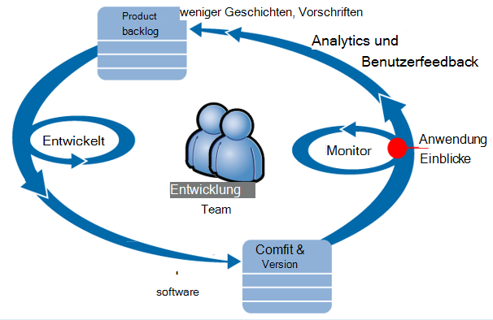

Vorschriften feed in ihrer Entwicklung Rückstand (Aufgabenliste). Sie arbeiten in Sprints, die funktionsfähige Software - meist in Form der Verbesserung und Erweiterung der vorhandenen Anwendung häufig zu liefern. Die live-app wird regelmäßig mit neuen Features aktualisiert. Während es aktiv ist, überwacht das Team für Leistung und mit Hilfe der Anwendung Einblicke. Diese Analyse feeds in ihrer Entwicklung Rückstand.

Das Team verwendet Application Insights Web genau kontrollieren:
* Leistung. Sie möchten verstehen, wie Antwort mit Anzahl variieren. wie viel CPU, Netzwerk, Festplatte und andere Ressourcen verwendet werden. und wo die Engpässe.
* Fehler. Wenn es Ausnahmen oder Anfragen oder geht ein Leistungsindikator außerhalb seiner vertraut, das Team schnell kennen, sodass sie Maßnahmen ergreifen können.
* Verwendung. Wenn neu veröffentlicht, möchten das Team wissen, inwieweit es verwendet wird, und ob Benutzer Probleme mit.

Konzentrieren wir uns auf Feedback Teil des Zyklus:

## Schlechten Verfügbarkeit ermitteln

Marcela Markova ist leitender Entwickler im Team OBS und zur Überwachung von Online-Leistung führt. Sie stellt mehrere [Webtests][availability]:

* Eine einzelne URL Test für die Hauptzielseite für die Anwendung http://fabrikambank.com/onlinebanking/. Sie legt Kriterien der HTTP-Code 200 und Text "Willkommen". Wenn dieser Test fehlschlägt, ist etwas falsch mit dem Netzwerk oder der Server oder möglicherweise Bereitstellungsprobleme. (Oder jemand Willkommen geändert hat. Meldung auf der Seite ohne ihr Wissen).

* Eine tiefere mehrstufigen Test anmelden und ein Girokonto und einige wichtige Details auf jeder Seite überprüft wird. Dieser Test überprüft, ob die Verbindung mit der Kontendatenbank funktioniert. Sie verwendet eine fiktiven Kunden Id: wenige für Testzwecke verwaltet.

Einrichten von Tests ist Marcela sicher, dass das Team ein Ausfall schnell wissen.  

Fehler werden als rote Punkte im Web Test Diagramm angezeigt:

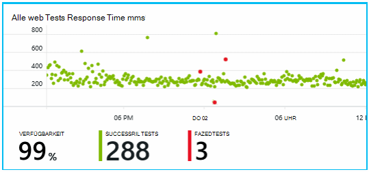

Aber noch wichtiger ist, eine Benachrichtigung über Fehler per e-Mail das Entwicklungsteam. Auf diese Weise wissen sie vor fast alle Kunden.

## Überwachen der Leistungsmetrik

Auf der Übersichtsseite Anwendung Erkenntnisse ist ein Diagramm, eine Vielzahl von [Kennzahlen][perf].

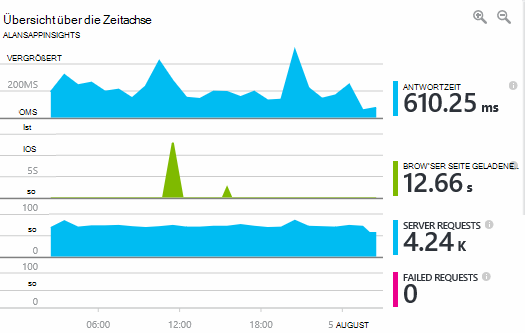

Direkt vom Webseiten Telemetrie Browser Seitenladezeit abgeleitet. Antwortzeit und Serveranzahl fehlgeschlagen Anzahl werden alle gemessenen im Webserver und Anwendung Einblicke aus an.

Marcela ist leicht am Server Antwort Diagramm zeigt die durchschnittliche Zeit zwischen empfängt der Server eine HTTP-Anforderung vom Browser des Benutzers und die Antwort zurückgegeben. Es ist nicht ungewöhnlich, eine Variante in diesem Diagramm sehen wie Belastung des Systems. Aber in diesem Fall scheint es eine Korrelation zwischen kleinen steigt die Anzahl der Anfragen und große Reaktionszeit steigt. Das könnte bedeuten, dass das Betriebssystem an ihre Grenzen. 

Sie öffnet die Server-Diagramme:

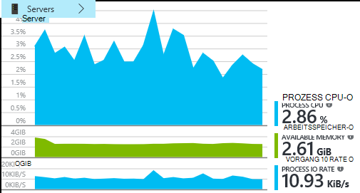

Es scheint keine Anzeichen, unzureichender Ressourcen vielleicht Beulen in Diagrammen Antwort Server Zufall sind.

## Alarme

Dennoch möchten sie Reaktionszeiten im Auge behalten. Hoch gehen, möchte sie sofort wissen.

Damit sie eine [Warnung]wird[metrics], überschreitet einen normalen Reaktionszeiten. Dadurch wird ihr Vertrauen sie darüber wissen, langsame Antwortzeiten sind.

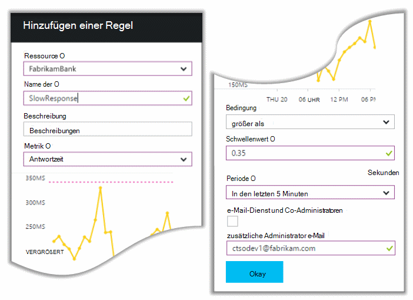

Alarme können auf eine Vielzahl von Metriken festlegen. Beispielsweise können Sie e-Mails Ausnahme Anzahl hoch wird, ob der verfügbare Arbeitsspeicher niedriger geht oder ein Spitzenwert in Clientanforderungen vorliegt.

## Proaktive Diagnose Alarme

Nächsten Tag kommt von Anwendung eine Benachrichtigung per e-Mail. Aber wenn sie sie geöffnet wird, findet sie die Antwort Zeit Warnung, die sie festlegen. Stattdessen teilt es, ein plötzlicher Anstieg fehlgeschlagenen Anfragen - d. h. Anfragen, die Fehlercodes von mindestens 500 zurückgegeben hat.

Fehlgeschlagene Anfragen werden, in dem Benutzer einen Fehler - in der Regel nach einer Ausnahme im Code gesehen haben. Vielleicht sehen sie eine Meldung "Leider konnte nicht wir Ihre Informationen jetzt aktualisieren" sagen oder am absoluten peinlich, ein Stapelabbild auf dem Bildschirm des Benutzers, von dem Webserver.

Diese Warnung ist eine Überraschung war zuletzt sah, die Anforderungsanzahl der fehlgeschlagenen erfreulich niedrig. Eine kleine Anzahl von Fehlern werden in einem ausgelasteten Server erwartet. 

Auch ein wenig überraschend für sie da haben sie diese Warnung konfigurieren. Proaktive Diagnose wird sogar automatisch Anwendung Einblicke. Automatisch angepasst wird, um Ihre app üblichen Fehler Muster und "wird verwendet" Fehler auf einer bestimmten Seite oder hoher Belastung oder andere verknüpft. Es löst Alarm nur bei Zurichten es kommt zu erwarten.

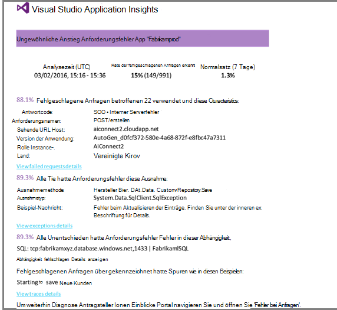

Dies ist eine sehr nützliche e-Mail. Es auslösen nicht nur einen Alarm. Es wird ein Großteil der Selektierung und Diagnose.

Es zeigt, wie viele Kunden betroffen sind, und die Webseiten oder Operationen. Marcela kann entscheiden, ob sie das gesamte Team arbeiten als einem, ob bis zur nächsten Woche ignoriert werden.

Die e-Mail zeigt auch, dass eine bestimmte Ausnahme ist aufgetreten und - noch interessanter - Fehlers durch fehlgeschlagene Aufrufe einer bestimmten Datenbank verknüpft ist. Dies erklärt, warum der Fehler plötzlich Obwohl Marcela Team kürzlich nicht Updates bereitgestellt wurde. 

Sie fragt den Gruppenleiter Datenbank. Ja, erschien einen hot Fix in der letzten halben Stunde; und huch, vielleicht hätte eine geringfügige Schema ändern...

Das Problem ist also auf dem Weg zum festen, sogar bevor Sie Protokolle untersuchen und innerhalb von 15 Minuten aus. Marcela klickt auf die Verknüpfung zum Öffnen der Anwendung Einblicke. Auf eine fehlerhafte Anforderung geöffnet und sie sehen der fehlerhaften Datenbank in der zugeordneten Abhängigkeit Aufrufe aufrufen. 

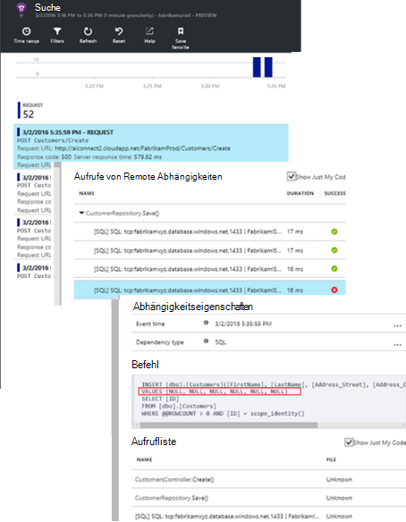

## Erkennen von Ausnahmen

Mit ein wenig Setup werden [Ausnahmen](app-insights-asp-net-exceptions.md) gemeldet Anwendung Erkenntnisse automatisch. Sie können auch explizit durch Aufrufen von [Trackexception()"](app-insights-api-custom-events-metrics.md#track-exception) in den Code einfügen erfasst werden:  

    var telemetry = new TelemetryClient();
    ...
    try
    { ...
    }
    catch (Exception ex)
    {
       // Set up some properties:
       var properties = new Dictionary <string, string>
         {{"Game", currentGame.Name}};

       var measurements = new Dictionary <string, double>
         {{"Users", currentGame.Users.Count}};

       // Send the exception telemetry:
       telemetry.TrackException(ex, properties, measurements);
    }

Fabrikam Bank-Team entwickelte die Praxis immer Telemetrie eine Ausnahme ohne offensichtliche Recovery.  

Ihre Strategie ist sogar noch umfassender: Senden sie Telemetrie in jedem Fall der Debitor im sie wollte ist, ob es eine Ausnahme im Code oder nicht entspricht. Beispielsweise wenn externe Inter-Bank-Übertragung eine Nachricht "diese Transaktion kann nicht abgeschlossen werden" Gründen Betrieb (ohne Verschulden des Kunden) zurück nachverfolgen klicken sie dieses Ereignis.

    var successCode = AttemptTransfer(transferAmount, ...);
    if (successCode < 0)
    {
       var properties = new Dictionary <string, string>
            {{ "Code", returnCode, ... }};
       var measurements = new Dictionary <string, double>
         {{"Value", transferAmount}};
       telemetry.TrackEvent("transfer failed", properties, measurements);
    }

TrackException Ausnahmen gemeldet werden, da eine Kopie des Stapels gesendet wird. TrackEvent wird verwendet, um andere Ereignisse melden. Sie können Eigenschaften anfügen, die bei der Diagnose hilfreich sein können.

Ausnahmen und Ereignisse in der [Diagnose suchen] angezeigt[ diagnostic] Blade. Sie können diese zusätzlichen Eigenschaften und stack Trace anzeigen.

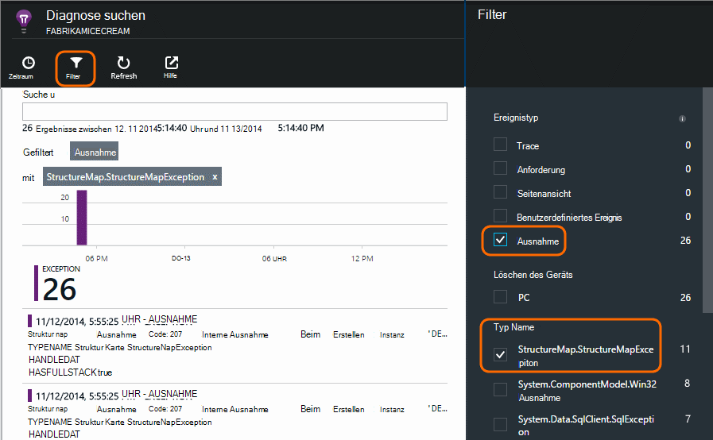

## Überwachen von Benutzeraktivitäten

Antwortzeit ist immer gut, gibt es einige fällt des Entwicklungsteam um die Benutzer zu verbessern und mehr Benutzer die gewünschten Ziele zu erreichen.

Beispielsweise hat ein normaler Benutzer durch die Website löschen 'Trichter': viele betrachten Sie bei verschiedenen Kredits; Einige ausfüllen Angebot; und derjenigen, die ein Angebot, ein Paar der Kredit aufzunehmen.

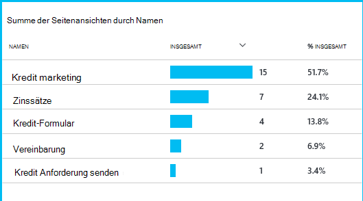

In Betracht ziehen, die größte Anzahl Kunden auslassen, kann Unternehmen, wie Benutzer am Ende der Trichter zu arbeiten. In einigen Fällen möglicherweise ein User Experience (UX) Fehler - z. B. die Schaltfläche 'Weiter' ist oder die Anweisungen nicht offensichtlich. Wahrscheinlich sind größere geschäftlichen Gründen ausfallenden: die Zinssätze sind möglicherweise zu hoch.

Unabhängig von den Gründen, können die Daten das Team, was Benutzer tun. Mehr Tracking Aufrufe möglich, genauer arbeiten. Trackevent()"kann verwendet werden, um alle Benutzeraktionen von Details der einzelnen Mausklicks auf Errungenschaften wie einen Kredit tilgen zählen.

Das Team wird mit Informationen zu Benutzeraktivitäten gewöhnen. Heute, wenn sie neu erstellen, Trainieren sie Feedback zu ihrer Verwendung bereit. Sie entwerfen Tracking Aufrufe der Funktion ab. Sie verwenden das Feedback zu der Funktion jeden Entwicklungszyklus.

## Proaktive Überwachung  

Marcela herumsitzen nicht nur Alarme warten. Nach jeder erneute sie betrachtet [Reaktionszeiten] [ perf] -insgesamt und die Tabelle der langsamste Anfragen Ausnahme zählt.  

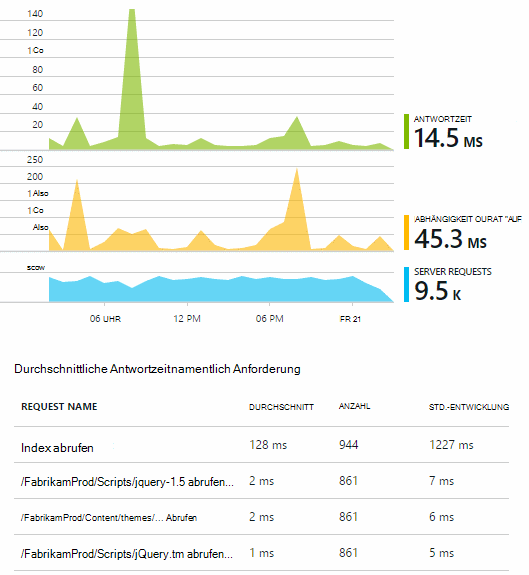

Sie können die Auswirkung auf die Leistung jeder Bereitstellung beurteilen normalerweise wöchentlich mit dem letzten vergleichen. Ist eine plötzliche Verschlechterung, löst sie, die mit den zuständigen Entwicklern aus.

## Selektierung

Triage - Bewertung der Schweregrad und Problem - ist der erste Schritt nach der Erkennung. Sollten wir das Team um Mitternacht aufrufen? Oder kann es bis zur nächsten geeigneten Lücke im Rückstand? Es gibt einige wichtigen Fragen im Rahmen der Selektierung.

Wie viel passiert? Die Diagramme auf der Übersicht geben Perspektive ein Problem. Fabrikam-Anwendung generiert beispielsweise vier Web Test Alarme nachts. Des Diagramms konnte morgens das Team sehen, gab es einige rote Punkte wäre immer noch die meisten Tests grün. Das Verfügbarkeitsdiagramm Drilldown, war klar, dass all diese Probleme zeitweise einen Test aus. Dies war offensichtlich ein Problem betreffen nur einen und würde sich wahrscheinlich deaktivieren.  

Dagegen ist sich dramatisch und stabiler im Diagramm der Ausnahme zählt oder Antwort offensichtlich etwas über Panik.

Eine nützliche Selektierung Taktik ist Probieren Sie es selbst. Wenn Sie dasselbe Problem stoßen, wissen Sie, dass es echt ist.

Welcher Teil Benutzer sind betroffen? Um eine grobe Antwort erhalten, teilen Sie die Fehlerrate der Sitzung gezählt.

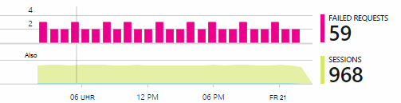

Vergleichen Sie bei langsamen Antwort Tabelle langsamsten Antworten Anfragen bei der Verwendung jeder Seite

Wie wichtig ist das blockierte Szenario? Ist dies ein funktionelles Problem blockieren einer bestimmten Benutzergeschichte, viel geht? Wenn Kunden ihre bezahlen können nicht ist dies schwerwiegende. Wenn sie ihren Bildschirm Farbe Voreinstellungen ändern können, kann vielleicht es warten. Details oder Ausnahme oder der Identität des langsamen Seite erfahren Sie, wo Kunden Probleme auftreten.

## Diagnose

Diagnose ist nicht identisch mit Debuggen. Vor Verfolgung durch den Code sollte Ihnen eine ungefähre Vorstellung davon, warum, wo und wann das Problem auftritt.

**Wenn passiert?** Ereignis und Metrik Diagramme bereitgestellten Verlaufsansicht vereinfacht die Ursachen Effekte zuordnen. In Zeit oder Ausnahme Reaktionsraten zeitweise Peaks vorhanden sind, sehen Sie sich die Anzahl: Spitzen gleichzeitig, wenn es sieht aus wie ein Ressourcenproblem. Möchten Sie mehr CPU oder Arbeitsspeicher zuweisen? Oder eine Abhängigkeit, die die Last nicht?

**Es ist uns?**  Wenn Sie plötzlicher Leistung eines bestimmten Typs haben - zum Beispiel wenn der Kontoauszug Kunde - Anforderung besteht einem externen Subsystem als Web-Anwendung möglicherweise. Metriken Explorer wählen Sie die Abhängigkeit Fehlerrate und Dauer der Abhängigkeit und vergleichen Sie ihre Geschichten über den letzten Stunden oder Tage mit dem Problem möchten. Es ändert korreliert werden, kann einem externen Subsystem verantwortlich sein.  

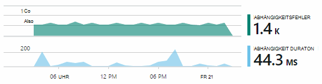

Einige langsame Abhängigkeitsprobleme Geolocation-Probleme. Fabrikam Bank Azure virtuelle Computer verwendet und entdeckt, dass sie versehentlich ihren Webserver und Konto Server in verschiedenen Ländern hatte. Eine spürbare Verbesserung wurde zum Migrieren eines.

**Was haben wir?** Wenn das Problem scheint in einer Abhängigkeit gäbe es immer, ist wahrscheinlich die Ursache einer aktuellen Änderung. Die Perspektive der Historie von Diagrammen Metrik und Ereignis bereitgestellt erleichtert die Bereitstellung plötzlichen Änderungen zuordnen. Das beschränkt die Suche für das Problem.

**Was ist los?** Einige Probleme treten nur selten auf und können schwierig sein, offline testen aufspüren. Wir müssen versuchen, den Fehler erfassen, tritt es live ist. Sie können die Stapeldumps ausnahmeberichte überprüfen. Darüber hinaus können Sie Ihre Lieblings-protokollierungsframework oder TrackTrace() oder Trackevent()"Tracing Aufrufe schreiben.  

Fabrikam hat ein unregelmäßig auftretendes Problem mit zwischen Konten, aber nur mit bestimmten Konto. Um besser zu verstehen, was passiert, sie TrackTrace() Aufrufe an wesentlichen Punkten im Code jeder Aufruf die Kontenart als Eigenschaft zuordnen eingefügt. Wurde er einfach nur die Spuren Diagnose Suche filtern. Sie angefügte auch Parameterwerte als Eigenschaften und Maßnahmen auf die Spur.

## Mit

Sobald das Problem diagnostiziert haben, machen Sie einen Plan zu korrigieren. Brauchen Sie eine aktuelle Änderung ein Rollback oder vielleicht Sie einfach weiter und beheben können. Nach Abschluss das Update informiert Application Insights Sie, ob Sie erfolgreich.  

Fabrikam Bank Entwicklungsteam vorgehen strukturierter Performance-Messung als früher bevor sie Application Insights verwendet.

* Sie geben Leistungsziele bestimmte Maßnahmen Anwendung Einblicke Übersichtsseite.

* Sie entwerfen Leistungskennzahlen in der Anwendung ab, wie die Metriken, die Benutzer über 'Trichter' Fortschritte  

## Verwendung

Anwendung Einblicke können auch verwendet werden, um zu erfahren, was Benutzer mit einer Anwendung. Sobald er läuft, möchten das Team mit den beliebtesten sind wie Benutzer oder haben Probleme mit und wie oft sie zurückkehren. Das Priorisieren von ihre anstehenden Aufgaben helfen. Und sie können Erfolgs jedes Feature im Rahmen des Entwicklungszyklus. [Weitere][usage].

## Anwendung

Das ist wie ein Team mit Application Insights nicht nur einzelne Probleme, sondern deren Lebenszyklus der Softwareentwicklung zu verbessern. Ich hoffe, es hat Ihnen einige Ideen Anwendung Einblicke die Leistung der Anwendung verbessern helfen.

## Video

[AZURE.VIDEO performance-monitoring-application-insights]

<!--Link references-->

[api]: app-insights-api-custom-events-metrics.md
[availability]: app-insights-monitor-web-app-availability.md
[diagnostic]: app-insights-diagnostic-search.md
[metrics]: app-insights-metrics-explorer.md
[perf]: app-insights-web-monitor-performance.md
[usage]: app-insights-web-track-usage.md
 
