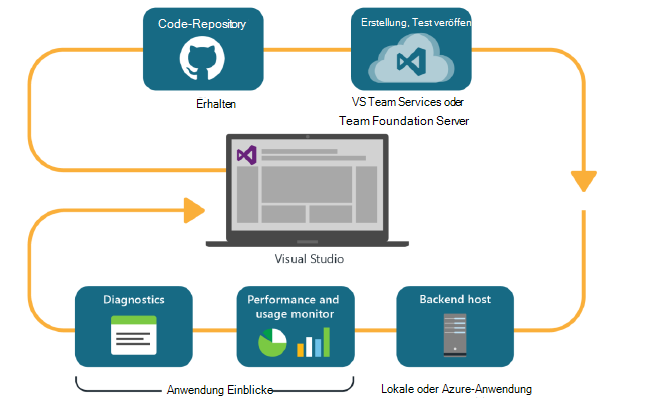
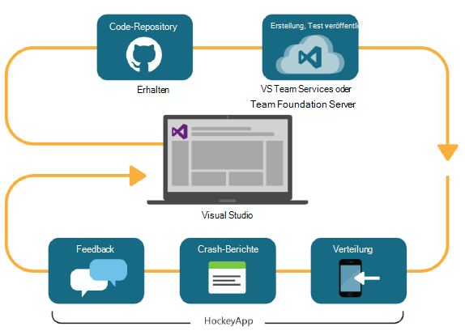

<properties
    pageTitle="Entwickler Analytics"
    description="DevOps mit Visual Studio Application Insights und HockeyApp"
    authors="alancameronwills"
    services="application-insights"
    documentationCenter=""
    manager="douge"/>

<tags
    ms.service="application-insights"
    ms.workload="tbd"
    ms.tgt_pltfrm="ibiza"
    ms.devlang="na"
    ms.topic="article" 
    ms.date="05/18/2016"
    ms.author="awills"/>

# Entwickler Analytics Anwendung Einblicke und HockeyApp

*Anwendung Informationen ist in der Vorschau.*

Zahlreiche arbeiten einen schnellen [DevOps](https://en.wikipedia.org/wiki/DevOps) -Zyklus. Sie erstellen eine Anwendung verteilen, Feedback zu wie durchführt und welche Benutzer tun und Kenntnisse können weitere Entwicklungszyklen planen. 

Zum Überwachen von Nutzung und Performance unbedingt Telemetriedaten live Anwendung sowie Feedback von den Benutzern selbst. 

Viele Systeme bauen aus mehreren Komponenten: einem Webdienst, Back-End-Prozessoren oder Datenspeicher und Clientsoftware im Browser des Benutzers oder als app in ein Telefon oder ein anderes Gerät ausgeführt. Telemetriedaten aus diesen anderen Komponenten hat, zusammen.

Einige Versionen haben Verteilung bestimmten Testern beschränkt; Wir haben auch organisierte flighting (Tests des neuen Features mit eingeschränkter) und ein | B-Tests (parallele Tests alternative Benutzeroberfläche).

Verteilung von Verwaltung und Integration von Überwachung mehrerer Client- und Serverkomponenten nicht einfache Aufgabe. Dieser Prozess ist ein wesentlicher Bestandteil der Architektur der Anwendung: wir ein System Art ohne eine iterative Entwicklungszyklus und gute Überwachungstools kann nicht erstellt werden.

In diesem Artikel betrachten wir die anderen Teile des Prozesses wie Überwachung Aspekte des Zyklus DevOps passen. 

Wenn Sie ein bestimmtes Beispiel betrachten möchten, ist [eine interessante Fallstudie](http://aka.ms/mydrivingdocs) , die mehrere Client- und Serverkomponenten.

## DevOps-Zyklus

Visual Studio und Entwickler Analyse-Tools bieten eine integrierte DevOps. Hier ist z. B. ein normaler Zyklus für eine Web-Anwendung (die Java und Node.js ASP.NET sein kann):

* Ein Entwickler Code-Repository eingecheckt und die main-Verzweigung zusammengeführt. Repository ist Git in diesem [Team Foundation-Versionskontrolle](https://www.visualstudio.com/docs/tfvc/overview)gleichmäßig sein
* Die Änderungen auslösen Build- und Unit Test. Der Builddienst kann in [Visual Studio Team Services oder Gegenstück lokalen Team Foundation Server](https://www.visualstudio.com/docs/vsts-tfs-overview). 
* Einen erfolgreichen Build und Komponententests können [Trigger eine automatische Bereitstellung](https://www.visualstudio.com/docs/release/author-release-definition/more-release-definition). Web app Host kann einen eigenen Webserver oder Microsoft Azure. 
* Telemetriedaten live App an [Application Insights](app-insights-overview.md)sowohl vom Server und [vom Clientbrowser](app-insights-javascript.md)gesendet. Dort können Sie die Leistung der Anwendung und die Verwendungsmuster analysieren. Leistungsstarke [Suchfunktionen](app-insights-analytics.md) Hilfe Probleme diagnostizieren. [Alarme](app-insights-alerts.md) sicherstellen, dass Sie als es entsteht ein Problem kennen. 
* Die nächsten Entwicklungszyklus wird durch die Analyse der Telemetriedaten live informiert.

### Gerät und Desktop-apps

Für Gerät und desktop-apps unterscheidet Verteilung Teil des Zyklus, da wir nur einen oder zwei Server hochladen nicht sind. Stattdessen können einen erfolgreichen Build Komponententest [Trigger HockeyApp hochladen](https://support.hockeyapp.net/kb/third-party-bug-trackers-services-and-webhooks/how-to-use-hockeyapp-with-visual-studio-team-services-vsts-or-team-foundation-server-tfs). HockeyApp überwacht Verteilung an Ihr Team Testbenutzer (oder der Öffentlichkeit auf Wunsch). 

HockeyApp sammelt Performance und Nutzungsdaten in Form von:

* Wörtliche Benutzerfeedback mit screenshots
* Crash-Berichte
* Benutzerdefinierte Telemetrie Sie codiert.

Wieder wird der DevOps abgeschlossen machen Ihre zukünftige Entwicklungspläne angesichts Feedback erhalten.

## Entwickler Analytics einrichten

Für jede Komponente der Anwendung – mobile oder Web oder Desktop - sind die Schritte im Grunde identisch. Für viele app führt Visual Studio automatisch einige Schritte.

1. Ihre Anwendung entsprechende SDK hinzufügen. Gerät Apps ist HockeyApp für Webdienste Anwendung Einblicke ist Jede verfügt über verschiedene Varianten für verschiedene Plattformen. (Kann auch desktop-apps mit beiden SDK zwar wir HockeyApp empfehlen.)
2. Registrieren Sie Ihrer app Portal Anwendung Einblicke oder HockeyApp je nach Verwendung SDK. Dies ist Analytics live App finden Sie. Sie erhalten eine instrumentationsschlüssel oder ID, die Sie in Ihre Anwendung so konfigurieren, dass SDK weiß, wohin die Telemetrie gesendet.
3. Hinzufügen von benutzerdefiniertem Code (falls gewünscht) protokollieren Ereignisse oder Metriken zur Unterstützung bei der Diagnose oder Leistung oder Nutzung analysieren. Es ist viel Überwachung integriert, müssen Sie diese auf Ihrem ersten Zyklus wird nicht.
3. Geräte-Apps:
 * Laden Sie einen Debugbuild auf HockeyApp. Aus können einem Team Testbenutzer verteilen. Wenn Sie hochladen nachfolgenden builds, das Team darüber informiert.
 * Beim Einrichten der kontinuierlichen Dienst, erstellen eine Version, die den Plug-in-Schritt HockeyApp hochladen.

### Analytics und Export HockeyApp Telemetrie

HockeyApp benutzerdefinierte untersuchen, und melden Sie sich mit der Analyse und kontinuierliche exportieren Anwendung Erkenntnisse durch [eine Brücke](app-insights-hockeyapp-bridge-app.md)Telemetrie.

## Nächste Schritte
 
Hier werden detaillierten Informationen für unterschiedliche app:

* [ASP.NET WebApp](app-insights-asp-net.md) 
* [Java WebApp](app-insights-java-get-started.md)
* [Node.js WebApp](https://github.com/Microsoft/ApplicationInsights-node.js)
* [iOS-app](https://support.hockeyapp.net/kb/client-integration-ios-mac-os-x-tvos/hockeyapp-for-ios)
* [Mac OS X-Anwendung](https://support.hockeyapp.net/kb/client-integration-ios-mac-os-x-tvos/hockeyapp-for-mac-os-x)
* [Android](https://support.hockeyapp.net/kb/client-integration-android/hockeyapp-for-android-sdk)
* [Universelle Windows-app](https://support.hockeyapp.net/kb/client-integration-windows-and-windows-phone/how-to-create-an-app-for-uwp)
* [Windows Phone 8 und 8.1 app](https://support.hockeyapp.net/kb/client-integration-windows-and-windows-phone/hockeyapp-for-windows-phone-silverlight-apps-80-and-81)
* [Windows Presentation Foundation-Anwendung](https://support.hockeyapp.net/kb/client-integration-windows-and-windows-phone/hockeyapp-for-windows-wpf-apps)

