<properties 
    pageTitle="Mit Diagnose suchen | Microsoft Azure" 
    description="Suchen Sie und Filtern Sie einzelner Ereignisse, Anfragen und protokollieren Sie Spuren." 
    services="application-insights" 
    documentationCenter=""
    authors="alancameronwills" 
    manager="douge"/>

<tags 
    ms.service="application-insights" 
    ms.workload="tbd" 
    ms.tgt_pltfrm="ibiza" 
    ms.devlang="na" 
    ms.topic="article" 
    ms.date="06/09/2016" 
    ms.author="awills"/>
 
# Diagnostische Suchfunktion Anwendung Erkenntnisse

Diagnostische Suche ist ein Feature von [Application Insights] [ start] , suchen und entdecken einzelne Telemetrie, wie Seitenaufrufe, Ausnahmen oder web-Anfragen zu verwenden. Und Sie können Spuren Protokoll und Ereignisse, die Sie programmiert haben.

## Wo sehen Sie diagnostische suchen?

### Im Azure-portal

Sie können explizit Diagnose Suche öffnen:

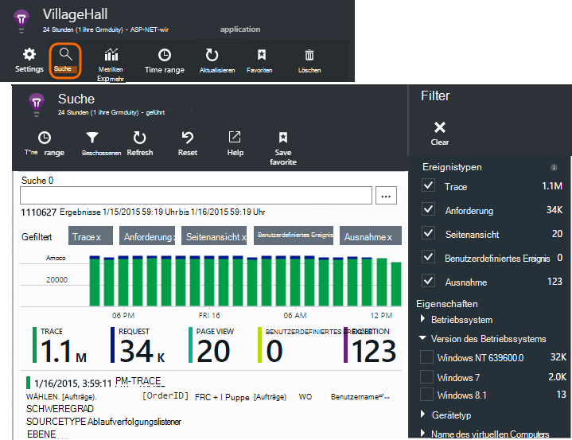

Es wird geöffnet, wenn Sie durch einige Diagramme und Raster klicken. In diesem Fall werden Filter vor sich auf den Typ des Elements ausgewählten festgelegt. 

Ein Webdienst zeigt die Anwendung Übersicht Blade beispielsweise ein Diagramm der Abfragen. Klicken sie, und man eine detailliertere Tabelle eine Liste anzeigen, wie viele Anfragen für jede URL hat. Klicken Sie auf eine beliebige Zeile, und Sie erhalten eine Liste der einzelnen Anfragen für die URL:

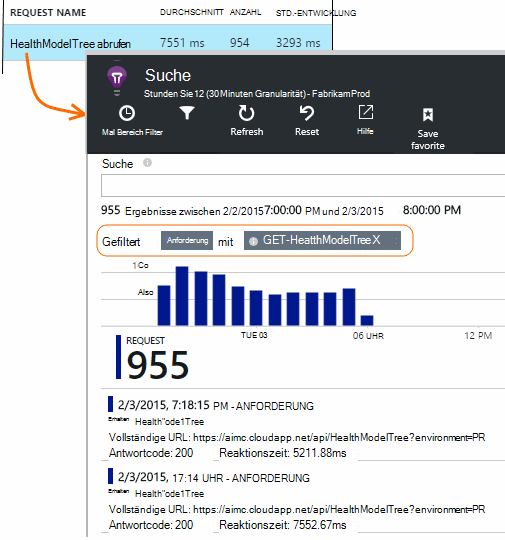

Hauptteil Diagnosesuche wird eine Liste der telemetrieelemente - Clientanforderungen Seite Ansichten benutzerdefinierte Ereignisse programmiert haben, und. Am Anfang der Liste ist eine Übersicht mit der Anzahl der Ereignisse mit der Zeit.

Ereignisse werden normalerweise in Diagnose Suchen in metrischen Explorer angezeigt. Obwohl das Blade selbst in Intervallen aktualisiert, können Sie aktualisieren klicken, wenn Sie für ein bestimmtes Ereignis warten.

### In Visual Studio

Öffnen Sie das Fenster suchen, in Visual Studio:

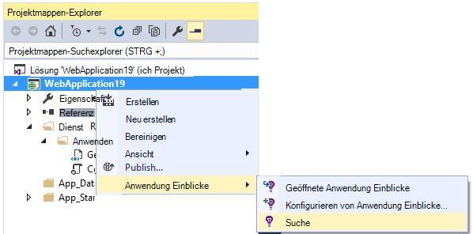

Das Fenster Suchen hat die gleichen Funktionen wie das Web-Portal:

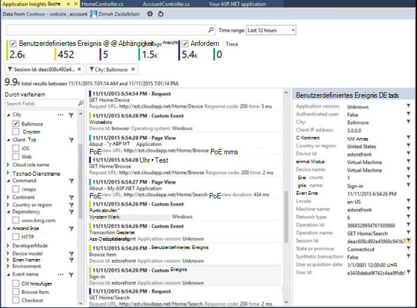

## Probenahme

Wenn Ihre Anwendung viele Telemetrie generiert (und ASP.NET SDK Version 2.0.0-beta3 oder höher), adaptive Sampling-Modul reduziert das Volume, das das Portal an einen repräsentativen Teil Ereignisse senden. Jedoch wird Ereignisse bezüglich der gleichen Anforderung ausgewählt oder als Gruppe deaktiviert, damit Sie zwischen Ereignissen navigieren können. 

[Erfahren Sie mehr über Sampling](app-insights-sampling.md).

## Einzelne Elemente überprüfen

Wählen Sie jedes telemetrieelement an Schlüsselfelder und verknüpfte Elemente aus Klicken Sie auf "..." ", um den vollständigen Satz der Felder anzuzeigen. 

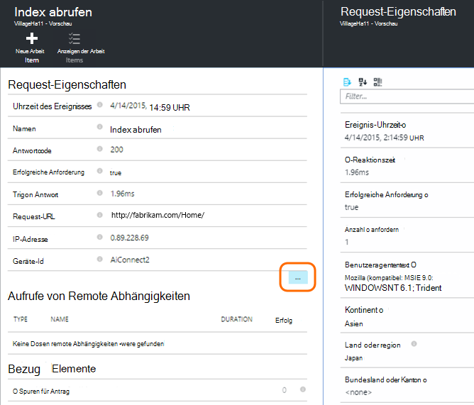

Verwenden Sie den vollständigen Satz der Felder, um einfache Zeichenfolgen (ohne Platzhalterzeichen). Die verfügbaren Felder hängen von Telemetrie.

## Arbeitsaufgabe erstellen

Sie können einen Fehler in Visual Studio Team Services mit Detaildaten aus Telemetriedaten Elemente erstellen. 

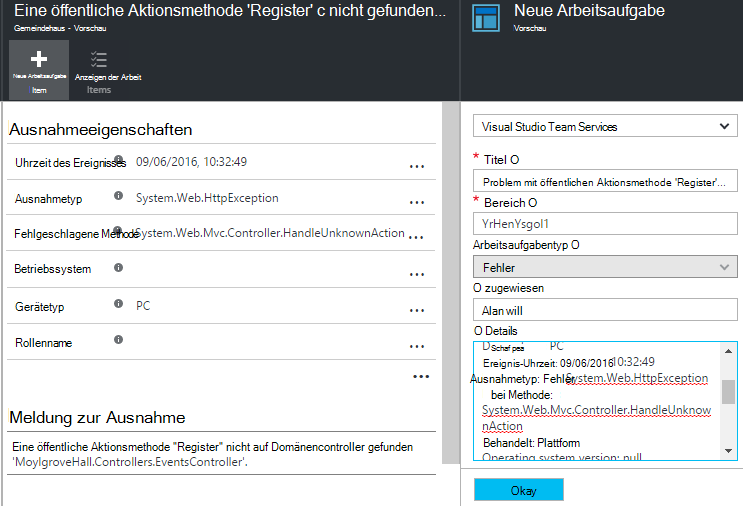

Diesen Vorgang zum ersten Mal werden Sie aufgefordert einen Link auf Ihre Project Team Services konfigurieren.

(Sie erhalten auch an die Konfiguration Blade aus > Arbeitsaufgaben.)

## Filter-Ereignistypen

Öffnen Sie Blade Filter, und wählen Sie die Ereignistypen, die Sie anzeigen möchten. (Wenn Sie später die Filter mit dem Öffnen das Blade wiederherstellen möchten, klicken Sie auf Zurücksetzen.)

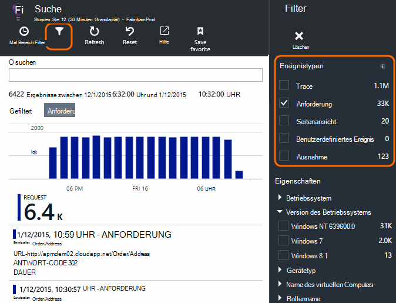

Die Ereignistypen sind:

* **Trace** - Diagnoseprotokolle einschließlich TrackTrace, log4Net, NLog und System.Diagnostic.Trace.
* **Request** - HTTP-Anfragen von der Serveranwendung, einschließlich Seiten, Skripts, Bilder, Styles und Daten. Diese Ereignisse wird die Anforderung und Antwort Übersicht Diagramme erstellen.
* **Seitenansicht** - Telemetrie per WebClient verwendet Seite anzeigen Berichte erstellen. 
* **Custom Event** - Aufrufe Trackevent()"zu [Überwachung der Nutzung]eingefügt[track], finden sie hier.
* **Ausnahme** - nicht abgefangene Ausnahmen in die Server und die Anmeldung mit Trackexception()".

## Filtern nach Eigenschaftswerten

Sie können Ereignisse auf die Werte ihrer Eigenschaften filtern. Die verfügbaren Eigenschaften hängen von ausgewählten Ereignistypen. 

Wählen Sie beispielsweise Anfragen mit einer bestimmten Antwort.

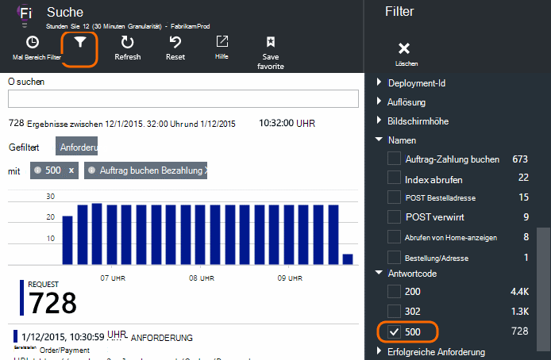

Wählen keine Werte einer bestimmten Eigenschaft hat die gleiche Auswirkung wie alle Werte; Diese deaktiviert Filter auf diese Eigenschaft.

### Grenzen Sie Ihre Suche

Beachten Sie, dass Zahlen rechts Filterwerte wie häufig es im aktuellen gefilterten Satz zeigen. 

In diesem Beispiel wurde deutlich, dass die `Reports/Employees` führt die meisten 500 Fehler anfordern:

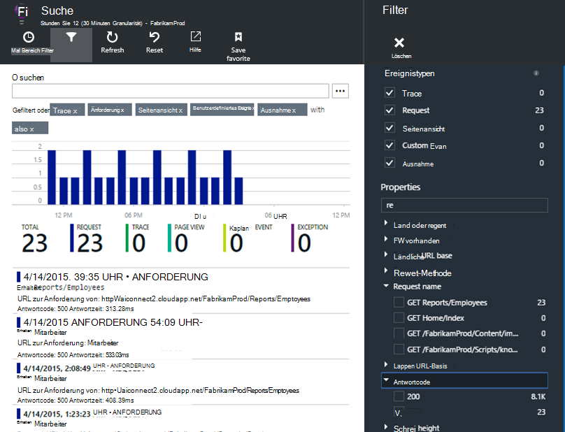

Außerdem möchten Sie Siehe auch andere Ereignisse während dieser Zeit passiert, können Sie **Ereignisse einschließen nicht definierte Eigenschaften**überprüfen.

## Bot und Test Datenverkehr entfernen

Verwenden Sie den Filter **Real oder synthetische Datenverkehr** und überprüfen Sie **Real**.

Sie können auch durch **synthetische Datenverkehr**filtern.

## Untersuchen der einzelne Vorkommen

Filtersatzes Anforderung namens hinzu, und Sie können dann einzelne Vorkommen dieses Ereignisses prüfen.

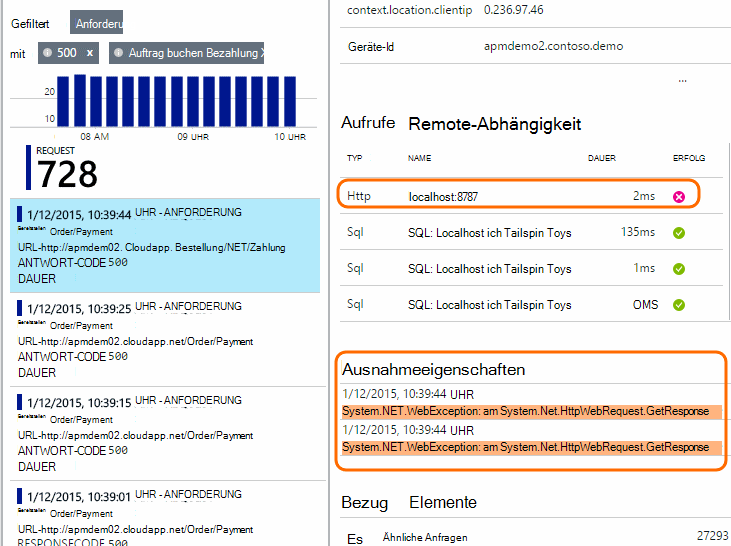

Details anzeigen für Ereignisse Ausnahmen, die während der Verarbeitung der Anforderung ist.

Klicken Sie auf eine Ausnahme der Details einschließlich Stapelrahmen.

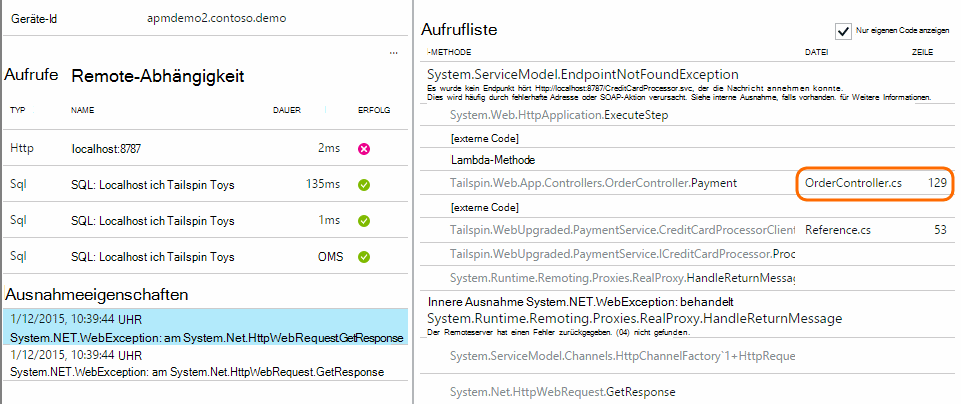

## Ereignisse mit derselben

Suchen Sie alle Elemente mit dem gleichen Eigenschaftswert:

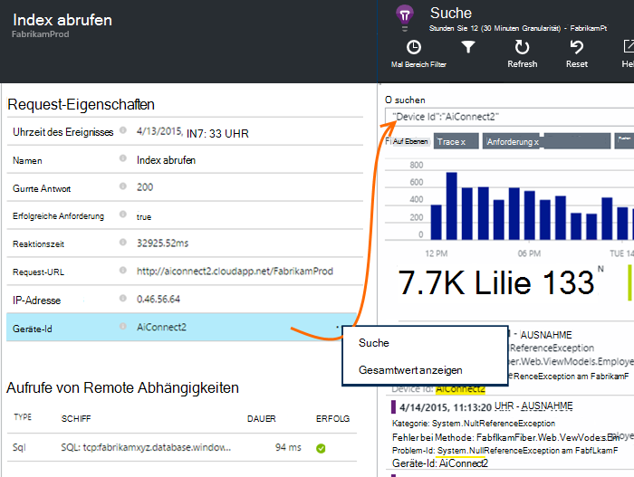

## Metrische Wert suchen

Alle die Anfragen Antwortzeit > 5 s zu erhalten.  Uhrzeiten werden in Ticks dargestellt: 10 000 Ticks = 1 ms.

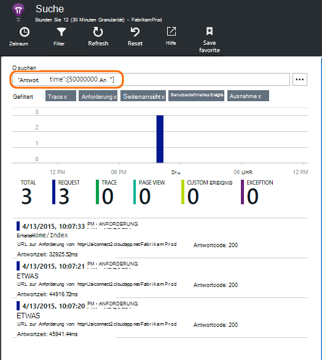

## Durchsuchen der Daten

Sie können Ausdrücke in einem der Eigenschaftswerte suchen. Dies ist besonders nützlich, wenn Sie [benutzerdefinierte Ereignisse] geschrieben haben[ track] mit Eigenschaftswerten. 

Sie möchten eine Zeit als Suchläufe über eine kürzere Reichweite sind schneller. 

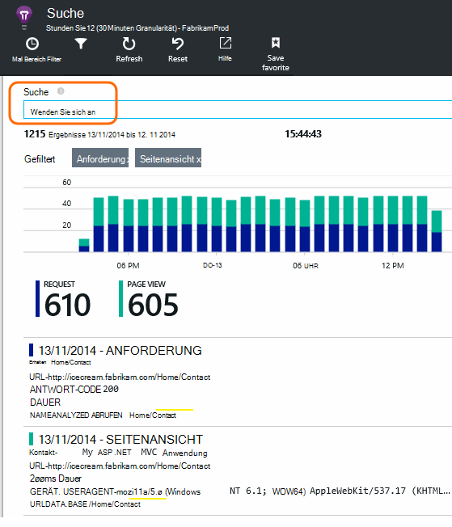

Suche nach Begriffen nicht Teilzeichenfolgen. Sind alphanumerische Zeichenfolgen wie einige Satzzeichen '.' und '_'. Zum Beispiel:

Begriff|*nicht* wird zugeordnet|aber diese entsprechen
---|---|---
HomeController.About|über Startseite|h\*über Startseite\*
IsLocal|lokale ist \*lokale|ISL\* IsLocal i\*l\*
Neue Verzögerung|w d|Neu Verzögerung n\* und d\*

Hier sind die Suchbegriffe, die Sie verwenden können:

Beispielabfrage | Effekt 
---|---
verlangsamen|Suchen Sie alle Ereignisse im Datumsbereich, deren Felder den Begriff "langsam"
Datenbank?|Entspricht database01, DatabaseAB... ? darf nicht am Anfang eines Ausdrucks.
Datenbank * |Datenbank, database01, DatabaseNNNN entspricht  * Anfang einen Suchbegriff darf nicht
Apple und Bananen|Suchereignisse,, die beide Begriffe enthalten. Kapital "und" nicht verwendet "und".
Apple oder Banane Apple banana|Finden Sie Ereignisse, die entweder Begriff. Verwenden Sie "Oder" keine "oder". < /br/ > kurze Formular.
Apple nicht banana Apple-Banana|Finden Sie Ereignisse, die enthalten eine jedoch nicht. Kurzform.
App * und Bananen-(grape pear)|Logische Operatoren und Belichtungsreihen.
"Metrik": 0 bis 500 "Metrik": 500 an * | Finden Sie Ereignisse, die benannte Messung im Wertebereich enthalten.

## Suche speichern

Wenn Sie alle Filter festgelegt haben, soll, können Sie die Suche als Favoriten speichern. Wenn Sie ein Konto Organisation arbeiten, können Sie auswählen, ob für andere Teammitglieder freigeben.

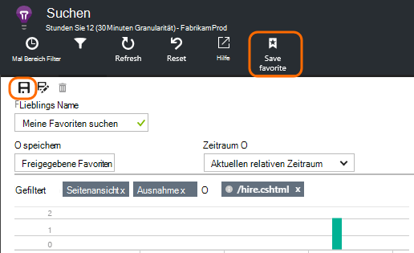

Zu den erneut suchen, **Gehen Sie zu Übersicht Blade** Favoriten öffnen:

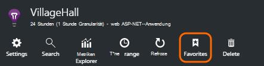

Wenn Sie mit relativen Zeitraum gespeichert, hat wieder Blade die neuesten Daten Gespeichert mit absoluten Zeit sehen Sie jedes Mal dieselben Daten.

## Weitere Telemetrie an Application Insights senden

Neben der Out-of-the-Box Telemetrie per Application Insights-SDK können Sie:

* Erfassen Protokoll Spuren aus Ihrem bevorzugten protokollierungsframework in [.NET] [ netlogs] oder [Java][javalogs]. Dies bedeutet die Spuren Protokoll durchsuchen und Seitenansichten, Ausnahmen und anderen Ereignissen zu korrelieren. 
* [Schreiben von Code] [ track] benutzerdefinierte Ereignisse Seitenansichten und Ausnahmen zu senden. 

[Erfahren Sie, wie Protokolle und benutzerdefinierte Telemetrie Anwendung Erkenntnisse][trace].

## Fragen & Antworten

### Wie viele Daten gespeichert?

Bis zu 500 Ereignisse pro Sekunde bei jeder Anwendung. Ereignisse werden sieben Tage lang aufbewahrt.

### Wie kann ich meine Server Anfragen POST-Daten anzeigen?

Wir nicht die POST-Daten automatisch anmelden, aber können [TrackTrace oder Protokoll Aufrufe][trace]. Legen Sie die POST-Daten der Message-Parameter Kann nicht gefiltert werden der Nachricht Sie Eigenschaften können wie die maximale Größe ist jedoch länger.

## Nächste Schritte

* [Protokolle und benutzerdefinierte Telemetrie an Application Insights senden][trace]
* [Verfügbarkeit und Reaktionsfähigkeit Tests einrichten][availability]
* [Problembehandlung][qna]

<!--Link references-->

[availability]: app-insights-monitor-web-app-availability.md
[javalogs]: app-insights-java-trace-logs.md
[netlogs]: app-insights-asp-net-trace-logs.md
[qna]: app-insights-troubleshoot-faq.md
[start]: app-insights-overview.md
[trace]: app-insights-search-diagnostic-logs.md
[track]: app-insights-api-custom-events-metrics.md

 