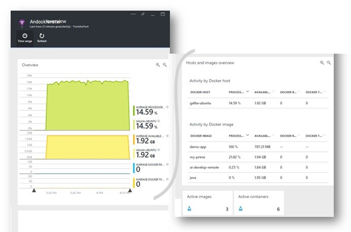
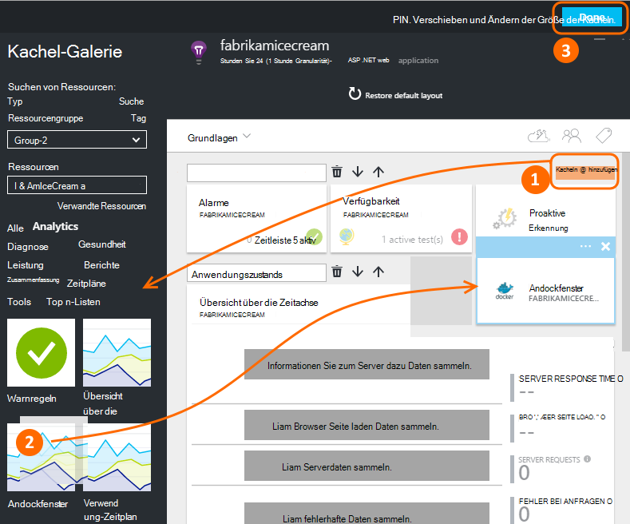
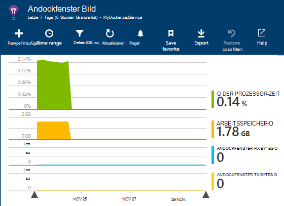
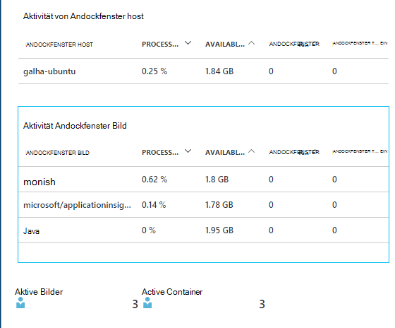
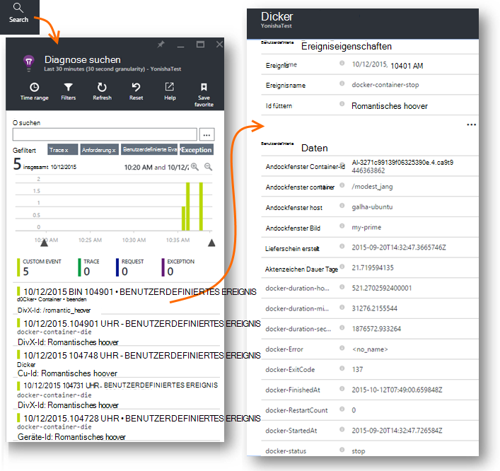
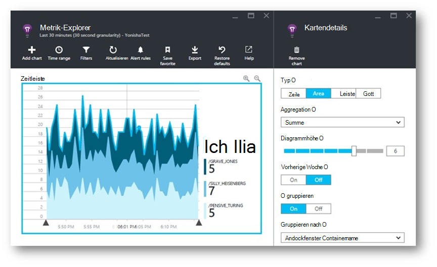
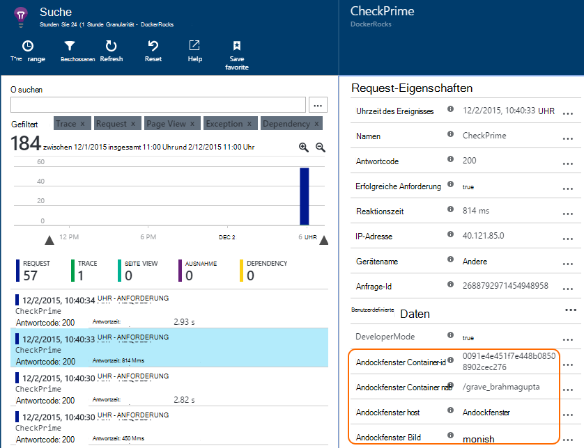
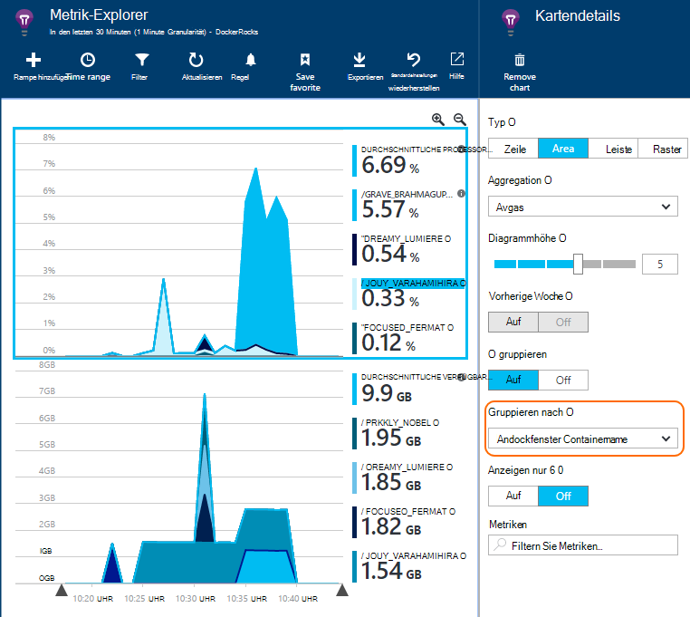

<properties 
    pageTitle="Andockfenster Applications in Application Insights überwachen" 
    description="Andockfenster Leistungsindikatoren, Ereignissen und Ausnahmen können auf Anwendung, mit der Telemetrie Container Apps angezeigt werden." 
    services="application-insights" 
    documentationCenter=""
    authors="alancameronwills" 
    manager="douge"/>

<tags 
    ms.service="application-insights" 
    ms.workload="tbd" 
    ms.tgt_pltfrm="ibiza" 
    ms.devlang="na" 
    ms.topic="article" 
    ms.date="12/01/2015" 
    ms.author="awills"/>
 
# <a name="monitor-docker-applications-in-application-insights"></a>Andockfenster Applications in Application Insights überwachen

Lebenszyklusereignisse und Leistungsindikatoren aus [Andockfenster](https://www.docker.com/) können auf Anwendung dargestellt. In einem Container in Ihrem Host [Application Insights](app-insights-overview.md) Installationsabbilds und Leistungsindikatoren für den Host sowie die anderen Bilder werden angezeigt.

Andockfenster vertreiben Ihre apps in einfache Container mit konfiguriert. Sie laufen auf jeder, die ein Andockfenster läuft.

Beim Ausführen der [Anwendung Einblicke Bild](https://hub.docker.com/r/microsoft/applicationinsights/) auf Ihrem Host Andockfenster erhalten Sie folgende Vorteile:

* Lebenszyklus Telemetrie über alle Container ausgeführt auf Host - starten, beenden und so weiter.
* Leistungsindikatoren für alle Container. CPU, Speicher, Netzwerk und mehr.
* Wenn Sie apps im Container alle Telemetriedaten dieser Apps [Application Insights-SDK installiert](app-insights-java-live.md) zusätzliche Eigenschaften identifiziert den Container und Host-Computer haben. So haben Sie Instanzen einer app in mehr als einem Server ausgeführt, können einfach Ihre app Telemetrie Host filtern Sie.




## <a name="set-up-your-application-insights-resource"></a>Einrichten der Application Insights-Ressource

1. Melden Sie [Microsoft Azure-Portal an](https://azure.com) und öffnen Sie die Anwendung Einblicke Ressource für Ihre Anwendung. oder [eine neue erstellen](app-insights-create-new-resource.md). 

    *Welche Ressource soll ich verwenden?* Apps, die auf dem Host ausgeführt werden von Personen entwickelt wurden, müssen erstellen Sie [eine neue Application Insights-Ressource](app-insights-create-new-resource.md)Sie. Dies ist, anzeigen und analysieren die Telemetrie. (Wählen Sie "Andere" für Anwendungstyp.)

    Aber wenn der Entwickler der apps sind, dann hoffen wir jeder [Anwendung Insights SDK hinzugefügt](app-insights-java-live.md) . Wenn sie wirklich alle einer einzigen Anwendung sind möglicherweise Konfigurieren aller Telemetrie an eine Ressource senden, und Sie verwenden die gleiche Ressource Andockfenster Lebenszyklus und Performance-Daten anzeigen. 

    Ein drittes Szenario ist, dass entwickelt die meisten apps verwenden Sie separate Ressourcen ihre Telemetrie angezeigt. In diesem Fall wahrscheinlich auch eine separate Ressource für die Andockfenster Daten erstellen möchten. 

2.  Hinzufügen die Kachel Andockfenster: Wählen Sie **Nebeneinander hinzuzufügen**, ziehen Sie die Kachel Andockfenster aus der Galerie und dann auf **Fertig**. 

    


3. Klicken Sie auf die Dropdownliste **Essentials** und kopieren Sie Instrumentationsschlüssel. Sie verwenden das SDK, wo die Telemetriedaten senden soll.


    

Halten Sie dieses Browserfenster bereit, wie Sie zurück kommen, sobald sich der Telemetrie.


## <a name="run-the-application-insights-monitor-on-your-host"></a>Führen Sie den Systemmonitor Anwendung Erkenntnisse auf dem host
 
Da Sie irgendwo Telemetriedaten angezeigt haben, können Sie der Container-Anwendung einrichten, die sammeln und senden.

1.  Verbinden Sie mit dem Andockfenster Host. 
2.  In diesem Befehl den instrumentationsschlüssel bearbeiten und ausführen:
 
    ```

    docker run -v /var/run/docker.sock:/docker.sock -d microsoft/applicationinsights ikey=000000-1111-2222-3333-444444444
    ```

Nur eine Anwendung Einblicke Bild ist pro Andockfenster Host. Wenn Ihre Anwendung mehrere Andockfenster Hosts bereitgestellt wird, wiederholen Sie den Befehl auf jedem Host aus.

## <a name="update-your-app"></a>Aktualisieren Sie Ihrer Anwendung

Wenn Ihre Anwendung mit dem [Application Insights-SDK für Java](app-insights-java-get-started.md)instrumentiert, fügen Sie folgende Zeile in die Datei ApplicationInsights.xml in das Projekt unter dem `<TelemetryInitializers>` Element:

```xml

    <Add type="com.microsoft.applicationinsights.extensibility.initializer.docker.DockerContextInitializer"/> 
```

Jedes telemetrieelement Ihrer App gesendet hinzugefügt Andockfenster Informationen wie Container und Host-Id.

## <a name="view-your-telemetry"></a>Anzeigen der Telemetrie

Zurück zu der Ressource Anwendung Einblicke in Azure-Portal.

Klicken Sie auf die Kachel Andockfenster.

Sie sehen kurz Daten von app Andockfenster insbesondere bei anderen Containern Andockfenster-Engine ausgeführt.


Hier sind einige Ansichten erhalten können.

### <a name="perf-counters-by-host-activity-by-image"></a>Leistungsindikatoren vom Host Aktivität Bild








Klicken Sie auf einen beliebigen Namen Host oder Bild für weitere Details.


Anpassen der Ansicht, klicken Sie auf Diagramme, Raster Überschrift oder Diagramm hinzufügen. 

[Weitere Informationen zu Messgrößen Explorer](app-insights-metrics-explorer.md).

### <a name="docker-container-events"></a>Andockfenster Containerereignisse




Klicken Sie auf [Suchen](app-insights-diagnostic-search.md), um einzelne Ereignisse zu untersuchen. Suchen und Filtern der Ereignisse finden. Klicken Sie auf ein Ereignis, um weitere Details zu erhalten.
 
### <a name="exceptions-by-container-name"></a>Ausnahmen vom Containername
 



### <a name="docker-context-added-to-app-telemetry"></a>Andockfenster Kontext app Telemetrie hinzugefügt

Anforderung Telemetrie von AI SDK Andockfenster Kontext angereichert instrumentierte Anwendung gesendet:



Prozessorzeit und Arbeitsspeicher-Leistungsindikatoren bereichert und Andockfenster Containernamen gruppiert:





## <a name="q--a"></a>Fragen & Antworten

*Was mir Application Insights das kann vom Andockfenster abrufen?*

* Detaillierte Aufschlüsselung der Leistungsindikatoren von Container und Bild.
* Integrieren Sie Container und die app-Daten in einem Dashboard.
* Zur weiteren Analyse an eine Datenbank, Power BI oder andere Dashboard [Telemetrie exportieren](app-insights-export-telemetry.md) .

*Wie erhalte ich über die app Telemetrie?*

* Installieren Sie Application Insights SDK in die Anwendung. Erfahren Sie, wie: [Java webapps](app-insights-java-get-started.md), [Windows web apps](app-insights-asp-net.md).
