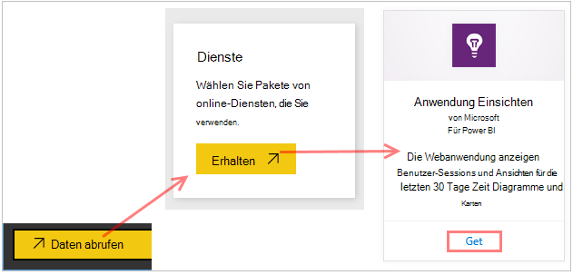
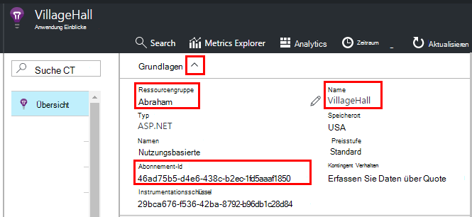
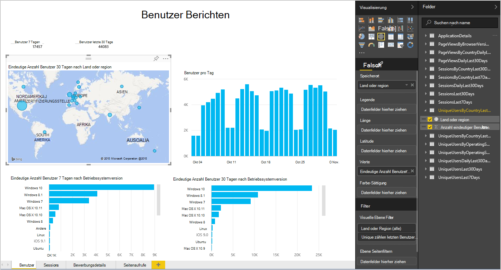
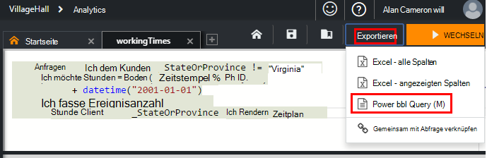
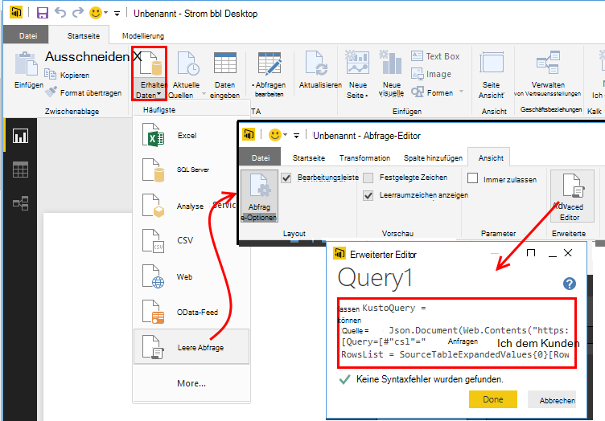
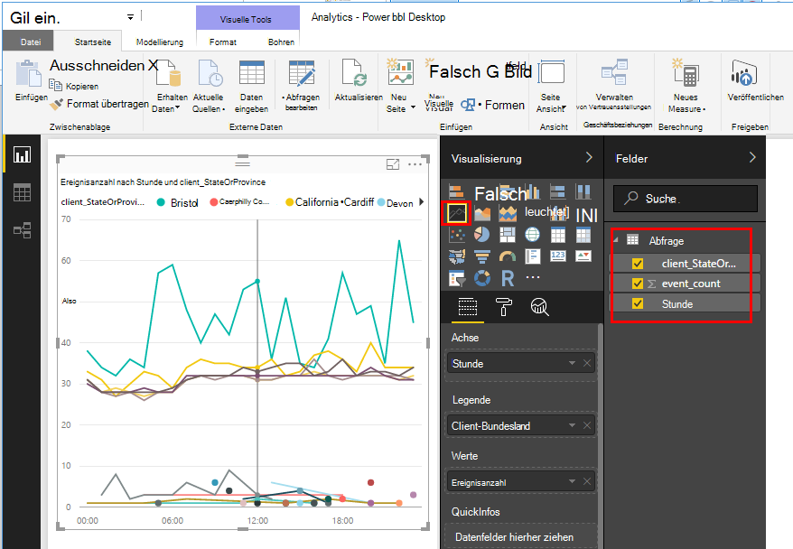

<properties 
    pageTitle="Anwendung Einblicke in Power BI exportieren | Microsoft Azure" 
    description="Analytics Abfragen können in Power BI angezeigt werden." 
    services="application-insights" 
    documentationCenter=""
    authors="noamben" 
    manager="douge"/>

<tags 
    ms.service="application-insights" 
    ms.workload="tbd" 
    ms.tgt_pltfrm="ibiza" 
    ms.devlang="na" 
    ms.topic="article" 
    ms.date="10/18/2016" 
    ms.author="awills"/>

# Feed Power BI Anwendung Einblicke

[Power BI](http://www.powerbi.com/) ist eine Suite von Business Analytics Tools zum Analysieren von Daten und Einsichten. Rich Dashboards sind auf jedem Gerät verfügbar. Sie können Daten aus vielen Quellen Analyseabfragen von [Visual Studio Anwendung](app-insights-overview.md)kombinieren.

Es gibt drei empfohlene Methoden Power BI Application Insights-Datenexport. Sie können einzeln oder zusammen verwenden.

* [**Power BI-Adapter**](#power-pi-adapter) - vollständige Dashboard Telemetriedaten aus Ihrer app. Mehrere Diagramme vordefiniert, jedoch können Sie eigene Abfragen aus anderen Quellen hinzufügen.
* [**Exportieren Analyseabfragen**](#export-analytics-queries) - Schreiben einer Abfrage gewünschte Analytics und Power BI exportieren. Sie können diese Abfrage auf einem Dashboard zusammen mit anderen Daten platzieren.
* [**Kontinuierliche exportieren und Stream Analytics**](app-insights-export-stream-analytics.md) - Dies bedeutet Mehrarbeit einrichten. Es empfiehlt sich, Daten über lange Zeiträume beibehalten werden soll. Andernfalls werden die Methoden empfohlen.

## BI-Netzteil

Diese Methode erstellt eine vollständige Dashboard Telemetrie. Das ursprüngliche Dataset vordefiniert, aber Sie können weitere Daten hinzufügen.

### Ruft den adapter

1. [Power BI](https://app.powerbi.com/)anmelden.
2. **Daten**, **Dienste**, **Erkenntnisse Anwendung** öffnen

    

3. Einzelheiten der Application Insights-Ressource.

    

4. Warten Sie ein oder zwei Minuten für die Daten importiert werden sollen.

    

Das Dashboard können Sie Diagramme Anwendung Einblicke mit anderen Quellen und mit Analytics Abfragen kombinieren. Gibt eine Visualisierung Galerie, weitere Diagramme erhalten und jedes Diagramm verfügt über Parameter, die Sie festlegen können.

Nach dem ursprünglichen Import weiterhin das Dashboard und Berichte täglich aktualisieren. Sie können den Aktualisierungszeitplan für das Dataset steuern.

## Analytics Abfragen exportieren

Diese Route können Sie Fragen wie Sie Analytics schreiben und exportieren, Power BI-Dashboard. (Sie können das Dashboard erstellt vom Adapter hinzufügen.)

### Einmal: Power BI Desktop installieren

Um Ihre Anwendung Einblick Abfrage zu importieren, verwenden Sie die Desktopversion von Power BI. Aber bevor Sie veröffentlichen sie im Web oder Arbeitsbereich Cloud Power BI. 

[Power BI Desktop](https://powerbi.microsoft.com/en-us/desktop/)installiert.

### Exportieren einer Abfrage Analytics

1. [Öffnen Analytics und Schreiben Sie die Abfrage](app-insights-analytics-tour.md).
2. Testen Sie und verfeinern Sie die Abfrage, bis Sie mit dem Ergebnis zufrieden sind.
3. Wählen Sie im Menü **Exportieren** **Power BI (M)**. Speichern Sie die Textdatei.

    
4. Power BI Desktop wählen Sie **importieren, leere Abfrage aus** und dann im Abfrage-Editor unter **Ansicht** **Erweiterte Abfrage-Editor**.

    Fügen Sie das exportierte M Sprache Skript in erweiterte Abfrage-Editor.

    

5. Möglicherweise Anmeldeinformationen angeben, um Power BI Azure zugreifen können. "Organisationseinheiten Konto" Microsoft-Konto anmelden.

    

6. Wählen Sie eine Visualisierung für die Abfrage und die Felder für die x-Achse, y-Achse und Segmentierung Dimension.

    

7. Veröffentlichen Sie den Bericht Arbeitsbereich Cloud Power BI. Dort können Sie eine synchronisierte Version in Webseiten einbetten.

    
 
8. Bericht in Intervallen manuell aktualisieren oder eine geplante Aktualisierung auf der Optionsseite einrichten.

## Zur Probenahme

Sendet die Anwendung eine große Datenmenge, kann adaptive Sampling-Funktion arbeiten und senden einen Anteil der Telemetrie. Dies gilt auch wenn Probenahme manuell im SDK oder auf Aufnahme festgelegt haben. [Erfahren Sie mehr über Sampling.](app-insights-sampling.md)
 

## Nächste Schritte

* [Schalten Sie BI - Informationen](http://www.powerbi.com/learning/)
* [Analytics-Lernprogramm](app-insights-analytics-tour.md)
