<properties 
    pageTitle="Mit der Daten von Anwendung exportiert Stream Analytics | Microsoft Azure" 
    description="Stream Analytics können kontinuierlich transformieren, Filtern und die Daten von Anwendung exportieren." 
    services="application-insights" 
    documentationCenter=""
    authors="noamben" 
    manager="douge"/>

<tags 
    ms.service="application-insights" 
    ms.workload="tbd" 
    ms.tgt_pltfrm="ibiza" 
    ms.devlang="na" 
    ms.topic="article" 
    ms.date="10/18/2016" 
    ms.author="awills"/>

# <a name="use-stream-analytics-to-process-exported-data-from-application-insights"></a>Mit der exportierten Daten von Anwendung Stream Analytics

[Azure Stream Analytics](https://azure.microsoft.com/services/stream-analytics/) ist hervorragend für die Verarbeitung von Daten [von Anwendung exportiert](app-insights-export-telemetry.md). Stream Analytics können Daten aus verschiedenen Quellen abrufen. Sie können transformieren Daten filtern und dann an Empfänger weiterleiten.

In diesem Beispiel erstellen wir einen Adapter, der die Daten von Anwendung, umbenannt und einige Felder verarbeitet und in Power BI leitet.

> [AZURE.WARNING] Es gibt viel bessere und einfachere [Verfahren zum Anzeigen von Daten in Power BI Anwendung Einblicke empfohlen](app-insights-export-power-bi.md). Dargestellte Pfad ist nur ein Beispiel zum Veranschaulichen der exportierten Daten.

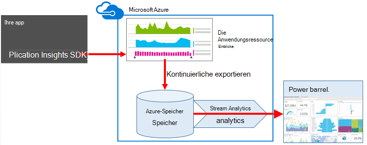


## <a name="create-storage-in-azure"></a>Speicher in Azure erstellen

Fortlaufende Export gibt immer Daten in Azure Storage-Konto müssen Sie zunächst den Speicher.

1.  Erstellen Sie ein "klassische" Speicherkonto in Ihrem Abonnement im [Azure-Portal](https://portal.azure.com).

    

2. Erstellen eines Containers

    

3. Die Zugriffstaste Speicher kopieren

    Sie benötigen sie um die Eingabe für den Stream Analytics-Dienst einrichten.

    

## <a name="start-continuous-export-to-azure-storage"></a>Fortlaufende Export starten Azure-Speicher

[Exportieren Sie fortlaufend](app-insights-export-telemetry.md) verschoben Daten von Anwendung in Azure-Speicher.

1. Suchen Sie in Azure-Portal Application Insights-Ressource, die für die Anwendung erstellt.

    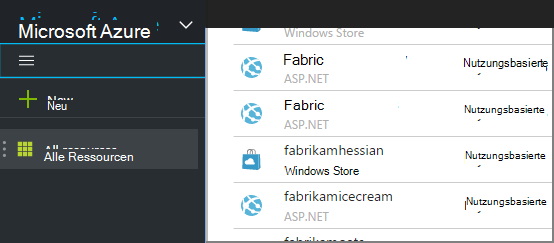

2. Erstellen einer kontinuierlichen exportieren.

    


    Wählen Sie das Speicherkonto, das Sie zuvor erstellt haben:

    
    
    Legen Sie die gewünschten Ereignistypen:

    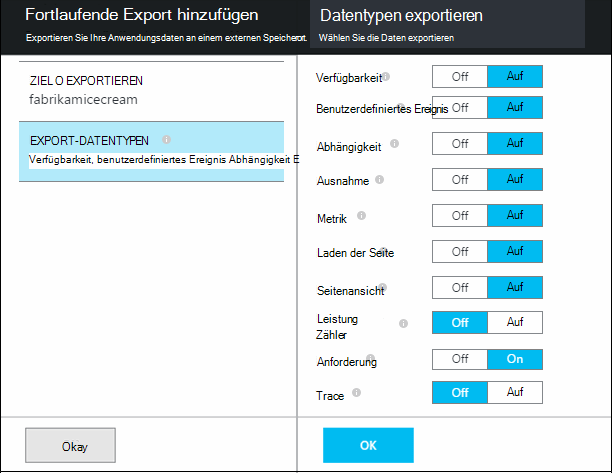

3. Lassen Sie Daten sammeln. Zurücklehnen Sie und Personen, die Ihre Anwendung für eine Weile. Telemetrie kommt, und Sie sehen statistische Diagramme in [metrischen Explorer](app-insights-metrics-explorer.md) und Ereignisse in [Diagnose suchen](app-insights-diagnostic-search.md). 

    Und auch exportieren die Daten in den Speicher. 

4. Überprüfen Sie die exportierten Daten. Wählen Sie in Visual Studio **Anzeigen / Cloud Explorer**, und Azure öffnen / speichern. (Haben Sie diese Menüoption, müssen das Azure SDK installieren: Öffnen Sie das Dialogfeld Neues Projekt und Visual C# / Cloud / Microsoft Azure SDK für .NET erhalten.)

    

    Notieren Sie sich häufig Teil der Pfadname die ANWENDUNGSTASTE Namen und Instrumentation abgeleitet. 

Die Ereignisse werden auf BLOB-Dateien im JSON-Format geschrieben. Jede Datei kann ein oder mehrere Ereignisse enthalten. So möchten wir Daten lesen und die gewünschten Felder filtern. Gibt es Dinge, die wir mit den Daten konnte aber unser Plan besteht mit Stream Analytics Daten Power BI leiten.

## <a name="create-an-azure-stream-analytics-instance"></a>Erstellen Sie eine Instanz von Azure Stream Analytics

[Azure-Verwaltungsportal](https://manage.windowsazure.com/)Azure Stream Analytics Service auswählen und einen neuen Auftrag für Stream Analytics erstellen:


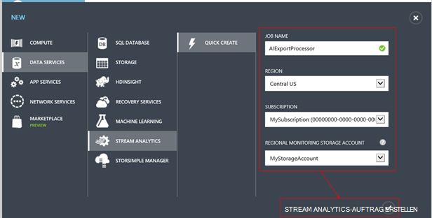

Wenn das neue Projekt erstellt wird, erweitern Sie dessen Details:


### <a name="set-blob-location"></a>BLOB-Position festlegen

Festlegen von Ihrem fortlaufenden Export Blob zu:


Jetzt benötigen den Primärschlüssel Zugriff aus das Speicherkonto Sie bereits erwähnt. Als Speicherschlüssel Konto festlegen.

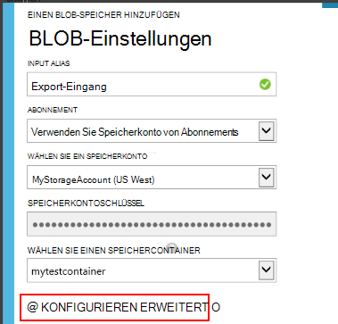

### <a name="set-path-prefix-pattern"></a>Set Pfad Präfixmuster 

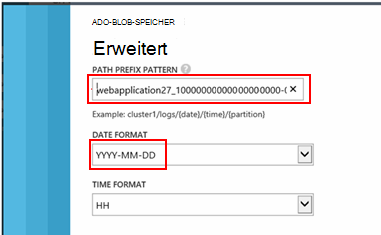


**Achten Sie darauf, dass das Datumsformat JJJJ-MM-TT (mit Bindestrichen) fest.**

Pfad-Präfix Muster gibt Stream Analytics Eingabedateien im Speicher findet. Legen sie entsprechen, wie fortlaufende exportieren die Daten gespeichert werden müssen. Wie folgt festlegen:

    webapplication27_12345678123412341234123456789abcdef0/PageViews/{date}/{time}

In diesem Beispiel:

* `webapplication27`ist der Name der Anwendung Einblicke Ressource **Kleinbuchstaben**.
* `1234...`ist der instrumentationsschlüssel Application Insights-Ressource, **Bindestriche weglassen**. 
* `PageViews`ist der Typ der Daten, die Sie analysieren möchten. Die verfügbaren Typen hängen in fortlaufenden Export festgelegten Filter. Überprüfen Sie die exportierten Daten die verfügbaren Typen und finden Sie unter [Exportieren Datenmodell](app-insights-export-data-model.md).
* `/{date}/{time}`ein Muster wird wörtlich geschrieben werden.

> [AZURE.NOTE] Überprüfen des Speichers um sicherzustellen, dass Sie den Pfad richtig.

### <a name="finish-initial-setup"></a>Anfängliche Setup Fertig stellen

Überprüfen Sie das Format:


Schließen Sie den Assistenten, und warten Sie, bis die Installation abgeschlossen.

> [AZURE.TIP] Befehl Beispiel Daten herunterladen. Als Probe Debuggen Ihrer Abfrage beibehalten.

## <a name="set-the-output"></a>Stellen Sie die Ausgabe

Jetzt wählen Sie Ihre Arbeit und die Ausgabe.

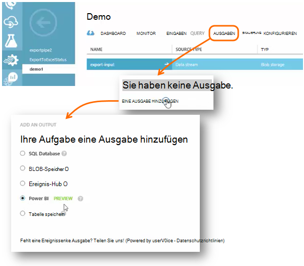

Geben Sie Ihre **Arbeit oder Schule Konto** Stream Analytics auf Power BI Ressource autorisiert. Erfinden Sie dann einen Namen für die Ausgabe für das Ziel Power BI Dataset und.

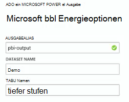

## <a name="set-the-query"></a>Die Abfrage

Die Abfrage steuert die Übersetzung Eingabe zur Ausgabe.

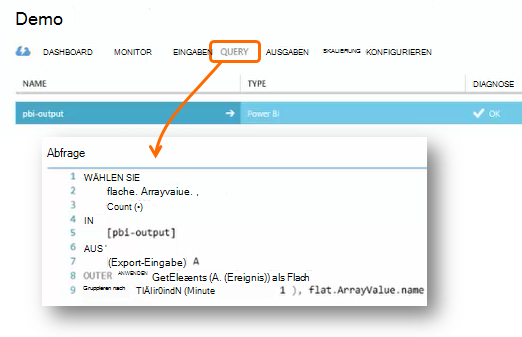


Verwenden Sie die Testfunktion zu um überprüfen, ob Sie die richtige Ausgabe erhalten. Geben sie die Beispieldaten auf Eingaben hat. 

### <a name="query-to-display-counts-of-events"></a>Abfrage von Ereignissen angezeigt

Fügen Sie folgende Abfrage:

```SQL

    SELECT
      flat.ArrayValue.name,
      count(*)
    INTO
      [pbi-output]
    FROM
      [export-input] A
    OUTER APPLY GetElements(A.[event]) as flat
    GROUP BY TumblingWindow(minute, 1), flat.ArrayValue.name
```

* Export-Eingabe ist der Alias in den Stream input gab
* Pbi-Ausgabe ist Ausgabealias definiert
* Ist der Name in einem geschachtelten JSON Arrray verwenden wir [ÄUßERE GetElements anwenden](https://msdn.microsoft.com/library/azure/dn706229.aspx) . Auswählen wählt dann den Ereignisnamen sowie die Anzahl der Instanzen mit diesem Namen im Zeitraum. Die [Group By](https://msdn.microsoft.com/library/azure/dn835023.aspx) -Klausel gruppiert die Elemente in Zeiträumen von einer Minute.


### <a name="query-to-display-metric-values"></a>Abfrage metrischen Werte anzeigen


```SQL

    SELECT
      A.context.data.eventtime,
      avg(CASE WHEN flat.arrayvalue.myMetric.value IS NULL THEN 0 ELSE  flat.arrayvalue.myMetric.value END) as myValue
    INTO
      [pbi-output]
    FROM
      [export-input] A
    OUTER APPLY GetElements(A.context.custom.metrics) as flat
    GROUP BY TumblingWindow(minute, 1), A.context.data.eventtime

``` 

* Diese Abfrage erzeugt in Metriken Telemetrie Zeit für das Ereignis und den metrischen Wert. Die metrischen Werte sind innerhalb eines Arrays, damit wir ÄUßERE anwenden GetElements Muster verwenden, um Zeilen zu extrahieren. "MyMetric" ist in diesem Fall den Namen der Metrik. 

### <a name="query-to-include-values-of-dimension-properties"></a>Abfrage Werte von Eigenschaften

```SQL

    WITH flat AS (
    SELECT
      MySource.context.data.eventTime as eventTime,
      InstanceId = MyDimension.ArrayValue.InstanceId.value,
      BusinessUnitId = MyDimension.ArrayValue.BusinessUnitId.value
    FROM MySource
    OUTER APPLY GetArrayElements(MySource.context.custom.dimensions) MyDimension
    )
    SELECT
     eventTime,
     InstanceId,
     BusinessUnitId
    INTO AIOutput
    FROM flat

```

* Diese Abfrage bezieht Dimensionseigenschaften ohne je nach einer bestimmten Bemaßung zu fixierten Index im Dimensionsarray.

## <a name="run-the-job"></a>Auftrag ausführen

Sie können ein Datum in der Vergangenheit das Projekt starten auswählen. 

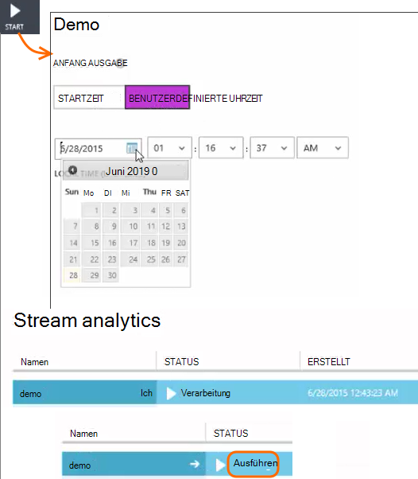

Warten Sie, bis der Auftrag ausgeführt wird.

## <a name="see-results-in-power-bi"></a>Ergebnisse in Power BI

> [AZURE.WARNING] Es gibt viel bessere und einfachere [Verfahren zum Anzeigen von Daten in Power BI Anwendung Einblicke empfohlen](app-insights-export-power-bi.md). Dargestellte Pfad ist nur ein Beispiel zum Veranschaulichen der exportierten Daten.

Öffnen Sie Power BI mit Ihrer Arbeit oder Schule Konto und wählen Dataset und Tabelle, die die Ausgabe der Stream Analytics-Auftrag definiert.

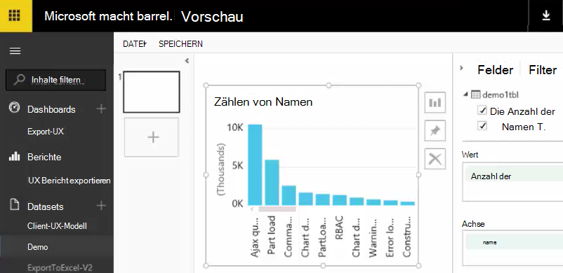

Jetzt können Sie dieses Dataset im Berichte und Dashboards in [Power BI](https://powerbi.microsoft.com).


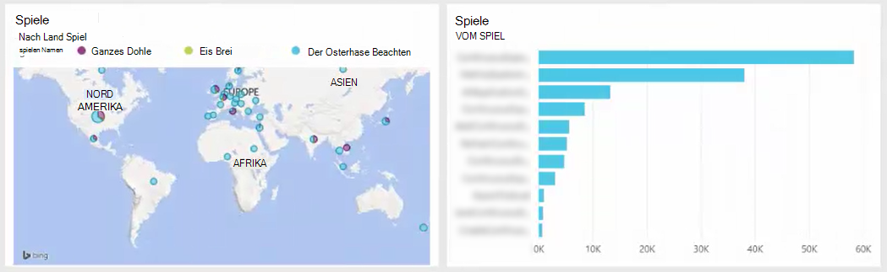


## <a name="no-data"></a>Keine Daten?

* Überprüfen Sie, dass Sie [Festlegen des Datumformats](#set-path-prefix-pattern) korrekt JJJJ-MM-TT (mit Bindestrichen).


## <a name="video"></a>Video

NOAM Ben Zeev veranschaulicht exportierten Daten mit Stream Analytics.

> [AZURE.VIDEO export-to-power-bi-from-application-insights]

## <a name="next-steps"></a>Nächste Schritte

* [Kontinuierliche exportieren](app-insights-export-telemetry.md)
* [Detaillierte Datenmodell für Typen und Werte.](app-insights-export-data-model.md)
* [Anwendung Einblicke](app-insights-overview.md)
* [Beispiele und exemplarische Vorgehensweisen](app-insights-code-samples.md)
 
