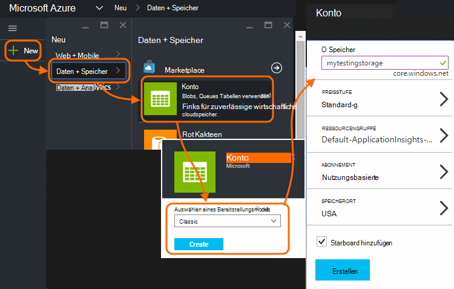
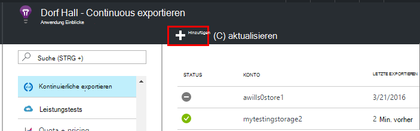
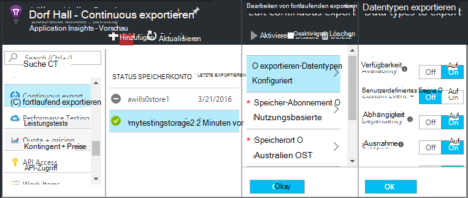
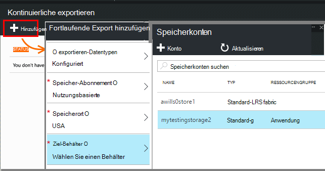
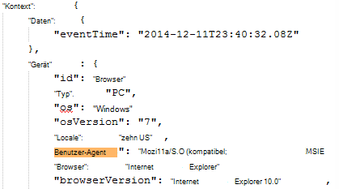
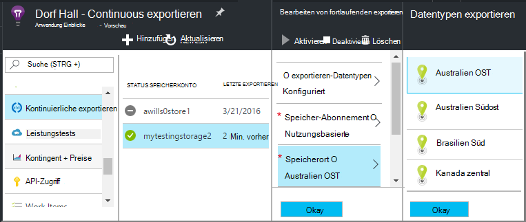

<properties 
    pageTitle="Fortlaufende Export Telemetrie von Anwendung | Microsoft Azure" 
    description="Diagnose-und Nutzungsdaten Speicher in Microsoft Azure exportieren und herunterladen." 
    services="application-insights" 
    documentationCenter=""
    authors="alancameronwills" 
    manager="douge"/>

<tags 
    ms.service="application-insights" 
    ms.workload="tbd" 
    ms.tgt_pltfrm="ibiza" 
    ms.devlang="na" 
    ms.topic="article" 
    ms.date="10/18/2016" 
    ms.author="awills"/>
 
# Telemetrie von Anwendung exportieren

Die Telemetrie länger als die standardmäßige Aufbewahrungszeit beibehalten möchten? Oder auf spezielle Weise verarbeitet? Fortlaufende Export ist ideal. Die Ereignisse sehen Sie in Application Insights-Portal können Speicher in Microsoft Azure im JSON-Format exportiert werden. Dort können Sie Daten herunterladen und Schreiben jeder code verarbeitet werden müssen.  

Fortlaufende Export ist in der Testphase und [Standard- und Premium Preisplänen](https://azure.microsoft.com/pricing/details/application-insights/)verfügbar.

Vor dem Einrichten von fortlaufenden Export gibt es einige Alternativen, berücksichtigt werden soll:

* [Das Exportieren](app-insights-metrics-explorer.md#export-to-excel) oben Metriken oder Suche Blade ermöglicht die Übertragung von Tabellen und Diagramme in eine Exceltabelle. 
* [Analytics](app-insights-analytics.md) stellt leistungsstarke Abfragesprache für Telemetrie und können Ergebnisse exportieren.
* Wenn Sie auf [Ihre Daten in Power BI](http://blogs.msdn.com/b/powerbi/archive/2015/11/04/explore-your-application-insights-data-with-power-bi.aspx)suchen, können Sie dies ohne kontinuierliche exportieren.

## Ein Speicherkonto erstellen

Haben Sie bereits ein "klassische" Speicherkonto erstellen.

1. Erstellen Sie ein Speicherkonto in Ihrem Abonnement im [Azure-Portal](https://portal.azure.com).

    

2. Erstellen Sie einen Container.

    

## Einrichten von kontinuierlichen exportieren

Die Anwendung Übersicht Blade im Application Insights-Portal öffnen Sie kontinuierlichen exportieren: 

Fügen Sie einen fortlaufenden Export und wählen Sie die Ereignistypen, die Sie exportieren möchten:

Auswählen oder Erstellen von [Azure Speicherkonto](../storage/storage-introduction.md) , die Daten gespeichert werden soll:

Nach dem Erstellen des Exports beginnt gehen. (Sie erhalten nur mit nach dem Export erstellen.) 

Es kann eine Verzögerung von ungefähr eine Stunde vor der Daten im Blob.

Wenn Sie Ereignistypen später ändern möchten, bearbeiten Sie einfach den Export:

Klicken Sie auf deaktivieren, um den Stream zu beenden. Wenn Sie erneut aktivieren klicken, wird der Stream mit neuen Daten neu gestartet. Sie erhalten nicht die Daten, die in das Portal eingegangen exportieren deaktiviert wurde.

Stoppen den Stream dauerhaft löschen Sie exportieren. Damit löschen Ihre Daten nicht aus dem Speicher.

#### Kann nicht hinzufügen oder Ändern einer exportieren?

* Hinzufügen oder Ändern von Exporten, benötigen Sie Besitzer, Teilnehmer oder Anwendung Einblicke Teilnehmer verfügen. [Erfahren Sie mehr über Rollen][roles].

## Erhalten was Sie?

Die exportierten Daten ist raw Telemetrie in der Anwendung erhalten wir Positionsdaten die wir berechnen die Client-IP-Adresse hinzufügen. 

Daten nach [Sampling](app-insights-sampling.md) verworfen werden nicht in die exportierten Daten enthalten.

Berechneten Metriken sind nicht enthalten. Angenommen, wir nicht durchschnittliche CPU-Auslastung exportieren, aber wir exportieren raw Telemetriedaten aus der der Durchschnitt berechnet wird.

Die Daten umfassen auch die Ergebnisse der [Verfügbarkeit von Webtests](app-insights-monitor-web-app-availability.md) , die Sie eingerichtet haben. 

> [AZURE.NOTE] **Sampling.** Wenn Ihre Anwendung große Datenmengen sendet und Application Insights SDK für ASP.NET Version 2.0.0-beta3 oder höher verwenden, kann adaptive Sampling-Funktion ausgeführt werden und nur einen Teil der Telemetrie. [Erfahren Sie mehr über Sampling.](app-insights-sampling.md)

## Überprüfen der Daten

Sie können den Speicher direkt im Portal prüfen. Klicken Sie auf **Durchsuchen**, wählen Sie das Speicherkonto und öffnen Sie **Container**.

Öffnen Sie zum Überprüfen von Azure-Speicher in Visual Studio **Anzeigen** **Cloud Explorer**. (Wenn Sie diesen Menübefehl haben, müssen Sie Azure SDK installieren: im Dialogfeld **Neues Projekt** zu öffnen, erweitern Sie Visual C# / Cloud und **Microsoft Azure SDK für .NET erhalten**.)

Wenn Sie Blob-Speicher öffnen, sehen Sie einen Container mit BLOB-Dateien. Der URI der einzelnen Dateien der Anwendung Einblicke Ressourcenname instrumentationsschlüssel, Telemetrie-Typ Datum/Uhrzeit abgeleitet. (Der Ressourcenname wird nur Kleinbuchstaben und instrumentationsschlüssel lässt Bindestriche.)

Datum und Uhrzeit UTC sind und wenn die Telemetrie im Speicher - nicht hinterlegt wurde, generiert wurde. Schreiben von Code, um die Daten können sie so linear Daten durchlaufen.

Hier wird die Form des Pfads:

    $"{applicationName}_{instrumentationKey}/{type}/{blobDeliveryTimeUtc:yyyy-MM-dd}/{ blobDeliveryTimeUtc:HH}/{blobId}_{blobCreationTimeUtc:yyyyMMdd_HHmmss}.blob"
  
Wo 

-   `blobCreationTimeUtc`inszeniert-Uhrzeit Blob im internen Speicher
-   `blobDeliveryTimeUtc`immer wenn Blob exportieren Ziel Speicher kopiert wird

## Datenformat

* Jedes Blob ist eine Textdatei mit mehreren ' \n'-separated Zeilen. Über einen Zeitraum von ungefähr eine halbe Minute verarbeitete Telemetrie enthält.
* Jede Zeile stellt einen Datenpunkt Telemetrie wie eine Anforderung oder Seite.
* Jede Zeile ist eine unformatierte JSON-Dokument. Wenn Sie wollen es starren, in Visual Studio öffnen und bearbeiten Sie, erweitert, Formatdatei:

Zeitdauer in Ticks, wobei 10 000 mehr Striche werden = 1 ms. Diese Werte zeigen z. B. nacheinander 1ms senden eine Anforderung vom Browser 3ms empfangen und 1.8 der Seite im Browser:

    "sendRequest": {"value": 10000.0},
    "receiveRequest": {"value": 30000.0},
    "clientProcess": {"value": 17970000.0}

[Detaillierte Datenmodell für Typen und Werte.](app-insights-export-data-model.md)

## Verarbeitung der Daten

Auf kleinen können Sie schreiben Code Auseinanderziehen Daten, in eine Tabelle zu lesen und so weiter. Zum Beispiel:

    private IEnumerable<T> DeserializeMany<T>(string folderName)
    {
      var files = Directory.EnumerateFiles(folderName, "*.blob", SearchOption.AllDirectories);
      foreach (var file in files)
      {
         using (var fileReader = File.OpenText(file))
         {
            string fileContent = fileReader.ReadToEnd();
            IEnumerable<string> entities = fileContent.Split('\n').Where(s => !string.IsNullOrWhiteSpace(s));
            foreach (var entity in entities)
            {
                yield return JsonConvert.DeserializeObject<T>(entity);
            }
         }
      }
    }

Umfangreicheren Codebeispiels finden Sie unter [eine Worker-Rolle mit][exportasa].

## Alte löschen
Bitte beachten Sie, dass Ihre Speicherkapazität verwaltet und Löschen der alten Daten bei Bedarf. 

## Wenn Ihre Speicherschlüssel regenerieren...

Wenn Sie Ihr Speichersystem den Schlüssel ändern, wird kontinuierlicher Export funktionieren. Sie sehen eine Benachrichtigung in Ihrem Azure-Konto. 

Kontinuierliche exportieren Blade öffnen und Bearbeiten des Exports. Bearbeiten Sie das Exportziel aber lassen Sie denselben Speicher aktiviert. Klicken Sie auf OK.

Der fortlaufende Export wird neu gestartet.

## Export-Beispiele

* [Exportieren Sie in eine Worker-Rolle mit SQL][exportcode]
* [Stream Analytics mit SQL exportieren][exportasa]
* [Stream Analytics Beispiel 2](app-insights-export-stream-analytics.md)

Berücksichtigen Sie in größeren Maßstäben [HDInsight](https://azure.microsoft.com/services/hdinsight/) - Cluster Hadoop in der Cloud. HDInsight bietet eine Vielzahl von Technologie für das Verwalten und Analysieren von großen Daten.

## Fragen & Antworten

* *Aber ich möchte einen einmaligen Download eines Diagramms.*  
 
    Ja, können Sie dies. Klicken Sie oben im Blatt auf [Daten exportieren](app-insights-metrics-explorer.md#export-to-excel).

* *Export werden eingerichtet, aber es sind keine Daten im Shop.*

    Erhielt Application Insights Telemetrie Ihrer App seit der Export einrichten? Sie erhalten nur neue Daten.

* *Ich versuchte einen Export einrichten, aber wurde verweigert*

    Wenn das Konto der Organisation gehört, müssen Sie der Besitzer oder die Mitwirkenden Gruppen angehören.

* *Kann direkt mit eigenen lokalen Speicher werden exportiert?* 

    Nein, leider. Export-Engine arbeitet derzeit nur mit Azure-Speicher zu diesem Zeitpunkt.  

* *Gibt es irgendeine Einschränkung der Datenmenge, die in meinem Shop einsetzen?* 

    Nein. Wir werden Daten pushen den Export löschen. Wir halten stoßen wir auf die äußeren Grenzen für BLOB-Speicher jedoch ziemlich groß ist. Es ist um zu steuern, wie viel Speicher Sie verwenden.  

* *Wie viele Blobs sollte im Speicher werden angezeigt?*

 * Für jeden Datentyp um zu exportieren, wird ein neues Blob (sofern Daten verfügbar sind) jede Minute erstellt. 
 * Darüber hinaus werden zusätzliche Partition Einheiten für Applikationen mit hoher Auslastung zugewiesen. In diesem Fall erstellt jede Einheit ein Blob pro Minute.

* *Ich mein Speicher den Schlüssel generiert oder den Namen des Containers geändert, und jetzt funktioniert exportieren.*

    Bearbeiten Sie den Export und öffnen Sie Export Ziel Blade. Lassen Sie denselben Speicher wie zuvor ausgewählt, und klicken Sie auf OK. Export wird neu gestartet. Wenn die Änderung in den letzten Tagen gehen keine Daten verloren.

* *Kann den Export anhalten?*

    Ja. Klicken Sie auf deaktivieren.

## Code-Beispiele

* [Exportiert eine Worker-Rolle mit JSON analysiert][exportcode]
* [Stream Analytics-Beispiel](app-insights-export-stream-analytics.md)
* [Stream Analytics mit SQL exportieren][exportasa]

* [Detaillierte Datenmodell für Typen und Werte.](app-insights-export-data-model.md)

<!--Link references-->

[exportcode]: app-insights-code-sample-export-telemetry-sql-database.md
[exportasa]: app-insights-code-sample-export-sql-stream-analytics.md
[roles]: app-insights-resources-roles-access-control.md

 
