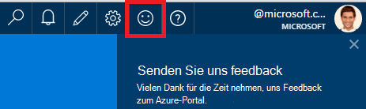
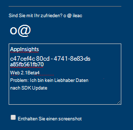
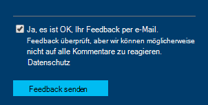

<properties 
    pageTitle="Zum technischen Support von Application Insights-Entwicklungsteam | Microsoft Azure" 
    description="Bei einer Anfrage, die besondere Unterstützung von Application Insights-Entwicklungsteam benötigt ist dies wie Details zu Support senden können." 
    services="application-insights" 
    documentationCenter=""
    authors="alexbulankou" 
    manager="douge"/>
 
<tags 
    ms.service="application-insights" 
    ms.workload="tbd" 
    ms.tgt_pltfrm="ibiza" 
    ms.devlang="na" 
    ms.topic="article" 
    ms.date="06/01/2016" 
    ms.author="albulank"/>
    
# <a name="how-to-get-technical-support-from-application-insights-development-team"></a>Zum technischen Support von Application Insights-Entwicklungsteam
    
Wenn Sie ein technisches Problem mit [Visual Studio Application Insights](app-insights-overview.md)haben, sind Ihre Optionen zum Hilfe hier:

## <a name="1-check-the-documents"></a>1. Überprüfen Sie 1. die Dokumente

* Fehlende Daten? Kontrollkästchen: [Sampling](app-insights-sampling.md) [Kontingente Drosselung](app-insights-pricing.md).
* Problembehandlung: [ASP.NET](app-insights-troubleshoot-faq.md) | [Java](app-insights-java-troubleshoot.md)

## <a name="2-search-the-forums"></a>2. die Foren durchsuchen

* [MSDN-forum](https://social.msdn.microsoft.com/Forums/vstudio/home?forum=ApplicationInsights)
* [StackOverflow](http://stackoverflow.com/questions/tagged/ms-application-insights)

## <a name="3-azure-support-plan"></a>3. Azure Support-Plan?

Es gibt Situationen, die Entwickler Ihre speziellen Fall untersuchen möchten. 

Haben Sie ein [Supportplan mit Microsoft Azure](https://azure.microsoft.com/support/plans/) können Sie [ein Support-Ticket öffnen](https://portal.azure.com/?#blade/Microsoft_Azure_Support/HelpAndSupportBlade).

## <a name="4-contact-the-application-insights-team"></a>4. Kontakt Anwendung Einblicke

Haben Sie einen Support-Plan, freut sich unser Entwicklungsteam Anwendung Einblicke Kunden bestmöglichen Support anbieten, Vorbereitung der allgemeinen Verfügbarkeit Meilenstein. Wir stellen **eine neue Support-Option**: Beschreiben Sie Ihre Anfrage an uns Ihre Azure-Portal und haben Entwickler an Team Anwendung Einblicke zurück, um das Problem zu beheben.


1. Klicken Sie auf das Smiley rechts oben im [Application Insights-Portal](https://portal.azure.com):  

       

2. Stellen Sie im Kommentarfeld **AppInsights** in der ersten Zeile an und enthalten Sie folgende Angaben:   

    ```

    AppInsights   
    ikey: <instrumentation key>   
    sdk: <SDK that you are using, including name and version>  
    issue: <please describe the problem you are having>

    ```   

       

3. Überprüfen Sie "Ja, ok e-Mails ist". 

      

Ingenieur Application Insights-Team werden Sie bald kontaktieren. Wie wir diesen Service auf bestem bieten keine formalen SLA an dieser Stelle erhalten.


