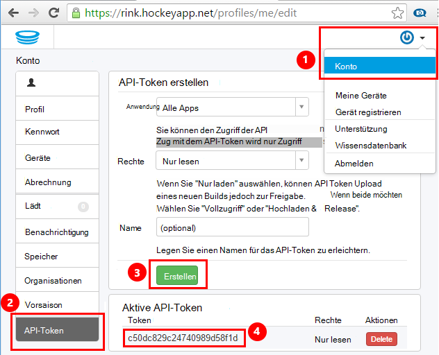
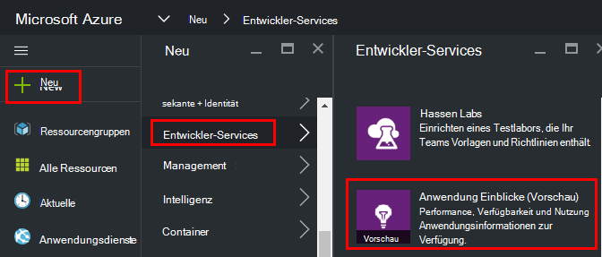
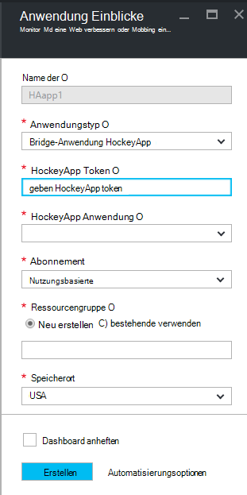
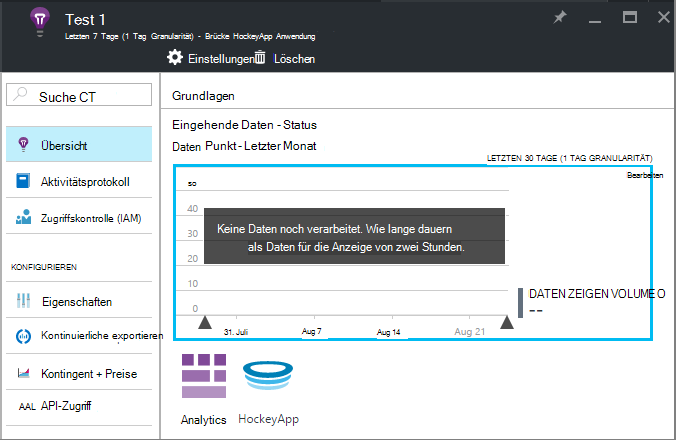
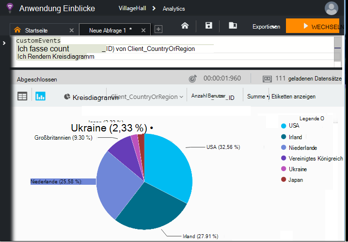

<properties 
    pageTitle="Untersuchen von HockeyApp Daten in Application Insights | Microsoft Azure" 
    description="Verwendung und Leistung der Anwendung zum Azure app zu analysieren." 
    services="application-insights" 
    documentationCenter="windows"
    authors="alancameronwills" 
    manager="douge"/>

<tags 
    ms.service="application-insights" 
    ms.workload="tbd" 
    ms.tgt_pltfrm="ibiza" 
    ms.devlang="na" 
    ms.topic="article" 
    ms.date="08/25/2016" 
    ms.author="awills"/>

#  Untersuchen von HockeyApp Daten Anwendung Erkenntnisse

[HockeyApp](https://azure.microsoft.com/services/hockeyapp/) ist die empfohlene Plattform für live und mobile apps überwachen. Von HockeyApp können Sie benutzerdefinierte senden und Telemetrie überwachen und Diagnose (neben Absturzdaten) verfolgen. Dieser Stream Telemetrie kann mithilfe des leistungsstarken [Analytics](app-insights-analytics.md) Features von [Visual Studio Application Insights](app-insights-overview.md)abgefragt werden. Darüber hinaus können Sie [das benutzerdefinierte exportieren und Telemetrie verfolgen](app-insights-export-telemetry.md). Um diese Features zu aktivieren, legen Sie eine Brücke, die Daten HockeyApp Anwendung Einblicke leitet.

## Die Anwendung HockeyApp-Brücke

HockeyApp Bridge-Anwendung ist die Kernfunktion, die HockeyApp Anwendung Erkenntnisse über die Analytics Zugriff ermöglicht und kontinuierliche exportieren. Alle Daten von HockeyApp nach der Erstellung der Brücke HockeyApp diese Funktionen zugegriffen werden. Mal sehen, wie man diese Brücke einrichten.

Öffnen Sie in HockeyApp Konteneinstellungen [API-Token](https://rink.hockeyapp.net/manage/auth_tokens). Ein neues Token erstellen oder eine vorhandene verwenden. Die minimale Rechte erforderlich "werden nur lesen". Nehmen Sie eine Kopie der API token.

Öffnen Sie Microsoft Azure-Portal und [Application Insights-Ressource erstellen](app-insights-create-new-resource.md). Anwendungstyp auf "Bridge-Anwendung HockeyApp" festgelegt:

Sie müssen einen Namen – dies automatisch vom HockeyApp Namen festgelegt.

HockeyApp Bridge Felder angezeigt. 

Geben Sie HockeyApp-Token, das Sie zuvor notiert haben. Dadurch füllt alle HockeyApp Programme im Dropdownmenü "HockeyApp Anwendung". Wählen Sie die gewünschte, und füllen Sie die Felder. 

Öffnen Sie die neue Ressource. 

Beachten Sie, dass die Daten eine Weile fließen.

Das wars! Alle Daten in Ihrer Anwendung HockeyApp instrumentiert ab diesem Punkt steht jetzt zur Analyse und fortlaufenden Export Funktionen Anwendung Erkenntnisse.

Lassen Sie uns kurz diese Funktionen jetzt zur Verfügung.

## Analytics

Analytics ist ein leistungsfähiges Tool für Ad-hoc-Abfragen, die Daten zu analysieren und Analysieren der Telemetrie Ursachen und Muster feststellen.

* [Erfahren Sie mehr über Analytics](app-insights-analytics-tour.md)
* [Einführungsvideo](https://channel9.msdn.com/events/Build/2016/T666)
* [Erweiterte Konzepte video](https://channel9.msdn.com/Events/Build/2016/P591)

## Kontinuierliche exportieren

Kontinuierliche können Sie Ihre Daten in einem Container Azure BLOB-Speicher exportieren. Dies ist sehr nützlich, wenn Ihre Daten länger als die Aufbewahrungsdauer von Application Insights angeboten werden sollen. Sie können Daten im BLOB-Speicher, in einer SQL-Datenbank oder die bevorzugte Lösung für Datawarehousing verarbeiten.

[Erfahren Sie mehr über kontinuierliche exportieren](app-insights-export-telemetry.md)

## Nächste Schritte

* [Analytics auf die Daten angewendet.](app-insights-analytics-tour.md)

