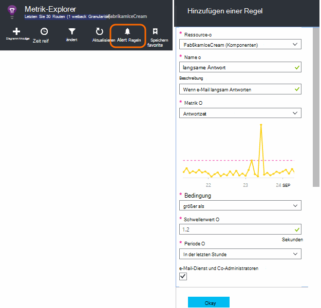
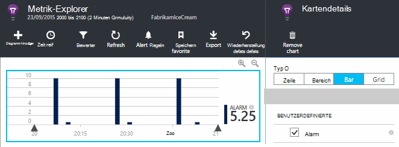
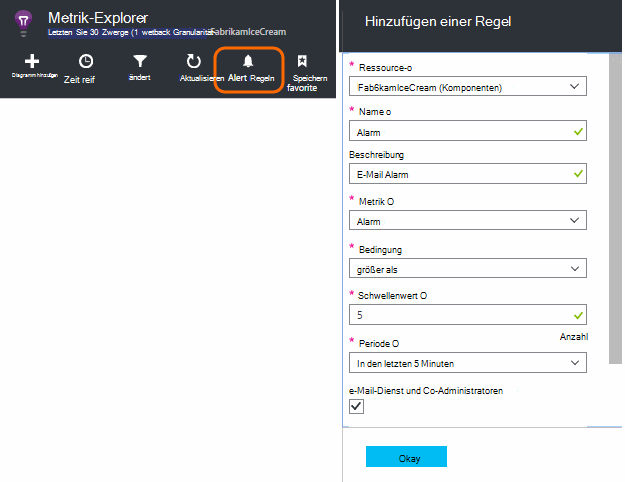
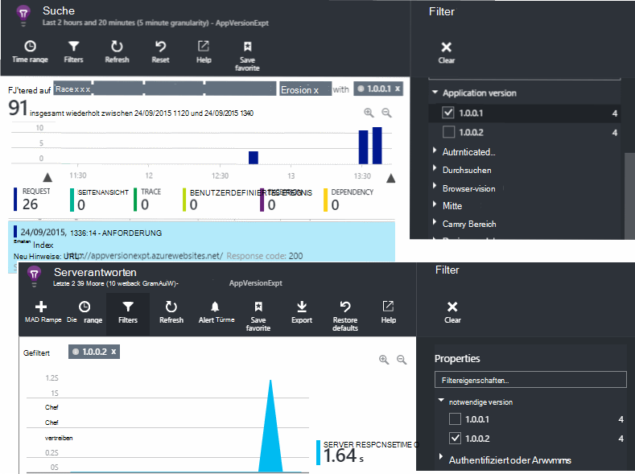
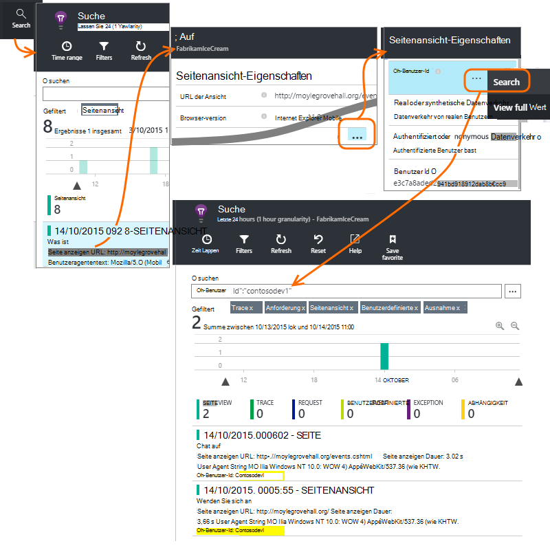
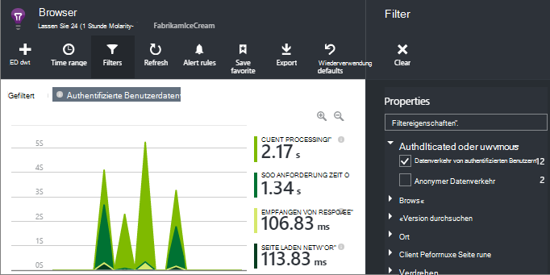
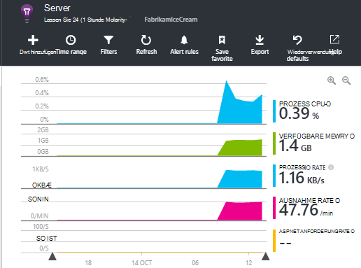

<properties 
    pageTitle="Gewusst wie... in Application Insights | Microsoft Azure" 
    description="Häufig gestellte Fragen zur Anwendung Erkenntnisse." 
    services="application-insights" 
    documentationCenter=""
    authors="alancameronwills" 
    manager="douge"/>

<tags 
    ms.service="application-insights" 
    ms.workload="tbd" 
    ms.tgt_pltfrm="ibiza" 
    ms.devlang="na" 
    ms.topic="article" 
    ms.date="02/05/2016" 
    ms.author="awills"/>

# <a name="how-do-i--in-application-insights"></a>Gewusst wie... in Application Insights?

## <a name="get-an-email-when-"></a>E-Mail senden als...

### <a name="email-if-my-site-goes-down"></a>Meine Website geht e-Mail

Legen Sie einen [Webtest Verfügbarkeit](app-insights-monitor-web-app-availability.md).

### <a name="email-if-my-site-is-overloaded"></a>E-Mail, wenn meine Website überladen

Festlegen Sie eine [Warnung](app-insights-alerts.md) auf **Antwortzeit**. Ein Schwellenwert zwischen 1 und 2 Sekunden sollte funktionieren.



Ihre app kann auch Belastung Anzeichen von Fehlercodes zurückgegeben. Festlegen Sie eine Warnung für **Fehler Anfragen**.

Wenn Sie eine Warnung für **Server-Ausnahmen**festlegen möchten, möglicherweise [einige zusätzliche Einrichtungsschritte](app-insights-asp-net-exceptions.md) , um Daten anzuzeigen.

### <a name="email-on-exceptions"></a>E-Mail-Ausnahmen

1. [Einrichten der ausnahmeüberwachung](app-insights-asp-net-exceptions.md)
2. Auf die Ausnahme Count Metrik [festlegen](app-insights-alerts.md)


### <a name="email-on-an-event-in-my-app"></a>Ein Ereignis in meiner app e-Mail

Angenommen, Sie möchten eine e-Mail, wenn ein bestimmtes Ereignis eintritt. Anwendung nicht Erkenntnisse diese Funktion direkt, aber es kann [sendet eine Warnung, wenn eine Metrik einen Schwellenwert überschreitet](app-insights-alerts.md). 

Alarme können für [benutzerdefinierte Messgrößen](app-insights-api-custom-events-metrics.md#track-metric), aber nicht benutzerdefinierte Ereignisse festgelegt werden. Schreiben Sie Code, um eine Metrik erhöhen, wenn das Ereignis eintritt:

    telemetry.TrackMetric("Alarm", 10);

oder:

    var measurements = new Dictionary<string,double>();
    measurements ["Alarm"] = 10;
    telemetry.TrackEvent("status", null, measurements);

Da Alarme zwei Zustände haben, haben Sie einen niedrigen Wert an, bei der Warnung beendet:

    telemetry.TrackMetric("Alarm", 0.5);

Erstellen eines Diagramms in [metrischen Explorer](app-insights-metrics-explorer.md) den Alarm anzeigen:



Legen Sie jetzt eine Warnung ausgelöst, wenn die Metrik einen mittleren Wert für einen kurzen Zeitraum überschreitet:




Fristen Sie dieser auf ein Minimum. 

Erhalten Sie e-Mails sowohl geht die Metrik oberhalb und unterhalb des Grenzwerts.

Einige Punkte zu beachten:

* Eine Warnung verfügt über zwei Zustände ("Warnung" und "gesund"). Der Status wird nur ausgewertet, wenn eine Metrik empfangen wird.
* Eine e-Mail wird nur gesendet, wenn der Status ändert. Deshalb haben sowohl hohe senden und geringwertige Metriken. 
* Um die Warnung zu evaluieren, ist der Durchschnitt empfangenen Werte der vorangegangenen Periode übernommen. Dies jedes Mal, wenn eine Metrik empfangen wird, damit e-Mails häufiger als der Zeitraum gesendet wird, festlegen.
* Da e-Mails "Warnung" und "gesund" gesendet werden, empfiehlt es sich, sollten das einmalige Ereignis als zwei Zustand überdenken. Angenommen, statt ein Ereignis "abgeschlossen" haben Sie eine Bedingung "Job in Bearbeitung" erhalten Sie e-Mails am Anfang und Ende eines Auftrags.

### <a name="set-up-alerts-automatically"></a>Warnung automatisch einrichten

[Neue Warnung erstellen mithilfe von PowerShell](app-insights-alerts.md#set-alerts-by-using-powershell)

## <a name="use-powershell-to-manage-application-insights"></a>Mithilfe von PowerShell Anwendung Einblicke verwalten

* [Neue Ressourcen erstellen](app-insights-powershell-script-create-resource.md)
* [Neue Warnung erstellen](app-insights-alerts.md#set-alerts-by-using-powershell)

## <a name="application-versions-and-stamps"></a>Anwendungsversionen und Stempel

### <a name="separate-the-results-from-dev-test-and-prod"></a>Trennen Sie die Ergebnisse von Entwicklung, Test und Produktion

* Für unterschiedliche Environmnents verschiedene Ikeys einrichten
* Für anderen Zeitstempel (Entwicklung, test, prod) tag Telemetrie mit anderen Eigenschaftswerten

[Weitere Informationen](app-insights-separate-resources.md)
 

### <a name="filter-on-build-number"></a>Buildnummer filtern

Wenn Sie eine neue Version der Anwendung veröffentlichen, sollten Sie Telemetriedaten aus verschiedenen Builds trennen.

Sie können der Anwendungsversion Eigenschaftensatz, Filtern von [Such-](app-insights-diagnostic-search.md) und [Metrik-Explorer](app-insights-metrics-explorer.md) . 




Es gibt verschiedene Methoden die Anwendungsversion-Eigenschaft festlegen.

* Direkt festgelegt:

    `telemetryClient.Context.Component.Version = typeof(MyProject.MyClass).Assembly.GetName().Version;`

* Umschließen Sie Zeile einen [Initialisierer Telemetrie](app-insights-api-custom-events-metrics.md#telemetry-initializers) um sicherzustellen, dass alle Instanzen von TelemetryClient einheitlich festgelegt werden.

* [ASP.NET] Legen Sie die Version in `BuildInfo.config`. Die Version der BuildLabel-Knoten übernehmen das Webmodul. Fügen Sie diese Datei im Projekt, und denken Sie daran, die Eigenschaft immer kopieren im Projektmappen-Explorer.

    ```XML

    <?xml version="1.0" encoding="utf-8"?>
    <DeploymentEvent xmlns:xsi="http://www.w3.org/2001/XMLSchema-instance" xmlns:xsd="http://www.w3.org/2001/XMLSchema" xmlns="http://schemas.microsoft.com/VisualStudio/DeploymentEvent/2013/06">
      <ProjectName>AppVersionExpt</ProjectName>
      <Build type="MSBuild">
        <MSBuild>
          <BuildLabel kind="label">1.0.0.2</BuildLabel>
        </MSBuild>
      </Build>
    </DeploymentEvent>

    ```
* [ASP.NET] Generieren Sie BuildInfo.config in MSBuild automatisch. Dazu fügen Sie einige Zeilen der CSPROJ-Datei:

    ```XML

    <PropertyGroup>
      <GenerateBuildInfoConfigFile>true</GenerateBuildInfoConfigFile>    <IncludeServerNameInBuildInfo>true</IncludeServerNameInBuildInfo>
    </PropertyGroup> 
    ```

    Dadurch wird eine Datei namens *Ihr Projektname*generiert. BuildInfo.config. Der Veröffentlichungsprozess umbenannt in BuildInfo.config.

    Der Buildbezeichnung enthält einen Platzhalter (AutoGen_...) mit Visual Studio erstellen. Aber wenn mit MSBuild erstellt, mit der richtigen Versionsnummer aufgefüllt.

    Damit MSBuild generiert werden kann, legen Sie die Version wie `1.0.*` in AssemblyReference.cs

## <a name="monitor-backend-servers-and-desktop-apps"></a>Überwachen von Back-End-Servern und desktop-apps

[Mit Windows Server SDK-Modul](app-insights-windows-desktop.md).


## <a name="visualize-data"></a>Daten

#### <a name="dashboard-with-metrics-from-multiple-apps"></a>Dashboard mit Metriken aus mehreren apps

* [Metrik-Explorer](app-insights-metrics-explorer.md)Diagramm anpassen und als Favoriten speichern. Azure Dashboard angeheftet.


#### <a name="dashboard-with-data-from-other-sources-and-application-insights"></a>Mit Daten aus anderen Quellen und Anwendung Einblicke

* [Telemetrie Power BI exportieren](app-insights-export-power-bi.md). 

Oder

* Verwenden Sie SharePoint als Standarddashboard Daten in SharePoint-Webparts. [Verwenden Sie fortlaufende exportieren und Stream Analytics SQL exportieren](app-insights-code-sample-export-sql-stream-analytics.md).  Verwenden Sie PowerView der Datenbank zu, und erstellen Sie ein SharePoint-Webpart für PowerView.


<a name="search-specific-users"></a>
### <a name="filter-out-anonymous-or-authenticated-users"></a>Anonyme oder authentifizierte Benutzer filtern

Wenn Ihre Benutzer anmelden, können Sie die [Authentifizierte Benutzer-Id](app-insights-api-custom-events-metrics.md#authenticated-users)festlegen. (Es nicht automatisch.) 

Anschließend können Sie:

* Suche auf bestimmte Benutzer-ids



* Metriken für anonyme oder authentifizierte Benutzer filtern



## <a name="modify-property-names-or-values"></a>Eigenschaftennamen oder-Werte ändern

Erstellt einen [Filter](app-insights-api-filtering-sampling.md#filtering). Dadurch ändern oder Telemetrie filtern, bevor sie Ihre App an Application Insights gesendet wird.

## <a name="list-specific-users-and-their-usage"></a>Liste der Benutzer und deren Verwendung

Wenn Sie nur [bestimmten Benutzern suchen](#search-specific-users)möchten, können Sie die [Authentifizierte Benutzer-Id](app-insights-api-custom-events-metrics.md#authenticated-users)festlegen.

Ggf. eine Liste von Daten, z. B. welche Seiten sie sehen wie oft anmelden, haben Sie zwei Optionen:

* [Gruppe Authentifizierte Benutzer-Id](app-insights-api-custom-events-metrics.md#authenticated-users) [in eine Datenbank exportieren](app-insights-code-sample-export-sql-stream-analytics.md) und mit geeigneten Tools Ihre Benutzerdaten analysieren.
* Haben Sie nur wenige Benutzer senden Sie benutzerdefinierte Ereignisse oder Metriken Daten als Namen der metrischen Wert oder Ereignis und die Benutzer-Id als Eigenschaft festlegen. Seitenansichten zu analysieren, ersetzen Sie den standard JavaScript TrackPageView-Aufruf. Verwenden Sie zum Analysieren von serverseitigen Telemetrie Telemetrie Initialisierer Telemetrie für alle Server die Benutzer-Id hinzu. Anschließend können Sie Filter und Segment Metriken und auf die Benutzer-Id.


## <a name="reduce-traffic-from-my-app-to-application-insights"></a>Reduzierung des Datenverkehrs von meiner app Anwendung Einblicke

* Deaktivieren Sie alle Module, die Sie benötigen, die diese Performance Counter Kollektor in [ApplicationInsights.config](app-insights-configuration-with-applicationinsights-config.md).
* Verwenden Sie [Probenahme und Filterung](app-insights-api-filtering-sampling.md) im SDK.
* In Webseiten die Anzahl der Ajax-Aufrufe für alle Seitenansicht gemeldet. Im Codeausschnitt nach `instrumentationKey:...` , einfügen: `,maxAjaxCallsPerView:3` (oder eine entsprechende Anzahl).
* Wenn Sie [TrackMetric](app-insights-api-custom-events-metrics.md#track-metric)verwenden, berechnet das Aggregat Batches von metrischen Werten vor dem Senden des Ergebnis. Gibt es eine Überladung, bietet TrackMetric().


Weitere Informationen zu [Preisen und Quoten](app-insights-pricing.md)

## <a name="disable-telemetry"></a>Telemetrie deaktivieren

Zu **dynamisch anhalten und starten** der Übertragung von Telemetriedaten aus dem Server:

```

    using  Microsoft.ApplicationInsights.Extensibility;

    TelemetryConfiguration.Active.DisableTelemetry = true;
```


**Deaktivieren Sie ausgewählte standard Kollektoren** - z. B. Leistungsindikatoren, HTTP-Anfragen Dependencies - löschen oder kommentieren Sie die entsprechenden Zeilen in [ApplicationInsights.config](app-insights-api-custom-events-metrics.md). Sie können z. B. dazu TrackRequest Daten senden soll.


## <a name="view-system-performance-counters"></a>Systemleistungsindikatoren anzeigen

Die Metriken Metriken Explorer zeigen gehören eine Gruppe von Leistungsindikatoren. Es gibt eine vordefinierte Blade- **Server** , die mehrere zeigt Titel.



### <a name="if-you-see-no-performance-counter-data"></a>Wenn Sie keine Leistungsindikatordaten angezeigt

* **IIS-Server** auf Ihrem Computer oder auf einem virtuellen Computer. [Statusmonitor installieren](app-insights-monitor-performance-live-website-now.md). 
* **Azure-Website** - Leistungsindikatoren wird noch nicht unterstützt. Es gibt verschiedene Messgrößen als Standardbestandteil des Bedienfelds Azure-Website erhalten.
* **UNIX-Server** - [siecollectd installieren](app-insights-java-collectd.md)

### <a name="to-display-more-performance-counters"></a>Weitere Leistungsindikatoren anzeigen

* Erstens haben [ein neues Diagramm hinzufügen](app-insights-metrics-explorer.md) und sehen, ob der Zähler in der Basic, festgelegt ist.
* Wenn nicht, [gegen das Leistungsindikatorenmodul erfassten Gruppe hinzufügen](app-insights-performance-counters.md).


