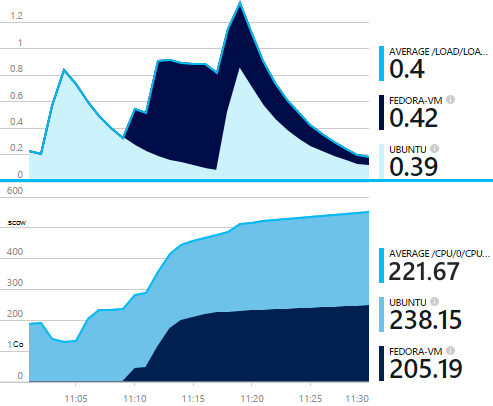
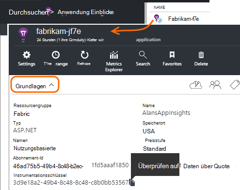

<properties 
    pageTitle="reststoffe: Perf Statistiken für Java unter Unix in Anwendung Einblicke" 
    description="Erweiterte Überwachung der Website Java plug-in Reststoffe Anwendung Einblicke" 
    services="application-insights" 
    documentationCenter="java"
    authors="alancameronwills" 
    manager="douge"/>

<tags 
    ms.service="application-insights" 
    ms.workload="tbd" 
    ms.tgt_pltfrm="ibiza" 
    ms.devlang="na" 
    ms.topic="article" 
    ms.date="08/24/2016" 
    ms.author="awills"/>
 
# <a name="collectd-unix-performance-metrics-in-application-insights"></a>reststoffe: Unix Leistungsmetriken Anwendung Erkenntnisse

*Anwendung Informationen ist in der Vorschau.*

Installieren Sie [reststoffe](http://collectd.org/)mit Plug-in-Anwendung Erkenntnisse zu Unix System Leistungsmetriken [Anwendung](app-insights-overview.md)Erkenntnisse. Diese Open Source-Lösung sammelt verschiedene und Statistiken.

In der Regel Sie verwenden reststoffe haben Sie bereits [den Webdienst Java Anwendung zum instrumentiert][java]. Es gibt weitere Daten können Sie die Leistung Ihrer Anwendung oder Probleme diagnostizieren. 



## <a name="get-your-instrumentation-key"></a>Die Instrumentation Schlüssel

Öffnen Sie in [Microsoft Azure-Portal](https://portal.azure.com) [Application Insights](app-insights-overview.md) -Ressource, die die Daten angezeigt werden soll. (Oder [Erstellen Sie eine neue Ressource](app-insights-create-new-resource.md)).

Erstellen Sie eine Kopie des Schlüssels Instrumentation, die die Ressource identifiziert.




## <a name="install-collectd-and-the-plug-in"></a>Reststoffe und das plug-in installieren

Auf den Servercomputern Unix:

1. [Reststoffe](http://collectd.org/) Version 5.4.0 installieren oder höher.
2. [Application Insights reststoffe Writer-Plug-in](https://aka.ms/aijavasdk)herunterladen Notieren Sie die Versionsnummer.
3. Kopie des Plug-Ins in JAR- `/usr/share/collectd/java`.
3. Bearbeiten `/etc/collectd/collectd.conf`:
 * Stellen Sie sicher, dass das [Java-Plugin](https://collectd.org/wiki/index.php/Plugin:Java) aktiviert ist.
 * Aktualisieren Sie die JVMArg für die java.class.path auf die folgenden JAR-Datei. Aktualisieren Sie die Versionsnummer entsprechend der heruntergeladenen:
  * `/usr/share/collectd/java/applicationinsights-collectd-1.0.5.jar`
 * Fügen Sie dieser Ausschnitt Instrumentation Taste, wenn die Ressource hinzu:

```

     LoadPlugin "com.microsoft.applicationinsights.collectd.ApplicationInsightsWriter"
     <Plugin ApplicationInsightsWriter>
        InstrumentationKey "Your key"
     </Plugin>
```

Hier ist eine Beispielkonfigurationsdatei Teil:

    ...
    # collectd plugins
    LoadPlugin cpu
    LoadPlugin disk
    LoadPlugin load
    ...

    # Enable Java Plugin
    LoadPlugin "java"

    # Configure Java Plugin
    <Plugin "java">
      JVMArg "-verbose:jni"
      JVMArg "-Djava.class.path=/usr/share/collectd/java/applicationinsights-collectd-1.0.5.jar:/usr/share/collectd/java/collectd-api.jar"

      # Enabling Application Insights plugin
      LoadPlugin "com.microsoft.applicationinsights.collectd.ApplicationInsightsWriter"
                
      # Configuring Application Insights plugin
      <Plugin ApplicationInsightsWriter>
        InstrumentationKey "12345678-1234-1234-1234-123456781234"
      </Plugin>

      # Other plugin configurations ...
      ...
    </Plugin>
.   ...

Konfigurieren Sie andere [reststoffe Plugins](https://collectd.org/wiki/index.php/Table_of_Plugins), die verschiedene Daten aus verschiedenen Quellen abrufen können.

Starten Sie reststoffe nach seiner- [manuell](https://collectd.org/wiki/index.php/First_steps).

## <a name="view-the-data-in-application-insights"></a>Anzeigen der Daten in der Anwendung Einblicke

Öffnen Sie Application Insights-Ressource [Metriken Explorer und Diagramme hinzufügen][metrics], auswählen die Metriken aus der Kategorie Benutzerdefiniert angezeigt werden soll.


Standardmäßig sind die Metriken für alle Hostcomputer zusammengesetzt aus denen Metriken gesammelt wurden. Zum Anzeigen von Metriken pro Host im Diagramm Details Blade gruppieren aktivieren Sie und dann gruppieren nach Reststoffe-Host.


## <a name="to-exclude-upload-of-specific-statistics"></a>Uploads von statistischen Werte ausschließen

Standardmäßig sendet Application Insights-Plugin von alle aktivierten reststoffe 'read' Plugins gesammelten Daten. 

Daten aus bestimmten Plug-Ins oder Datenquellen ausschließen:

* Bearbeiten Sie die Konfigurationsdatei. 
* In `<Plugin ApplicationInsightsWriter>`, Richtlinie Zeilen folgendermaßen hinzufügen:

Richtlinie | Effekt
---|---
`Exclude disk` | Schließen Sie alle Daten von der `disk` -Plug-in
`Exclude disk:read,write` | Ausschließen von Datenquellen mit dem Namen `read` und `write` aus der `disk` -Plug-in.

Einzelrichtlinien mit Zeilenvorschub.


## <a name="problems"></a>Probleme?

*Daten im Portal nicht angezeigt werden.*

* [Suche] öffnen[ diagnostic] auf die rohen Ereignisse eingegangen. Manchmal länger sie Metriken Explorer angezeigt.
* Sie müssen [Firewallausnahmen für ausgehende Daten](app-insights-ip-addresses.md) festlegen
* Aktivieren Sie Verfolgung in Application Insights-Plug-in. Fügen Sie diese Zeile in `<Plugin ApplicationInsightsWriter>`:
 *  `SDKLogger true`
* Öffnen Sie ein Terminal und starten Sie reststoffe ausführliches reporting ist Probleme anzuzeigen:
 * `sudo collectd -f`


<!--Link references-->

[api]: app-insights-api-custom-events-metrics.md
[apiexceptions]: app-insights-api-custom-events-metrics.md#track-exception
[availability]: app-insights-monitor-web-app-availability.md
[diagnostic]: app-insights-diagnostic-search.md
[eclipse]: app-insights-java-eclipse.md
[java]: app-insights-java-get-started.md
[javalogs]: app-insights-java-trace-logs.md
[metrics]: app-insights-metrics-explorer.md
[usage]: app-insights-web-track-usage.md

 
