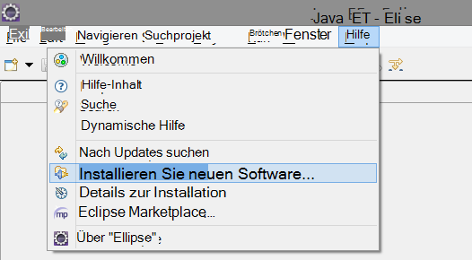
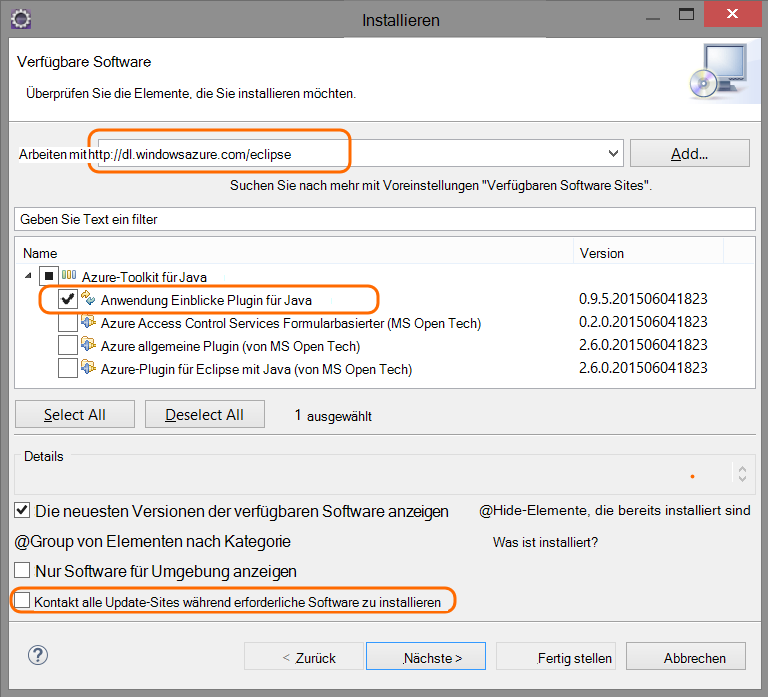
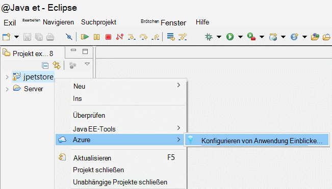
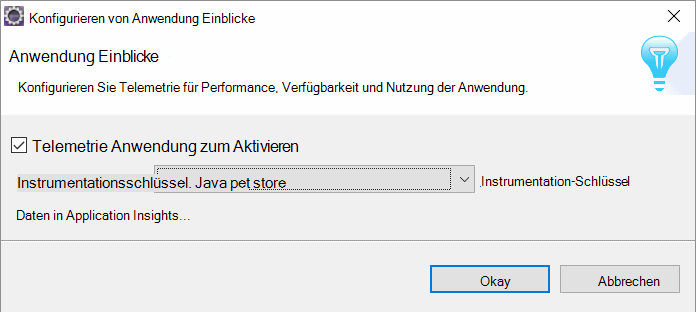
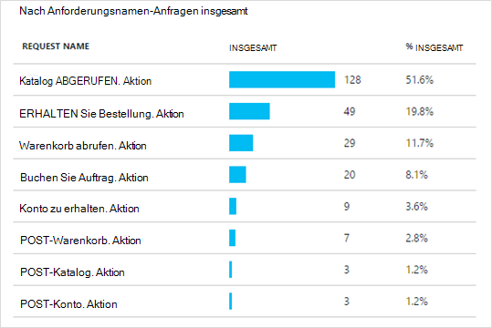
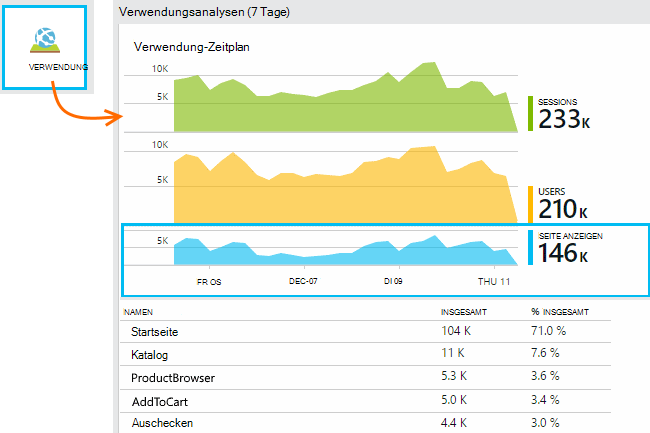
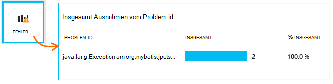
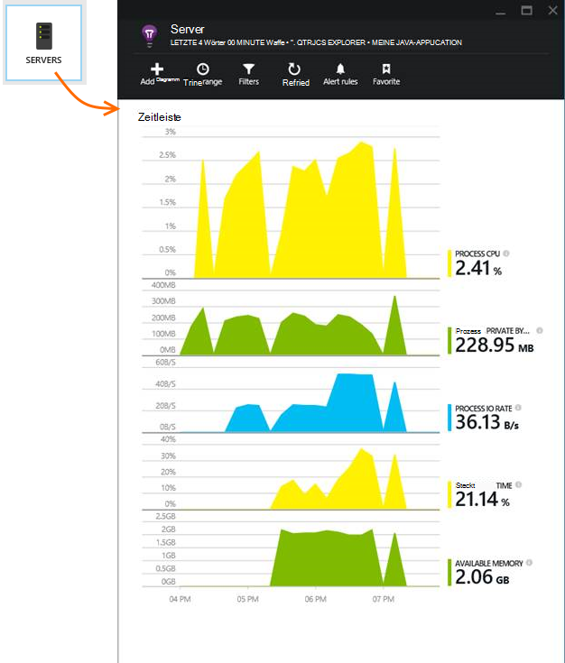
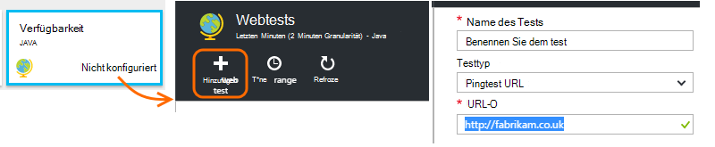

<properties 
    pageTitle="Erste Schritte mit Anwendung Einblicke mit Java in Eclipse" 
    description="Verwenden Sie die Eclipse plug-in Performance und Nutzung Ihrer Website Java-Anwendung zum Überwachen" 
    services="application-insights" 
    documentationCenter="java"
    authors="alancameronwills" 
    manager="douge"/>

<tags 
    ms.service="application-insights" 
    ms.workload="tbd" 
    ms.tgt_pltfrm="ibiza" 
    ms.devlang="na" 
    ms.topic="article" 
    ms.date="03/02/2016" 
    ms.author="awills"/>
 
# Erste Schritte mit Anwendung Einblicke mit Java in Eclipse

Application Insights SDK sendet Telemetrie aus Ihrer Anwendung Java Web, Auslastung und Performance analysieren. Eclipse plug-in für Application Insights installiert das SDK im Projekt, so dass Sie aus dem Feld Telemetrie plus eine API, mit denen Sie benutzerdefinierte Telemetrie schreiben.   

## Erforderliche Komponenten

Derzeit das plug-in arbeitet für Maven und dynamische Web-Projekte in Eclipse. ([Application Insights für andere Java-Projekt hinzufügen][java].)

Sie benötigen Folgendes:

* Oracle JRE 1.6 oder höher
* Ein [Microsoft Azure-](https://azure.microsoft.com/)Abonnement. (Sie können mit der [Testversion](https://azure.microsoft.com/pricing/free-trial/)beginnen.)
* [Eclipse-IDE für Java EE Entwickler](http://www.eclipse.org/downloads/)Indigo oder höher.
* Windows 7 oder höher oder WindowsServer 2008 oder höher

## Installieren Sie das SDK auf Eclipse (einmal)

Sie müssen nur einmal pro Computer durchführen. Durch diesen Schritt wird eine Toolkit, die dann das SDK Dynamic Web hinzufügen kann.

1. Klicken Sie in Eclipse auf Hilfe, neue Software installieren.

    

2. Das SDK ist in http://dl.windowsazure.com/eclipse unter Azure Toolkit. 
3. Deaktivieren Sie **Alle Update-Sites zu kontaktieren...**

    

Die verbleibenden Schritte für jede Java-Projekt.

## Erstellen Sie eine Ressource Anwendung Einblicke in Azure

1. Mit der [Azure-Portal](https://portal.azure.com)anmelden.
2. Erstellen Sie eine neue Application Insights-Ressource.  

      
3. Legen Sie den Anwendungstyp Java Web Application.  

      
4. Suchen Sie den instrumentationsschlüssel der neuen Ressource. Sie müssen dies in Kürze in das Codeprojekt einfügen.  

      

## Anwendung Erkenntnisse zu Ihrem Projekt hinzufügen

1. Anwendung Erkenntnisse aus dem Kontextmenü Java Webprojekt hinzufügen

    

2. Fügen Sie des Instrumentation-Schlüssels, den von Azure-Portal haben.

    

Der Schlüssel wird zusammen mit jedem Element der Telemetrie gesendet und Anwendung Einblicke in die Ressource angezeigt wird.

## Führen Sie die Anwendung und Metriken finden Sie unter

Die Anwendung auszuführen.

Zurück zu der Ressource Anwendung Einblicke in Microsoft Azure.

HTTP-Anfragen Daten werden auf die Übersicht angezeigt. (Wenn keine, warten Sie einige Sekunden und klicken Sie auf aktualisieren.)

 

Klicken Sie auf Diagramme detailliertere Kriterien anzeigen. 

[Erfahren Sie mehr über Metriken.][metrics]

 

Und beim Anzeigen der Eigenschaften einer Anforderung sehen Sie die Telemetrie-Ereignisse Ausnahmen wie Anfragen zugeordnet.
 

## Clientseitige Telemetrie

Das Blade Schnellstart klicken Sie auf Code abrufen, um Webseiten zu überwachen: 

Den Codeausschnitt im head-Bereich der HTML-Dateien einfügen.

#### Client-seitige Daten

Die aktualisierten Webseiten öffnen und verwenden. Warten ein oder zwei Minuten, dann wieder Anwendung Einblicke und Blade Verwendung öffnen. (Blatt Übersicht unten Sie und klicken Sie auf Verwendung)

Seite anzeigen, Benutzer und Sitzung-Metriken werden auf die Verwendung angezeigt:

[Weitere Informationen zum Einrichten von clientseitigen Telemetrie.][usage]

## Veröffentlichen Sie die Anwendung

Jetzt veröffentlichen Sie Ihre Anwendung auf dem Server können mit, und Überwachung der Telemetrie im Portal angezeigt.

* Stellen Sie sicher, dass die Firewall diese Ports Telemetriedaten senden kann:

 * DC.Services.VisualStudio.com:443
 * DC.Services.VisualStudio.com:80
 * F5.Services.VisualStudio.com:443
 * F5.Services.VisualStudio.com:80

* Auf Windows-Servern zu installieren:

 * [Microsoft Visual C++ Redistributable](http://www.microsoft.com/download/details.aspx?id=40784)

    (Diese kann Leistungsindikatoren.)

## Ausnahmen und fehlgeschlagene

Nicht behandelte Ausnahmen werden automatisch erfasst:

Datensammlung andere Ausnahmen haben Sie zwei Optionen:

* [Legen Sie TrackException im Code aufrufen](app-insights-api-custom-events-metrics.md#track-exception). 
* [Java-Agent auf dem Server installieren](app-insights-java-agent.md). Sie geben die Methoden, die Sie überwachen möchten.

## Überwachen von Methodenaufrufen und externe Faktoren

[Java-Agent installieren](app-insights-java-agent.md) sich interne Methoden und Anrufe über JDBC mit Daten angegeben.

## Leistungsindikatoren

Die Blade Übersicht unten und **Server** klicken. Sie sehen einen Bereich von Leistungsindikatoren.

### Sammlung von Leistungsindikatoren anpassen

Fügen Sie den folgenden Code unter dem Stammknoten der Datei ApplicationInsights.xml Auflistung der Standardsatz von Leistungsindikatoren um zu deaktivieren:

    <PerformanceCounters>
       <UseBuiltIn>False</UseBuiltIn>
    </PerformanceCounters>

### Zusätzliche Leistungsindikatoren sammeln

Sie können weitere Leistungsindikatoren gesammelt werden.

#### JMX-Indikatoren (verfügbar durch die Java Virtual Machine)

    <PerformanceCounters>
      <Jmx>
        <Add objectName="java.lang:type=ClassLoading" attribute="TotalLoadedClassCount" displayName="Loaded Class Count"/>
        <Add objectName="java.lang:type=Memory" attribute="HeapMemoryUsage.used" displayName="Heap Memory Usage-used" type="composite"/>
      </Jmx>
    </PerformanceCounters>

*   `displayName`– Der Name im Application Insights-Portal angezeigt.
*   `objectName`– Der JMX-Objektname.
*   `attribute`– Das Attribut des Objektnamens JMX abrufen
*   `type`(optional) – der Typ des Attributs JMX Objekts:
 *  Standard: einen einfachen Typ wie Int oder Long.
 *  `composite`: die Leistungsindikatorendaten werden im Format 'Attribut.Daten'
 *  `tabular`: die Leistungsindikatorendaten hat das Format einer Tabellenzeile

#### Windows-Leistungsindikatoren

Jeder [Windows-Leistungsindikator](https://msdn.microsoft.com/library/windows/desktop/aa373083.aspx) ist Mitglied einer Kategorie (auf die gleiche Weise ein Feld ist ein Member einer Klasse). Kategorien kann global oder nummeriert oder benannte Instanzen.

    <PerformanceCounters>
      <Windows>
        <Add displayName="Process User Time" categoryName="Process" counterName="%User Time" instanceName="__SELF__" />
        <Add displayName="Bytes Printed per Second" categoryName="Print Queue" counterName="Bytes Printed/sec" instanceName="Fax" />
      </Windows>
    </PerformanceCounters>

*   DisplayName-Application Insights-Portal angezeigte Name.
*   Kategoriename – die Leistungsindikatorkategorie (Leistungsobjekt) dieser Leistungsindikator zugeordnet ist.
*   CounterName – der Name des Leistungsindikators.
*   Instanzname – der Name der Kategorie Leistungsindikatorinstanz oder eine leere Zeichenfolge (""), wenn die Kategorie eine einzelne Instanz enthält. Bei CategoryName Prozess und sammeln möchten Leistungsindikator aus dem aktuellen JVM-Prozess auf dem Ihre Anwendung ausgeführt, `"__SELF__"`.

Die Leistungsindikatoren werden als benutzerdefinierte Messgrößen im [Metrik-Explorer][metrics].

### UNIX-Leistungsindikatoren

* Eine Vielzahl von Daten und [reststoffe mit Application Insights-Plugin installieren](app-insights-java-collectd.md) .

## Verfügbarkeit von Webtests

Anwendung Einblicke Testen Ihre Website regelmäßig zu überprüfen, die es gut reagiert. [Zum Einrichten von][availability], Bildlauf auf Verfügbarkeit.

Erhalten Sie Diagramme, die Reaktionszeit sowie e-Mail-Benachrichtigungen fällt der Site.

[Informationen Sie über Verfügbarkeit von Webtests.][availability] 

## Diagnoseprotokolle

Verwenden Sie Logback oder Log4J (1.2 oder v2. 0) für die Protokollierung, können Sie die Ablaufverfolgungsprotokolle Anwendung Erkenntnisse können Sie durchsuchen und suchen Sie automatisch gesendet.

[Erfahren Sie mehr über Diagnoseprotokolle][javalogs]

## Benutzerdefinierte Telemetrie 

Legen Sie ein paar Codezeilen in Java Webtests, was Benutzer mit oder Probleme diagnostizieren. 

Sie können sowohl in Webseite JavaScript serverseitige Java Code einfügen.

[Erfahren Sie mehr über benutzerdefinierte Telemetrie][track]

## Nächste Schritte

#### Erkennung und diagnose von Problemen

* [Hinzufügen von Web Client Telemetrie] [ usage] zu Leistung Telemetrie über den WebClient.
* [Einrichten von Webtests] [ availability] um sicherzustellen, dass Ihre Anwendung bleibt live und Reaktionsfähigkeit.
* [Suchen von Ereignissen und Protokollen] [ diagnostic] Probleme diagnostizieren.
* [Log4J oder Logback-Traces erfassen][javalogs]

#### Nutzung nachverfolgen

* [Hinzufügen von Web Client Telemetrie] [ usage] Monitor Seitenansichten und grundlegenden Metriken.
* [Nachverfolgen von benutzerdefinierten Ereignissen und Metriken] [ track] zu lernen, wie die Anwendung sowohl auf dem Client und dem Server verwendet wird.

<!--Link references-->

[availability]: app-insights-monitor-web-app-availability.md
[diagnostic]: app-insights-diagnostic-search.md
[java]: app-insights-java-get-started.md
[javalogs]: app-insights-java-trace-logs.md
[metrics]: app-insights-metrics-explorer.md
[track]: app-insights-api-custom-events-metrics.md
[usage]: app-insights-web-track-usage.md

 