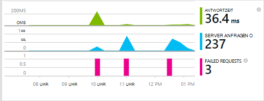
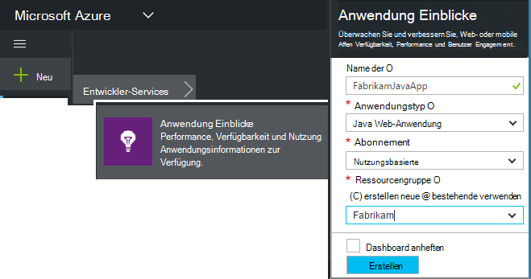
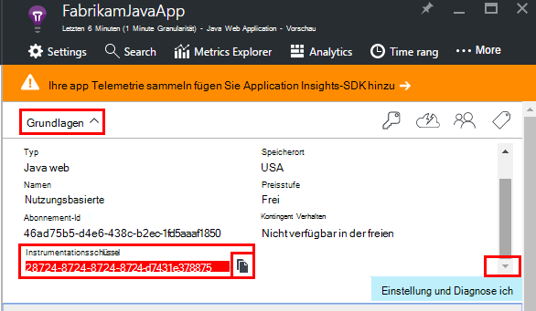
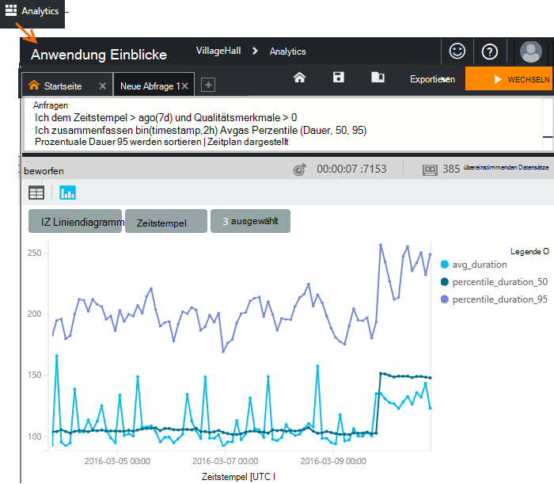
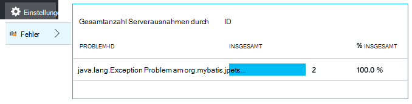
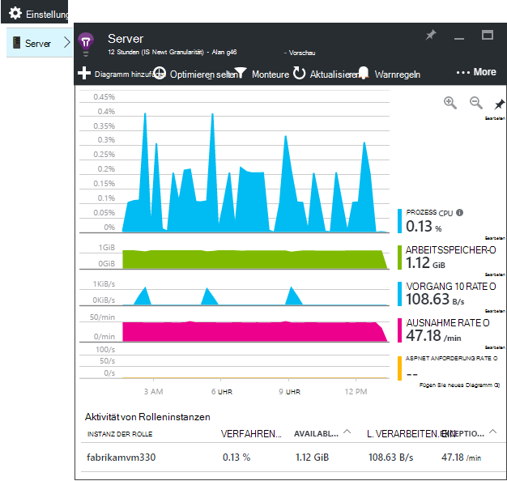
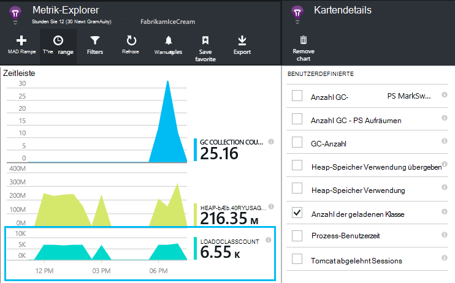
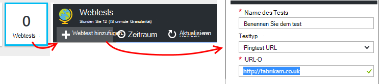
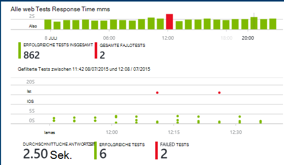

<properties
    pageTitle="Java Web app Analytics Anwendung Einblicke | Microsoft Azure"
    description="Überwachen Sie Leistung und Verwendung Ihrer Website Java-Anwendung zum. "
    services="application-insights"
    documentationCenter="java"
    authors="alancameronwills"
    manager="douge"/>

<tags
    ms.service="application-insights"
    ms.workload="tbd"
    ms.tgt_pltfrm="ibiza"
    ms.devlang="na"
    ms.topic="get-started-article"
    ms.date="08/17/2016"
    ms.author="awills"/>

# In einem Webprojekt Java-Anwendung zum Einstieg

*Anwendung Informationen ist in der Vorschau.*

[AZURE.INCLUDE [app-insights-selector-get-started](../../includes/app-insights-selector-get-started.md)]

[Application Insights](https://azure.microsoft.com/services/application-insights/) ist ein erweiterbares Analytics Dienst, der Leistung und Auslastung der aktiven Anwendung. [Erkennung und diagnose von Performance-Problemen und Ausnahmen](app-insights-detect-triage-diagnose.md)und [Code schreiben,] verwenden[ api] auf Benutzeraktivitäten mit Ihrer Anwendung.

Application Insights unterstützt Java apps auf Linux, Unix oder Windows ausgeführt.

Du brauchst:

* Oracle JRE 1.6 oder höher oder Zulu JRE 1.6 oder höher
* Ein [Microsoft Azure-](https://azure.microsoft.com/)Abonnement. (Sie können mit der [Testversion](https://azure.microsoft.com/pricing/free-trial/)beginnen.)

*Haben Sie eine Webanwendung, die bereits aktiv ist, können Sie das alternative Verfahren [SDK zur Laufzeit auf dem Webserver](app-insights-java-live.md)hinzufügen folgen Diese Alternative vermeidet den Code neu, aber Sie erhalten nicht die Möglichkeit, Code schreiben, um Benutzeraktivitäten zu verfolgen.*

## 1. einen Anwendung Einblicke instrumentationsschlüssel abrufen

1. Mit [Microsoft Azure-Portal](https://portal.azure.com)anmelden.
2. Erstellen einer Application Insights-Ressource. Legen Sie den Anwendungstyp Java Web Application.

    
4. Suchen Sie den instrumentationsschlüssel der neuen Ressource. Sie müssen diesen Schlüssel kurz in das Codeprojekt einfügen.

    

## 2. Anwendung Einblicke SDK für Java dem Projekt hinzufügen

*Wählen Sie entsprechend für Ihr Projekt.*

#### Verwenden Sie Eclipse Maven oder dynamische Web-Projekt erstellen...

Verwenden Sie [Application Insights-SDK für Java-Plug-in][eclipse].

#### Verwenden Sie Maven...

Wenn das Projekt bereits eingerichtet Maven Build mit Zusammenführen Sie den folgenden Code in die Datei pom.xml.

Aktualisieren Sie Project Dependencies zu Binärdateien heruntergeladen.

    <repositories>
       <repository>
          <id>central</id>
          <name>Central</name>
          <url>http://repo1.maven.org/maven2</url>
       </repository>
    </repositories>

    <dependencies>
      <dependency>
        <groupId>com.microsoft.azure</groupId>
        <artifactId>applicationinsights-web</artifactId>
        <!-- or applicationinsights-core for bare API -->
        <version>[1.0,)</version>
      </dependency>
    </dependencies>

* *Build oder Prüfsumme Validierungsfehler?* Verwenden Sie eine bestimmte Version wie: `<version>1.0.n</version>`. Die neueste Version finden in der [SDK-Versionshinweisen](https://github.com/Microsoft/ApplicationInsights-Java#release-notes) oder unsere [Maven Artefakte](http://search.maven.org/#search%7Cga%7C1%7Capplicationinsights).
* *Möchten Sie ein neues SDK aktualisieren?* Aktualisieren des Projekts abhängig.

#### Wenn Sie Gradle verwenden.

Wenn das Projekt bereits eingerichtet Gradle Build mit Zusammenführen Sie den folgenden Code in die Datei build.gradle.

Project Dependencies Binärdateien heruntergeladen zu aktualisieren.

    repositories {
      mavenCentral()
    }

    dependencies {
      compile group: 'com.microsoft.azure', name: 'applicationinsights-web', version: '1.+'
      // or applicationinsights-core for bare API
    }

* *Erstellen oder Prüfsumme Validierung Fehler? Verwenden Sie eine bestimmte Version wie:* `version:'1.0.n'`. *Die neueste Version finden Sie in der [SDK-Versionsinformationen](https://github.com/Microsoft/ApplicationInsights-Java#release-notes).*
* *Ein neues SDK aktualisieren*
 * Aktualisieren des Projekts abhängig.

#### Andernfalls...

Das SDK manuell hinzufügen:

1. [Application Insights SDK für Java](https://aka.ms/aijavasdk)herunterladen
2. Extrahieren Sie die Binärdateien aus der Zip-Datei und dem Projekt hinzugefügt.

### Fragen...

* *Was ist die Beziehung zwischen dem `-core` und `-web` Komponenten im Zip?*

 * `applicationinsights-core`bietet bare API. Brauchen Sie diese Komponente.
 * `applicationinsights-web`können Sie Metriken, die Anzahl der HTTP-Anforderung und Reaktionszeiten zu verfolgen. Diese Komponente kann weggelassen werden, wenn Sie nicht, dass diese automatisch gesammelten Telemetriedaten möchten. Beispielsweise möchten Sie schreiben Ihre eigenen.

* *Das SDK Update veröffentlicht wird*
 * Neueste [Application Insights-SDK für Java](https://aka.ms/qqkaq6) downloaden und die alten zu ersetzen.
 * Änderungen werden in den [Versionshinweisen SDK](https://github.com/Microsoft/ApplicationInsights-Java#release-notes)beschrieben.

## 3. Hinzufügen von Application Insights XML-Datei

Fügen Sie ApplicationInsights.xml Ressourcen-Ordner in Ihrem Projekt hinzu oder sicherstellen Sie, dass das Projekt Bereitstellungspfad Klasse hinzugefügt wird. Kopieren Sie das folgende XML hinein.

Ersetzen Sie den instrumentationsschlüssel, den von Azure-Portal haben.

    <?xml version="1.0" encoding="utf-8"?>
    <ApplicationInsights xmlns="http://schemas.microsoft.com/ApplicationInsights/2013/Settings" schemaVersion="2014-05-30">

      <!-- The key from the portal: -->

      <InstrumentationKey>** Your instrumentation key **</InstrumentationKey>

      <!-- HTTP request component (not required for bare API) -->

      <TelemetryModules>
        <Add type="com.microsoft.applicationinsights.web.extensibility.modules.WebRequestTrackingTelemetryModule"/>
        <Add type="com.microsoft.applicationinsights.web.extensibility.modules.WebSessionTrackingTelemetryModule"/>
        <Add type="com.microsoft.applicationinsights.web.extensibility.modules.WebUserTrackingTelemetryModule"/>
      </TelemetryModules>

      <!-- Events correlation (not required for bare API) -->
      <!-- These initializers add context data to each event -->

      <TelemetryInitializers>
        <Add   type="com.microsoft.applicationinsights.web.extensibility.initializers.WebOperationIdTelemetryInitializer"/>
        <Add type="com.microsoft.applicationinsights.web.extensibility.initializers.WebOperationNameTelemetryInitializer"/>
        <Add type="com.microsoft.applicationinsights.web.extensibility.initializers.WebSessionTelemetryInitializer"/>
        <Add type="com.microsoft.applicationinsights.web.extensibility.initializers.WebUserTelemetryInitializer"/>
        <Add type="com.microsoft.applicationinsights.web.extensibility.initializers.WebUserAgentTelemetryInitializer"/>

      </TelemetryInitializers>
    </ApplicationInsights>

* Instrumentationsschlüssel zusammen mit jedem Element der Telemetrie gesendet und Anwendung Einblicke in die Ressource angezeigt wird.
* Die Komponente HTTP-Anforderung ist optional. Telemetriedaten zu Anfragen und Reaktionszeiten wird automatisch an das Portal gesendet.
* Korrelation von Ereignissen ist eine Erweiterung der HTTP-Anforderung Komponente. Jede Anforderung vom Server empfangenen Bezeichner zugewiesen, und dieser Bezeichner für jedes Element der Telemetrie als Eigenschaft 'Operation.Id' als Eigenschaft hinzugefügt. Können durch Setzen von Filtern in [Diagnose Suche]jeder Anforderung zugeordnete Telemetrie korrelieren[diagnostic].
* Anwendung Einsichten Schlüssel dynamisch von Azure-Portal als Systemeigenschaft übergeben werden kann (-DAPPLICATION_INSIGHTS_IKEY = Your_ikey). Wenn keine Eigenschaft definiert ist, überprüft Umgebungsvariablen (APPLICATION_INSIGHTS_IKEY) im Azure App. Wenn die Eigenschaften nicht definiert sind, wird der Standardwert InstrumentationKey von ApplicationInsights.xml verwendet. Diese Sequenz können Sie verschiedene InstrumentationKeys für verschiedene umge bungen dynamisch verwaltet.

### Alternativen für die Instrumentation festlegen

Application Insights-SDK sieht für den Schlüssel in dieser Reihenfolge:

1. Systemeigenschaft:-DAPPLICATION_INSIGHTS_IKEY = Your_ikey
2. Umgebungsvariable: APPLICATION_INSIGHTS_IKEY
3. Datei: ApplicationInsights.xml

Sie können auch [im Code festlegen](app-insights-api-custom-events-metrics.md#ikey):

    telemetryClient.InstrumentationKey = "...";

## 4. Fügen Sie einen HTTP-filter

Der letzte Konfigurationsschritt ermöglicht die HTTP-Anforderung Komponente sich jeder Webanfrage. (Nicht erforderlich bei bare API möchte.)

Öffnen der Datei web.xml in Ihrem Projekt und den folgenden Code unter dem Knoten Web app bei der Anwendungsfilter Konfiguration zusammenführen.

Um möglichst genaue Ergebnisse zu erhalten, sollten Filter vor alle anderen Filter zugeordnet.

    <filter>
      <filter-name>ApplicationInsightsWebFilter</filter-name>
      <filter-class>
        com.microsoft.applicationinsights.web.internal.WebRequestTrackingFilter
      </filter-class>
    </filter>
    <filter-mapping>
       <filter-name>ApplicationInsightsWebFilter</filter-name>
       <url-pattern>/*</url-pattern>
    </filter-mapping>

#### Verwenden Sie Feder Web MVC 3.1 oder höher

Bearbeiten Sie diese Elemente der Anwendung Einblicke Paket:

    <context:component-scan base-package=" com.springapp.mvc, com.microsoft.applicationinsights.web.spring"/>

    <mvc:interceptors>
        <mvc:interceptor>
            <mvc:mapping path="/**"/>
            <bean class="com.microsoft.applicationinsights.web.spring.RequestNameHandlerInterceptorAdapter" />
        </mvc:interceptor>
    </mvc:interceptors>

#### Verwenden Sie streben 2

Fügen Sie zur Konfigurationsdatei streben (in der Regel mit dem Namen struts.xml oder default.xml streben hinzu):

     <interceptors>
       <interceptor name="ApplicationInsightsRequestNameInterceptor" class="com.microsoft.applicationinsights.web.struts.RequestNameInterceptor" />
     </interceptors>
     <default-interceptor-ref name="ApplicationInsightsRequestNameInterceptor" />

(Wenn Interceptors in einem Stapel Standard definiert haben, kann der Interceptor einfach Stapel hinzugefügt werden.)

## 5. Führen Sie 5. die Anwendung

Im Debug-Modus auf dem Entwicklungscomputer ausführen oder auf dem Server veröffentlichen.

## 6. der Telemetrie in Application Insights anzeigen

Zurück zu der Ressource Anwendung Einblicke in [Microsoft Azure-Portal](https://portal.azure.com).

HTTP-Daten Anfragen auf die Übersicht. (Wenn keine, warten Sie einige Sekunden und klicken Sie auf aktualisieren.)

[Erfahren Sie mehr über Metriken.][metrics]

Klicken Sie auf jedes Diagramms detailliertere aggregierte Metriken anzuzeigen.

> Application Insights nimmt an, dass das Format der HTTP-Anfragen für MVC Applications: `VERB controller/action`. Beispielsweise `GET Home/Product/f9anuh81`, `GET Home/Product/2dffwrf5` und `GET Home/Product/sdf96vws` gruppiert sind `GET Home/Product`. Diese Gruppierung kann sinnvolle Aggregationen Anfragen wie Anfragen und durchschnittliche Ausführungszeit für Anfragen.

### Daten 

Klicken Sie auf ein Anfrage an einzelne Instanzen. 

Zwei Arten von Daten werden in Anwendung Einblicke: aggregierte Daten gespeichert und als Mittelwerte, Zahlen und Summen; und Instanzdaten - einzelner Berichte der HTTP-Anfragen, Ausnahmen, Seitenansichten und benutzerdefinierte Ereignisse.

Beim Anzeigen der Eigenschaften einer Anforderung können Anfragen wie Ausnahmen zugeordneten Telemetrie-Ereignisse anzeigen

### Analytics: Leistungsfähige Abfragesprache

Wie Sie mehr Daten sammeln, können Sie sowohl Daten und Einzelfällen Abfragen ausführen. [Analytics]() ist ein leistungsfähiges Tool für Grundlegendes zu Leistung und Auslastung und zu Diagnosezwecken.

## 7. installieren Sie 7. Ihre Anwendung auf dem server

Jetzt veröffentlichen Sie Ihre Anwendung auf dem Server können mit, und Überwachung der Telemetrie im Portal angezeigt.

* Stellen Sie sicher, dass die Firewall diese Ports Telemetriedaten senden kann:

 * DC.Services.VisualStudio.com:443
 * F5.Services.VisualStudio.com:443

* Auf Windows-Servern zu installieren:

 * [Microsoft Visual C++ Redistributable](http://www.microsoft.com/download/details.aspx?id=40784)

    (Diese Komponente kann Leistungsindikatoren.)

## Ausnahmen und fehlgeschlagene

Nicht behandelte Ausnahmen werden automatisch erfasst:

Datensammlung andere Ausnahmen haben Sie zwei Optionen:

* [Aufrufe von Trackexception()"in den Code einfügen][apiexceptions]. 
* [Java-Agent auf dem Server installieren](app-insights-java-agent.md). Sie geben die Methoden, die Sie überwachen möchten.

## Überwachen von Methodenaufrufen und externe Faktoren

[Java-Agent installieren](app-insights-java-agent.md) sich interne Methoden und Anrufe über JDBC mit Daten angegeben.

## Leistungsindikatoren

Öffnen Sie **Einstellungen**, **Server**, um eine Reihe von Leistungsindikatoren.

### Sammlung von Leistungsindikatoren anpassen

Fügen Sie den folgenden Code unter dem Stammknoten der Datei ApplicationInsights.xml Auflistung der Standardsatz von Leistungsindikatoren um zu deaktivieren:

    <PerformanceCounters>
       <UseBuiltIn>False</UseBuiltIn>
    </PerformanceCounters>

### Zusätzliche Leistungsindikatoren sammeln

Sie können weitere Leistungsindikatoren gesammelt werden.

#### JMX-Indikatoren (verfügbar durch die Java Virtual Machine)

    <PerformanceCounters>
      <Jmx>
        <Add objectName="java.lang:type=ClassLoading" attribute="TotalLoadedClassCount" displayName="Loaded Class Count"/>
        <Add objectName="java.lang:type=Memory" attribute="HeapMemoryUsage.used" displayName="Heap Memory Usage-used" type="composite"/>
      </Jmx>
    </PerformanceCounters>

*   `displayName`– Der Name im Application Insights-Portal angezeigt.
*   `objectName`– Der JMX-Objektname.
*   `attribute`– Das Attribut des Objektnamens JMX abrufen
*   `type`(optional) – der Typ des Attributs JMX Objekts:
 *  Standard: einen einfachen Typ wie Int oder Long.
 *  `composite`: die Leistungsindikatorendaten werden im Format 'Attribut.Daten'
 *  `tabular`: die Leistungsindikatorendaten hat das Format einer Tabellenzeile

#### Windows-Leistungsindikatoren

Jeder [Windows-Leistungsindikator](https://msdn.microsoft.com/library/windows/desktop/aa373083.aspx) ist Mitglied einer Kategorie (auf die gleiche Weise ein Feld ist ein Member einer Klasse). Kategorien kann global oder nummeriert oder benannte Instanzen.

    <PerformanceCounters>
      <Windows>
        <Add displayName="Process User Time" categoryName="Process" counterName="%User Time" instanceName="__SELF__" />
        <Add displayName="Bytes Printed per Second" categoryName="Print Queue" counterName="Bytes Printed/sec" instanceName="Fax" />
      </Windows>
    </PerformanceCounters>

*   DisplayName-Application Insights-Portal angezeigte Name.
*   Kategoriename – die Leistungsindikatorkategorie (Leistungsobjekt) dieser Leistungsindikator zugeordnet ist.
*   CounterName – der Name des Leistungsindikators.
*   Instanzname – der Name der Kategorie Leistungsindikatorinstanz oder eine leere Zeichenfolge (""), wenn die Kategorie eine einzelne Instanz enthält. Bei CategoryName Prozess und sammeln möchten Leistungsindikator aus dem aktuellen JVM-Prozess auf dem Ihre Anwendung ausgeführt, `"__SELF__"`.

Die Leistungsindikatoren werden als benutzerdefinierte Messgrößen im [Metrik-Explorer][metrics].

### UNIX-Leistungsindikatoren

* Eine Vielzahl von Daten und [reststoffe mit Application Insights-Plugin installieren](app-insights-java-collectd.md) .

## Benutzer und Sitzung Daten

OK, senden Sie Telemetrie vom Webserver. Jetzt können zu 360 Grad-Ansicht der Anwendung Überwachung hinzufügen:

* [Telemetrie zu Ihren Webseiten hinzufügen] [ usage] Monitor Seitenansichten und Benutzer Metriken.
* [Einrichten von Webtests] [ availability] um sicherzustellen, dass Ihre Anwendung bleibt live und Reaktionsfähigkeit.

## Protokoll-Traces erfassen

Anwendung Einblicke können in Slices und Würfel Protokolle von Log4J, Logback oder anderen Frameworks anmelden. Sie können die Protokolle HTTP-Anfragen und andere Telemetrie entsprechen. [Erfahren Sie, wie][javalogs].

## Eigene Telemetriedaten senden

Installation des SDK können API Sie eigene Telemetriedaten senden.

* [Nachverfolgen von benutzerdefinierten Ereignissen und Metriken] [ api] zu tun Benutzer mit Ihrer Anwendung.
* [Suchen von Ereignissen und Protokollen] [ diagnostic] Probleme diagnostizieren.

## Verfügbarkeit von Webtests

Anwendung Einblicke Testen Ihre Website regelmäßig zu überprüfen, die es gut reagiert. [Zum Einrichten von][availability], klicken Sie auf Webtests.

Erhalten Sie Diagramme, die Reaktionszeit sowie e-Mail-Benachrichtigungen fällt der Site.

[Informationen Sie über Verfügbarkeit von Webtests.][availability] 

## Haben Sie Fragen? Probleme?

[Problembehandlung bei Java](app-insights-java-troubleshoot.md)

## Nächste Schritte

Weitere Informationen finden Sie unter [Java Developer Center](/develop/java/).

<!--Link references-->

[api]: app-insights-api-custom-events-metrics.md
[apiexceptions]: app-insights-api-custom-events-metrics.md#track-exception
[availability]: app-insights-monitor-web-app-availability.md
[diagnostic]: app-insights-diagnostic-search.md
[eclipse]: app-insights-java-eclipse.md
[javalogs]: app-insights-java-trace-logs.md
[metrics]: app-insights-metrics-explorer.md
[usage]: app-insights-web-track-usage.md
