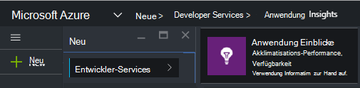
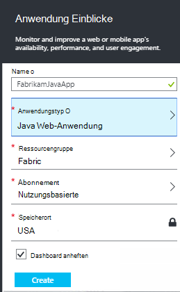
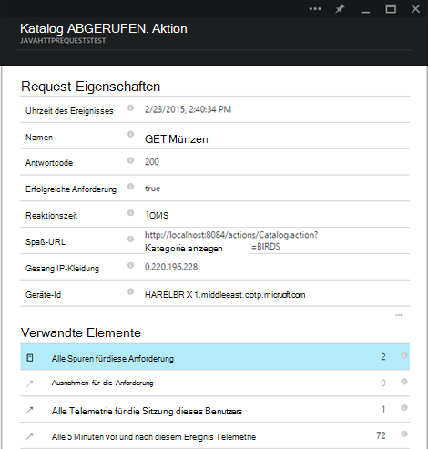

<properties 
    pageTitle="Anwendung Einblicke für Java webapps bereits live" 
    description="Starten Sie die Überwachung einer Anwendung, die bereits auf dem Server ausgeführt wird" 
    services="application-insights" 
    documentationCenter="java"
    authors="alancameronwills" 
    manager="douge"/>

<tags 
    ms.service="application-insights" 
    ms.workload="tbd" 
    ms.tgt_pltfrm="ibiza" 
    ms.devlang="na" 
    ms.topic="article" 
    ms.date="08/24/2016" 
    ms.author="awills"/>
 
# Anwendung Einblicke für Java webapps bereits live

*Anwendung Informationen ist in der Vorschau.*

Haben Sie eine Anwendung, die bereits auf dem J2EE-Server ausgeführt wird, können Sie beginnen, ohne Code ändern oder das Projekt kompilieren [Anwendung](app-insights-overview.md) zum Überwachen. Mit dieser Option erhalten Sie Informationen über HTTP-Anfragen an die Server nicht behandelte Ausnahmen und Leistungsindikatoren.

Sie benötigen ein [Microsoft Azure-](https://azure.com)Abonnement.

> [AZURE.NOTE] Die Schritte auf dieser Seite hinzugefügt Ihrer Anwendung zur Laufzeit SDK. Diese Laufzeitinstrumentation ist nützlich, wenn Sie nicht zum Aktualisieren oder Neuerstellen von Quellcode. Sie können wir empfehlen Ihnen jedoch [das SDK zum Quellcode hinzufügen](app-insights-java-get-started.md) stattdessen. Das gibt Ihnen mehr Optionen wie Code schreiben Benutzeraktivität nachverfolgen.

## 1. einen Anwendung Einblicke instrumentationsschlüssel abrufen

1. [Microsoft Azure-Portal](https://portal.azure.com) anmelden
2. Erstellen einer neuen Application Insights-Ressource

    
3. Legen Sie den Anwendungstyp Java Web Application.

    
4. Suchen Sie den instrumentationsschlüssel der neuen Ressource. Sie müssen diesen Schlüssel kurz in das Codeprojekt einfügen.

    

## 2. Laden Sie das SDK

1. [Application Insights SDK für Java](https://aka.ms/aijavasdk)herunterladen 
2. Entpacken Sie auf dem Server SDK in das Verzeichnis, aus dem die Projektbinärdateien geladen werden. Wenn Sie Tomcat verwenden, wäre dieses Verzeichnis in der Regel unter`webapps\<your_app_name>\WEB-INF\lib`

## 3. Hinzufügen von Application Insights XML-Datei

Erstellen Sie ApplicationInsights.xml im Ordner SDK hinzugefügt. Setzen sie den folgenden XML-Code.

Ersetzen Sie den instrumentationsschlüssel, den von Azure-Portal haben.

    <?xml version="1.0" encoding="utf-8"?>
    <ApplicationInsights xmlns="http://schemas.microsoft.com/ApplicationInsights/2013/Settings" schemaVersion="2014-05-30">

      <!-- The key from the portal: -->

      <InstrumentationKey>** Your instrumentation key **</InstrumentationKey>

      <!-- HTTP request component (not required for bare API) -->

      <TelemetryModules>
        <Add type="com.microsoft.applicationinsights.web.extensibility.modules.WebRequestTrackingTelemetryModule"/>
        <Add type="com.microsoft.applicationinsights.web.extensibility.modules.WebSessionTrackingTelemetryModule"/>
        <Add type="com.microsoft.applicationinsights.web.extensibility.modules.WebUserTrackingTelemetryModule"/>
      </TelemetryModules>

      <!-- Events correlation (not required for bare API) -->
      <!-- These initializers add context data to each event -->

      <TelemetryInitializers>
        <Add   type="com.microsoft.applicationinsights.web.extensibility.initializers.WebOperationIdTelemetryInitializer"/>
        <Add type="com.microsoft.applicationinsights.web.extensibility.initializers.WebOperationNameTelemetryInitializer"/>
        <Add type="com.microsoft.applicationinsights.web.extensibility.initializers.WebSessionTelemetryInitializer"/>
        <Add type="com.microsoft.applicationinsights.web.extensibility.initializers.WebUserTelemetryInitializer"/>
        <Add type="com.microsoft.applicationinsights.web.extensibility.initializers.WebUserAgentTelemetryInitializer"/>

      </TelemetryInitializers>
    </ApplicationInsights>

* Instrumentationsschlüssel zusammen mit jedem Element der Telemetrie gesendet und Anwendung Einblicke in die Ressource angezeigt wird.
* Die Komponente HTTP-Anforderung ist optional. Telemetriedaten zu Anfragen und Reaktionszeiten wird automatisch an das Portal gesendet.
* Korrelation von Ereignissen ist eine Erweiterung der HTTP-Anforderung Komponente. Jede Anforderung vom Server empfangenen Bezeichner zugewiesen, und dieser Bezeichner für jedes Element der Telemetrie als Eigenschaft 'Operation.Id' als Eigenschaft hinzugefügt. Sie können Sie durch Setzen von Filtern in [Diagnose Suche](app-insights-diagnostic-search.md)jeder Anforderung zugeordnete Telemetrie korrelieren.

## 4. Fügen Sie einen HTTP-filter

Öffnen Sie die Datei web.xml im Projekt und Zusammenführen Sie den folgenden Codeausschnitt unter Web app Knoten, in dem der Anwendungsfilter konfiguriert werden.

Um möglichst genaue Ergebnisse zu erhalten, sollten Filter vor alle anderen Filter zugeordnet.

    <filter>
      <filter-name>ApplicationInsightsWebFilter</filter-name>
      <filter-class>
        com.microsoft.applicationinsights.web.internal.WebRequestTrackingFilter
      </filter-class>
    </filter>
    <filter-mapping>
       <filter-name>ApplicationInsightsWebFilter</filter-name>
       <url-pattern>/*</url-pattern>
    </filter-mapping>

## 5. Überprüfen Sie 5. Firewallausnahmen

Sie müssen [Ausnahmen für ausgehende Daten](app-insights-ip-addresses.md)festgelegt.

## 6. Starten Sie Ihrer Anwendung

## 7. Ihre Telemetrie in Application Insights anzeigen

Zurück zu der Ressource Anwendung Einblicke in [Microsoft Azure-Portal](https://portal.azure.com).

Telemetriedaten zu HTTP-Anfragen auf die Übersicht wird angezeigt. (Wenn keine, warten Sie einige Sekunden und klicken Sie auf aktualisieren.)

 

Klicken Sie auf Diagramme detailliertere Kriterien anzeigen. 

 

Und beim Anzeigen der Eigenschaften einer Anforderung sehen Sie die Telemetrie-Ereignisse Ausnahmen wie Anfragen zugeordnet.
 

[Erfahren Sie mehr über Metriken.](app-insights-metrics-explorer.md)

## Nächste Schritte

* Monitor Seitenansichten und Benutzer Metriken [Telemetrie zu Ihren Webseiten hinzufügen](app-insights-web-track-usage.md) .
* Um sicherzustellen, dass Ihre Anwendung bleibt, live und Reaktionsfähigkeit [Webtests einrichten](app-insights-monitor-web-app-availability.md) .
* [Protokoll-Traces erfassen](app-insights-java-trace-logs.md)
* [Suche Ereignisse und Protokolle](app-insights-diagnostic-search.md) zu diagnostizieren.

 
