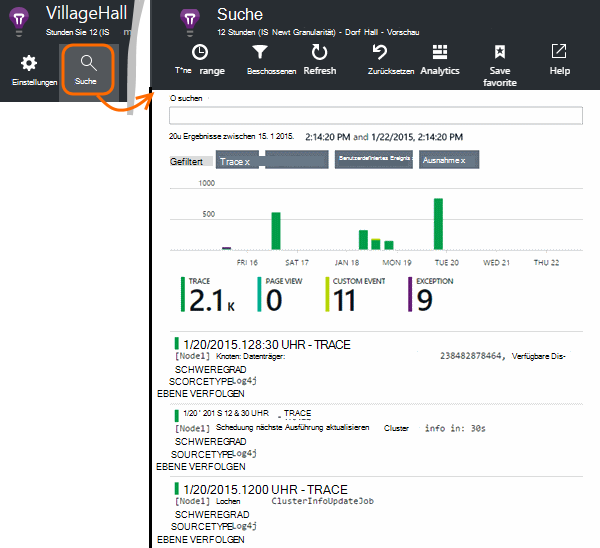

<properties 
    pageTitle="Durchsuchen Sie Java-Anwendung Einblicke Ablaufverfolgungsprotokolle" 
    description="Suche Log4J oder Logback Spuren Anwendung Erkenntnisse" 
    services="application-insights" 
    documentationCenter="java"
    authors="alancameronwills" 
    manager="douge"/>

<tags 
    ms.service="application-insights" 
    ms.workload="tbd" 
    ms.tgt_pltfrm="ibiza" 
    ms.devlang="na" 
    ms.topic="article" 
    ms.date="07/12/2016" 
    ms.author="awills"/>

# Durchsuchen Sie Java-Anwendung Einblicke Ablaufverfolgungsprotokolle

Verwenden Sie Logback oder Log4J (1.2 oder v2. 0) für die Protokollierung, können Sie die Ablaufverfolgungsprotokolle Anwendung Erkenntnisse können Sie durchsuchen und suchen Sie automatisch gesendet.

Installieren Sie [Application Insights-SDK für Java][java], wenn Sie dies bereits getan haben.

## Protokollierung Bibliotheken zum Projekt hinzufügen

*Wählen Sie entsprechend für Ihr Projekt.*

#### Verwenden Sie Maven...

Zusammenführen Sie Projekt bereits eingerichtet Maven Build mit einer der folgenden Codeausschnitte in Ihre pom.xml Datei.

Dependencies Projekt heruntergeladen Binärdateien zu aktualisieren.

*Logback*

    <dependencies>
       <dependency>
          <groupId>com.microsoft.azure</groupId>
          <artifactId>applicationinsights-logging-logback</artifactId>
          <version>[1.0,)</version>
       </dependency>
    </dependencies>

*Log4J v2. 0*

    <dependencies>
       <dependency>
          <groupId>com.microsoft.azure</groupId>
          <artifactId>applicationinsights-logging-log4j2</artifactId>
          <version>[1.0,)</version>
       </dependency>
    </dependencies>

*Log4J v1. 2*

    <dependencies>
       <dependency>
          <groupId>com.microsoft.azure</groupId>
          <artifactId>applicationinsights-logging-log4j1_2</artifactId>
          <version>[1.0,)</version>
       </dependency>
    </dependencies>

#### Wenn Sie Gradle verwenden.

Wenn das Projekt bereits eingerichtet Build mit Gradle hinzufügen eine der folgenden Zeilen der `dependencies` im build.gradle-Datei:

Dependencies Projekt heruntergeladen Binärdateien zu aktualisieren.

**Logback**

    compile group: 'com.microsoft.azure', name: 'applicationinsights-logging-logback', version: '1.0.+'

**Log4J v2. 0**

    compile group: 'com.microsoft.azure', name: 'applicationinsights-logging-log4j2', version: '1.0.+'

**Log4J v1. 2**

    compile group: 'com.microsoft.azure', name: 'applicationinsights-logging-log4j1_2', version: '1.0.+'

#### Andernfalls...

Herunterladen Sie und extrahieren Sie der entsprechenden Appender und fügen Sie die entsprechende Bibliothek zum Projekt hinzu:

Protokollierung | Herunterladen | Bibliothek
----|----|----
Logback|[SDK mit Logback appender](https://aka.ms/xt62a4)|Applicationinsights protokollieren logback
Log4J v2. 0|[SDK mit Log4J v2 appender](https://aka.ms/qypznq)|Applicationinsights protokollieren log4j2 
Log4j v1. 2|[SDK mit Log4J 1.2 appender](https://aka.ms/ky9cbo)|Applicationinsights protokollieren log4j1_2 

## Die Appender der Protokollierung Rahmen hinzufügen

Starten der erste Spuren Zusammenführen Sie wichtigen kleinen Codeabschnitt, der Konfigurationsdatei Log4J oder Logback: 

*Logback*

    <appender name="aiAppender" 
      class="com.microsoft.applicationinsights.logback.ApplicationInsightsAppender">
    </appender>
    <root level="trace">
      <appender-ref ref="aiAppender" />
    </root>

*Log4J v2. 0*

    <Configuration packages="com.microsoft.applicationinsights.Log4j">
      <Appenders>
        <ApplicationInsightsAppender name="aiAppender" />
      </Appenders>
      <Loggers>
        <Root level="trace">
          <AppenderRef ref="aiAppender"/>
        </Root>
      </Loggers>
    </Configuration>

*Log4J v1. 2*

    <appender name="aiAppender" 
         class="com.microsoft.applicationinsights.log4j.v1_2.ApplicationInsightsAppender">
    </appender>
    <root>
      <priority value ="trace" />
      <appender-ref ref="aiAppender" />
    </root>

Appender Anwendung Einblicke können von konfigurierten Protokollierung und nicht von der Stamm-Protokollierung verwiesen werden (Siehe den obigen Codebeispielen).

## Ihre Spuren im Application Insights-Portal durchsuchen

Damit das Projekt Spuren an Application Insights senden konfiguriert haben, können Sie anzeigen und suchen Sie diese Spuren im Portal Anwendung Einblicke in die [Suche] [ diagnostic] Blade.

## Nächste Schritte

[Diagnose suchen][diagnostic]

<!--Link references-->

[diagnostic]: app-insights-diagnostic-search.md
[java]: app-insights-java-get-started.md

 
