<properties
    pageTitle="Anwendung Einblicke für JavaScript web apps | Microsoft Azure"
    description="Seite anzeigen und Sitzung Anzahl Web Clientdaten abrufen und Verwendungsmuster verfolgen. Erkennen Sie Ausnahmen und Leistungsprobleme in JavaScript Webseiten."
    services="application-insights"
    documentationCenter=""
    authors="alancameronwills"
    manager="douge"/>

<tags
    ms.service="application-insights"
    ms.workload="tbd"
    ms.tgt_pltfrm="ibiza"
    ms.devlang="na"
    ms.topic="get-started-article"
    ms.date="08/15/2016"
    ms.author="awills"/>

# Anwendung Einblicke für Webseiten

[AZURE.INCLUDE [app-insights-selector-get-started-dotnet](../../includes/app-insights-selector-get-started-dotnet.md)]

Erfahren Sie mehr über die Leistung und die Verwendung Ihrer Webseite oder Anwendung. Wenn Sie Ihr Seitenskript Visual Studio Application Insights hinzufügen, erhalten Sie Anzeigedauer Seite AJAX-Aufrufe, zählt und Details der Browser Ausnahmen und AJAX Fehler sowie Benutzer und Sitzung zählt. Alle, die diese Seite Client-Betriebssystem und Browserversion, GeoLocation und andere Dimensionen unterteilt werden können. Alarme für Fehleranzahl festlegen können oder langsame Seite.

Können Anwendung Einblicke mit Webseiten - einfach ein Stück JavaScript hinzufügen. Wenn Ihr Webdienst [Java](app-insights-java-get-started.md) oder [ASP.NET](app-insights-asp-net.md)ist, können Sie Telemetriedaten aus Ihrem Server und Clients integrieren.

Sie benötigen ein [Microsoft Azure-](https://azure.com)Abonnement. Hat das Team ein Abonnement Organisationseinheit bitten Sie den Besitzer der Microsoft Account hinzufügen. Gibt ein freier Tarif Entwicklung und begrenzte Verwendung nichts Kosten.

## Einrichten der Anwendung Einblicke für Ihre Webseite

Zunächst müssen Sie Anwendung Einblicke zu Ihren Webseiten hinzufügen? Sie können bereits getan haben. Wenn Sie Ihrer Anwendung im Dialogfeld Neues Projekt in Visual Studio Application Insights hinzugefügt haben, wurde das Skript dann hinzugefügt. In diesem Fall müssen Sie nicht mehr.

Andernfalls müssen Sie einem Codeausschnitt Webseiten wie folgt hinzufügen.

### Öffnen Sie eine Anwendung Insights-Ressource

Application Insights-Ressource werden Daten über Leistung und Auslastung der Seite angezeigt. 

[Azure-Portal](https://portal.azure.com)anmelden.

Wenn Sie bereits auf der Serverseite der Anwendung überwachen eingerichtet, haben Sie bereits eine Ressource:

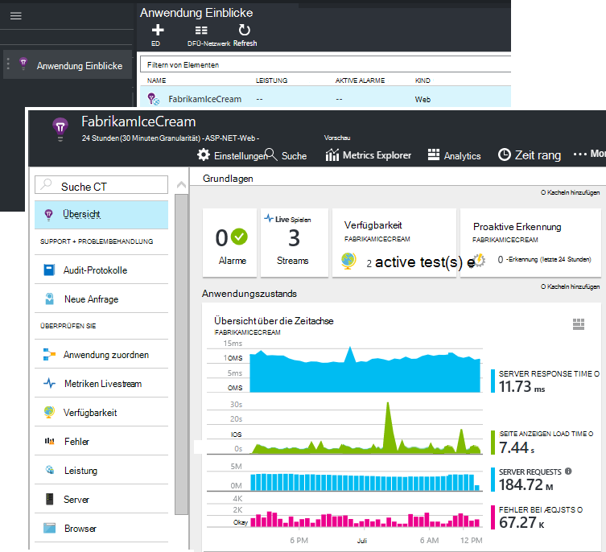

Wenn Sie eine erstellt haben:

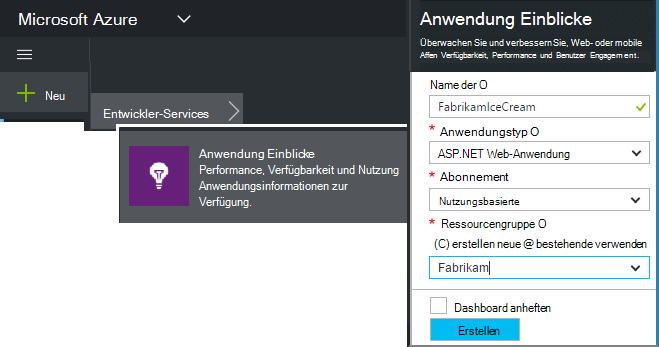

*Noch Fragen?* [Weitere Informationen über Ressourcen erstellen](app-insights-create-new-resource.md).

### Ihre app oder Webseiten SDK-Skript hinzufügen

Rufen Sie in Quick Start des Skripts für Webseiten:

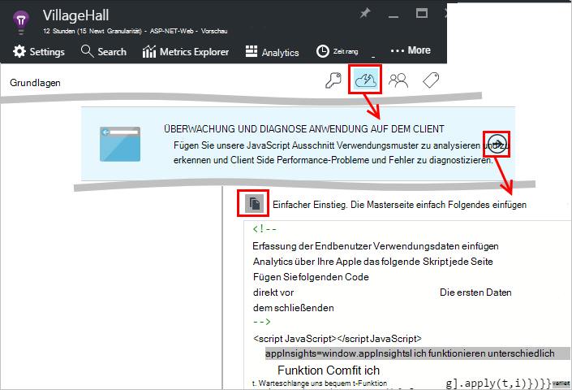

Legen Sie das Skript direkt vor dem `</head>` Tag jeder Seite, die Sie verfolgen möchten. Wenn Ihre Website eine Masterseite verfügt, setzen Sie das Skript vorhanden. Zum Beispiel:

* In ASP.NET MVC-Projekt würden Sie es ins`View\Shared\_Layout.cshtml`
* Öffnen Sie in einer SharePoint-Website, auf der [Site Settings / Masterseite](app-insights-sharepoint.md).

Das Skript enthält die Instrumentation, die Daten für die Anwendung Einblicke Ressource verweist. 

([Detailliertere Erklärung der Skript](http://apmtips.com/blog/2015/03/18/javascript-snippet-explained/))

*(Wenn Sie bekannter Webseite Framework verwenden, achten Sie auf Application Insights-Adapter. Zum Beispiel ist [ein AngularJS Modul](http://ngmodules.org/modules/angular-appinsights).)*

## Detaillierte Konfiguration

Gibt es mehrere [Parameter](https://github.com/Microsoft/ApplicationInsights-JS/blob/master/API-reference.md#config) , die Sie festlegen können, obwohl in den meisten Fällen Sie müssen sollte nicht. Sie können z. B. deaktivieren oder die Anzahl der Ajax-Aufrufe pro Seite (Verringerung Verkehr) gemeldet. Oder Sie können Debugmodus Telemetrie rasch über die Pipeline ohne zusammengefasst werden sollen.

Um diese Parameter für diese Zeile im Codeausschnitt suchen und weitere durch Kommas getrennten Elemente zufügen:

    })({
      instrumentationKey: "..."
      // Insert here
    });

Die [Parameter](https://github.com/Microsoft/ApplicationInsights-JS/blob/master/API-reference.md#config) umfassen:

    // Send telemetry immediately without batching.
    // Remember to remove this when no longer required, as it
    // can affect browser performance.
    enableDebug: boolean,

    // Don't log browser exceptions.
    disableExceptionTracking: boolean,

    // Don't log ajax calls.
    disableAjaxTracking: boolean,

    // Limit number of Ajax calls logged, to reduce traffic.
    maxAjaxCallsPerView: 10, // default is 500

    // Time page load up to execution of first trackPageView().
    overridePageViewDuration: boolean,

    // Set these dynamically for an authenticated user.
    appUserId: string,
    accountId: string,

## Führen Sie die Anwendung

Ihrer Anwendung ausführen, verwenden sie eine Weile Telemetrie generieren, und warten Sie einige Sekunden. Sie können entweder mit der Taste **F5** auf dem Entwicklungscomputer ausführen oder veröffentlichen und Benutzer damit spielen.

Telemetriedaten überprüfen, die Web app an Application Insights senden, verwenden Sie Tools zum Debuggen des Browsers (**F12** in vielen Browsern). Daten an dc.services.visualstudio.com gesendet.

## Untersuchen Sie die Browser-Leistungsinformationen

Browser Blade Leistung aggregierten Daten vom Browser des Benutzers zu öffnen.

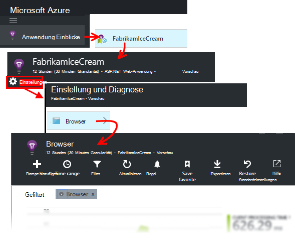

*Noch keine Daten? Klicken Sie auf ** am oberen Rand der Seite *zu aktualisieren* . Immer noch nichts? Siehe [Problembehandlung](app-insights-troubleshoot-faq.md).*

Browser-Blade ist eine [Metrik-Explorer Blade](app-insights-metrics-explorer.md) Diagramm Auswahl mit vordefinierten filtern. Sie können Zeit, Filter und Diagrammkonfiguration möchten und das Ergebnis als Favoriten speichern. Klicken Sie auf zurück zu den ursprünglichen Blade-Konfiguration **Wiederherstellen** .

## Seitenleistung

Am Anfang ist segmentiert der Seitenladezeiten. Die Gesamthöhe des Diagramms stellt die durchschnittliche Zeit zum Laden und Anzeigen von Seiten aus Ihrer app im Browser des Benutzers. Die Zeit wird vom sendet der Browser die ursprünglichen HTTP-Anfrage bis alle synchrone Last, Ereignisse einschließlich Layouts und Ausführen von Skripts verarbeitet wurden, gemessen. Auch Aufgaben wie Webparts von AJAX-Aufrufe.

Das Diagramm Segmente insgesamt Seitenladezeit in [standard Anzeigedauer von W3C definiert](http://www.w3.org/TR/navigation-timing/#processing-model). 

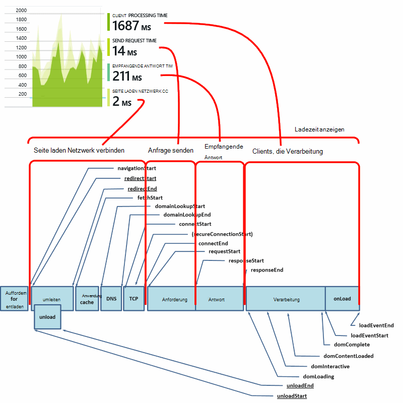

Beachten Sie, dass die *Verbindung mit dem Netzwerk* häufig ist niedriger als erwartet, liegt durchschnittlich über alle Anfragen vom Browser an den Server. Viele einzelne Anfragen haben verbinden 0 da bereits eine aktive Verbindung mit dem Server besteht.

### Langsames Laden?

Langsame Seite sind eine wichtige Quelle der Unzufriedenheit für die Benutzer. Wenn das Diagramm langsame Seite anzeigt, lässt Recherchieren Diagnose.

Das Diagramm zeigt den Durchschnitt aller Seite Lasten in Ihrer Anwendung. Wenn das Problem auf bestimmte Seiten beschränkt sehen Sie das Blade weiter besteht ein Raster segmentiert durch Seiten-URL:

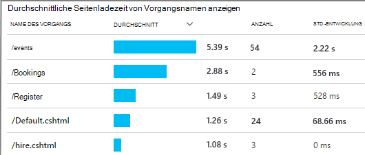

Beachten Sie die Seitenzahl anzeigen und die Standardabweichung. Wenn die Seitenzahl sehr niedrig ist, ist nicht dann das Problem auswirkt Benutzer viel. Eine hohe (vergleichbar mit dem Durchschnitt selbst) Standardabweichung große Unterschiede zwischen einzelnen.

**Vergrößern einer URL und Seitenansicht.** Klicken Sie auf jeder Seitennamen Blade Browser Diagramme zur URL gefiltert anzuzeigen. und auf eine Instanz einer Seitenansicht.

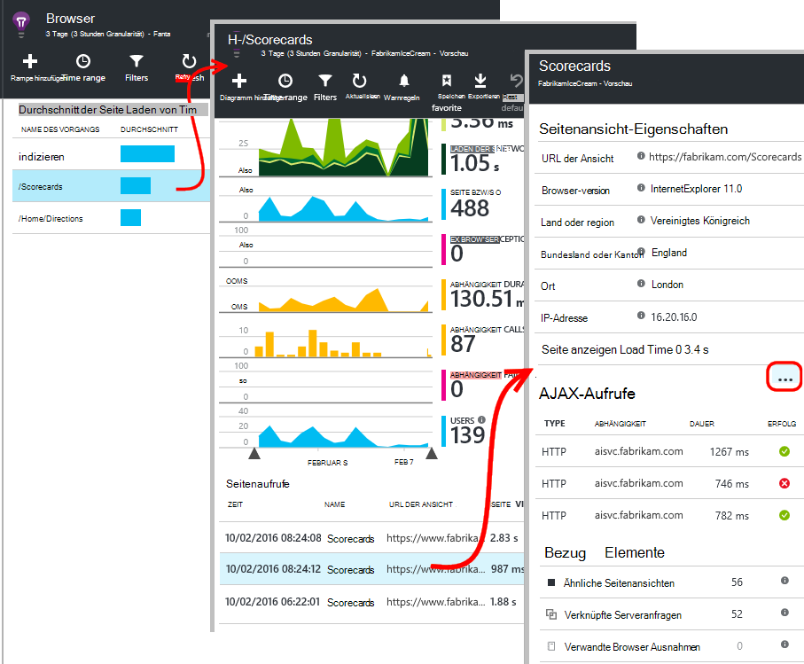

Klicken Sie auf `...` für eine vollständige Liste der Eigenschaften für das Ereignis oder die Ajax-Aufrufe und Ereignisse überprüfen. Langsame Ajax-Aufrufe beeinflussen insgesamt Seitenladezeit synchron sind. Ereignisse enthalten Anfragen für denselben URL (Wenn Application Insights Webserver eingerichtet haben).

**Seitenleistung.** Am Blade Browser ändern Sie Seitenladezeit anzeigen Netz in ein Liniendiagramm auf Spitzen zu bestimmten Zeiten sind:

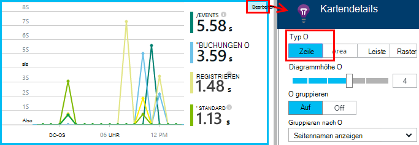

**Segmentieren von anderen Dimensionen.** Vielleicht sind Ihre Seiten langsamer auf einen bestimmten Browser, Client-Betriebssystem oder Benutzer Ort geladen? Hinzufügen eines Diagramms und Experimentieren mit **Group by** Dimension.

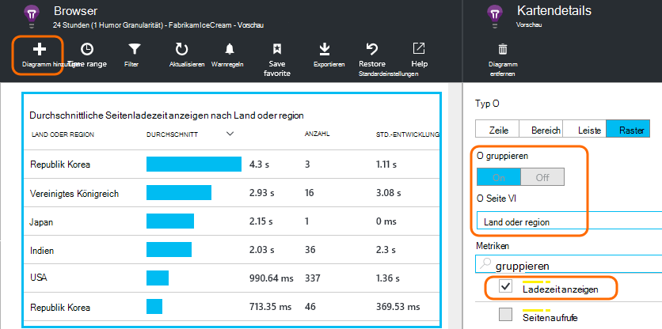

## AJAX-Leistung

Vergewissern Sie sich gut AJAX Aufrufe in Webseiten. Häufig werden sie sich asynchron zu füllen. Obwohl Gesamtseite sofort laden kann, können Benutzer frustriert werden beginnend am leeren Webparts Daten dort angezeigt.

AJAX-Aufrufe von der Webseite werden auf den Browser als Abhängigkeiten angezeigt.

Es sind zusammenfassende Diagramme im oberen Teil des Blades:

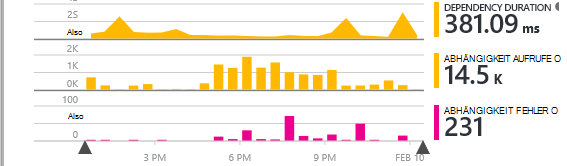

und detaillierte Raster unten:

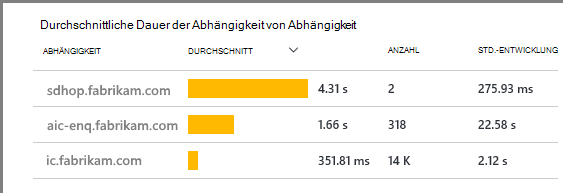

Klicken Sie auf eine beliebige Zeile Einzelheiten.

> [AZURE.NOTE] Wenn Sie Browser-Filter auf dem Blatt löschen, sind Server und AJAX Abhängigkeiten in diesen Diagrammen enthalten. Klicken Sie auf Wiederherstellen, um den Filter zu konfigurieren.

**Fehlgeschlagene Ajax-Aufrufe anbohren** Abhängigkeit Fehler Raster scrollen und klicken Sie auf eine Zeile, um bestimmte Instanzen angezeigt.

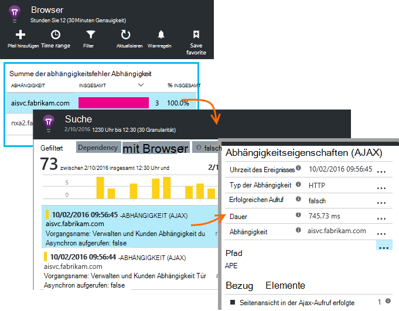

Klicken Sie auf `...` für die vollständige Telemetrie für ein Ajax-Aufruf.

### Keine Ajax-Aufrufe gemeldet?

AJAX-Aufrufe enthalten alle HTTP-Aufrufe aus dem Skript der Webseite. Sie berichtet nicht sehen, sicher, dass der Codeausschnitt festlegen nicht der `disableAjaxTracking` oder `maxAjaxCallsPerView` [Parameter](https://github.com/Microsoft/ApplicationInsights-JS/blob/master/API-reference.md#config).

## Browser-Ausnahmen

-Blade Browser gibt eine Übersicht der Ausnahmen und Raster Ausnahmetypen weiter unten das Blade.

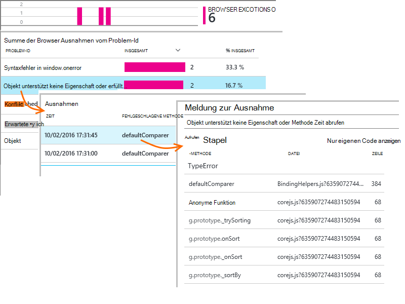

Browser-Ausnahmen gemeldet nicht angezeigt wird, sicher, dass der Codeausschnitt festlegen nicht der `disableExceptionTracking` [Parameter](https://github.com/Microsoft/ApplicationInsights-JS/blob/master/API-reference.md#config).

## Überprüfen Sie Ereignisse der einzelnen Seiten anzeigen

Normalerweise Seite Ansicht Telemetrie Anwendung Einsichten analysiert und Sie sehen nur kumulative Berichte als Mittelwert für alle Benutzer. Aber für debugging-Zwecke, Sie können auch Ereignisse für einzelne Seite anzeigen.

Legen Sie Filter Blade Diagnose suchen auf Seitenansicht.

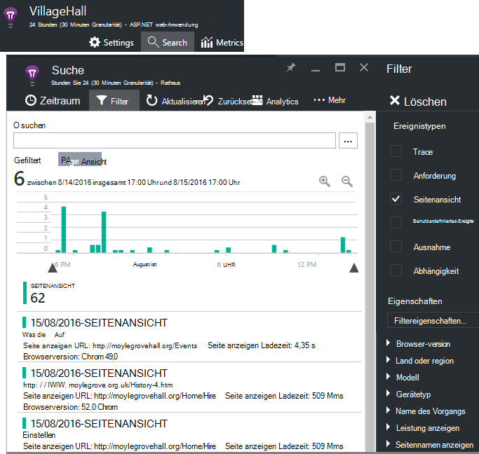

Wählen Sie ein Ereignis, um weitere Details anzuzeigen. Klicken Sie auf der Detailseite auf "...", um weitere Details anzuzeigen.

> [AZURE.NOTE] Verwenden Sie [Suche](app-insights-diagnostic-search.md), beachten Sie, dass nach ganzen Wörtern: "En" und "Kampf" entsprechen "Info".

Die leistungsstarke [Analytics Abfragesprache](app-insights-analytics-tour.md) können auch um Seitenansichten zu suchen.

### Seiteneigenschaften anzeigen

* **Seitendauer anzeigen** 

 * Standardmäßig die Zeit zum Laden der Seite vom Client anfordern Vollast (einschließlich Hilfsdateien aber ohne Aufgaben wie Ajax aufruft). 
 * Setzen Sie `overridePageViewDuration` [Seitenkonfiguration](#detailed-configuration)Intervall zwischen Anforderung zur Ausführung des ersten `trackPageView`. Wenn Sie nach der Initialisierung des Skripts TrackPageView von seiner üblichen Position verschoben haben, wird es einen anderen Wert reflektiert.
 * Wenn `overridePageViewDuration` festgelegt ist und eine Dauer Argument aus der `trackPageView()` aufrufen, wird der Wert stattdessen verwendet. 

## Benutzerdefinierte Seitenzahlen

Standardmäßig wird die Seitenzahl jedes Mal eine neue Seite in den Clientbrowser lädt.  Aber zusätzliche Seitenaufrufe zählen möchten. Beispielsweise eine Seite kann den Inhalt in Registerkarten anzuzeigen und eine Seite Wenn Benutzer Registerkarten zählen möchten. Oder JavaScript-Code in die Seite möglicherweise neuen Inhalte ohne URL des Browsers.

Fügen Sie an der entsprechenden Stelle im Clientcode JavaScript Aufruf:

    appInsights.trackPageView(myPageName);

Der Seitenname enthalten dieselben Zeichen im URL jedoch alles nach dem "#" oder "?" wird ignoriert.

## Verwendung

Möchten Sie herausfinden, was Ihre Benutzer mit Ihrer Anwendung?

* [Erfahren Sie mehr über die Verwendung](app-insights-web-track-usage.md)
* [Informationen zu benutzerdefinierten Ereignissen und Metriken API](app-insights-api-custom-events-metrics.md).

#### Video: Überwachen (Verwendung)

> [AZURE.VIDEO tracking-usage-with-application-insights]

## Nächste Schritte

* [Nutzung nachverfolgen](app-insights-web-track-usage.md)
* [Benutzerdefinierte Ereignisse und Metriken](app-insights-api-custom-events-metrics.md)
* [Build Maßnahme erfahren](app-insights-overview-usage.md)

