<properties 
    pageTitle="Metriken in Application Insights untersuchen | Microsoft Azure" 
    description="Wie Diagramme, metrische Explorer interpretiert und Blades Metrik-Explorer anpassen." 
    services="application-insights" 
    documentationCenter=""
    authors="alancameronwills" 
    manager="douge"/>

<tags 
    ms.service="application-insights" 
    ms.workload="tbd" 
    ms.tgt_pltfrm="ibiza" 
    ms.devlang="na" 
    ms.topic="article" 
    ms.date="10/15/2016" 
    ms.author="awills"/>
 
# Erkunden Metriken Anwendung Erkenntnisse

Metriken in [Application Insights] [ start] sind Werte und die Anzahl der Ereignisse, die von der Anwendung in Telemetrie gesendet werden. Sie können Sie Leistungsprobleme und Trends bei der Verwendung der Anwendung sehen. Es gibt eine Vielzahl von standard-Metriken und können auch eigene benutzerdefinierte Metriken und Ereignisse.

Metriken und Ereignis zählt werden in Diagrammen Aggregatwerte wie Summen, Mittelwerte oder Anzahl angezeigt.

Hier ist ein Beispieldiagramm:

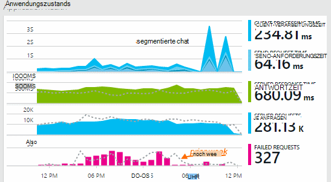

Einige Diagramme unterteilt: die Gesamthöhe des Diagramms jederzeit ist die Summe der Metriken angezeigt. Die Legende standardmäßig zeigt die größten Mengen.

Gepunktete Linien zeigen den Wert der Metrik eine Woche zuvor.

## Zeitraum

Sie können Diagramme und Raster auf alle fallen Zeitraum ändern.

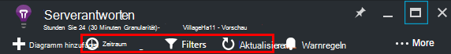

Wenn Sie einige Daten, die noch nicht angezeigt erwarten, klicken Sie auf aktualisieren. Diagramme aktualisieren sich in Intervallen Intervalle sind jedoch für größere Zeiträume. Im Release-Modus können sie Daten über die Pipeline Analyse auf ein Diagramm zu dauern.

Um ein Diagrammelement zu vergrößern, ziehen Sie darauf:

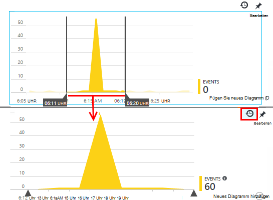

Klicken Sie Zoomen rückgängig wiederherstellen.

## Granularität und zeigen Werte

Mauszeiger über das Diagramm nun die Werte der Metriken angezeigt.

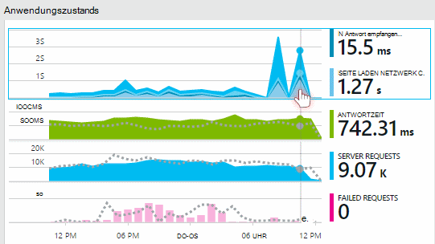

Der Wert der Metrik zu einem bestimmten Zeitpunkt über den vorhergehenden Samplingintervall aggregiert. 

Samplingintervall oder "Granularität" wird am Anfang des Blades angezeigt. 

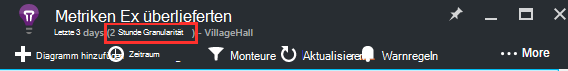

Sie können die Granularität in der Blade-Zeit-Bereich:

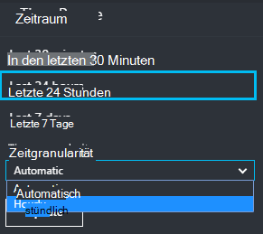

Die Granularität der verfügbaren hängen ausgewählten Zeitraum. Expliziten Granularitäten sind Alternativen zu "automatisch" Granularität für den Zeitraum. 

## Metrik-Explorer

Klicken Sie auf Diagramme auf der Übersicht eine weitere Reihe von verknüpften Diagramme und Raster anzeigen. Sie können diese Diagramme und Raster auf die Details konzentrieren, die Sie interessieren.

Oder Sie können klicken Metriken Explorer im head-Bereich des Blades Overview.

Klicken Sie z. B. über das Web app fehlerhaften Anforderungen Diagramm:

## Was bedeuten die Zahlen?

Die Legende auf der Seite standardmäßig zeigt normalerweise den Aggregatwert Zeitraum im Diagramm. Wenn Sie über das Diagramm bewegen, werden den Wert nun zeigt.

Datenpunkte im Diagramm ist eine in der vorhergehenden Samplingintervall oder "Granularität" empfangenen Datenwerten. Die Granularität wird am Anfang des Blades angezeigt und variiert mit der gesamten Zeitskala des Diagramms.

Metriken können auf unterschiedliche Weise zusammengefasst werden: 

 * **Addiert die Werte aller Datenpunkte über das Samplingintervall oder die Periode des Diagramms empfangen.**
 * **Durchschnittliche** teilt die Summe durch die Anzahl der Datenpunkte der Zeitraum empfangen.
 * Anzahl der Benutzer und Konten werden **Unique** zählt. Die Abbildung zeigt die Anzahl der verschiedenen Benutzer in dieser Zeit angezeigt, über das Samplingintervall oder Zeitraum im Diagramm.

Sie können die Aggregationsmethode ändern:

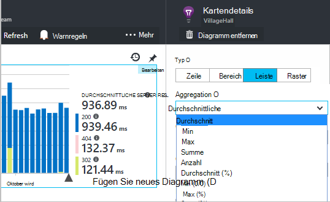

Die Standardmethode für jede Metrik wird angezeigt, wenn Sie ein neues Diagramm erstellen oder wenn alle deaktiviert werden:

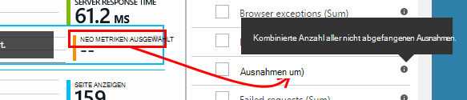

## Diagramme und Raster bearbeiten

Das Blade ein neues Diagramm hinzu:

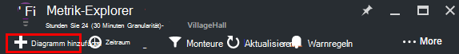

Wählen Sie einen vorhandenen oder neuen Diagramm Anzeige bearbeiten **Bearbeiten** :

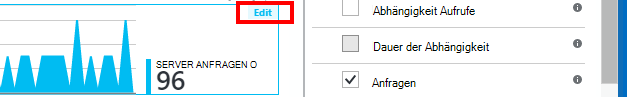

Gibt es Einschränkungen Kombinationen, die zusammen angezeigt werden können, können Sie mehr als eine Metrik in einem Diagramm anzeigen. Sobald Sie eine Metrik auswählen, sind die anderen deaktiviert. 

Wenn Sie [benutzerdefinierte Messgrößen] codiert[ track] in Ihrer Anwendung (Aufrufe an TrackMetric und TrackEvent) werden sie hier aufgeführt werden.

## Ihre Daten

Eine Metrik möglich von Eigenschaften, z. B. Seitenansichten auf Clients mit unterschiedlichen Betriebssystemen zu vergleichen. 

Wählen Sie ein Diagramm oder Raster, wechseln Sie zum Gruppieren und wählen Sie eine Eigenschaft auf Gruppieren nach:

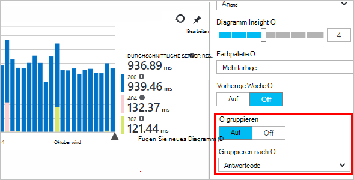

> [AZURE.NOTE] Bei Verwendung von Gruppierung bieten welche Fläche und Balkendiagramm gestapelt anzeigen. Dies eignet sich die Aggregationsmethode Summe ist. Aber wo der Aggregation Durchschnitt ist, wählen Sie die Zeile oder Raster anzeigen. 

Wenn Sie [benutzerdefinierte Messgrößen] codiert[ track] in Ihrer Anwendung und sie Eigenschaftswerte enthalten, können Sie die Eigenschaft in der Liste aus.

Ist das Diagramm zu klein für segmentierten Daten? Anpassen der Höhe:

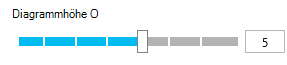

## Filtern von Daten

Um nur die Metriken für eine ausgewählte Gruppe von Eigenschaftswerten anzuzeigen:

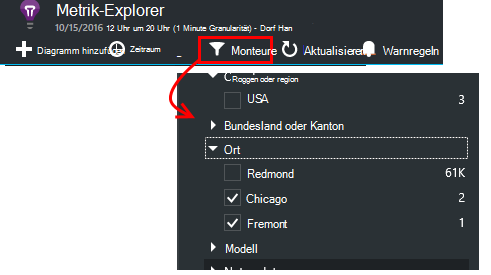

Wenn Sie Werte für eine bestimmte Eigenschaft auswählen, es ist gleichbedeutend mit allen: Eigenschaft kein angewendet wird.

Beachten Sie die Anzahl der Ereignisse neben jeden Eigenschaftswert. Wenn Sie eine Eigenschaft auswählen, werden zählt neben anderen Eigenschaftswerten angepasst.

Filter gelten für alle Diagramme auf einer-Blade. Wenn verschiedene Filter auf andere Diagramme angewendet werden soll, erstellen Sie und speichern Sie verschiedener Messzahlen Blades. Gegebenenfalls können Diagramme aus verschiedenen Dashboard anzuheften, sodass sie nebeneinander angezeigt.

### Bot und Test Datenverkehr entfernen

Verwenden Sie den Filter **Real oder synthetische Datenverkehr** und überprüfen Sie **Real**.

Sie können auch durch **synthetische Datenverkehr**filtern.

### Eigenschaften der Filterliste hinzufügen

Möchten Sie Telemetrie für eine Kategorie Ihrer Wahl filtern? Beispielsweise vielleicht Benutzer in Kategorien aufteilen und Sie möchten Ihre Daten nach diesen Kategorien unterteilen.

Sie [erstellen eine eigene Eigenschaft](app-insights-api-custom-events-metrics.md#properties). Legen Sie sie in einer [Telemetrie Initialisierer](app-insights-api-custom-events-metrics.md#telemetry-initializers) haben alle Telemetrie - einschließlich standard Telemetrie Modulen SDK gesendet werden.

## Diagramm bearbeiten

Beachten Sie Raster und Diagramme wechseln können.

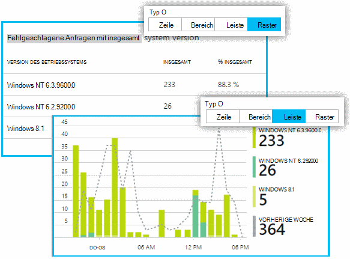

## Speichern Sie die Metriken blade

Bei einigen Diagrammen erstellt haben, speichern Sie sie als Favoriten. Sie können auswählen, ob für andere Teammitglieder freigeben einer Organisationseinheit Konto verwenden.

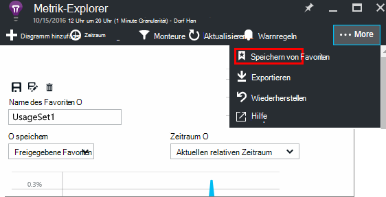

So finden das Blade wieder, **Gehen Sie zu Übersicht Blade** und Favoriten öffnen:

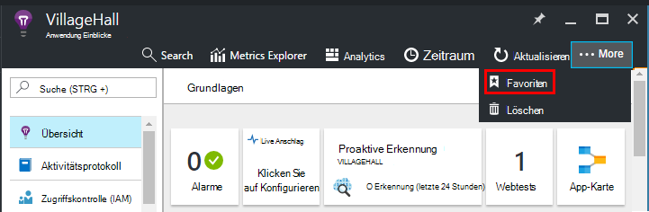

Wenn Sie relativen Zeitraum beim Speichern wählen, wird das Blade mit den neuesten Metriken aktualisiert. Wenn Sie Absolute Zeit ausgewählt haben, zeigt dieselben Daten jedes Mal es.

## Das Blade zurücksetzen

Wenn Sie bearbeiten eine-Blade dann zurück auf den ursprünglichen Satz gespeichert werden möchten, klicken Sie einfach auf Zurücksetzen.

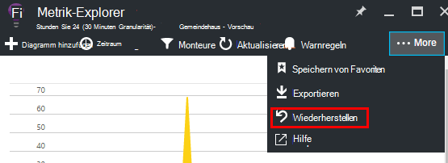

## Livestream Metriken: instant Metriken für die Überwachung

Metriken Livestream zeigt die Anwendungswerte vor diesem Augenblick mit einer nahezu in Echtzeit Wartezeit von 1 Sekunde. Ist besonders nützlich, wenn Sie einen neuen Build veröffentlichen und sicherzustellen, dass alles erwartungsgemäß arbeiten oder Untersuchen von Sicherheitsvorfällen in Echtzeit

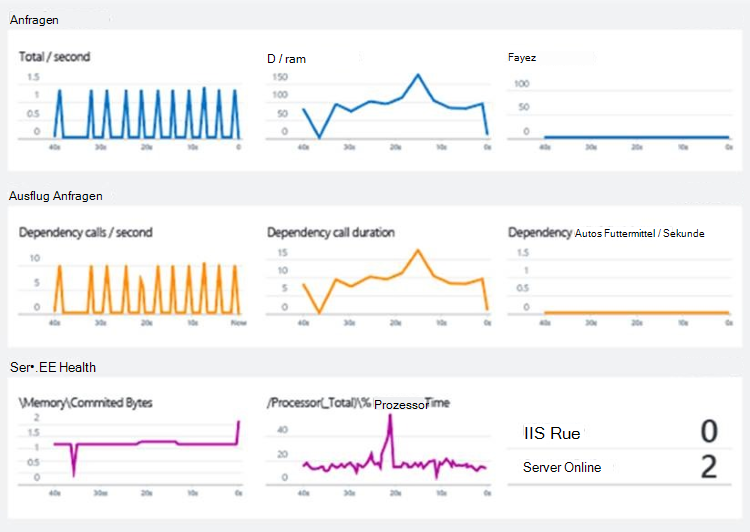

Im Gegensatz zu Metrik-Explorer zeigt Livestream Metriken festgelegten Kriterien. Die Daten beibehalten werden nur solange im Diagramm ist und dann verworfen. 

Metriken Livestream steht mit Application Insights SDK für ASP.NET Version 2.1.0 oder höher.

## Alarme

Um per ungewöhnliche Werte einer Metrik benachrichtigt werden, fügen Sie eine Warnung. Sie können entweder das e-Mail Konto-Administratoren oder bestimmte e-Mail-Adresse.

[Weitere Informationen zu Alarmen][alerts].

## Exportieren nach Excel

Die exportieren Daten in eine Exceldatei in metrischen Explorer angezeigt wird. Die exportierten Daten enthält Daten aus allen Diagrammen und Tabellen im Portal angezeigt. 

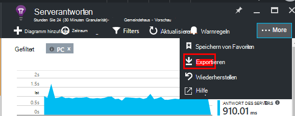

Die Daten für jedes Diagramm oder Tabelle ist auf einem anderen Arbeitsblatt in der Excel-Datei exportiert.

Sie sehen was exportiert wird. Ändern Sie den Zeitraum oder den Filter möchten Sie Daten ändern. Für Tabellen Befehl **mehr** angezeigt wird, können Sie darauf klicken bevor auf exportieren, um mehr Daten exportiert.

*Exportieren Sie funktioniert nur für Internet Explorer und Chrome derzeit. Wir arbeiten an andere Browser unterstützen.*

## Kontinuierliche exportieren

Wenn Daten kontinuierlich, damit es extern verarbeiten soll, sollten Sie [fortlaufend exportieren](app-insights-export-telemetry.md).

### Power BI

Ggf. auch umfangreichere Datenansichten können Sie [Power BI exportieren](http://blogs.msdn.com/b/powerbi/archive/2015/11/04/explore-your-application-insights-data-with-power-bi.aspx).

## Analytics

[Analytics](app-insights-analytics.md) ist eine vielseitigere Möglichkeit zum Analysieren der Telemetrie mit leistungsstarken Abfragesprache. Verwenden sie kombinieren oder Metriken Ergebnisse berechnen oder eine Untersuchung im Deph der aktuellen Leistung Ihrer Anwendung ausführen soll. Auf der anderen Seite verwenden Sie Metrics Explorer ggf. automatische Aktualisierung Diagramme Dashboard und Alarme.

## Problembehandlung

*Keine Daten im Diagramm angezeigt.*

* Filter gelten für alle Diagramme auf dem Blatt. Stellen Sie sicher, dass während auf einem Diagramm konzentrieren haben Sie einen Filter setzen, der die Daten auf einem anderen ausschließt. 

    Wenn Sie verschiedene Filter auf verschiedene Diagramme, in anderen Blades erstellen möchten, speichern Sie sie als separate Favoriten. Wenn Sie möchten, können Sie sie zum Dashboard anheften, damit sie nebeneinander angezeigt.

* Wenn Sie ein Diagramm nach einer Eigenschaft, die in der Metrik nicht definiert ist gruppieren, dann werden nicht im Diagramm. Löschen Sie 'Gruppieren', oder wählen Sie eine unterschiedliche Gruppierung-Eigenschaft.
* Leistungsdaten (CPU, e/a-Rate usw.) für Java WebServices, Windows desktop-apps [IIS web apps und Dienste bei der Installation überwachen](app-insights-monitor-performance-live-website-now.md)und [Azure Cloud Services](app-insights-azure.md)verfügbar ist. Es ist nicht verfügbar für Azure Websites.

## Nächste Schritte

* [Überwachen der Verwendung Anwendung Einblicke](app-insights-overview-usage.md)
* [Diagnostische Suche](app-insights-diagnostic-search.md)

<!--Link references-->

[alerts]: app-insights-alerts.md
[start]: app-insights-overview.md
[track]: app-insights-api-custom-events-metrics.md

 