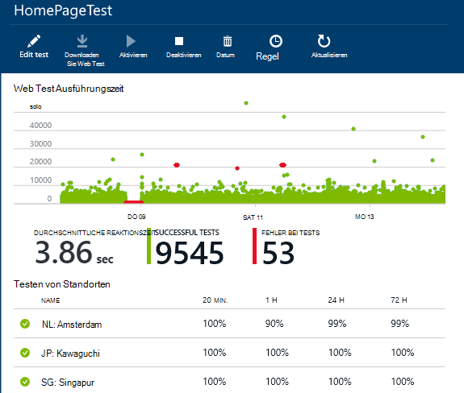
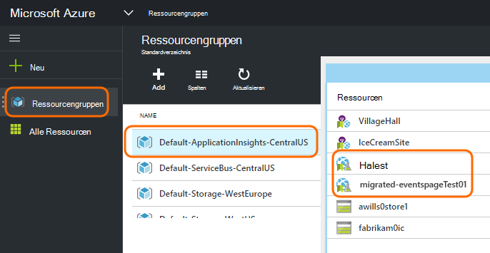
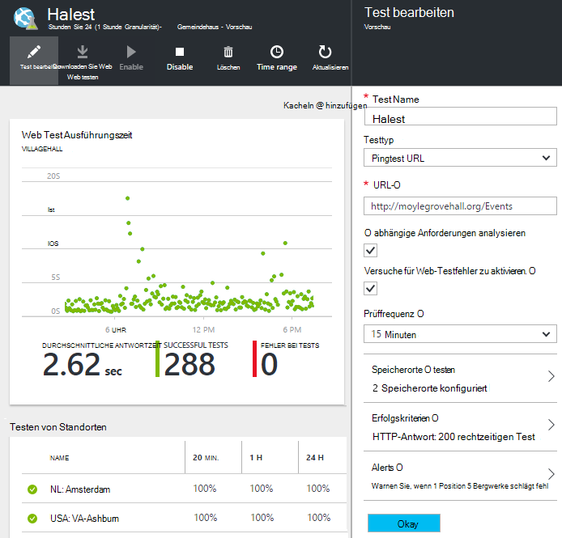

<properties 
    pageTitle="Migrieren von Azure Endpunkt Anwendung Einblicke Verfügbarkeit Tests" 
    description="Migrieren von klassischen Azure Endpunktüberwachung Tests Erkenntnisse Anwendung testet Verfügbarkeit bis zum 31. Oktober 2016."
    services="application-insights" 
    documentationCenter=""
    authors="soubhagyadash" 
    manager="douge"/>

<tags 
    ms.service="application-insights" 
    ms.workload="tbd" 
    ms.tgt_pltfrm="ibiza" 
    ms.devlang="na" 
    ms.topic="article" 
    ms.date="07/25/2016" 
    ms.author="awills"/>
 
# Verschieben von Azure Endpunktüberwachung Einblicke Verfügbarkeit Anwendungstests

[Überwachen der Endpunkt](https://blogs.msdn.microsoft.com/mast/2013/03/03/windows-azure-portal-update-configure-web-endpoint-status-monitoring-preview/) für Azure apps verwenden Sie? *31. Oktober 2016*ersetzen wir ihnen neue und leistungsfähigere [Verfügbarkeitstests](app-insights-monitor-web-app-availability.md). Wir haben einige neue Tests bereits erstellt, obwohl sie bis zum 31. Oktober 2016 deaktiviert sind. 

Sie können neue Tests bearbeiten und Ausführen den Switch selbst. Sie finden [Azure-Portal](https://portal.azure.com) in der Ressourcengruppe Standard-ApplicationInsights-CentralUS sie.

## Was sind Verfügbarkeitstests?

Testen der Verfügbarkeit ist ein Feature von Azure, die ständig überprüft, ob eine Website oder einen Dienst, und führen HTTP-Anfragen (einzelne Ping-Tests oder Visual Studio Webtests) von bis zu 16 Standorten weltweit. 

In [Azure-Verwaltungsportal](https://manage.windowsazure.com)wurden diese Tests Überwachen der Endpunkt bezeichnet. Sie wurden mehr eingeschränkt. Die neue Verfügbarkeitstests sind eine wesentliche Verbesserung:

* Bis zu 10 Visual Studio Webtests oder Ping-Tests pro Anwendung Insights-Ressource. 
* Bis zu 16 Standorten Ihrer Anwendung Webtest an. Mehr Kontrolle über Erfolgskriterien. 
* Testen Sie eine Website oder Service - nur Azure webapps.
* Testen der Wiederholungsversuche: falsch-positiv-Warnung durch vorübergehende Netzwerkprobleme reduzieren. 
* Webhooks können Alarme HTTP POST benachrichtigt.

Weitere Informationen zur [Verfügbarkeitstests hier](app-insights-monitor-web-app-availability.md).

Verfügbarkeitstests sind Teil der [Visual Studio Application Insights](app-insights-overview.md)ein erweiterbares Dienst für jede Web-Anwendung.

## So was passiert mit meinem Endpunkt überprüft?

* Wir haben Ihren Endpunkt Überwachung Tests neue Einblicke Verfügbarkeit Tests kopiert.
* Neue Verfügbarkeitstests sind derzeit deaktiviert und Alter Endpoint-Tests werden noch ausgeführt.
* Die Warnung Regeln *nicht* migriert. Die neuen Tests wurden zunächst mit einer Standardregel eingerichtet:
 * Wird ausgelöst, wenn mehr als 1 Ort in 5 Minuten Fehler meldet.
 * Sendet eine e-Mail an den Abonnement-Administratoren.

In [Azure-Portal](https://portal.azure.com)finden Sie die migrierten Tests in der Ressourcengruppe "Standard-ApplicationInsights-CentralUS". Testnamen Präfix 'Migriert-'. 

## Was muss ich tun?

* Wenn wir irgendwie Tests migrieren, werden die neuen Verfügbarkeitstests [einfach](app-insights-monitor-web-app-availability.md).

### Die Option führen Sie A: nichts. Lassen sie uns.

**Am 31. Oktober 2016** wird Folgendes beschrieben:

* Deaktivieren Sie ALTER Endpoint-Tests.
* Aktivieren Sie die migrierten Verfügbarkeitstests.

### Option B: Sie verwalten oder neue Tests aktivieren.

* Prüfen Sie und bearbeiten Sie die neue Verfügbarkeitstests im neuen [Azure-Portal](https://portal.azure.com). 
 * Überprüfen der Kriterien
 * Überprüfen Sie die e-Mail-Empfänger
* Die neuen Tests aktivieren
* Wir deaktiviert legacy Endpunkt Überwachung Tests am 31. Oktober 2016 

### Option C: Opt out

Wenn Sie Verfügbarkeitstests verwenden möchten, können Sie sie in [Azure-Portal](https://portal.azure.com)löschen. Es gibt auch ein "Unsubscribe"-Link am unteren Rand der Systemfehlers.

Wir werden noch alte Endpunkt Tests am 31. Oktober 2016 löschen. 

## Bearbeiten der neuen tests

[Azure-Portal](https://portal.azure.com) melden Sie an und suchen Sie 'Migriert-' Webtests: 

Bearbeiten und Aktivieren von Tests:

## Warum geschieht dies?

Besseren Service. Der alte Endpunkt Dienst war wesentlich geringer. Sie könnten zwei URLs für einfache Ping-Tests aus 3 Geo ein Azure VM oder Web app. Neue Tests können Webtests aus mehreren Schritten bis 16 Standorten ausgeführt und können bis zu 10 Tests für eine Anwendung. URLs testen - es muss eine Azure-Website.

Die neuen Tests werden aus dem WebApp oder VM testen, separat konfiguriert. 

Die Migration Tests, um sicherzustellen, dass Sie weiterhin steuern sie dabei das neue Portal. 

## Was ist Application Insights?

Neue Verfügbarkeitstests gehören [Visual Studio Application Insights](app-insights-overview.md). Hier ist [2 Minuten](http://go.microsoft.com/fwlink/?LinkID=733921).

## Bezahle ich die neuen Tests?

Migrierte Tests werden im freien Standardpläne im Application Insights-Ressource eingerichtet. Dies ermöglicht die Erstellung von bis zu 5 Millionen Datenpunkte. Das Datenvolume derzeit verwendeten Tests leicht abdeckt. 

Natürlich, wenn Sie Anwendung Einblicke und Verfügbarkeitstests erstellen oder mehr Performance-Überwachung und Diagnosefunktionen erlassen, dann Sie weitere Datenpunkte generieren.  Das Ergebnis wäre jedoch nur, dass das Kontingent für den freien Plan erreicht werden kann. Sie erhalten eine Rechnung nicht, wenn für die Pläne Standard oder Premium anmelden. 

[Weitere Informationen über die Anwendung Einblicke Preis- und Überwachung](app-insights-pricing.md). 

## Was ist und migriert wird nicht?

Beibehalten der ALTER Endpoint-Tests:

* Endpunkt-URL getestet werden.
* Geo-Positionen aus denen Anfragen gesendet werden.
* Prüffrequenz bleibt 5 Minuten.
* Test-Timeout ist 30 Sekunden. 

Nicht migriert:

* Warnung Triggerregel. Die Regel Trigger setzen wir bei 1 Ort in 5 Minuten Fehler meldet.
* Warnen Sie Empfänger. E-Mail-Benachrichtigungen erhalten Abonnementbesitzer und Eigentümer. 

## Finden die neuen tests

Sie können neue Tests jetzt Wunsch bearbeiten. [Azure-Portal](https://portal.azure.com)melden Sie an, öffnen Sie **Ressourcengruppen** , und wählen Sie **Standard-ApplicationInsights-CentralUS**. In dieser Gruppe finden Sie neue Webtests. [Erfahren Sie mehr über die neuen Verfügbarkeitstests](app-insights-monitor-web-app-availability.md).

Beachten Sie, dass die neue Warnung e-Mails von dieser Adresse gesendet: App Einblicke Alarmen(ai-noreply@microsoft.com)

## Was geschieht, wenn ich nichts tun?

Eine Option gelten. Wir migrierten Tests aktivieren und die Regeln für die Warnung einrichten, wie bereits erwähnt. Sie müssen alle benutzerdefinierten Warnregeln erwähnt Empfänger hinzufügen. Wir deaktiviert legacy Endpunkt Tests überwachen. 

## Wo kann ich Feedback dazu? 

Wir schätzen Ihr Feedback. Geben Sie [uns eine e-Mail](mailto:vsai@microsoft.com). 

