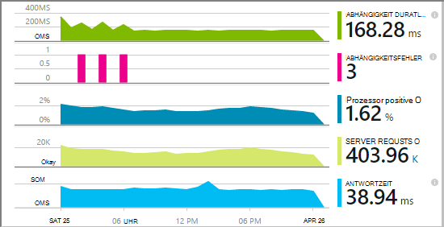
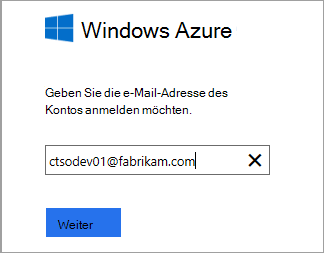
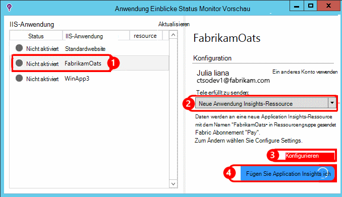
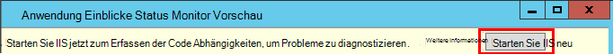
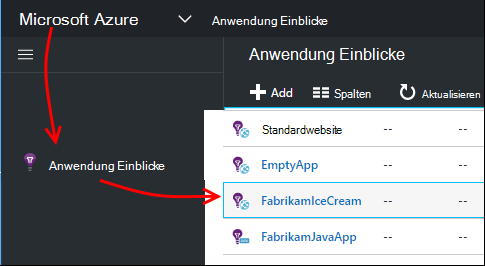
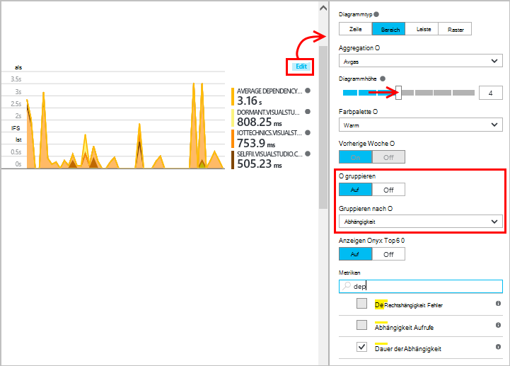
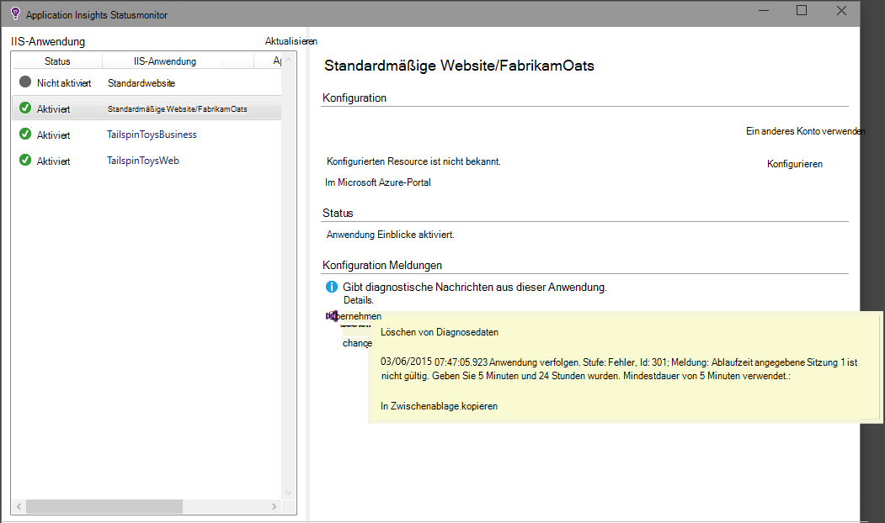

<properties
    pageTitle="Diagnose von Leistungsproblemen ausgeführten IIS-Website | Microsoft Azure"
    description="Überwachen der Leistung einer Website ohne erneut bereitstellen. Verwenden Sie eigenständige oder Anwendung Einblicke SDK zu Abhängigkeit Telemetrie."
    services="application-insights"
    documentationCenter=".net"
    authors="alancameronwills"
    manager="douge"/>

<tags
    ms.service="application-insights"
    ms.workload="tbd"
    ms.tgt_pltfrm="ibiza"
    ms.devlang="na"
    ms.topic="get-started-article"
    ms.date="10/24/2016"
    ms.author="awills"/>

# Instrument webapps Laufzeit Anwendung Einblicke

*Anwendung Informationen ist in der Vorschau.*

Instrumentieren eine Web app mit Visual Studio Application Insights ohne zu ändern oder den Code erneut. In Ihren apps gehostet werden von einem lokalen IIS-Server installieren Sie überwachen; oder wenn sie Azure webapps oder eine Azure VM ausführen, können Sie die Application Insights-Erweiterung. (Es gibt auch Artikel zu instrumentieren [live J2EE webapps](app-insights-java-live.md) und [Azure Cloud Services](app-insights-cloudservices.md).)

Sie können drei Ihren Web Application Insights zuweisen:

* **Zeit:** [Application Insights SDK hinzufügen] [greenbrown] Web app Code. 
* **Laufzeit:** Instrumentieren Sie wie unten beschrieben einbringt, ohne erneutes Erstellen und den Code Ihrer Anwendung auf dem Server.
* **Beide:** Erstellen Sie das SDK in Web app Code und auch zur Laufzeit Extensions. Holen Sie das beste aus beiden Optionen. 

Hier ist eine Zusammenfassung der von jeder Route zu erhalten:

||Zeit|Zur Laufzeit|
|---|---|---|
|Anfragen und Ausnahmen|Ja|Ja|
|[Weitere Ausnahmen](app-insights-asp-net-exceptions.md)||Ja|
|[Abhängigkeit Diagnose](app-insights-asp-net-dependencies.md)|Auf 4.6 +|Ja|
|[Systemleistungsindikatoren](app-insights-performance-counters.md)||IIS oder Azure Cloud Service nicht Azure WebApp|
|[API für benutzerdefinierte Telemetrie][api]|Ja||
|[Trace-Protokoll-integration](app-insights-asp-net-trace-logs.md)|Ja||
|[Anzeigen und Daten](app-insights-javascript.md)|Ja||
|Ohne Code neu erstellen|Nein||

## Instrumentieren Sie Ihrer Anwendung zur Laufzeit

Sie benötigen ein [Microsoft Azure](http://azure.com) -Abonnement.

### Wenn Ihre Anwendung ein Azure WebApp oder Cloud-Dienst

* Wählen Sie Application Insights auf der Anwendung in Azure. 

    [Erfahren Sie mehr](app-insights-azure.md).

### Wenn Ihre Anwendung auf dem IIS-server

1. Auf dem IIS-Webserver mit Administratoranmeldeinformationen anmelden.
2. Herunterladen Sie und führen Sie der [Statusmonitor Installer aus](http://go.microsoft.com/fwlink/?LinkId=506648).
4. Melden Sie sich im Installations-Assistenten Microsoft Azure an.

    

    *Fehler? Finden Sie unter [Troubleshooting](#troubleshooting).*

5. Wählen Sie installierte Anwendung oder Website, die Sie überwachen möchten, und konfigurieren Sie die Ressource in der die Ergebnisse im Application Insights-Portal.

    

    Normalerweise möchten Sie eine neue Ressource und die [Ressourcengruppe]konfigurieren[roles].

    Andernfalls eine vorhandene Ressource verwenden, wenn Sie bereits [Webtests] [ availability] für Ihre Website oder [Web-Client überwachen][client].

6. Starten Sie IIS neu.

    

    Der Webdienst wird kurzzeitig unterbrochen.

6. Beachten Sie, dass ApplicationInsights.config in den Web apps eingefügt wurde, die Sie überwachen möchten.

    

   Es gibt auch in web.config geändert.

#### Möchten Sie später (erneut) konfigurieren?

Nach Abschluss des Assistenten können Sie den Agenten jederzeit neu konfigurieren. Sie können dies auch verwenden, wenn den Agent installiert, aber es Probleme mit der Erstinstallation gab.

## Ansicht Leistung Telemetrie

Melden Sie [Azure-Portal an](https://portal.azure.com)durchsuchen Sie Anwendung Einblicke und öffnen Sie die erstellte Ressource.

Öffnen Sie Leistung Blade Anforderung, Antwort, Abhängigkeit und andere Daten.

Klicken Sie auf Diagramme anzeigen öffnen.

Sie können [Bearbeiten, ändern, speichern](app-insights-metrics-explorer.md), und Diagramme oder ganze Blade- [Dashboard](app-insights-dashboards.md).

## Abhängigkeit

Dauer der Abhängigkeit Diagramm zeigt die Zeit Aufrufe Ihrer app externe Komponenten wie Datenbanken, REST-APIs oder Azure BLOB-Speicher.

Das Diagramm durch Aufrufe von anderen Abhängigkeiten segmentiert: Diagramm bearbeiten, gruppieren aktivieren und Gruppieren nach Abhängigkeit Abhängigkeitstyp und Abhängigkeit Leistung.

## Leistungsindikatoren 

(Nicht für Azure webapps.) Klicken Sie auf die Übersicht über Diagramme von Server-Leistungsindikatoren wie CPU-Auslastung und Speicherverwendung sehen auf Server.

Haben mehrere Serverinstanzen möchten Sie Diagramme von Rolleninstanz Gruppe bearbeiten.

Sie können auch das [Ändern von Leistungsindikatoren, die vom SDK gemeldet werden](app-insights-configuration-with-applicationinsights-config.md#nuget-package-3). 

## Ausnahmen

Sie können bestimmte Ausnahmen (letzte 7 Tage) Drilldown und Stack-Traces und Kontextdaten.

## Probenahme

Wenn Ihre Anwendung große Datenmengen sendet und Application Insights SDK für ASP.NET Version 2.0.0-beta3 oder höher verwenden, kann adaptive Sampling-Funktion ausgeführt werden und nur einen Teil der Telemetrie. [Erfahren Sie mehr über Sampling.](app-insights-sampling.md)

## Problembehandlung

### Verbindungsfehler

Sie müssen auf [einige ausgehende Ports](app-insights-ip-addresses.md#outgoing-ports) in der Firewall des Servers überwachen zu können.

### Keine Telemetrie?

  * Verwenden der Website Daten generieren.
  * Warten Sie einige Minuten, bis die Daten ankommen, und klicken Sie auf **Aktualisieren**.
  * Öffnen Sie Diagnose Search (Suche Kachel) um einzelne Ereignisse anzuzeigen. Ereignisse sind häufig in der Diagnosesuche, Daten in den Diagrammen angezeigt.
  * Überwachen und wählen Sie die Anwendung auf linken Seite. Überprüfen Sie, ob Fehlermeldungen Diagnose für diese Anwendung im Abschnitt "Konfiguration Meldungen":

  

  * Sicherstellen Sie, dass die Serverfirewall ausgehenden Datenverkehr auf den oben aufgeführten Ports zulässt.
  * Auf dem Server eine Meldung "nicht genügend Berechtigungen" angezeigt wird, versuchen Sie Folgendes:
    * Wählen Sie im IIS-Manager den Anwendungspool, **Erweiterte Einstellungen**öffnen Sie, und notieren Sie die Identität unter **Prozessmodell** .
    * Gruppe Systemmonitorbenutzer Systemsteuerungsprogramm Computer Management fügen Sie diese Identität hinzu.
  * Wenn Sie MMA/SCOM auf Ihrem Server installiert haben, können einige Versionen in Konflikt stehen. Deinstallieren Sie SCOM und Statusmonitor und installieren Sie die neuesten Versionen.
  * Siehe [Problembehandlung bei][qna].

## Das System

Unterstützte Betriebssysteme für Application Insights Status Monitor auf Server:

- WindowsServer 2008
- Windows Server 2008 R2
- Windows Server 2012
- WindowsServer 2012 R2

mit den neuesten Service Packs und.NET Framework 4.0 und 4.5

Auf dem Client Windows 7, 8 und 8.1 mit.NET Framework 4.0 und 4.5

IIS Support: IIS 7, 7.5, 8, 8,5 (IIS ist erforderlich)

## Automatisierung mit PowerShell

Sie können starten und Beenden der Überwachung mithilfe von PowerShell auf dem IIS-Server.

Zunächst importieren Sie Application Insights-Modul:

`Import-Module 'C:\Program Files\Microsoft Application Insights\Status Monitor\PowerShell\Microsoft.Diagnostics.Agent.StatusMonitor.PowerShell.dll'`

Herausfinden Sie, welche apps überwacht werden:

`Get-ApplicationInsightsMonitoringStatus [-Name appName]`

* `-Name`(Optional) Der Name des Web app.
* Zeigt Anwendung Einblicke Überwachung des Status für jede Webanwendung (oder benannten app) auf diesem IIS-Server.

* Gibt `ApplicationInsightsApplication` für jede Anwendung:
 * `SdkState==EnabledAfterDeployment`: App wird und zur Laufzeit instrumentiert wurde vom Tool Statusmonitor oder durch `Start-ApplicationInsightsMonitoring`.
 * `SdkState==Disabled`Die Anwendung wird für Application Insights instrumentiert. Nicht instrumentiert oder Laufzeit Überwachung deaktiviert wurde, mit dem Tool Statusmonitor oder `Stop-ApplicationInsightsMonitoring`.
 * `SdkState==EnabledByCodeInstrumentation`Die Anwendung wurde von Quellcode SDK hinzufügen instrumentiert. Die SDK kann nicht aktualisiert oder beendet werden.
 * `SdkVersion`Zeigt die Version für die Überwachung dieser Anwendung verwendet.
 * `LatestAvailableSdkVersion`Zeigt die derzeit verfügbare Version NuGet-Katalog. Um die Anwendung auf diese Version aktualisieren, verwenden Sie `Update-ApplicationInsightsMonitoring`.

`Start-ApplicationInsightsMonitoring -Name appName -InstrumentationKey 00000000-000-000-000-0000000`

* `-Name`Der Name der Anwendung in IIS
* `-InstrumentationKey`Der Ikey Anwendung Einblicke Ressource, wo die Ergebnisse angezeigt werden sollen.

* Dieses Cmdlet wirkt sich nur auf apps, die bereits instrumentiert werden - d. h. SdkState == NotInstrumented.

    Das Cmdlet wirkt sich nicht auf eine Anwendung aus, die bereits, instrumentiert wird, beim Erstellen von Code im SDK hinzufügen oder zur Laufzeit durch eine vorherige Verwendung dieses Cmdlets.

    Das SDK zum Instrumentieren der Anwendung ist die Version, die zuletzt auf diesen Server übertragen wurde.

    Verwenden Sie zum Herunterladen der neuesten Version ApplicationInsightsVersion aktualisieren.

* Gibt `ApplicationInsightsApplication` bei Erfolg. Andernfalls eine Spur an Stderr protokolliert.

    
          Name                      : Default Web Site/WebApp1
          InstrumentationKey        : 00000000-0000-0000-0000-000000000000
          ProfilerState             : ApplicationInsights
          SdkState                  : EnabledAfterDeployment
          SdkVersion                : 1.2.1
          LatestAvailableSdkVersion : 1.2.3

`Stop-ApplicationInsightsMonitoring [-Name appName | -All]`

* `-Name`Der Name der Anwendung in IIS
* `-All`Beendet alle apps auf diesem IIS-Server für die Überwachung`SdkState==EnabledAfterDeployment`

* Beendet die Überwachung des angegebenen apps und Instrumentation entfernt. Es funktioniert nur für apps, die instrumentiert wurden zur Laufzeit mit dem Tool Status überwachen oder ApplicationInsightsApplication starten. (`SdkState==EnabledAfterDeployment`)

* Gibt ApplicationInsightsApplication zurück.

`Update-ApplicationInsightsMonitoring -Name appName [-InstrumentationKey "0000000-0000-000-000-0000"`]

* `-Name`: Der Name einer Web-Anwendung in IIS.
* `-InstrumentationKey`(Optional). Können Sie die Ressourcen ändern, die app Telemetrie gesendet wird.
* Dieses Cmdlet:
 * Upgrades heruntergeladen benannte app Version des SDK zuletzt auf diesem Computer. (Funktioniert nur, wenn `SdkState==EnabledAfterDeployment`)
 * Wenn Sie Instrumentation Key angeben, ist die benannte app Telemetrie mit diesem Schlüssel an die Ressource senden konfiguriert. (Funktioniert, wenn `SdkState != Disabled`)

`Update-ApplicationInsightsVersion`

* Die aktuelle Anwendung Einblicke SDK heruntergeladen an den Server.

## Nächste Schritte

* [Erstellen von Webtests] [ availability] um sicherzustellen, dass Ihre Website bleibt live.
* [Suchen von Ereignissen und Protokollen] [ diagnostic] Probleme diagnostizieren.
* [Hinzufügen von Web Client Telemetrie] [ usage] Ausnahmen von Webseitencode und Trace-Aufrufe einfügen.
* [Der Webdienstcode Application Insights-SDK hinzufügen] [ greenbrown] Trace einfügen und Protokoll im Servercode aufruft.

<!--Link references-->

[api]: app-insights-api-custom-events-metrics.md
[availability]: app-insights-monitor-web-app-availability.md
[client]: app-insights-javascript.md
[diagnostic]: app-insights-diagnostic-search.md
[greenbrown]: app-insights-asp-net.md
[qna]: app-insights-troubleshoot-faq.md
[roles]: app-insights-resources-roles-access-control.md
[usage]: app-insights-web-track-usage.md
