<properties
    pageTitle="Verfügbarkeit und Reaktionsfähigkeit Websites überwachen | Microsoft Azure"
    description="Richten Sie Webtests in Application Insights. Wenn eine Website nicht verfügbar oder langsam reagiert Alarme."
    services="application-insights"
    documentationCenter=""
    authors="alancameronwills"
    manager="douge"/>

<tags
    ms.service="application-insights"
    ms.workload="tbd"
    ms.tgt_pltfrm="ibiza"
    ms.devlang="na"
    ms.topic="get-started-article"
    ms.date="09/07/2016"
    ms.author="awills"/>

# Überwachen der Verfügbarkeit und Reaktionsfähigkeit einer Website

Nachdem Sie Ihre WebApp oder Website auf einem Server bereitgestellt haben, können Sie Webtests zur Überwachung der Verfügbarkeit und Reaktionsfähigkeit festlegen. [Visual Studio Application Insights](app-insights-overview.md) sendet Anfragen an die Anwendung in regelmäßigen Abständen aus der ganzen Welt. Es warnt Sie, wenn Ihre Anwendung reagiert nicht oder langsam reagiert.

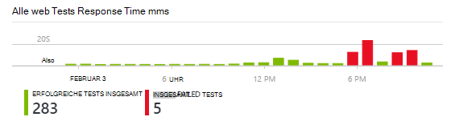

Sie können Webtests für jeden HTTP oder HTTPS-Endpunkt festlegen, die vom öffentlichen Internet zugegriffen werden kann.

Es gibt zwei Arten von Webtests:

* [URL Ping testen](#create): einen einfachen Test im Azure-Portal erstellen.
* [Mehrstufige Webtest](#multi-step-web-tests): Erstellen Sie in Visual Studio Ultimate oder Visual Studio Enterprise und auf das Portal hochladen.

Sie können bis zu 10 Webtests pro Anwendungsressource erstellen.

## 1. erstellen Sie 1. eine Ressource für Ihre Testberichte

Überspringen Sie diesen Schritt, wenn Sie bereits [eine Application Insights-Ressource eingerichtet] haben[ start] für diese Anwendung, und Sie wollen die Verfügbarkeitsberichte am selben Ort.

[Microsoft Azure](http://azure.com)anmelden zum [Azure-Portal](https://portal.azure.com)und Application Insights-Ressource erstellen.

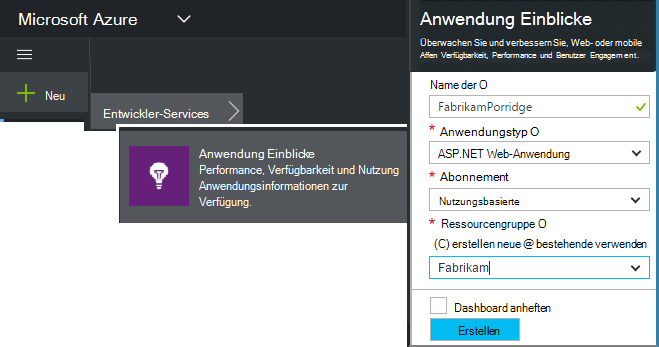

Klicken Sie auf **alle Ressourcen** öffnen Übersicht Blade für die neue Ressource.

## 2. erstellen Sie einen URL-Ping-test

Application Insights-Ressource suchen Sie nach Verfügbarkeit nebeneinander. Klicken Sie auf, um das Web Tests Blade für die Anwendung zu öffnen, und fügen Sie einen Webtest.

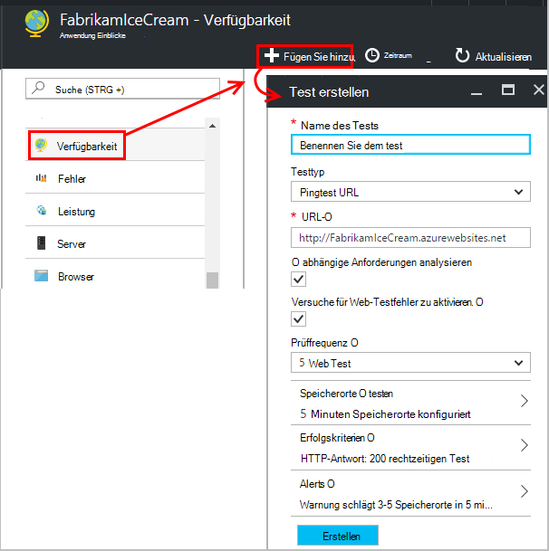

- **Die URL** muss dem öffentlichen Internet sichtbar. Zählen eine Abfragezeichenfolge & #151; also beispielsweise Sie können Übung Ihrer Datenbank ein wenig. Wenn die URL eine Umleitung ergibt, folgen wir bis 10 leitet.
- **Abhängige Anforderungen analysieren**: Bilder, Skripts, Style-Dateien und andere Ressourcen der Seite als Teil des Tests angefordert und die aufgezeichnete Reaktionszeit enthält diese Zeiten. Der Test schlägt fehl, wenn diese Ressourcen innerhalb des Zeitlimits für den gesamten Test erfolgreich heruntergeladen werden können.
- **Versuche aktivieren**: Wenn der Test fehlschlägt, wird Sie nach kurzer Zeit wiederholt. Nur wenn drei aufeinander folgende Versuche fehlschlagen, wird ein Fehler gemeldet. Nachfolgende Tests werden dann bei der üblichen durchgeführt. Wiederholen ist bis zum nächsten Erfolg vorübergehend. Diese Regel gilt unabhängig an jedem Standort Test. (Es wird empfohlen diese Einstellung. Durchschnittlich verschwinden ca. 80 % der Ausfälle auf Wiederholen.)
- **Testen Sie Häufigkeit**: Legt fest, wie oft der Test von jedem Test ausgeführt wird. Mit fünf Minuten und fünf Standorte wird Ihre Site im Durchschnitt pro Minute getestet.
- **Test Speicherorte** sind die Orte aus, an unseren Servern Webanfragen Ihrer URL senden. Wählen Sie mehrere, sodass Sie Probleme in Ihrer Website Netzwerkprobleme unterscheiden können. Sie können bis zu 16 Positionen auswählen.

- **Erfolg**:

    **Test-Timeouts**: Dieser Wert langsam Antworten benachrichtigt werden. Der Test wird als Fehler gezählt, wenn die Antworten Ihrer Website innerhalb dieser Frist nicht eingegangen sind. Wenn **abhängige Anforderungen analysieren**, dann alle Bilder, stildateien ausgewählt müssen Skripts und andere abhängigen Ressourcen innerhalb dieser Frist eingegangen sind.

    **HTTP-Antwort**: zurückgegebene Statuscode, der als erfolgreich gewertet. 200 ist der Code, der angibt, dass eine normale Webseite zurückgegeben wurde.

    **Inhalt**: eine Zeichenfolge wie "Willkommen!" Wir testen, dass in jeder Antwort auftritt. Es muss eine einfache Zeichenfolge ohne Platzhalter sein. Vergessen Sie nicht, dass wenn sich die Seite möglicherweise aktualisieren.

- **Alerts** sind standardmäßig an Sie gesendet wird, treten Fehler in Standorten über fünf Minuten. Ein Fehler in einem Standort ist ein Netzwerkproblem und nicht auf ein Problem mit Ihrer Site zu. Schwellenwert mehr oder weniger zu ändern und Sie können auch ändern, an die e-Mails gesendet werden sollen.

    Sie können eine [Webhook](../monitoring-and-diagnostics/insights-webhooks-alerts.md) einrichten, die aufgerufen wird, wenn eine Warnung ausgelöst wird. (Aber beachten Sie, dass derzeit Abfrageparameter nicht über Eigenschaften übergeben werden.)

### Testen Sie mehrere URLs

Fügen Sie weitere Tests hinzu. Wird auch als Startseite testen können Sie sicherstellen, dass Ihre Datenbank ausgeführt wird, testen Sie die URL für die Suche.

## 3. finden Sie in Ihrem Web Testergebnisse

Ergebnisse werden nach 1 bis 2 Minuten Blade Webtest angezeigt.

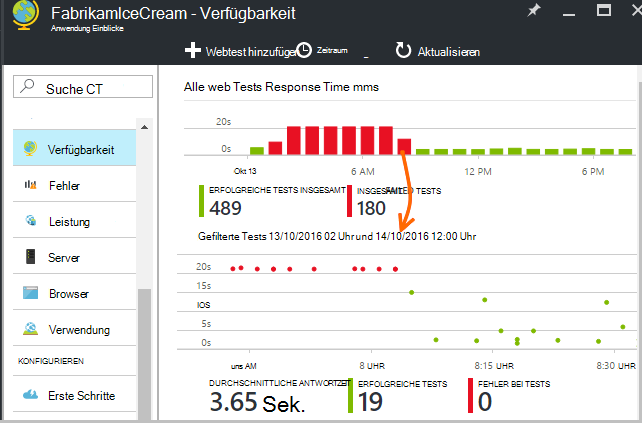

Klicken Sie auf alle im Diagramm für eine detailliertere Ansicht der Periode.

Diese Diagramme werden Ergebnisse für alle Webtests dieser Anwendung kombiniert.

## Wenn Sie Fehler entdecken

Klicken Sie auf einen roten Punkt.

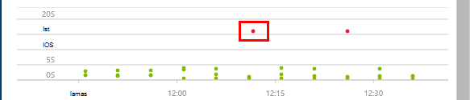

Scrollen Sie nach unten oder klicken Sie auf Test Sie finden weniger als 100 % Erfolg.

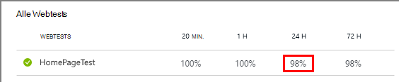

Die Ergebnisse des Tests geöffnet.

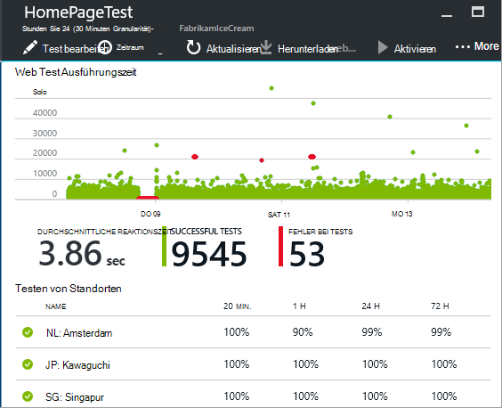

Der Testlauf mehrmals & #151; auswählen, werden die Ergebnisse weniger als 100 %.

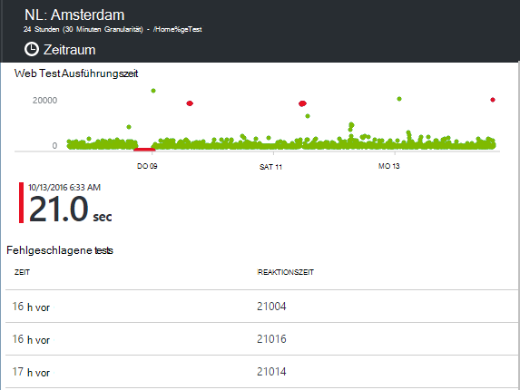

**Fehlgeschlagene Tests** Scrollen Sie und wählen Sie ein Ergebnis.

Klicken Sie auf das Ergebnis im Portal evaluieren und sehen, warum es fehlgeschlagen ist.

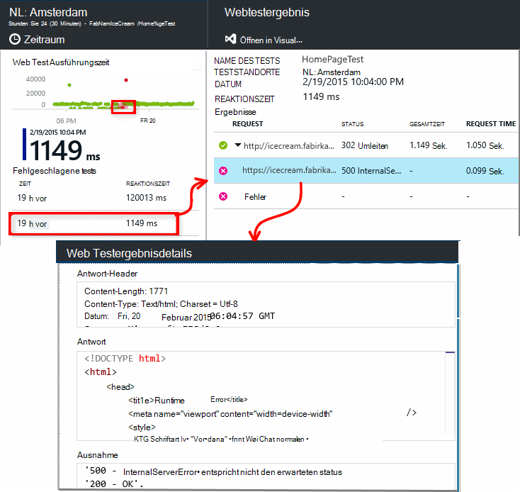

Alternativ können Sie Ergebnis herunterladen und in Visual Studio überprüfen.

*Richtig, aber ein Fehler gemeldet?* Überprüfen Sie alle Bilder, Skripts, Stylesheets und andere Dateien, die von der Seite geladen. Diese schlägt der Test als ausgefallen gemeldet, auch wenn die HTML-Hauptdatei Seite OK geladen.

## Mehrstufige Webtests

Sie können ein Szenario, bei dem eine Folge von URLs, überwachen. Z. B. Wenn Sie eine Webseite überwachen, können Sie testen, Hinzufügen von Elementen zum Einkaufen funktioniert ordnungsgemäß Einkaufswagen.

Erstellen einen mehrstufigen Test aufzeichnen Szenario mithilfe von Visual Studio und Aufzeichnung auf Application Insights hochladen. Anwendung Einblicke Szenario in Intervallen wiederholt und überprüft die Antworten.

Verwendung kann nicht Funktionen in Ihren Tests codiert: Szenarienschritte müssen als Skript in die Webtest-Datei enthalten sein.

#### 1. erfassen Sie ein Szenario

Verwenden Sie Visual Studio Enterprise oder Ultimate websitzung aufzuzeichnen.

1. Erstellen Sie ein Projekt.

    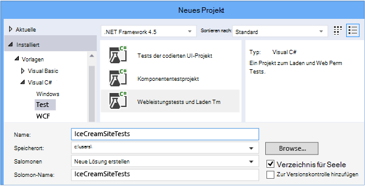

2. Die Webtest-Datei öffnen und aufnehmen.

    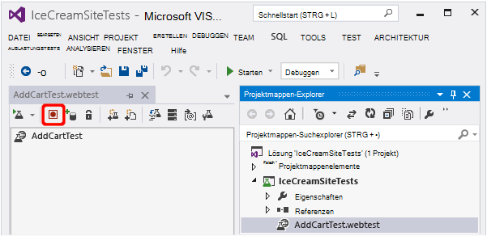

3. Führen Sie die Benutzeraktionen im Test simulieren möchten: Öffnen Sie Ihre Website, Hinzufügen eines Produkts zum Warenkorb und so weiter. Halten Sie den Test.

    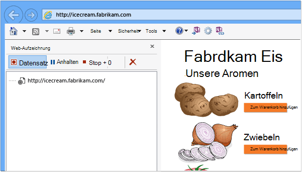

    Stellen Sie nicht lang Szenario. Es sind maximal 100 Schritte und 2 Minuten.

4. Bearbeiten des Tests:
 - Fügen Sie Validierungen empfangenen Text und Antwort-Codes überprüfen.
 - Entfernen Sie überflüssigen Aktivitäten. Abhängige Anforderungen für Bilder oder zu Ad Sites nachverfolgen können auch entfernen.

    Denken Sie daran, Sie können nur das Testskript nicht benutzerdefinierten Code hinzufügen oder Aufrufen anderer Webtests. Legen Sie Schleifen nicht im Test. Sie können standardmäßige Webtest-Plug-ins.

5. Tests in Visual Studio, um sicherzustellen, dass es funktioniert.

    Das Testprogramm Web öffnet ein Webbrowser und aufgezeichnete Aktionen wiederholt. Stellen Sie sicher, dass sie erwartungsgemäß funktioniert.

    

#### 2 Laden Sie 2 den Webtest Anwendung Einblicke

1. Erstellen Sie in Application Insights-Portal einen neuen Webtest.

    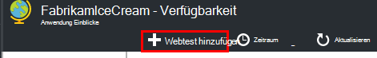

2. Wählen Sie mehrstufigen Test und Hochladen Sie die Webtest-Datei.

    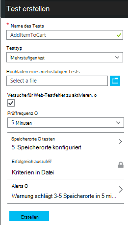

    Festlegen der Test Speicherorte, Häufigkeit und Warnungsparameter in wie Ping-Tests.

Die Testergebnisse und alle Fehler auf die gleiche Weise wie für einzelne Url Tests anzeigen

Eine häufige Ursache für Fehler ist, dass der Test zu lange ausgeführt wird. Er darf nicht länger als zwei Minuten ausgeführt.

Vergessen Sie nicht, alle Ressourcen einer Seite ordnungsgemäß für den Test erfolgreich verläuft, laden müssen einschließlich Skripts, Stylesheets, Bilder usw..

Beachten Sie, dass der Webtest vollständig in die Webtest-Datei enthalten sein muss: in der Test nicht codierte Funktionen verwendet.

### Zeit und Zufallszahlen anschließen in mehrstufigen test

Angenommen Sie, Sie testen ein Tool, die zeitabhängige Daten wie Aktien aus einem externen Feed abruft. Wenn Sie den Webtest aufzeichnen, bestimmte Zeiten verwendet jedoch als Parameter des Tests, Startzeit und Endzeit festgelegt.

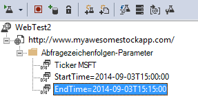

Beim Ausführen der Tests möchten EndTime immer zu Zeit und StartTime sollte Minuten.

Webtest-Plug-ins sind Zeiten parametrisiert.

1. Fügen Sie einen Webtest-Plug-In für jede Variable Parameterwert. Wählen Sie in der Web-Symbolleiste **Test-Plug-In hinzufügen**.

    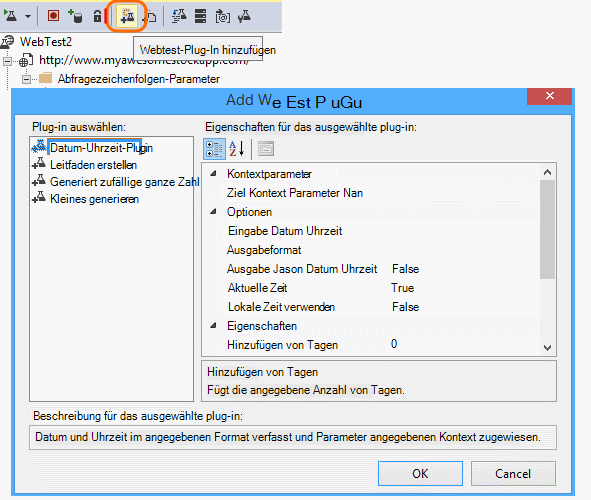

    In diesem Beispiel verwenden wir zwei Instanzen von Datum Uhrzeit Plug-in. Eine Instanz ist für "Minuten" und "jetzt".

2. Öffnen Sie die Eigenschaften jedes plug-in. Geben sie einen Namen und legen sie die aktuelle Uhrzeit verwendet. Für eine von Ihnen, legen Protokoll =-15.

    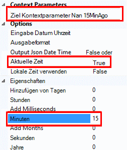

3. Im Web Testparameter, {{Plug-in-Name}} auf ein plug-in verwenden.

    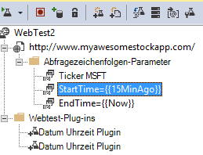

Jetzt Hochladen des Tests zum Portal. Die dynamischen Werte werden bei jeder Ausführung des Tests verwendet.

## Mit Anmeldung

Wenn die Benutzer Ihrer Anwendung anmelden, müssen Sie verschiedene Optionen für die Simulation anmelden, damit Sie Seiten hinter die Anmeldung testen können. Der Ansatz hängt vom Typ der von der Anwendung bereitgestellte Sicherheit.

In allen Fällen sollten Sie ein Konto in der Anwendung nur zum Testen erstellen. Wenn möglich, schränken Sie die Berechtigungen dieses Kontos Test so ein, dass besteht keine Webtests Benutzer beeinträchtigen.

### Einfache Benutzername und Kennwort

Aufzeichnen eines Webtests auf die übliche Weise. Löschen Sie Cookies zuerst.

### SAML-Authentifizierung

Verwenden Sie SAML-Plug-in die verfügbaren Webtests.

### Clientschlüssel

Wenn Ihre app eine Route anmelden, bei der einem geheimen, verwenden Sie diese Route. Azure Active Directory (AAD) ist ein Beispiel für einen Dienst, der einen Client geheimen anmelden. In AAD ist die geheimen Schlüssel App.

Hier ist ein Beispiel Webtest Azure Web App mit einem app-Schlüssel:

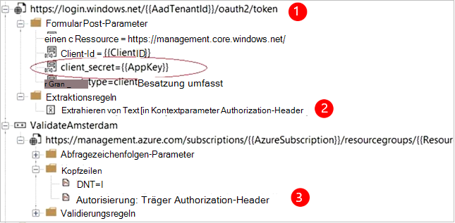

1. Abrufen von token AAD mit geheimen (AppKey).
2. Extrahieren Sie trägertoken aus Antwort.
3. Mit trägertoken in der Authorization-Header-API aufrufen.

Stellen Sie sicher, dass der Webtest einen Kunden - es seine eigene Anwendung in AAD hat - und verwenden Sie die ClientId + Appkey. Der Dienst getestet hat seine eigene Anwendung in AAD: AppID URI dieser App im Webtest im Feld "Resource" wiedergegeben.

### Offene Authentifizierung

Ein Beispiel für offene Authentifizierung ist mit Microsoft oder Google-Konto anmelden. Viele apps, die OAuth stellen Sie dem Client geheimen Alternative erste Taktik, untersuchen soll.

Wenn der Test OAuth anmelden muss, ist generell:

 * Verwenden Sie ein Tool wie Fiddler Datenverkehr zwischen Webbrowser Authentifizierungswebsite und Ihre Anwendung zu.
 * Führen Sie mindestens zwei Anmeldungen mit anderen Computer oder Browser oder lange Intervallen (zu Token abläuft).
 * Vergleichen Sie verschiedene Sessions, identifiziert Token vom authentifizierenden Website, die dann den app-Server nach der Anmeldung an.
 * Aufzeichnen eines Webtests mit Visual Studio.
 * Parametrisieren Sie Token Parameters festlegen, wenn das Token vom Authentifikator zurückgegeben wird und in der Abfrage auf die Website verwenden.
 (Visual Studio versucht, den Test parametrisieren, aber parametrisieren Token nicht richtig.)

## Bearbeiten oder Deaktivieren eines Tests

Öffnen eines einzelnen Tests bearbeiten oder deaktivieren.

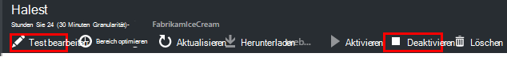

Möglicherweise möchten Webtests deaktivieren, während Sie auf den Dienst gewartet werden.

## Leistungstests

Sie können einen Auslastungstest auf Ihrer Website ausführen. Wie der Test Verfügbarkeit können Sie einfache oder mehrstufigen Anfragen aus unserer weltweit senden. Im Gegensatz zu einem Test Verfügbarkeit sind viele Anfragen gesendet mehreren gleichzeitige Benutzern simulieren.

Übersicht über Blatt öffnen **Einstellungen** **Leistungstests**. Wenn Sie einen Test erstellen, laden oder erstellen Sie ein Visual Studio Team Services-Konto.

Wenn der Test abgeschlossen ist, werden Reaktionszeiten und Erfolgsraten angezeigt.

## Automatisierung

* [Mit PowerShell-Skripts zum Einrichten eines Webtests](https://azure.microsoft.com/blog/creating-a-web-test-alert-programmatically-with-application-insights/) automatisch.
* Richten Sie eine [Webhook](../monitoring-and-diagnostics/insights-webhooks-alerts.md) , die aufgerufen wird, wenn eine Warnung ausgelöst wird.

## Haben Sie Fragen? Probleme?

* *Kann ich von meinem Webtest Code aufrufen?*

    Nein. Die Schritte des Tests muss die Webtest-Datei. Sie können nicht aufrufen anderer Webtests und Schleifen verwenden. Aber es gibt mehrere Plug-Ins, die hilfreich sein können.

* *Unterstützt HTTPS?*

    TLS 1.1 oder TLS 1.2 unterstützt.

* *Gibt es einen Unterschied zwischen "Web" und "Verfügbarkeitstests"?*

    Wir verwenden die beiden Begriffe Synonym.

* *Ich möchte Verfügbarkeitstests auf unsere internen Server verwenden, der hinter einer Firewall ausgeführt wird.*

    Konfigurieren der Firewalls Anfragen von [IP-Adressen der Web test-Agents](app-insights-ip-addresses.md#availability)zu ermöglichen.

* *Hochladen eines mehrstufigen Webtests schlägt fehl*

    Es ist maximal 300 K.

    Schleifen werden nicht unterstützt.

    Verweise auf andere Webtests werden nicht unterstützt.

    Datenquellen werden nicht unterstützt.

* *Meine mehrstufigen Test nicht abgeschlossen*

    Es sind maximal 100 Anfragen pro.

    Der Test wird beendet, wenn mehr als zwei Minuten ausgeführt wird.

* *Wie kann ich einen Test mit Clientzertifikaten ausführen?*

    Nicht unterstützt, die uns leid.

## Video

> [AZURE.VIDEO monitoring-availability-with-application-insights]

## Nächste Schritte

[Suchen von Diagnoseprotokollen][diagnostic]

[Problembehandlung][qna]

[IP-Adressen der Web test-agents](app-insights-ip-addresses.md)

<!--Link references-->

[azure-availability]: ../insights-create-web-tests.md
[diagnostic]: app-insights-diagnostic-search.md
[qna]: app-insights-troubleshoot-faq.md
[start]: app-insights-overview.md
