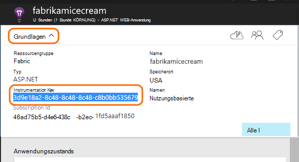
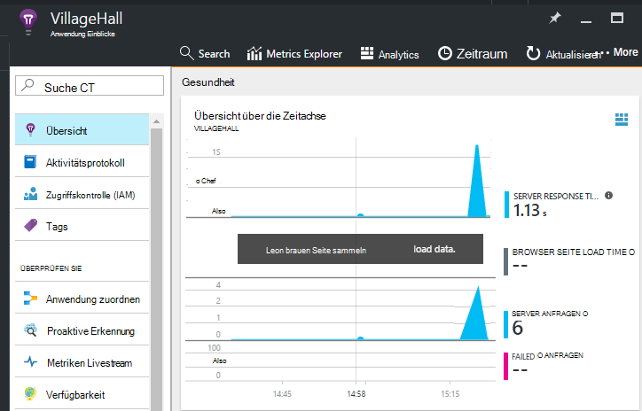

<properties
    pageTitle="Fügen Sie Application Insights SDK Node.js app überwachen | Microsoft Azure"
    description="Auslastung, Verfügbarkeit und Leistung Ihres lokalen oder Microsoft Azure Web Application Anwendung zum Analysieren."
    services="application-insights"
    documentationCenter=""
    authors="alancameronwills"
    manager="douge"/>

<tags
    ms.service="application-insights"
    ms.workload="tbd"
    ms.tgt_pltfrm="ibiza"
    ms.devlang="na"
    ms.topic="get-started-article"
    ms.date="08/30/2016"
    ms.author="awills"/>


# <a name="add-application-insights-sdk-to-monitor-your-nodejs-app"></a>Fügen Sie Application Insights SDK Node.js app Überwachung hinzu

*Anwendung Informationen ist in der Vorschau.*

[Visual Studio Application Insights](app-insights-overview.md) überwacht die aktiven Anwendung zu [erkennen und zu diagnostizieren, Performance-Probleme und Ausnahmen](app-insights-detect-triage-diagnose.md)und [entdecken Sie, wie Ihre Anwendung verwendet wird](app-insights-overview-usage.md). Für apps, die auf Ihre eigenen lokalen IIS-Server oder Azure VMs befinden sowie Azure webapps funktioniert.


Das SDK bietet automatische Erfassung der eingehenden HTTP-Anforderung Sätze und Antworten Leistungsindikatoren (CPU, Arbeitsspeicher, RPS) und nicht behandelte Ausnahmen. Darüber hinaus können Sie benutzerdefinierte Aufrufe Abhängigkeiten, Metriken und andere Ereignisse überwachen hinzufügen.


#### <a name="before-you-start"></a>Bevor Sie beginnen

Du brauchst:

* Visual Studio 2013 oder höher. Höher ist besser.
* Ein [Microsoft Azure-](http://azure.com)Abonnement. Hat das Team oder die Organisation Azure-Abonnement, kann der Besitzer Sie hinzufügen, Ihr [Microsoft-Konto](http://live.com).

## <a name="add"></a>Erstellen einer Application Insights-Ressource

[Azure-Portal]anmelden[portal], und erstellen Sie eine neue Application Insights-Ressource. [Resource] [ roles] in Azure ist eine Instanz eines Dienstes. Diese Ressource ist, Telemetriedaten aus Ihrer app analysiert und zur Verfügung gestellt.


Wählen Sie andere als die Anwendungstyp. Anwendung Art legt den Standardinhalt Ressource Blades und die Eigenschaften in Windows [Explorer Metriken][metrics].

#### <a name="copy-the-instrumentation-key"></a>Kopieren Sie den Instrumentationsschlüssel

Bezeichnet der Schlüssel der Ressource und installieren Sie es bald im SDK leiten Daten an die Ressource.




## <a name="sdk"></a>Installieren Sie das SDK in Ihrer Anwendung

```
npm install applicationinsights --save
```

## <a name="usage"></a>Verwendung

Dadurch können Anforderung Überwachung, Ausnahmefehler verfolgen und System-Performance monitoring (CPU/Speicher/RPS).

```javascript

var appInsights = require("applicationinsights");
appInsights.setup("<instrumentation_key>").start();
```

Instrumentationsschlüssel kann auch in der Umgebungsvariablen APPINSIGHTS_INSTRUMENTATIONKEY festgelegt werden. Erfolgt dies ist kein Argument erforderlich beim Aufrufen von `appInsights.setup()` oder `appInsights.getClient()`.

Das SDK können ohne Telemetrie versuchen: instrumentationsschlüssel auf eine Zeichenfolge festgelegt.


## <a name="run"></a>Führen Sie das Projekt

Führen Sie die Anwendung und ausprobieren: unterschiedliche Seiten um einige Telemetriedaten zu generieren.


## <a name="monitor"></a>Anzeigen der Telemetrie

[Azure-Portal](https://portal.azure.com) zurück, und suchen Sie die Application Insights-Ressource.


Suchen Sie nach Daten in der Seite. Zunächst sehen Sie nur ein oder zwei Punkte. Zum Beispiel:



Klicken Sie auf Diagramme detailliertere Kriterien anzeigen. [Erfahren Sie mehr über Metriken.][perf]

#### <a name="no-data"></a>Keine Daten?

* Mithilfe der Anwendung verschiedene Seiten öffnen, sodass einige Telemetriedaten generiert.
* Öffnen der [Suche](app-insights-diagnostic-search.md) Kachel, um einzelne Ereignisse anzuzeigen. Manchmal dauert es Ereignisse etwas länger Metriken Pipeline zu.
* Warten Sie einige Sekunden, und klicken Sie auf **Aktualisieren**. Diagramme aktualisieren sich regelmäßig, aber Sie können manuell aktualisieren, wenn einige Daten warten angezeigt werden.
* Siehe [Problembehandlung bei][qna].

## <a name="publish-your-app"></a>Veröffentlichen Sie Ihre app

Jetzt bereitstellen Sie die Anwendung, IIS oder Azure und sehen Sie die Daten sammeln.


#### <a name="no-data-after-you-publish-to-your-server"></a>Keine Daten nach dem Veröffentlichen auf dem Server?

Öffnen Sie diese Ports für ausgehenden Datenverkehr in der Server-Firewall:

+ `dc.services.visualstudio.com:443`
+ `f5.services.visualstudio.com:443`


#### <a name="trouble-on-your-build-server"></a>Probleme auf dem Buildserver?

[Dieser Artikel Problembehandlung](app-insights-asp-net-troubleshoot-no-data.md#NuGetBuild)anzeigen


## <a name="customized-usage"></a>Benutzerdefinierte Verwendung 

### <a name="disabling-auto-collection"></a>Deaktivieren Auto-Auflistung

```javascript
import appInsights = require("applicationinsights");
appInsights.setup("<instrumentation_key>")
    .setAutoCollectRequests(false)
    .setAutoCollectPerformance(false)
    .setAutoCollectExceptions(false)
    // no telemetry will be sent until .start() is called
    .start();
```

### <a name="custom-monitoring"></a>Benutzerdefinierte Überwachung

```javascript
import appInsights = require("applicationinsights");
var client = appInsights.getClient();

client.trackEvent("custom event", {customProperty: "custom property value"});
client.trackException(new Error("handled exceptions can be logged with this method"));
client.trackMetric("custom metric", 3);
client.trackTrace("trace message");
```

[Erfahren Sie mehr über Telemetrie API](app-insights-api-custom-events-metrics.md).

### <a name="using-multiple-instrumentation-keys"></a>Die Verwendung mehrerer Instrumentation Schlüssel

```javascript
import appInsights = require("applicationinsights");

// configure auto-collection with one instrumentation key
appInsights.setup("<instrumentation_key>").start();

// get a client for another instrumentation key
var otherClient = appInsights.getClient("<other_instrumentation_key>");
otherClient.trackEvent("custom event");
```

## <a name="examples"></a>Beispiele

### <a name="tracking-dependency"></a>Tracking-Abhängigkeit

```javascript
import appInsights = require("applicationinsights");
var client = appInsights.getClient();

var startTime = Date.now();
// execute dependency call
var endTime = Date.now();

var elapsedTime = endTime - startTime;
var success = true;
client.trackDependency("dependency name", "command name", elapsedTime, success);
```


### <a name="manual-request-tracking-of-all-get-requests"></a>Manuelle Anforderung Nachverfolgen aller "GET" Anfragen

```javascript
var http = require("http");
var appInsights = require("applicationinsights");
appInsights.setup("<instrumentation_key>")
    .setAutoCollectRequests(false) // disable auto-collection of requests for this example
    .start();

// assign common properties to all telemetry sent from the default client
appInsights.client.commonProperties = {
    environment: process.env.SOME_ENV_VARIABLE
};

// track a system startup event
appInsights.client.trackEvent("server start");

// create server
var port = process.env.port || 1337
var server = http.createServer(function (req, res) {
    // track all "GET" requests
    if(req.method === "GET") {
        appInsights.client.trackRequest(req, res);
    }

    res.writeHead(200, { "Content-Type": "text/plain" });
    res.end("Hello World\n");
}).listen(port);

// track startup time of the server as a custom metric
var start = +new Date;
server.on("listening", () => {
    var end = +new Date;
    var duration = end - start;
    appInsights.client.trackMetric("StartupTime", duration);
});
```

## <a name="next-steps"></a>Nächste Schritte

* [Überwachen der Telemetrie im portal](app-insights-dashboards.md)
* [Die Telemetrie Analyseabfragen überschreiben](app-insights-analytics-tour.md)


<!--Link references-->

[knowUsers]: app-insights-overview-usage.md
[metrics]: app-insights-metrics-explorer.md
[perf]: app-insights-web-monitor-performance.md
[portal]: http://portal.azure.com/
[qna]: app-insights-troubleshoot-faq.md
[roles]: app-insights-resources-roles-access-control.md
