<properties
    pageTitle="Verwendungsanalyse Anwendung Einblicke"
    description="Übersicht über Verwendungsanalysen Anwendung Einblicke"
    services="application-insights"
    documentationCenter=""
    authors="alancameronwills"
    manager="douge"/>

<tags
    ms.service="application-insights"
    ms.workload="tbd"
    ms.tgt_pltfrm="ibiza"
    ms.devlang="multiple"
    ms.topic="article" 
    ms.date="04/08/2016"
    ms.author="awills"/>

# Verwendungsanalyse Anwendung Einblicke

Wissen, wie Menschen Ihre Anwendung können Sie die Szenarien, die für sie am wichtigsten sind Ihre Entwicklungsarbeit konzentrieren und Einblicke in die Ziele, die sie einfacher oder schwieriger zu finden.

Anwendung Einblicke können bieten einen klaren Überblick über Ihre Anwendung zu Ihrer Benutzer verbessern und Realisierung Ihrer geschäftlichen Ziele.

Application Insights funktioniert sowohl eigenständige apps (iOS, Android und Windows) und webapps (gehostet auf .NET und J2EE). 

## Anwendung Erkenntnisse zu Ihrem Projekt hinzufügen

Zunächst erhalten Sie ein kostenloses Konto mit [Microsoft Azure](https://azure.com). (Nach Ablauf dieses Zeitraums können Sie mit der freien des Dienstes weiter.)

Erstellen Sie in [Azure-Portal](https://portal.azure.com)Application Insights-Ressource. Dies ist die Nutzung und Performance-Daten über Ihre app finden Sie.

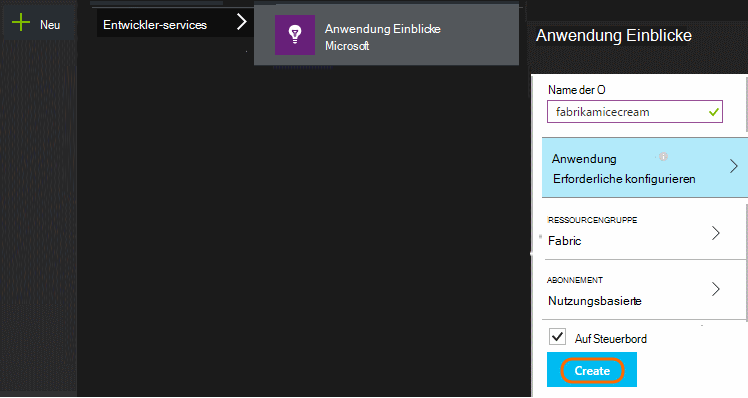

**Ihre Anwendung ist eine geräteanwendung** hinzufügen Application Insights SDK dem Projekt. Die genaue Vorgehensweise hängt von der [IDE und Plattform](app-insights-platforms.md). Für Windows-apps einfach mit der rechten Maustaste des Projekts in Visual Studio und wählen Sie "Add Application Insights."

**Ist eine Web app** öffnen Blade Schnellstart und den Codeausschnitt zu Ihren Webseiten hinzufügen. Veröffentlichen sie mit dieser Ausschnitt.

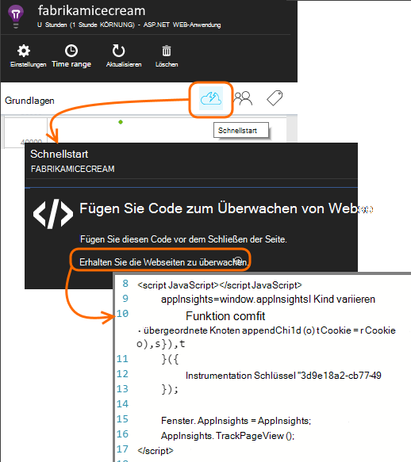

Application Insights fügen Sie Ihren Servercode [ASP.NET](app-insights-asp-net.md) oder [J2EE](app-insights-java-get-started.md) Telemetrie von Client und Server zu kombinieren.

### Führen Sie das Projekt und erste Ergebnisse

Führen Sie das Projekt im Debugmodus für einige Minuten zum [Azure-Portal](https://portal.azure.com) und der Projektressource Erkenntnisse Anwendung durchsuchen.

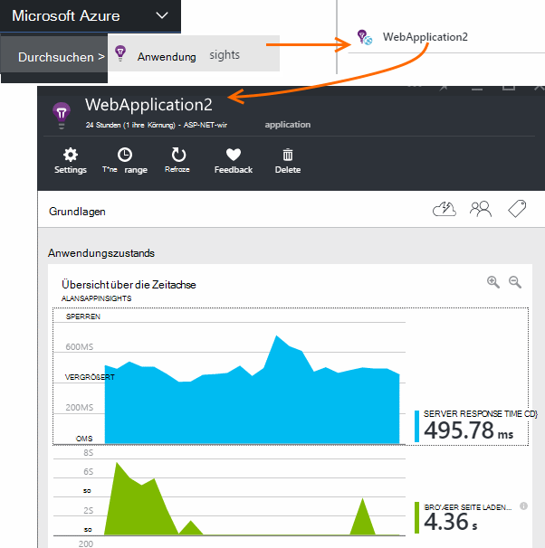

Veröffentlichen Sie Ihre Anwendung mehr Telemetrie und, was die Benutzer mit Ihrer Anwendung finden.

## Analytics aus Feld

Klicken Sie auf die Seitenansichten Kachel um Einzelheiten anzuzeigen.

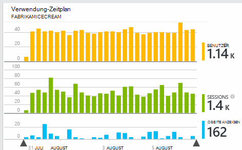

Bewegen Sie den leeren Bereich über einem Diagramm zählt zu einem bestimmten Zeitpunkt angezeigt. Andernfalls zeigen die Zahlen den Wert Zeitraum durchschnittlich, Summe oder Anzahl der verschiedenen Benutzer über den Zeitraum aggregiert.

In Webapplikationen zählen Benutzer mithilfe von Cookies. Eine Person, die mehrere Browser, löscht Cookies oder verwendet die Datenschutzfunktion mehrmals angerechnet.

Websitzung wird nach 30 Minuten Inaktivität gezählt. Wenn die Anwendung mehr als ein paar Sekunden angehalten wird eine Sitzung auf einem Telefon oder einem anderen Gerät zählt.

Klicken Sie auf Diagramme um weitere Details anzuzeigen. Zum Beispiel:

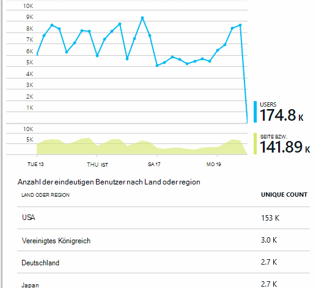

(In diesem Beispiel wird von einer Website, aber ähneln die Diagramme für apps, die auf Geräten ausgeführt.)

Vergleichen Sie mit der vorherigen Woche zu sehen, ob verändert werden:

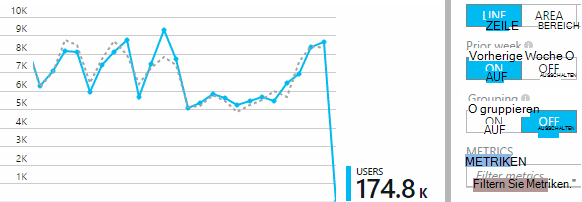

Vergleichen Sie zwei Kriterien, z. B. Benutzer und neue Benutzer:

(Segment) Gruppendaten von einer Eigenschaft oder Browser, Betriebssystem, Stadt:

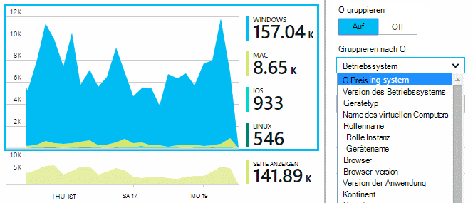

## Verwendung der Seite

Seitenansichten zu Kacheln auf eine Aufschlüsselung der beliebtesten Seiten:

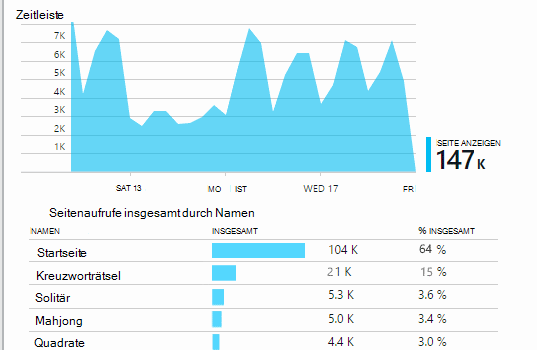

Das obige Beispiel ist von einer Spiele-Website. Daraus ersichtlich sofort:

* Verwendung noch nicht in der letzten Woche verbessert. Vielleicht sollten wir die Optimierung für Suchmaschinen denken?
* Viele sehen weniger Spiele Seiten als die Homepage. Warum Menschen nicht unsere Homepage Spiele?
* Kreuzworträtsel"ist das beliebteste Spiel. Wir sollten neue Ideen und Verbesserung Priorität einräumen.

## Benutzerdefinierte Überwachung

Angenommen, anstatt jedes Spiel auf einer separaten Webseite, beschließen, diese in der gleichen Anwendung einseitige mit Funktionen wie Javascript in der Webseite codiert umzugestalten. Dies ermöglicht schnelles Wechseln zwischen einem Spiel oder sogar mehrere Spiele auf einer Seite.

Aber weiterhin Anwendung Einblicke sich oft jedes Spiel in genau der gleichen Weise wie geöffnet wird, auf einzelne Webseiten. Das ist ganz einfach: Fügen Sie einen Aufruf Telemetrie Modul nur in JavaScript soll Datensatz eine neue Seite geöffnet hat:

    telemetryClient.trackPageView(game.Name);

## Benutzerdefinierte Ereignisse

Telemetrie können in vielerlei Hinsicht zu verstehen, wie Ihre Anwendung verwendet wird. Aber Sie möchten immer die Nachrichten mit Seitenansichten mischen. Verwenden Sie benutzerdefinierte Ereignisse. Sie können diese Gerät apps, Webseiten oder einem Webserver senden:

(JavaScript)

    telemetryClient.trackEvent("GameEnd");

(C#)

    var tc = new Microsoft.ApplicationInsights.TelemetryClient();
    tc.TrackEvent("GameEnd");

(VB)

    Dim tc = New Microsoft.ApplicationInsights.TelemetryClient()
    tc.TrackEvent("GameEnd")

Die häufigsten benutzerdefinierte Ereignisse werden auf der Übersicht aufgeführt.

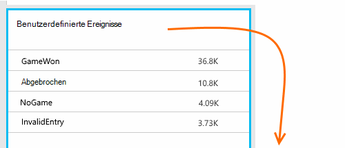

Klicken Sie auf den Anfang der Tabelle die Gesamtzahl der Ereignisse. Sie können das Diagramm durch Attribute wie den Namen segment:

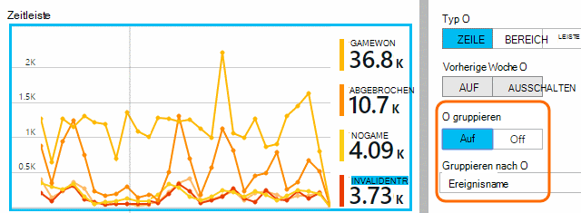

Besonders nützlich Zeitachsen werden Änderungen mit anderen Metriken und Ereignisse korrelieren. Wenn mehrere Spiele erwarten Sie einen Anstieg abgebrochener Spiele. Abgebrochene Spiele unverhältnismäßig ist jedoch möchten Sie herausfinden, ob die hohe Auslastung Probleme, die Benutzer nicht akzeptabel.

## Bestimmte Ereignisse Bohren

Um ein besseres Verständnis wie eine normale Sitzung geht, sollten Sie sich auf einen bestimmten Benutzer-Sitzung, die ein bestimmtes Ereignis enthält.

Beispielsweise kodiert ein benutzerdefiniertes Ereignis "NoGame", die aufgerufen wird, wenn sich der Benutzer abmeldet, ohne tatsächlich eine Spiel. Warum würde ein Benutzer das? Vielleicht Wenn wir einige bestimmte Ereignisse analysieren, erhalten wir einen Hinweis.

Benutzerdefinierte Ereignisse von der Anwendung empfangen werden namentlich auf der Übersicht aufgeführt:

Durch das Ereignis auf, und wählen Sie aktuelle spezifische auftreten:

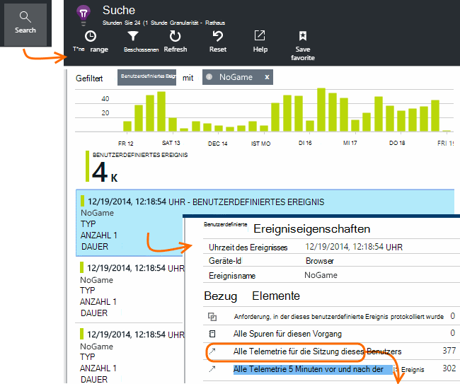

Betrachten wir die Telemetrie für die Sitzung, in der dieses NoGame Ereignis aufgetreten ist.

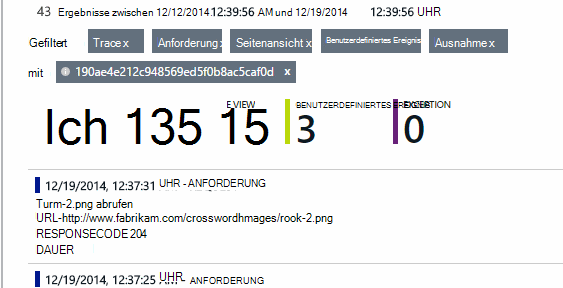

Es gab keine Ausnahmen Benutzer verhindert wurde nicht Fehlschlagen der Wiedergabe.

Wir können alle Arten von Telemetrie außer Seitenaufrufe für diese Sitzung filtern:

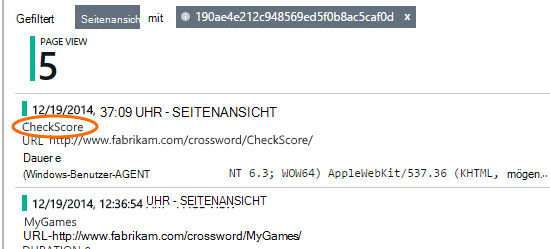

Und jetzt können wir sehen, dass dieser Benutzer angemeldet einfach um die neuesten Ergebnisse zu überprüfen. Vielleicht sollten wir die Entwicklung einer User Story, die es einfacher macht. (Und wir sollten eine benutzerdefinierte Ereignisse implementieren, tritt diese bestimmten Geschichte.)

## Filtern, suchen und Ihre Daten mit Eigenschaften
Sie können beliebige Tags und numerische Werte an Ereignisse anfügen.

JavaScript-Client

    appInsights.trackEvent("WinGame",
        // String properties:
        {Game: currentGame.name, Difficulty: currentGame.difficulty},
        // Numeric measurements:
        {Score: currentGame.score, Opponents: currentGame.opponentCount}
    );

C# auf server

    // Set up some properties:
    var properties = new Dictionary <string, string>
        {{"game", currentGame.Name}, {"difficulty", currentGame.Difficulty}};
    var measurements = new Dictionary <string, double>
        {{"Score", currentGame.Score}, {"Opponents", currentGame.OpponentCount}};

    // Send the event:
    telemetry.TrackEvent("WinGame", properties, measurements);

VB auf server

    ' Set up some properties:
    Dim properties = New Dictionary (Of String, String)
    properties.Add("game", currentGame.Name)
    properties.Add("difficulty", currentGame.Difficulty)

    Dim measurements = New Dictionary (Of String, Double)
    measurements.Add("Score", currentGame.Score)
    measurements.Add("Opponents", currentGame.OpponentCount)

    ' Send the event:
    telemetry.TrackEvent("WinGame", properties, measurements)

Fügen Sie Seitenansichten Eigenschaften auf die gleiche Weise:

JavaScript-Client

    appInsights.trackPageView("Win",
        {Game: currentGame.Name},
        {Score: currentGame.Score});

Diagnostische Suche zeigen Sie Eigenschaften durch ein einzelnes Auftreten des Ereignisses auf an.

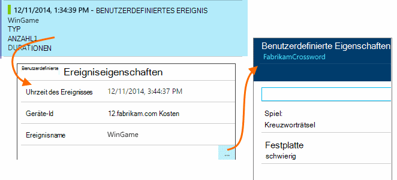

Verwenden Sie das Suchfeld, um Ereignisse mit einem bestimmten Eigenschaftswert anzuzeigen.

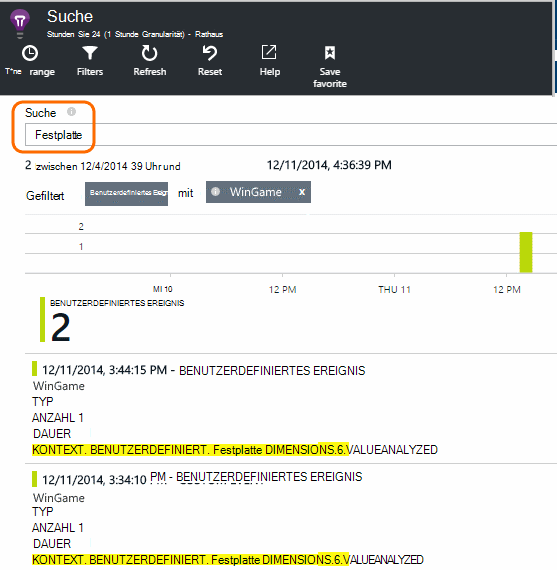

## EIN | B-Tests

Wenn Sie nicht wissen, welche Variante eine erfolgreicher werden lassen Sie beide einzelnen für andere Benutzer. Erfolg jedes und anschließend auf eine einheitliche Version.

Dieses Verfahren wird alle jede Version der Anwendung per Telemetrie unterschiedliche Tags zuordnen. Sie können dies durch Definieren von Eigenschaften in der aktiven TelemetryContext. Diese Standardeigenschaften werden alle Telemetrie Nachricht, die die Anwendung - nicht nur benutzerdefinierten Nachrichten aber standard Telemetriedaten sendet hinzugefügt.

Im Portal Application Insights werden dann möglicherweise filtern und gruppieren (Segment) Daten auf Tags, um verschiedene Versionen vergleichen.

C# auf server

    using Microsoft.ApplicationInsights.DataContracts;

    var context = new TelemetryContext();
    context.Properties["Game"] = currentGame.Name;
    var telemetry = new TelemetryClient(context);
    // Now all telemetry will automatically be sent with the context property:
    telemetry.TrackEvent("WinGame");

VB auf server

    Dim context = New TelemetryContext
    context.Properties("Game") = currentGame.Name
    Dim telemetry = New TelemetryClient(context)
    ' Now all telemetry will automatically be sent with the context property:
    telemetry.TrackEvent("WinGame")

Einzelne Telemetrie kann die Standardwerte überschreiben.

Sie können eine universelle Initialisierung so einrichten, dass alle neuen TelemetryClients automatisch Kontext verwenden.

    // Telemetry initializer class
    public class MyTelemetryInitializer : ITelemetryInitializer
    {
        public void Initialize (ITelemetry telemetry)
        {
            telemetry.Properties["AppVersion"] = "v2.1";
        }
    }

In der app-Initialisierung wie Global.asax.cs:

    protected void Application_Start()
    {
        // ...
        TelemetryConfiguration.Active.TelemetryInitializers
        .Add(new MyTelemetryInitializer());
    }

## Build - Measure - Informationen

Bei Verwendung von Analytics wird Bestandteil Ihres Entwicklungszyklus - nicht nur, den Sie denken Probleme beheben. Hier sind einige Tipps:

* Ermitteln Sie wichtigen Faktor der Anwendung. Möchten Sie so viele Benutzer wie möglich oder lieber eine kleine Gruppe von Benutzern sehr zufrieden? Möchten Sie zu besuchen oder Verkauf?
* Jede Story messen möchten. Wenn Sie skizzieren eine neue User Story oder Feature oder eine bestehende aktualisieren möchten immer überlegen wie messen Sie den Erfolg der Änderung. Vor dem Codieren beginnt Fragen Sie "welche Auswirkung dies auf unsere Metriken muss Wenn es funktioniert? Sollten wir alle neuen Ereignisse nachverfolgen?"
Und natürlich live handelt, betrachten Sie die Analyse und wirken sich auf die Ergebnisse.
* Betreffen Sie andere wichtige Metrik. Z. B. Wenn Sie eine Funktion "Favoriten" hinzufügen, möchten wissen, wie oft Benutzer Favoriten hinzufügen. Aber es ist vielleicht interessant zu wissen, wie oft sie ihre Favoriten zurückkehren. Und vor allem Benutzer Favoriten letztendlich kaufen mehr Ihr Produkt?
* Kanarischen testen. Richten Sie ein Feature Schalter neu nur für einige Benutzer sichtbar. Verwenden Sie Application Insights um festzustellen, ob das neue Feature wie verwendet wird, für die Sie vorgesehen. Anpassen und einem breiteren Publikum freigeben.
* Wenden Sie sich an Ihre Benutzer. Analytics ist nicht ausreichend, sich ergänzende gute Beziehung.

## Weitere Informationen

* [Erkennen, Selektierung und diagnose Systemabstürze und Leistungsprobleme in Ihrer Anwendung](app-insights-detect-triage-diagnose.md)
* [Auf vielen Plattformen Anwendung zum Einstieg](app-insights-detect-triage-diagnose.md)

## Video

> [AZURE.VIDEO usage-monitoring-application-insights]

 
