<properties 
    pageTitle="Anwendung Einblicke Tutorial | Microsoft Azure" 
    description="Nachverfolgen Sie Verwendung und Leistung der Anwendung Web.  Erkennen und selektieren diagnostizieren. Ständig überwachen Sie und verbessern Sie Erfolg mit den Benutzern." 
    services="application-insights" 
    documentationCenter=""
    authors="alancameronwills" 
    manager="douge"/>

<tags 
    ms.service="application-insights" 
    ms.workload="tbd" 
    ms.tgt_pltfrm="ibiza" 
    ms.devlang="na" 
    ms.topic="article" 
    ms.date="10/15/2016" 
    ms.author="awills"/>
 
# Application Insights - Einführung

Visual Studio Application Insights ist ein erweiterbares Analysen, die die Web-Anwendung überwacht. Sie können erkennen und Performance-Probleme diagnostizieren und verstehen Benutzer tatsächlich mit Ihrer Anwendung. Es soll für Entwickler zu Leistung und Verwendbarkeit zu verbessern. Für apps kann eine Vielzahl von Plattformen, einschließlich .NET, Node.js und J2EE Host lokal oder in der Cloud. 

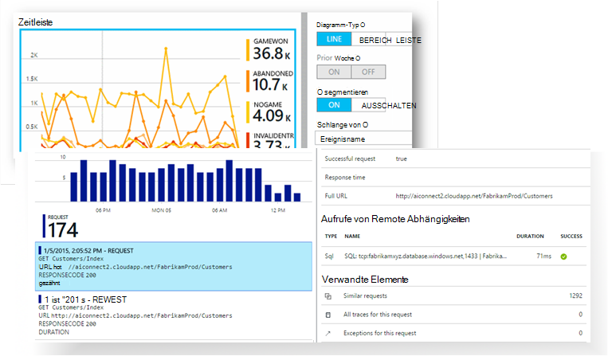

[Betrachten Sie die Intro-Animation](https://www.youtube.com/watch?v=fX2NtGrh-Y0).

## Wie funktioniert es?

Sie installieren eine kleine Instrumentierung der Anwendung und Application Insights-Ressource in Microsoft Azure-Portal einrichten. Die Instrumentation Ihrer Anwendung überwacht und sendet Daten an das Portal. Das Portal zeigt statistische Diagramme und bietet leistungsstarke Suche Tools zur diagnose von Problemen.

Anwendung Einblicke verfügt über verschiedene [standard Instrumentation Module](app-insights-configuration-with-applicationinsights-config.md) , die verschiedene Telemetrie Anforderung Antwortzeiten, Ausnahmen und Abhängigkeit Aufrufe sammeln. Sie können auch [Code schreiben, um benutzerdefinierte Telemetriedaten senden](app-insights-api-custom-events-metrics.md) zum Portal.

### Was ist der Aufwand?

Die Auswirkung auf die Leistung Ihrer Anwendung ist sehr klein. Tracking-Aufrufe werden werden nicht blockiert zusammengefasst und in einem separaten Thread gesendet. 

## Was tut es?

Application Insights soll das Entwicklungsteam zu verstehen, wie Ihre Anwendung ausgeführt wird und wie es verwendet wird. Es bietet:

Telemetrietypen:

* HTTP-Anforderung Sätze Antwortzeiten, Erfolg.
* Abhängigkeit (HTTP & SQL) rufen Sie Raten, Reaktionszeiten, Erfolg.
* Ausnahme Spuren von Server und Client.
* Diagnoseprotokoll Spuren.
* Seitenansicht zählt Benutzer und Sitzung zählt, Browser laden und Ausnahmen.
* AJAX-Tarife Antwortzeiten und Erfolgsraten.
* Server-Leistungsindikatoren.
* Benutzerdefinierte Client- und Telemetrie.
* Segmentierung von Kunden, Browser-Version, Betriebssystemversion, Serverinstanz, benutzerdefinierte Dimensionen und mehr.
* Verfügbarkeitstests

Diagnose und Analyse-Tools:

* Intelligente und manuelle-Alerts Fehlerraten und anderen Kriterien und Verfügbarkeit.
* Diagramme mit der Zeit aggregierten Metriken.
* Diagnostische Suche nach Instanzen von Anfragen, Ausnahmen, benutzerdefinierte Ereignisse protokollieren Spuren, Seitenaufrufe, Abhängigkeit und AJAX aufgerufen. 
* Analytics - eine leistungsfähige Abfragesprache über Ihre Telemetrie
* Dashboards - erstellen der Diagramme müssen Sie Ihre Anwendung Komponenten überwachen.

## Wie verwende ich sie?

### Monitor

Anwendung Einblicke in Ihrer Anwendung, Verfügbarkeit von Webtests einrichten installieren und:

* Richten Sie ein Dashboard für Ihr teamraum zu laden, Reaktionsfähigkeit und die Leistung der abhängigen Seite und AJAX-Aufrufe. 
* Entdecken Sie die langsamste und die meisten fehlerhaften Anfragen.
* Sehen Sie Live-Stream bei der Bereitstellung einer neuen Version Leistungsabfälle sofort wissen.

### Diagnostizieren

Wenn Sie eine Benachrichtigung erhalten oder ein Problem erkennen:

* Ausnahmen und Abhängigkeit Aufrufe Spuren entsprechen Sie Fehler.
* Untersuchen Sie Stapeldumps und Ablaufverfolgungsprotokolle.

### Bewerten

Messen Sie die Effektivität der alle neuen Features, die Sie bereitstellen.

* Messen, wie Kunden neue UX oder Business-Funktionen nutzen möchten.
* Schreiben Sie benutzerdefinierte Telemetrie in Verwendung sich Code.
* Beweise von Telemetrie basieren Sie jeden Entwicklungszyklus.

## Erste Schritte

Anwendung Einblicke ist eines der vielen in Microsoft Azure gehostet und Telemetrie geht es für Analysen und Präsentationen. Bevor Sie etwas anderes tun, Sie ein Abonnement für [Microsoft Azure](http://azure.com)benötigen. Kostenlos anmelden und können die kostenlose [Tarif](https://azure.microsoft.com/pricing/details/application-insights/) Anwendung Erkenntnisse. Wenn Ihr Unternehmen bereits ein Abonnement verfügt, konnte sie Ihr Microsoft-Konto hinzufügen. 

Es gibt mehrere Methoden für den Einstieg. Beginnen Sie mit je nachdem, was für Sie am besten geeignet. Sie können die anderen später hinzufügen.

* **Zur Laufzeit: Instrumentieren Ihrer Anwendung auf dem Server.** Eine Aktualisierung der Code verhindert. Sie benötigen Administratorzugriff auf den Server.
 * [**IIS lokal oder auf einem virtuellen Computer**](app-insights-monitor-performance-live-website-now.md)
 * [**Azure WebApp oder VM**](app-insights-monitor-performance-live-website-now.md#if-your-app-runs-as-an-azure-web-app)
 * [**J2EE**](app-insights-java-live.md)
* **Entwicklungszeit: Application Insights Code hinzugefügt.** Ermöglicht es Ihnen, benutzerdefinierte Telemetrie schreiben und Backend-Gerät und desktop-apps.
 * [Visual Studio](app-insights-asp-net.md) 2013 Update 2 oder höher.
 * Java in [Eclipse](app-insights-java-eclipse.md) oder [andere tools](app-insights-java-get-started.md)
 * [Node.js](app-insights-nodejs.md)
 * [Andere Plattformen](app-insights-platforms.md)
* **[Instrumentieren Webseiten](app-insights-javascript.md)** Seitenansicht, AJAX und andere clientseitige Telemetrie.
* **[Verfügbarkeitstests](app-insights-monitor-web-app-availability.md)** - ping Ihre Website regelmäßig von unseren Servern.

> [AZURE.NOTE]  An diesem Punkt möchten vielleicht und experimentieren. Aber wenn Sie sehen, was Application Insights lesen...

## Untersuchen von Metriken

Führen Sie Ihrer app - entweder im Debug-Modus auf dem Entwicklungscomputer oder auf einem Server bereitstellen aus - und für eine Weile. Melden Sie sich der [Azure-Portal](https://portal.azure.com).

Navigieren Sie zu Ihrer Anwendung Application Insights Übersicht Blade:

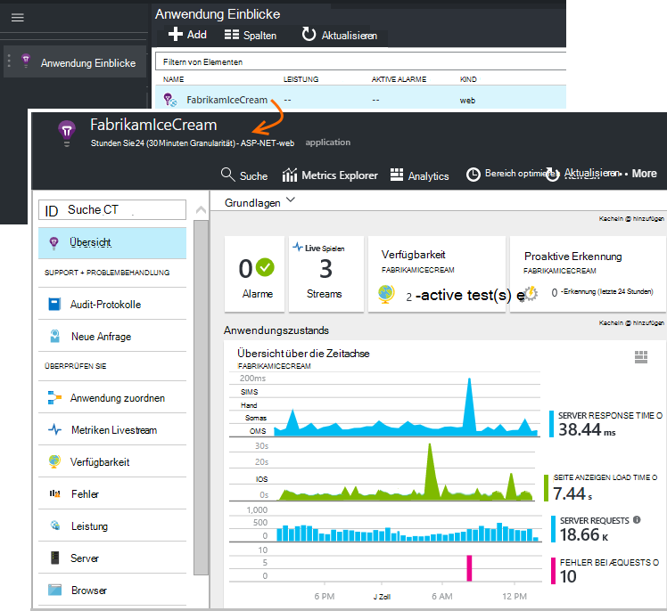

Die Übersicht können Sie sofort sehen, wie Ihre Anwendung ausführt. Sie können Load (in Bezug auf die Anzahl der Anfragen) mit der Zeit Ihre app auch auf Anfragen Antworten vergleichen. Ist ein unverhältnismäßiger Anstieg der Reaktionszeit beim steigt der Auslastung, empfiehlt es sich, mehr Mittel für Ihre Anwendung. Wenn sie fehlgeschlagene Antworten direkt nach der Bereitstellung eines neuen Builds anzeigt, empfiehlt es sich möglicherweise zurücksetzen.

#### Weitere Details

Klicken Sie auf Diagramme, detailliertere Diagramme erhalten. Beispielsweise führt die Antwortzeit des Diagramms, Diagramme, die Anforderung Raten, Reaktionszeiten und Reaktionszeiten Abhängigkeiten (Dienste, die Ihre Anwendung aufruft) anzeigen.  

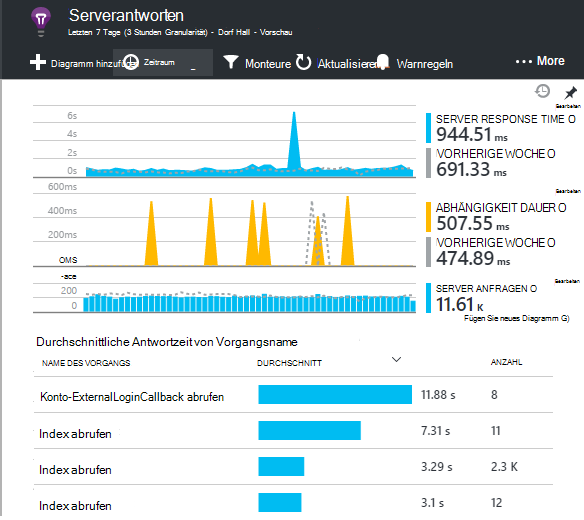

Die Abhängigkeitstabelle ist nützlich, da sie Ihnen helfen, ob die Datenbanken und REST-APIs, die Ihre app verwendet gut reagiert oder Verzögerung verursachen.

#### Anpassen eines Diagramms

Versuchen Sie eines dieser Diagramme bearbeiten. Wenn Ihrer Anwendung auf eine Auflistung von Serverinstanzen ausgeführt wird, können Sie Reaktionszeiten auf verschiedenen Serverinstanzen vergleichen:

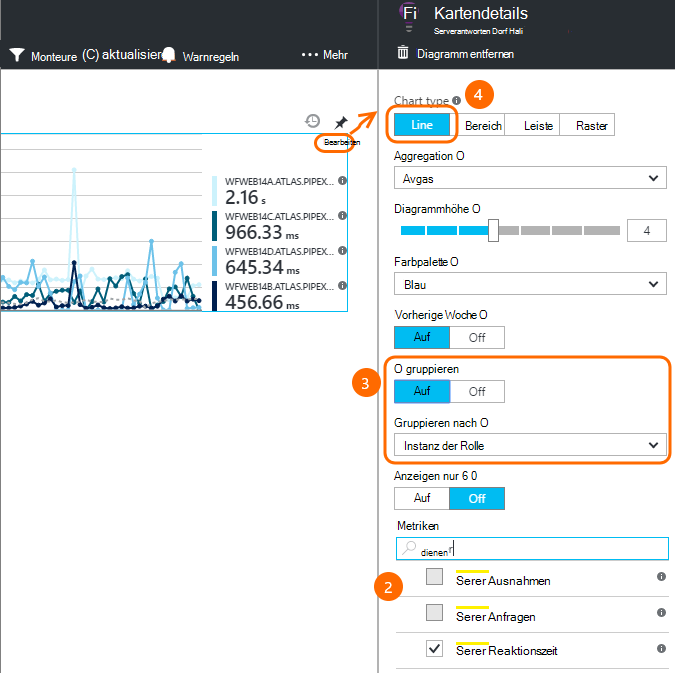

1. Zeigen Sie auf das Diagramm und klicken Sie auf Bearbeiten.
2. Wählen Sie eine Metrik. Mehrere Kriterien in einem Diagramm, aber nur in bestimmten Kombinationen angezeigt werden: möglicherweise eine Metrik deaktivieren, bevor Sie die auswählen.
3. Verwenden von Group By Metrik nach einer Eigenschaft zu segmentieren. In diesem Beispiel zeigen wir separate Zeilen für verschiedene Reaktionszeiten. 

    Beachten Sie, dass Sie eine gültige Eigenschaft für die Metrik auswählen oder das Diagramm keine Daten angezeigt.
4. Wählen Sie einen Diagrammtyp aus. Bereich und Balkendiagrammen anzeigen gestapelt anzeigen geeignet bei der Aggregationstyp 'Summe'

[Mehr zu erkunden Metriken](app-insights-metrics-explorer.md).

## Suchdaten

Um ein Problem zu untersuchen ist für bestimmte Ereignisinstanzen überprüfen.

Klicken Sie auf Diagramm metrische Daten mit entsprechenden Filtern und Zeitraum durchsuchen. Beispielsweise zählt durch Anforderung auf Anfrage anzeigen. 

Oder Sie können direkt auf Instanzdaten Suche auf:

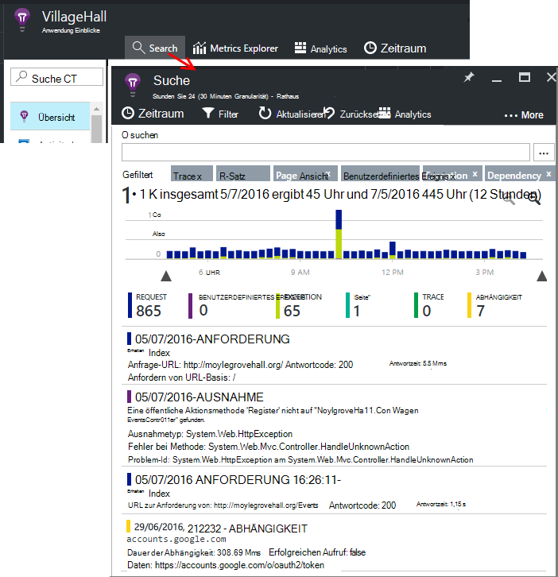

Verwenden Sie Filter auf bestimmte Ereignistypen und ausgewählte Werte:

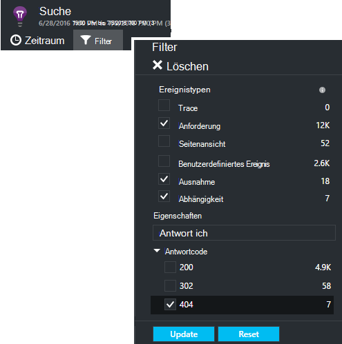

Klicken Sie auf "...", um eine vollständige Liste der Eigenschaften anzuzeigen, oder öffnen Sie andere Ereignisse im Zusammenhang mit der gleichen Anforderung. In diesem Beispiel hat die fehlgeschlagene Anforderung einen Bericht zugeordnete Ausnahme:

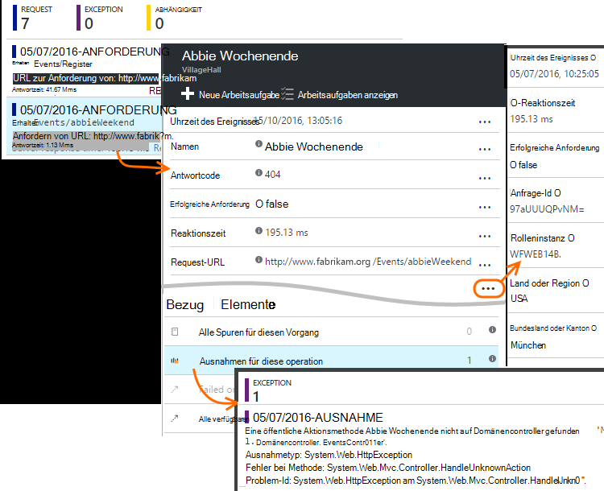

Ein Ereignis - dabei verwandten Ausnahme - öffnen und erstellen Sie eine Arbeitsaufgabe, (Wenn Sie Visual Studio Team Services verwenden, um Aufgaben zu verfolgen). 
 
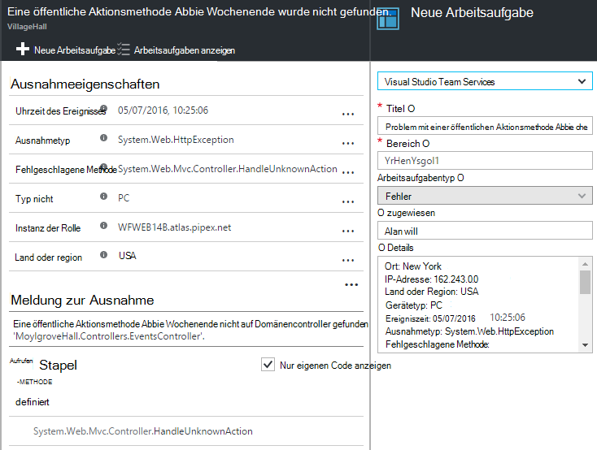

## Analytics

[Analytics](app-insights-analytics.md) ist ein noch leistungsfähigeres Such- und in dem Sie SQL-ähnliche Abfragen über die Telemetriedaten entweder nach bestimmten Themen suchen oder statistische Informationen schreiben können.

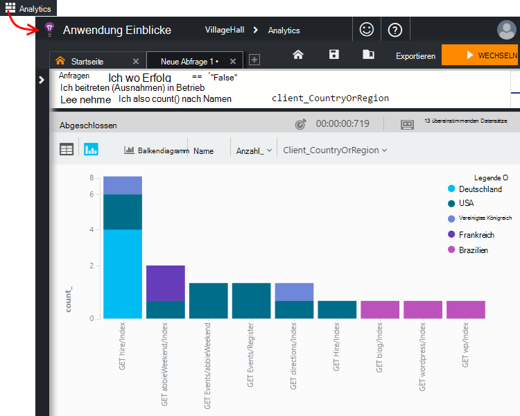

Tutorial Fenster und führen Sie Beispiele für Abfragen über die Daten oder mehr [Tutorial Exemplarische Vorgehensweise](app-insights-analytics-tour.md)lesen. IntelliSense fordert Sie Abfragen, die Sie verwenden können, und ein [Vollständiges Language Reference](app-insights-analytics-reference.md). 

Abfragen beginnen normalerweise mit dem Namen eines Streams Telemetrie wie Anfragen, Ausnahmen oder Dependencies. POP öffnen Schema Links finden eine Liste der verfügbaren Telemetrie Streams. Die Abfrage ist eine Pipeline [Abfrageoperationen](app-insights-analytics-reference.md#queries-and-operators) `where` - boolescher Filter - oder `project` -neue Eigenschaften berechnet. `summarize`[Aggregate Instanzen](app-insights-analytics-tour.md#aggregate-groups-of-rows)Gruppieren nach Funktionen definieren und dann Aggregationsfunktionen gruppierte Daten.

Ergebnisse können [in Tabellen oder verschiedene Diagramm dargestellt](app-insights-analytics-tour.md#charting-the-results)werden.

## Benutzerdefinierte Telemetrie

Integrierte Telemetrie, die Sie erhalten Einblicke Anwendung installieren können Sie die Anzahl Erfolgsraten, analysieren und Reaktionszeiten für Webanfragen auf Ihre app und Dependencies - d. h. Aufrufe Ihrer App zu SQL REST-APIs. Sie erhalten auch Ausnahme Spuren (mit Status Monitor auf dem Server) Systemleistungsindikatoren. Wenn Sie Client Ausschnitt zu Ihren Webseiten hinzufügen, erhalten Sie Seitenzahlen anzeigen und Ladezeiten, Client-Ausnahmen und AJAX Tarife Erfolg und Antwort. 

Analysieren dieser Telemetrie können Sie viel Leistung und Verwendung Ihrer app erzählen. Aber manchmal nicht genug. Sie möchten die Länge einer Warteschlange überwachen, damit Sie die Leistung optimieren; Anzahl Verkäufe und nach Standort zu segmentieren. oder auf der Clientseite erfahren Sie, wie oft Benutzer eine bestimmte Schaltfläche klicken, um die Benutzeroberfläche zu optimieren.

[Application Insights API](app-insights-api-custom-events-metrics.md) stellt Aufrufe `TrackEvent(name)` und `TrackMetric(name, value)` , damit Sie Ihre eigenen benutzerdefinierten Ereignisse und Metriken senden können. Es sind entsprechende Aufrufe für den Client.

Beispielsweise ist Ihre Webseite eine einseitige app möglicherweise Einfügen einer Zeile an den entsprechenden Stellen sich Benutzer gewinnt oder verliert eine Spiel:

    
    appInsights.trackEvent("WinGame");
    ...
    appInsights.trackEvent("LoseGame");

Dann können wir benutzerdefiniertes Ereignis zählt Diagramm segmentieren nach Namen:

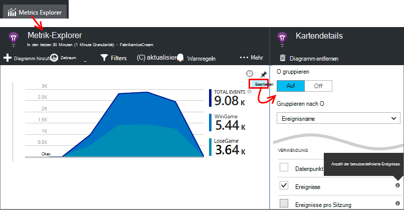

### Protokoll-Spuren

Für Diagnosezwecke ist ein benutzerdefiniertes Ereignis `TrackTrace(message)` , die für Ausführung Spuren können. Suche und Analyse-Funktionen können Sie auf den Inhalt der Nachricht suchen, die mehr als ein Ereignisname. 

Wenn Sie bereits eine protokollierungsframework wie Log4Net, NLog, Log4J oder System.Diagnostic.Trace, und diese Aufrufe Trace Einsichten Anwendung erfasst werden, erscheint neben der Telemetrie. Visual Studio Tools hinzufügen automatisch das entsprechende SDK-Modul.

## Dashboards

Häufig bestehen aus mehreren Komponenten wie einen Webdienst und einem oder mehreren back-Ends Prozessoren. Jede Komponente wird von einer separaten Anwendung Einblicke Ressource überprüft. Bei Betrieb auf Azure, Sie verwenden - und Überwachungsdienste - Ereignis Hubs und Computer sowie lernen. 

Zum Überwachen des gesamten Systems können andere apps interessantesten Diagramme auswählen und Heften sie ein Azure [Dashboard](app-insights-dashboards.md)können Sie das gesamte System fortlaufend überwachen. 

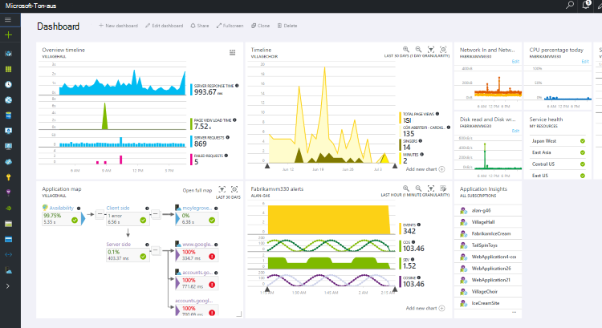

Tatsächlich können Sie mehrere Dashboards - z. B. ein Team Platz Dashboard zum Überwachen von allgemeinen Systemzustand erstellen. Dashboard entwerfen, die auf die Verwendung der verschiedenen Features; eine separate Dashboard für Komponenten getestet; Und so weiter.  

Teammitglieder können Dashboards, wie Ressourcen gemeinsam.

## Entwicklung in Visual Studio

Wenn Sie Visual Studio verwenden, um Ihre Anwendung zu entwickeln, finden Sie mehrere Application Insights-Tools integriert. 

### Diagnose suchen

Das Suchfenster zeigt Ereignisse, die protokolliert wurden. (Wenn Sie in Azure Anwendung Einblicke einrichten angemeldet, können die gleichen Ereignisse im Portal werden Sie.)

Die Freitextsuche kann auf alle Felder der Ereignisse. Suchen Sie beispielsweise Teil der URL der Seite; oder den Wert einer Eigenschaft z.B. Client; oder bestimmte Wörter eines Protokolls.

Klicken Sie auf ein Ereignis um detaillierten Eigenschaften anzuzeigen.

Sie können auch die Registerkarte verwandte Elemente, um Diagnose von fehlgeschlagenen Anfragen oder Ausnahmen öffnen.

### Diagnose-hub

Diagnose-Hub (Visual Studio 2015 oder später) zeigt Telemetrie Server Application Insights generiert wird. Dies funktioniert auch dann, wenn Sie sich, nur das SDK installieren entschieden, ohne eine Verbindung mit einer Ressource im Azure-Portal.

### Ausnahmen

Wenn Sie [ausnahmeüberwachung eingerichtet](app-insights-asp-net-exceptions.md)haben, werden ausnahmeberichte im Suchfenster angezeigt. 

Klicken Sie auf eine Ausnahme zu einem Stack Trace. Wenn der Code der Anwendung in Visual Studio geöffnet ist, können Sie durch von Stapelrahmen entsprechenden Codezeile klicken.

Darüber hinaus wird in der Zeile Code objektiv über jede Methode Anzahl von Anwendung Einblicke in den letzten 24 Stunden protokolliert Ausnahmen angezeigt.

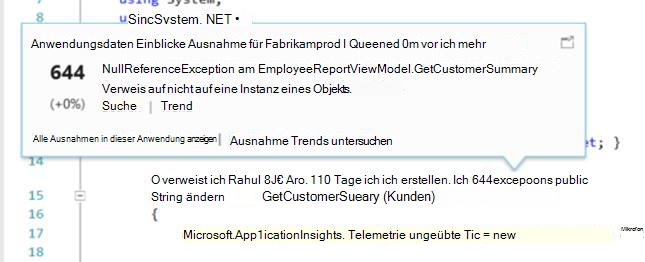

### Lokale Überwachung

(Von Visual Studio 2015 Update 2) Wenn Sie das SDK Telemetrie an Application Insights-Portal senden (deshalb keine instrumentationsschlüssel in ApplicationInsights.config) konfiguriert haben zeigt das Diagnosefenster Telemetriedaten aus der aktuellen Debugsitzung. 

Dies empfiehlt sich, wenn bereits eine frühere Version Ihrer Anwendung veröffentlicht haben. Nicht Telemetriedaten aus Ihrem Debugsitzungen mit Telemetrie Anwendung Insights-Portal aus der veröffentlichten Anwendung gemischt werden sollen.

Es ist auch nützlich, haben Sie einige [benutzerdefinierte Telemetrie](app-insights-api-custom-events-metrics.md) , die zu debuggende bevor Telemetrie an das Portal.

* *Zuerst konfiguriert ich vollständig Anwendung Einblicke Telemetrie zum Portal senden. Aber ich möchte jetzt Telemetrie in Visual Studio.*

 * In das Suchfenster Einstellungen ist eine Option zum lokalen Diagnose suchen, auch wenn Ihre app Telemetrie Portal sendet.
 * Stoppen Sie Telemetrie an das Portal kommentieren Sie die Zeile `<instrumentationkey>...` von ApplicationInsights.config. Wenn Sie das Portal Telemetrie erneut senden möchten, kommentieren Sie es aus.

## Trends

Trends ist ein Tool in Visual Studio für das Verhalten Ihrer Anwendung mit der Zeit darstellen. 

Wählen Sie Application Insights Symbolleistenschaltfläche oder Anwendung Einblicke Suchfenster **Telemetrie Trends untersuchen** . Wählen Sie eine der fünf allgemeine Abfragen zu beginnen. Sie können unterschiedlichen Datasets anhand von Telemetriedaten Typen, Zeiträume und andere Eigenschaften analysieren. 

Um Anomalien in den Daten zu suchen, wählen Sie eine Anomalie Optionen unter "Ansichtstyp" Dropdown. Filteroptionen am unteren Fensterrand erleichtern die bestimmte Teilmengen der Telemetrie weiter.

## Freigeben eines neuen Builds

### Metriken Livestream

Metriken Livestream zeigt die Anwendungswerte vor diesem Augenblick mit einer nahezu in Echtzeit Wartezeit von 1 Sekunde. Ist besonders nützlich, wenn Sie einen neuen Build veröffentlichen und sicherzustellen, dass alles erwartungsgemäß arbeiten oder Untersuchen von Sicherheitsvorfällen in Echtzeit

Im Gegensatz zu Metrik-Explorer zeigt Livestream Metriken festgelegten Kriterien. Die Daten beibehalten werden nur solange im Diagramm ist und dann verworfen. 

### Strukturänderungen

[Release Annotations](app-insights-annotations.md) Metriken Diagramme anzeigen, in dem Sie einen neuen Build bereitgestellt. Sie erleichtern die überprüfen, ob Änderungen Einfluss auf die Leistung der Anwendung haben. Sie können automatisch von [Visual Studio Team Services Buildsystem](https://www.visualstudio.com/en-us/get-started/build/build-your-app-vs)erstellt werden und können Sie auch [Erstellen sie PowerShell](#create-annotations-from-powershell).

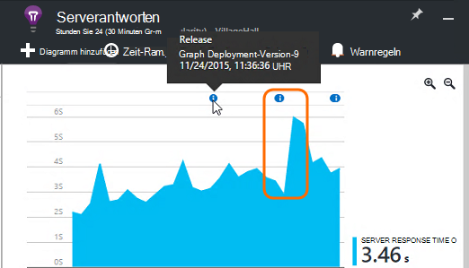

Release Annotations eine cloudbasierte Builds und Service von Visual Studio Team Services. 

## Alarme

Wenn etwas mit Ihrer app falsch sind, sollten Sie sofort wissen. 

Application Insights bietet drei Arten der Warnung, die per e-Mail übermittelt werden.

### Proaktive Diagnose 

[Proaktive Diagnose](app-insights-proactive-failure-diagnostics.md) automatisch eingerichtet - Sie nicht konfigurieren. Ihrer Website ausreichend Verkehr hat, erhalten Sie eine e-Mail, wenn ein Anstieg fehlgeschlagenen Anfragen, die für die Zeit des Tages oder die Anforderung ungewöhnlich ist. Die Warnung enthält Diagnoseinformationen. 

Hier ist eine Beispiel-Warnung. 

Ein zweiter Typ proaktive Erkennung erkennt Korrelationen zwischen Fehlern und Faktoren, Client-Betriebssystem oder Browser.

### Metrische alerts

Konfigurieren Sie [metrische Alerts](app-insights-alerts.md) sagen bei eine Metrik für einen gewissen Zeitraum - Fehleranzahl, Speicher oder Seitenansichten einen Schwellenwert überschreitet.

### Verfügbarkeit

[Verfügbarkeit von Webtests](app-insights-monitor-web-app-availability.md) Anfragen zur Website von unseren Servern an verschiedenen Standorten auf der ganzen Welt. Sie sagen Wenn Ihre Website im Internet nicht verfügbar oder reagiert langsam ist. 

## Exportieren

Es gibt verschiedene Arten die Telemetriedaten aus Application Insights-Portal zu erhalten:

* [Kontinuierliche exportieren](app-insights-export-telemetry.md) ist ideal, wenn Teil der Telemetrie länger als die standardmäßige Aufbewahrungszeit bleiben sollen.
* [Metriken](app-insights-metrics-explorer.md#export-to-excel) Tabellen, Suchergebnisse und [Analytics](app-insights-analytics.md) Ergebnisse können alle in einer Excel-Tabelle exportiert werden. 
* Data Access REST-API kann verwendet werden, und Daten, einschließlich Analytics Abfragen ausführen. Die API ist derzeit in privaten Vorschau. [Erfahren Sie mehr über die Vorschau verknüpfen](https://visualstudio.uservoice.com/forums/357324-application-insights/suggestions/4999529-make-data-accessible-via-apis-for-custom-processin).
* Exportieren [Analyseabfragen Power BI](app-insights-export-power-bi.md) -Dashboards und Anzeigen der Ergebnisse in Power BI-Visualisierung, die automatisch aktualisiert werden können.

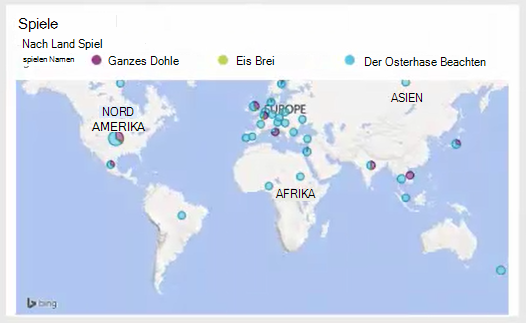
 
## Datenmanagement

Gibt es Grenzwerte für die Verwendung von Application Insights teilweise das Preismodell abhängig, die Sie auswählen. Die wichtigsten sind auf:

* Telemetrie pro minute
* Datenpunkt pro Monat
* Aufbewahrungsdauer für Daten

[Sampling](app-insights-sampling.md) ist ein Mechanismus zur Kostensenkung und zur Vermeidung Drosselung. Sie verwirft Anteil der Telemetrie eine repräsentative halten. Zugeordnete Elemente (z. B. Ausnahmen und die Anfragen, die sie verursacht) beibehalten oder verworfen zusammen. Für ASP.NET Applications Probenahme erfolgt automatisch und in der Anwendung angewendet wird. Andernfalls setzen Sie es auf Aufnahme zum Portal.

## Nächste Schritte

Erste Schritte mit Laufzeit:

* [IIS-server](app-insights-monitor-performance-live-website-now.md)
* [J2EE-server](app-insights-java-live.md)

Erste Schritte zur Entwicklungszeit mit:

* [ASP.NET](app-insights-asp-net.md)
* [Java](app-insights-java-get-started.md)
* [Node.js](app-insights-nodejs.md)

## Support und feedback

* Fragen und Probleme:
 * [Problembehandlung][qna]
 * [MSDN-Forum](https://social.msdn.microsoft.com/Forums/vstudio/home?forum=ApplicationInsights)
 * [StackOverflow](http://stackoverflow.com/questions/tagged/ms-application-insights)
 * [Developer Support erhalten](app-insights-get-dev-support.md)
* Ihre Vorschläge:
 * [UserVoice](https://visualstudio.uservoice.com/forums/357324)
* Blog:
 * [Anwendung Insights blog](https://azure.microsoft.com/blog/tag/application-insights)

## Videos

[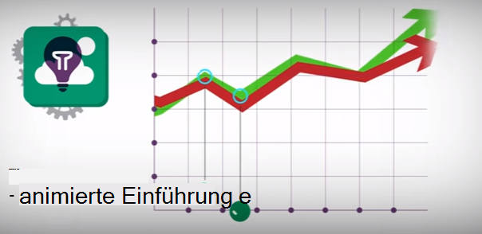](https://www.youtube.com/watch?v=fX2NtGrh-Y0)

> [AZURE.VIDEO 218]

> [AZURE.VIDEO usage-monitoring-application-insights]

> [AZURE.VIDEO performance-monitoring-application-insights]

> [Einführende animation](https://www.youtube.com/watch?v=fX2NtGrh-Y0)

<!--Link references-->

[android]: https://github.com/Microsoft/ApplicationInsights-Android
[azure]: ../insights-perf-analytics.md
[client]: app-insights-javascript.md
[desktop]: app-insights-windows-desktop.md
[detect]: app-insights-detect-triage-diagnose.md
[greenbrown]: app-insights-asp-net.md
[ios]: https://github.com/Microsoft/ApplicationInsights-iOS
[java]: app-insights-java-get-started.md
[knowUsers]: app-insights-overview-usage.md
[platforms]: app-insights-platforms.md
[portal]: http://portal.azure.com/
[qna]: app-insights-troubleshoot-faq.md
[redfield]: app-insights-monitor-performance-live-website-now.md

 