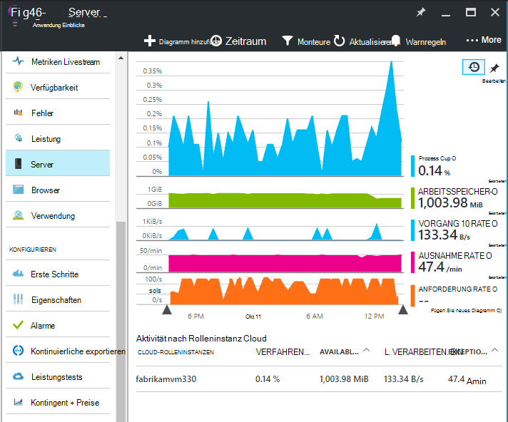
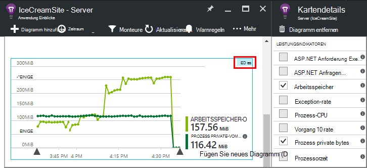
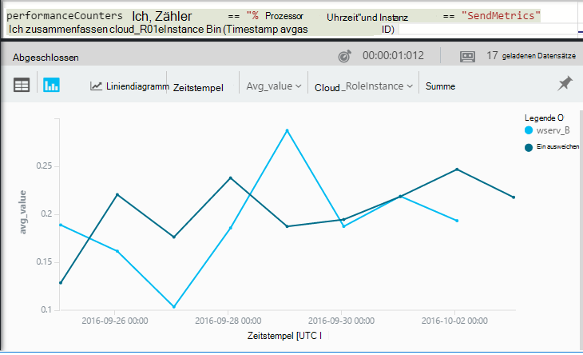

<properties 
    pageTitle="Leistungsindikatoren in Application Insights | Microsoft Azure" 
    description="Überwachen Sie System und Anwendung Erkenntnisse benutzerdefinierte .NET Leistungsindikatoren." 
    services="application-insights" 
    documentationCenter=""
    authors="alancameronwills" 
    manager="douge"/>

<tags 
    ms.service="application-insights" 
    ms.workload="tbd" 
    ms.tgt_pltfrm="ibiza" 
    ms.devlang="na" 
    ms.topic="article" 
    ms.date="10/11/2016" 
    ms.author="awills"/>
 
# <a name="system-performance-counters-in-application-insights"></a>Systemleistungsindikatoren in Anwendung Einblicke


Windows bietet eine Vielzahl von [Leistungsindikatoren](http://www.codeproject.com/Articles/8590/An-Introduction-To-Performance-Counters) wie CPU-Auslastung, Speicher, Datenträger und Netzwerk. Sie können auch eigene definieren. [Anwendung Einblicke](app-insights-overview.md) zeigen diese Leistungsindikatoren, läuft die Anwendung unter IIS auf einem lokalen Host oder virtuellen, Administratorzugriff haben. Diagramme zeigen die live Anwendung Ressourcen und unausgeglichene Last Serverinstanzen identifizieren können.

Leistungsindikatoren werden in das Server-Blade, enthält einer Tabelle, Segmente Serverinstanz angezeigt.



(Leistungsindikatoren sind nicht verfügbar für Azure Web Apps. Aber Sie können [Azure-Diagnose an Application Insights senden](app-insights-azure-diagnostics.md).)

## <a name="configure"></a>Konfigurieren

Application Insights Status Monitor noch auf den Servercomputern installiert ist, müssen Sie installieren, um Leistungsindikatoren angezeigt.

Herunterladen Sie und führen Sie der [Statusmonitor Installer](http://go.microsoft.com/fwlink/?LinkId=506648) auf jeder Serverinstanz aus. Wenn es bereits installiert ist, müssen Sie nicht erneut installieren.

* *Kann ich während der Entwicklung [Anwendung Einblicke SDK in meiner Anwendung installiert](app-insights-asp-net.md) . Muss weiterhin überwachen?*

    Ja, muss Statusmonitor Leistungsindikatoren für ASP.NET webapps erfassen. Wie Sie bereits wissen vielleicht, können [Monitor webapps, die bereits Live,](app-insights-monitor-performance-live-website-now.md)die Statusmonitor auch ohne Installation von SDK während der Entwicklung verwendet werden.


## <a name="view-counters"></a>Zähler anzeigen

Das Server-Blade zeigt eine Reihe von Leistungsindikatoren. 

Um andere Leistungsindikatoren anzuzeigen, entweder die Diagramm-Blade Server ein neues Blatt [Metrik-Explorer](app-insights-metrics-explorer.md) öffnen oder neue Diagramme hinzufügen. 

Wenn Sie ein Diagramm bearbeiten verfügbaren Leistungsindikatoren als Metrik aufgelistet.



Die nützlichsten Diagramme zentral, erstellen Sie ein [Dashboard](app-insights-dashboards.md) und zu fixieren.

## <a name="add-counters"></a>Leistungsindikatoren hinzufügen

Wenn der gewünschte Leistungsindikator in der Liste der Kriterien angezeigt wird, liegt dies daran Application Insights-SDK auf Ihrem Webserver sammeln ist nicht. Sie können dazu.

1. Herauszufinden Sie, welche Indikatoren auf dem Server verfügbar sind, mithilfe von PowerShell-Befehl auf dem Server:

    `Get-Counter -ListSet *`

    (See [`Get-Counter`](https://technet.microsoft.com/library/hh849685.aspx).)

1. Öffnen Sie ApplicationInsights.config.

 * Wenn Sie Ihre Anwendung während der Entwicklung Anwendung Einblicke hinzugefügt ApplicationInsights.config in Ihrem Projekt bearbeiten und dann erneut auf Ihrem Server bereitstellen.
 * Wenn Sie Statusmonitor Instrumentieren eine Webanwendung zur Laufzeit verwendet, finden Sie im Stammverzeichnis der Anwendung in IIS ApplicationInsights.config. Aktualisieren Sie es in jeder Server-Instanz.

2. Bearbeiten Sie Performance-Kollektor Richtlinie:

 ```XML

    <Add Type="Microsoft.ApplicationInsights.Extensibility.PerfCounterCollector.PerformanceCollectorModule, Microsoft.AI.PerfCounterCollector">
      <Counters>
        <Add PerformanceCounter="\Objects\Processes"/>
        <Add PerformanceCounter="\Sales(photo)\# Items Sold" ReportAs="Photo sales"/>
      </Counters>
    </Add>

```

Sie kann sowohl standardmäßigen Leistungsindikatoren auch selbst implementiert haben. `\Objects\Processes`ist ein Beispiel für ein Standardzähler auf allen Windows-Systemen verfügbar. `\Sales(photo)\# Items Sold`ist ein Beispiel für einen benutzerdefinierten Zähler in einem Webdienst implementiert werden könnte. 

Das Format ist `\Category(instance)\Counter"`, oder für Kategorien, die Instanzen nicht `\Category\Counter`.

`ReportAs`ist erforderlich für die Namen der Leistungsindikatoren, die nicht `[a-zA-Z()/-_ \.]+` -d. h. sie Zeichen in folgenden Sets enthalten: Buchstaben, Klammern, Schrägstrich, Bindestrich, Unterstrich, Leerzeichen, Punkt.

Wenn Sie eine Instanz angeben, werden es als Dimension "CounterInstanceName" gemeldete Metrik gesammelt.

### <a name="collecting-performance-counters-in-code"></a>Sammeln von Leistungsindikatoren im code

Sammeln von Systemleistungsindikatoren an Application Insights senden und passen Sie folgenden Codeausschnitt:

    var perfCollectorModule = new PerformanceCollectorModule();
    perfCollectorModule.Counters.Add(new PerformanceCounterCollectionRequest(
      @"\.NET CLR Memory([replace-with-application-process-name])\# GC Handles", "GC Handles")));
    perfCollectorModule.Initialize(TelemetryConfiguration.Active);

Oder mit benutzerdefinierten Messgrößen, die Sie erstellt haben:

    var perfCollectorModule = new PerformanceCollectorModule();
    perfCollectorModule.Counters.Add(new PerformanceCounterCollectionRequest(
      @"\Sales(photo)\# Items Sold", "Photo sales"));
    perfCollectorModule.Initialize(TelemetryConfiguration.Active);

## <a name="performance-counters-in-analytics"></a>Leistungsindikatoren in Analytics

Sie können Suchen und [Analytics](app-insights-analytics.md)Performance Counter Berichte anzuzeigen.


Schema **PerformanceCounters** macht die `category`, `counter` Name und `instance` Name des einzelnen Leistungsindikatoren.  In der Telemetrie für jede Anwendung sehen Sie nur die Leistungsindikatoren für die Anwendung. Z. B. darauf, welche Leistungsindikatoren sind verfügbar: 


("Instanz" bezieht sich hier auf die Leistungsindikatorinstanz nicht die Rolle oder Computer eine Serverinstanz. Der Instanzname Segmente normalerweise Indikatoren wie CPU-Zeit durch den Namen des Prozesses oder der Anwendung.)

Ein Diagramm des verfügbaren Speichers in der letzten Zeit abgerufen: 


Wie andere Telemetrie **PerformanceCounters** auch eine Spalte hat `cloud_RoleInstance` angibt, dass die Identität der Host Server-Instanz auf dem Ihre Anwendung ausgeführt wird. Wenn Sie beispielsweise die Leistung Ihrer Anwendung auf verschiedenen Computern vergleichen: 




## <a name="aspnet-and-application-insights-counts"></a>ASP.NET und Application Insights zählt

*Was ist der Unterschied zwischen der Ausnahme und Metriken Ausnahmen?*

* *Exception-Rate* ist ein Leistungsindikator System. Die CLR zählt alle behandelten und nicht behandelten Ausnahmen, die ausgelöst werden, und dividiert das Ergebnis durch die Länge des Intervalls in einem Samplingintervall. Application Insights SDK sammelt dieses Ergebnis und das Portal an.
* *Ausnahmen* ist die Anzahl der TrackException Berichte durch das Portal in das Samplingintervall des Diagramms. Sie enthält nur die Ausnahmen behandelten, in dem Sie TrackException im aufruft, und nicht alle [nicht behandelten Ausnahmen](app-insights-asp-net-exceptions.md)geschrieben haben. 

## <a name="alerts"></a>Alarme

Wie andere Metriken können Sie warnen, wenn ein Leistungsindikator außerhalb einer Angabe geht [eine Warnung festlegen](app-insights-alerts.md) . Öffnen Sie Alerts-Blade und auf Warnung hinzufügen.


## <a name="next"></a>Nächste Schritte

* [Abhängigkeit verfolgen](app-insights-asp-net-dependencies.md)
* [Tracking-Ausnahme](app-insights-asp-net-exceptions.md)