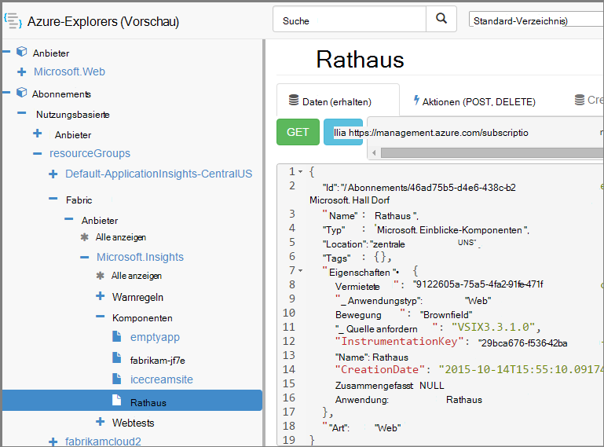

<properties 
    pageTitle="Erstellen Sie Application Insights-Ressourcen mithilfe von PowerShell" 
    description="Als Teil des Builds erstellen Sie Anwendung Einblicke Ressourcen programmgesteuert." 
    services="application-insights" 
    documentationCenter=""
    authors="alancameronwills" 
    manager="douge"/>

<tags 
    ms.service="application-insights" 
    ms.workload="tbd" 
    ms.tgt_pltfrm="ibiza" 
    ms.devlang="na" 
    ms.topic="article" 
    ms.date="03/02/2016" 
    ms.author="awills"/>
 
# <a name="create-application-insights-resources-using-powershell"></a>Erstellen Sie Application Insights-Ressourcen mithilfe von PowerShell

Dieser Artikel veranschaulicht das [Application Insights](app-insights-overview.md) -Ressource in Azure automatisch erstellen. Sie können z. B. als Teil eines Buildvorgangs tun. Mit grundlegenden Anwendung Einblicke Ressource können Sie [verfügbarkeitswebtests](app-insights-monitor-web-app-availability.md) [Alarme einrichten](app-insights-alerts.md), erstellen und andere Azure-Ressourcen.

Der Schlüssel zu dieser Ressourcen ist JSON-Vorlagen für [Azure-Ressourcen-Manager](../powershell-azure-resource-manager.md). Kurz gesagt, ist das Verfahren: download JSON Definitionen von vorhandenen Ressourcen; parametrisieren Sie, bestimmte Werte wie; und führen Sie dann die Vorlage eine neue Ressource erstellen möchten. Sie können mehrere Ressourcen zusammen verpacken, erstellt in einem gehen - z. B. app-Monitor Verfügbarkeitstests Alarme und Speicher für fortlaufende exportieren. Es gibt einige Besonderheiten einiger Parametrisierungen, die hier erläutert werden.

## <a name="one-time-setup"></a>Einmalige Installation

Wenn Sie Ihr-Abonnement Azure vor PowerShell verwendet haben:

Installieren Sie das Azure Powershell-Modul für die Skripts ausgeführt werden soll:

1. Installieren [Microsoft-Webplattform-Installer (v5 oder höher)](http://www.microsoft.com/web/downloads/platform.aspx).
2. Verwenden sie Microsoft Azure Powershell installieren.

## <a name="copy-the-json-for-existing-resources"></a>JSON für vorhandene Ressourcen kopieren

1. Richten Sie [Anwendung Einblicke](app-insights-overview.md) für ein Projekt ähnlich automatisch generieren möchten. Hinzufügen von Webtests und benachrichtigt sie.
2. Erstellen einer neuen Datei JSON - nennen wir es `template1.json` in diesem Beispiel. Kopieren Sie diese Inhalte in:


    ```JSON

        {
          "$schema": "https://schema.management.azure.com/schemas/2015-01-01/deploymentTemplate.json#",
          "contentVersion": "1.0.0.0",
          "parameters": {
            "appName": { "type": "string" },
            "webTestName": { "type": "string" },
            "url": { "type": "string" },
            "text": { "type" : "string" }
          },
          "variables": {
            "testName": "[concat(parameters('webTestName'), 
               '-', toLower(parameters('appName')))]"
            "alertRuleName": "[concat(parameters('webTestName'), 
               '-', toLower(parameters('appName')), 
               '-', subscription().subscriptionId)]"
          },
          "resources": [
            {
              // component JSON file contents
            },
            {
              //web test JSON file contents
            },
            {
              //alert rule JSON file contents
            }
 
            // Any other resources go here
          ]
        }
    
    ```

    Mit dieser Vorlage wird eine Verfügbarkeit Test neben die Ressource eingerichtet.


2. [Azure Ressourcen-Manager](https://resources.azure.com/)zu öffnen. Navigieren Sie durch `subscriptions/resourceGroups/<your resource group>/providers/Microsoft.Insights/components`, um die Anwendungsressource. 

    

    *Komponenten* sind die grundlegenden Anwendung Einblicke Ressourcen für Anwendung anzeigen. Es gibt separate Ressourcen zugeordneten Warnungsregeln und Verfügbarkeit von Webtests.

3. Kopieren von JSON der Komponente an der entsprechenden Stelle im `template1.json`.
6. Löschen Sie diese Eigenschaften:
  * `id`
  * `InstrumentationKey`
  * `CreationDate`
4. Öffnen Sie Webtests und Alertrules Abschnitte und kopieren Sie JSON für einzelne Elemente in der Vorlage. (Nicht von Webtests oder Alertrules Knoten kopieren: in Artikel unter ihnen.)

    Jeden Webtest hat eine zugeordnete Warnregel haben beide kopieren.

    Der Webtest gehen vor der Warnung.

5. Fügen Sie diese Zeile in jeder Ressource, um das Schema zu erfüllen:

    `"apiVersion": "2014-04-01",`

    (Schema beklagt auch die Groß-/Kleinschreibung der Typnamen Ressource `Microsoft.Insights/*` – aber *nicht* ändern.)


## <a name="parameterize-the-template"></a>Parametrisieren der Vorlage

Jetzt haben Sie mit die Namen ersetzen. [Eine Vorlage parametrisieren](../resource-group-authoring-templates.md)schreiben Sie Ausdrücke verwenden eine [Reihe von Hilfsfunktionen](../resource-group-template-functions.md). 

Sie können nicht nur Teil einer Zeichenfolge parametrisieren, was `concat()` zu erstellen.

Beispiele der Ersatzartikel, die Sie erstellen möchten. Es gibt mehrere Vorkommen jeder ersetzen. Andere in der Vorlage möglicherweise. Diese Beispiele verwenden die Parameter und Variablen definiert am oberen Rand der Vorlage.

Suchen | Ersetzen durch
---|---
`"hidden-link:/subscriptions/.../components/MyAppName"`| `"[concat('hidden-link:',`<br/>` resourceId('microsoft.insights/components',` <br/> ` parameters('appName')))]"`
`"/subscriptions/.../alertrules/myAlertName-myAppName-subsId",` | `"[resourceId('Microsoft.Insights/alertrules', variables('alertRuleName'))]",`
`"/subscriptions/.../webtests/myTestName-myAppName",` | `"[resourceId('Microsoft.Insights/webtests', parameters('webTestName'))]",`
`"myWebTest-myAppName"` | `"[variables(testName)]"'`
`"myTestName-myAppName-subsId"` | `"[variables('alertRuleName')]"`
`"myAppName"` | `"[parameters('appName')]"`
`"myappname"`(Kleinbuchstabe) | `"[toLower(parameters('appName'))]"`
`"<WebTest Name=\"myWebTest\" ...`<br/>` Url=\"http://fabrikam.com/home\" ...>"`|`[concat('<WebTest Name=\"',` <br/> `parameters('webTestName'),` <br/> `'\" ... Url=\"', parameters('Url'),` <br/> `'\"...>')]" `


## <a name="set-dependencies-between-the-resources"></a>Set Abhängigkeiten zwischen Ressourcen

Azure sollten Ressourcen in Reihenfolge einrichten. Um sicherzustellen, dass ein Abschluss, bevor die nächste beginnt, fügen Sie Abhängigkeitszeilen hinzu:

* Testen Sie Ressourcen im Web:

    `"dependsOn": ["[resourceId('Microsoft.Insights/components', parameters('appName'))]"],`

* In der Warnung:

    `"dependsOn": ["[resourceId('Microsoft.Insights/webtests', variables('testName'))]"],`

## <a name="create-application-insights-resources"></a>Application Insights-Ressourcen erstellen

1. In PowerShell in Azure anmelden

    `Login-AzureRmAccount`

2. Führen Sie einen Befehl wie folgt:

    ```PS

        New-AzureRmResourceGroupDeployment -ResourceGroupName Fabrikam `
               -templateFile .\template1.json `
               -appName myNewApp `
               -webTestName aWebTest `
               -Url http://myapp.com `
               -text "Welcome!"
               -siteName "MyAzureSite"

    ``` 

    * -ResourceGroupName ist die Gruppe, der Sie neuen Ressourcen erstellen möchten.
    * -Template muss vor den benutzerdefinierten Parametern erfolgen.
    * -Anwendungsname den Namen der zu erstellenden Ressource.
    * -WebTestName der Name des Webtests erstellen.
    * -Url die Url Ihrer Anwendung.
    * -Eine Zeichenfolge, die auf der Webseite angezeigt wird.
    * -SiteName - verwendet eine Azure-website


## <a name="define-metric-alerts"></a>Metrische Alarme definieren

Gibt ein [PowerShell Methode Alerts](app-insights-alerts.md#set-alerts-by-using-powershell).


## <a name="an-example"></a>Ein Beispiel

Hier ist die vollständige und Webtest Test alert Webvorlage, die ich erstellt:

``` JSON

{
  "$schema": "https://schema.management.azure.com/schemas/2015-01-01/deploymentTemplate.json#",
  "contentVersion": "1.0.0.0",
  "parameters": {
    "webTestName": { "type": "string" },
    "appName": { "type": "string" },
    "URL": { "type": "string" },
    "text": { "type" : "string" }
  },
  "variables": {
    "alertRuleName": "[concat(parameters('webTestName'), '-', toLower(parameters('appName')), '-', subscription().subscriptionId)]",
    "testName": "[concat(parameters('webTestName'), '-', toLower(parameters('appName')))]"
  },
  "resources": [
    {
      //"id": "[resourceId('Microsoft.Insights/components', parameters('appName'))]",
      "apiVersion": "2014-04-01",
      "kind": "web",
      "location": "Central US",
      "name": "[parameters('appName')]",
      "properties": {
        "TenantId": "9122605a-471fc50f8438",
        "Application_Type": "web",
        "Flow_Type": "Brownfield",
        "Request_Source": "VSIX3.3.1.0",
        "Name": "[parameters('appName')]",
        //"CreationDate": "2015-10-14T15:55:10.0917441+00:00",
        "PackageId": null,
        "ApplicationId": "[parameters('appName')]"
      },
      "tags": { },
      "type": "microsoft.insights/components"
    },
    {
      //"id": "[resourceId('Microsoft.Insights/webtests', variables('testName'))]",
      "name": "[variables('testName')]",
      "apiVersion": "2014-04-01",
      "type": "microsoft.insights/webtests",
      "location": "Central US",
      "tags": {
        "[concat('hidden-link:', resourceId('microsoft.insights/components', parameters('appName')))]": "Resource"
      },
      "properties": {
        "provisioningState": "Succeeded",
        "Name": "[parameters('webTestName')]",
        "Description": "",
        "Enabled": true,
        "Frequency": 900,
        "Timeout": 120,
        "Kind": "ping",
        "RetryEnabled": true,
        "Locations": [
          {
            "Id": "us-va-ash-azr"
          },
          {
            "Id": "emea-nl-ams-azr"
          },
          {
            "Id": "emea-gb-db3-azr"
          }
        ],
        "Configuration": {
          "WebTest": "[concat(
             '<WebTest   Name=\"', 
                parameters('webTestName'), 
              '\"  Id=\"32cfc791-aaad-4b50-9c8d-993c21beb218\"   Enabled=\"True\"         CssProjectStructure=\"\"    CssIteration=\"\"  Timeout=\"120\"  WorkItemIds=\"\"         xmlns=\"http://microsoft.com/schemas/VisualStudio/TeamTest/2010\"         Description=\"\"  CredentialUserName=\"\"  CredentialPassword=\"\"         PreAuthenticate=\"True\"  Proxy=\"default\"  StopOnError=\"False\"         RecordedResultFile=\"\"  ResultsLocale=\"\">  <Items>  <Request Method=\"GET\"         Guid=\"a6f2c90b-61bf-b28hh06gg969\"  Version=\"1.1\"  Url=\"', 
              parameters('Url'), 
              '\" ThinkTime=\"0\"  Timeout=\"300\" ParseDependentRequests=\"True\"         FollowRedirects=\"True\" RecordResult=\"True\" Cache=\"False\"         ResponseTimeGoal=\"0\"  Encoding=\"utf-8\"  ExpectedHttpStatusCode=\"200\"         ExpectedResponseUrl=\"\" ReportingName=\"\" IgnoreHttpStatusCode=\"False\" />        </Items>  <ValidationRules> <ValidationRule  Classname=\"Microsoft.VisualStudio.TestTools.WebTesting.Rules.ValidationRuleFindText, Microsoft.VisualStudio.QualityTools.WebTestFramework, Version=10.0.0.0, Culture=neutral, PublicKeyToken=b03f5f7f11d50a3a\" DisplayName=\"Find Text\"         Description=\"Verifies the existence of the specified text in the response.\"         Level=\"High\"  ExectuionOrder=\"BeforeDependents\">  <RuleParameters>        <RuleParameter Name=\"FindText\" Value=\"', 
              parameters('text'), 
              '\" />  <RuleParameter Name=\"IgnoreCase\" Value=\"False\" />  <RuleParameter Name=\"UseRegularExpression\" Value=\"False\" />  <RuleParameter Name=\"PassIfTextFound\" Value=\"True\" />  </RuleParameters> </ValidationRule>  </ValidationRules>  </WebTest>')]"
        },
        "SyntheticMonitorId": "[variables('testName')]"
      }
    },
    {
      //"id": "[resourceId('Microsoft.Insights/alertrules', variables('alertRuleName'))]",
      "name": "[variables('alertRuleName')]",
      "apiVersion": "2014-04-01",
      "type": "microsoft.insights/alertrules",
      "location": "East US",
      "dependsOn": [
        "[resourceId('Microsoft.Insights/components', parameters('appName'))]",
        "[resourceId('Microsoft.Insights/webtests', variables('testName'))]"
      ],
      "tags": {
        "[concat('hidden-link:', resourceId('Microsoft.Insights/components', parameters('appName')))]": "Resource",
        "[concat('hidden-link:', resourceId('Microsoft.Insights/webtests', variables('testName')))]": "Resource"
      },
      "properties": {
        "name": "[variables('alertRuleName')]",
        "description": "",
        "isEnabled": true,
        "condition": {
          "$type": "Microsoft.WindowsAzure.Management.Monitoring.Alerts.Models.LocationThresholdRuleCondition, Microsoft.WindowsAzure.Management.Mon.Client",
          "odata.type": "Microsoft.Azure.Management.Insights.Models.LocationThresholdRuleCondition",
          "dataSource": {
            "$type": "Microsoft.WindowsAzure.Management.Monitoring.Alerts.Models.RuleMetricDataSource, Microsoft.WindowsAzure.Management.Mon.Client",
            "odata.type": "Microsoft.Azure.Management.Insights.Models.RuleMetricDataSource",
            "resourceUri": "[resourceId('microsoft.insights/webtests', variables('testName'))]",
            "metricName": "GSMT_AvRaW"
          },
          "windowSize": "PT15M",
          "failedLocationCount": 2
        },
        "action": {
          "$type": "Microsoft.WindowsAzure.Management.Monitoring.Alerts.Models.RuleEmailAction, Microsoft.WindowsAzure.Management.Mon.Client",
          "odata.type": "Microsoft.Azure.Management.Insights.Models.RuleEmailAction",
          "sendToServiceOwners": true,
          "customEmails": [ ]
        },
        "provisioningState": "Succeeded",
        "actions": [ ]
      }

    }
  ]
}

```

## <a name="see-also"></a>Siehe auch

Weitere Artikel Automatisierung:

* [Erstellen einer Ressource Application Insights](app-insights-powershell-script-create-resource.md) - schnelle Methode ohne Vorlage.
* [Einrichten von Alerts](app-insights-powershell-alerts.md)
* [Erstellen von Webtests](https://azure.microsoft.com/blog/creating-a-web-test-alert-programmatically-with-application-insights/)
* [Senden von Azure Diagnostics Anwendung Einblicke](app-insights-powershell-azure-diagnostics.md)
* [Versionsanmerkungen erstellen](https://github.com/Microsoft/ApplicationInsights-Home/blob/master/API/CreateReleaseAnnotation.ps1)
