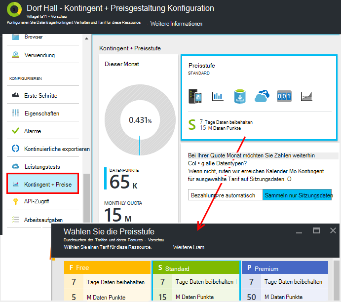
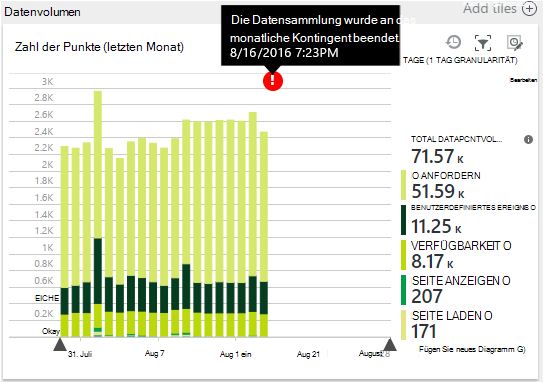
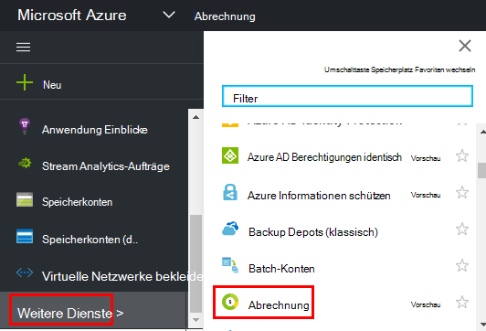

<properties 
    pageTitle="Verwalten von Preisen und Quoten für Anwendung Einblicke | Microsoft Azure" 
    description="Wählen Sie den Preisplan die Telemetrie managen" 
    services="application-insights" 
    documentationCenter=""
    authors="alancameronwills" 
    manager="douge"/>

<tags 
    ms.service="application-insights" 
    ms.workload="tbd" 
    ms.tgt_pltfrm="ibiza" 
    ms.devlang="na" 
    ms.topic="article" 
    ms.date="10/13/2016" 
    ms.author="awills"/>

# Verwalten von Preisen und Quoten für Anwendung Einblicke

*Anwendung Informationen ist in der Vorschau.*

[Preise] [ pricing] für [Visual Studio Application Insights] [ start] basiert auf Datenträger pro Anwendung. Gibt es eine umfangreiche freie Ebene in der man die meisten Features eingeschränkt.

Jede Anwendung Einblicke Ressource als separater Dienst geladen und zur Zahlung für Ihr Abonnement von Azure.

[Finden Sie in der Preisübersicht][pricing].

## Überprüfen Sie Kontingent und Preis für Ihre Anwendung Einblicke Ressource

Sie können das Kontingent + Preisgestaltung Blade aus der Anwendung Ressourcen öffnen.

Die Auswahl des Preismodell bestimmt:

* [Monatliche Kontingent](#monthly-quota) - Betrag Telemetrie monatlich zu analysieren.
* [Daten](#data-rate) - die maximale Rate, mit der Daten von der Anwendung verarbeitet werden können.
* [Kontinuierliche exportieren](#continuous-export) – ob Sie Daten in anderen Tools und Services exportieren.

Diese Grenzwerte werden separat für jede Anwendung Insights-Ressource festgelegt.

### Premium-Testversion

Wenn eine neue Application Insights-Ressource erstellen, wird in der freien.

Jederzeit können Sie Premium die 30-Tage-Testversion wechseln. Dadurch werden die Vorteile der Premium-Stufe. Nach 30 Tagen wird es automatisch so was Stufen zurückgesetzt wurden-sofern Sie explizit einer anderen Ebene. Wählen Sie Ebene jederzeit während des Testzeitraums möchte, jedoch erhalten Sie noch bis zum Ende der 30 Tage Testversion.

## Monatliche Kontingent

* Pro Kalendermonat kann die Anwendung auf eine bestimmte Menge Telemetrie Anwendung Einblicke senden. Das Kontingent für die kostenlose Tarif ist 5 Millionen Datenpunkte pro Monat und wesentlich mehr für die Schemas. Sie können mehr kaufen, wenn das Kontingent erreicht.  [Preismodell] finden Sie unter[ pricing] für die tatsächlichen Werte. 
* Das Kontingent hängt, den gewählte Tarif.
* Die Quote ist Mitternacht UTC am ersten Tag des Monats gezählt.
* Diagramm zeigt Daten zeigt Anteil Ihrer Quote diesen Monat verwendet wurde.
* Das Kontingent gemessen in *Datenpunkte.* Ein einzelnen Datenpunkt ist Aufrufen einer der Methoden verfolgen, ob explizit im Code oder durch einen standard Telemetrie-Module. Es können mehrere angefügte Eigenschaften und Metriken.
* Daten werden vom generiert:
 * [SDK-Module](app-insights-configuration-with-applicationinsights-config.md) , die automatisch sammeln Daten, z. B. eine Anforderung oder Absturz oder zum Messen der Leistung.
 * [API](app-insights-api-custom-events-metrics.md) `Track...` aufrufen, die Sie, z. B. geschrieben haben `TrackEvent` oder `trackPageView`.
 * [Verfügbarkeit von Webtests](app-insights-monitor-web-app-availability.md) , die Sie eingerichtet haben.
* Während Sie Debuggen, von Ihrer app im Visual Studio-Ausgabefenster Datenpunkte angezeigt. Clientereignisse öffnen sehen, dass die Registerkarte Netzwerk in Ihrem Browser Fenster (normalerweise F12) Debuggen ist.
* *Sitzungsdaten* werden in das Kontingent nicht gezählt. Dazu zählt Benutzer, Sitzung, Umgebung und Daten.
* Möchten Sie Daten durch Inspektion zählen, finden Sie diese an verschiedenen Orten:
 * Jedes Element finden Sie unter [diagnostic suchen](app-insights-diagnostic-search.md), einschließlich HTTP-Anfragen, Ausnahmen Protokoll Spuren, Seitenaufrufe, Abhängigkeit Ereignisse und benutzerdefinierte Ereignisse.
 * Jede raw Messung einer [Metrik](app-insights-metrics-explorer.md) wie einen Leistungsindikator. (Die Punkte auf die Diagramme sind normalerweise Aggregate mehrerer raw Datenpunkte.)
 * Jeder Punkt auf einem Web Verfügbarkeitsdiagramm ist auch eine mehrere Datenpunkte.
* Sie können auch einzelne Datenpunkte an während des Debuggens überprüfen:
 * Wenn Sie Ihre Anwendung im Debugmodus in Visual Studio ausführen, werden die Datenpunkte im Ausgabefenster protokolliert. 
 * Client Datenpunkte, Öffnen des Browsers debugging Bereich (normalerweise F12) und öffnen Sie die Registerkarte Netzwerk.
* Die Datenrate kann [adaptive](app-insights-sampling.md)Stichprobenkontrollen (standardmäßig) reduziert. Also, wie Ihre Anwendung erhöht, Telemetrie Erhöhung wird nicht so wie erwartet.

### Überschuss

Wenn die Anwendung über das monatliche Kontingent sendet, können Sie:

* Zahlen Sie für zusätzliche Daten. [Preismodell] finden Sie[ pricing] Informationen. Sie können diese Option im voraus. Diese Option ist nicht verfügbar in Tarif frei.
* Aktualisieren der Preisstufe.
* Nichts Unternehmen. Sitzungsdaten weiterhin aufgezeichnet, aber andere Daten erscheinen nicht in Diagnose suchen oder Metriken Explorer.

## Wie viele Daten sende ich?

Das Diagramm unten die Preise Blade zeigt Datenvolumen Punkt der Anwendung nach Punkt Datentyp gruppiert. (Sie können dieses Diagramm auch im Metrik-Explorer erstellen.)

Klicken Sie auf das Diagramm weitere Details oder es ziehen Sie und auf (+) ausführliche einen.

Das Diagramm zeigt die Datenmenge Application Insights-Dienst nach der [Probenahme](app-insights-sampling.md)erreicht.

Das Datenvolumen monatliche Kontingent erreicht, wird eine Anmerkung im Diagramm angezeigt.

## Datenrate

Neben das monatliche Kontingent sind Drosselung Grenzen auf die Daten. Für die freien [Tarif] [ pricing] beträgt 200 Punkte pro Sekunde durchschnittlich während 5 Minuten Daten und für die Ebenen ist 500-s gemittelt über eine Minute. 

Es gibt drei Buckets, die separat gezählt werden:

* [TrackTrace Aufrufe](app-insights-api-custom-events-metrics.md#track-trace) und [Protokolle erfasst](app-insights-asp-net-trace-logs.md)
* [Ausnahmen](app-insights-api-custom-events-metrics.md#track-exception)auf 50 Punkte/s beschränkt.
* Alle anderen Telemetrie (Seitenansichten Sessions Anfragen, Abhängigkeiten, Metriken, benutzerdefinierte Ereignisse, Webtestergebnisse).

*Was geschieht, wenn meine app, die pro Sekunde überschreitet?*

* Die Datenmenge, die Ihre Anwendung sendet jede Minute bewertet. Überschreitet er die pro Sekunde der Minute Durchschnitt, lehnt der Server einige Anfragen. Das SDK puffert Daten und versucht dann erneut, eine über mehrere Minuten ausbreiten. Ihre Anwendung ständig Daten über die Drosselung Rate sendet, werden einige Daten gelöscht. (ASP.NET, Java und JavaScript-SDKs auf diese Weise erneut versuchen, andere SDKs möglicherweise einfach gedrosselt Datenfelder.)

Wenn Drosselung auftritt, sehen Sie eine Benachrichtigung, dass dies geschehen ist.

*Wie weiß ich, wie viele Datenpunkte meiner app senden?*

* Öffnen Sie Settings-Kontingent und Preise Datenvolumen Diagramm.
* Oder Metriken Explorer Hinzufügen eines Diagramms und wählen Sie **Volume Datenpunkt** als die Metrik. Gruppierung und Gruppieren nach **Datentyp**wechseln

## Die Datenrate reduzieren

Sollten die Drosselung Grenzwerte sind hier tun können:

* Verwenden Sie [Probenahme](app-insights-sampling.md). Diese Technologie reduziert Daten ohne neigen metrischen und ohne Unterbrechung zwischen verwandten Elementen suchen navigieren.
* [Beschränken der Anzahl der Ajax-Aufrufe, die gemeldet werden kann,](app-insights-javascript.md#detailed-configuration) in jeder Seite oder ausschalten Ajax reporting.
* Auflistung Module bearbeiten [ApplicationInsights.config](app-insights-configuration-with-applicationinsights-config.md)brauchen nicht ausschalten. Beispielsweise können Sie entscheiden, dass Leistungsindikatoren oder Abhängigkeitsdaten unwesentliche.
* Vorab aggregieren Sie Metriken. Wenn Sie Aufrufe von TrackMetric in Ihre Anwendung eingefügt haben, reduzieren Sie Datenverkehr durch die Überladung, die Berechnung des Durchschnitts und der Standardabweichung einer Partie Maße akzeptiert. Oder verwenden Sie ein [vorab aggregieren Paket](https://www.myget.org/gallery/applicationinsights-sdk-labs). 

## Probenahme

[Sampling](app-insights-sampling.md) ist eine Reduzierung bei der Telemetrie an Ihre app und behalten die verwandten Ereignisse Diagnose Suchvorgängen finden Beibehaltung richtige Ereignis zählt. 

Sampling ist eine effektive Möglichkeit zu reduzieren Kosten in Ihre monatliche Kontingent. Sampling-Algorithmus behält Telemetrie verwandte Elemente, z. B. bei Verwendung von Suchen Sie Anmeldung für eine bestimmte Ausnahme finden. Der Algorithmus behält auch korrekt zählt, damit die richtigen Werte Metrik Explorer Anforderung Sätze Ausnahme Preise und anderen zählt.

Gibt verschiedene Formen der Probenahme.

* [Adaptive Sampling](app-insights-sampling.md) ist die Standardeinstellung für das SDK ASP.NET automatisch die Menge der Telemetriedaten anpasst, die Ihre Anwendung sendet. Es arbeitet automatisch im SDK in Ihrer Anwendung, sodass Telemetrie Datenverkehr im Netzwerk verringert wird. 
* *Einnahme Sampling* ist eine Alternative zum Zeitpunkt arbeitet, Telemetriedaten aus Ihrer app Application Insights-Dienst erreicht. Keinen Einfluss auf die Menge der Telemetriedaten aus Ihrer app gesendet, aber es reduziert die vom Dienst beibehalten. Sie können das Kontingent von Telemetriedaten aus Browser und andere SDKs verwendet zu.

Um Aufnahme Probenahme festzulegen, legen Sie das Steuerelement Kontingente + Preisgestaltung Blade:

> [AZURE.WARNING] Beispiele beibehalten Kachel angezeigte Wert gibt nur den Aufnahme Probenahme festgelegte Wert. Es zeigt nicht die Sampling-Rate, die auf das SDK in Ihrer Anwendung. 
> 
> Eingehende Telemetrie bereits im SDK aufgenommen wurde, wird Einnahme Probenahme nicht angewendet.
 
Zur Ermittlung der tatsächlichen Samplingrate egal, wo sie angewendet wurde, verwenden Sie eine [Abfrage Analytics](app-insights-analytics.md) wie diese:

    requests | where timestamp > ago(1d)
  	| summarize 100/avg(itemCount) by bin(timestamp, 1h) 
  	| render areachart 

In jedem Datensatz beibehalten `itemCount` gibt die Anzahl der ursprünglichen Datensätze darstellt, gleich 1 + die Anzahl der verworfenen Rekorde. 

## Überprüfen Sie die Abrechnung für Ihr Abonnement von Azure

Anwendung Einblicke Gebühren werden Ihrer Azure Rechnung hinzugefügt. Sie können Ihre Azure Abrechnung im Bereich auf der Azure-Portal in [Azure Abrechnungsportal](https://account.windowsazure.com/Subscriptions)Rechnung angezeigt. 

## Name-Grenzwerte

1.  Bis zu 200 eindeutige metrische Namen und 200 eindeutige Namen für die Anwendung. Kennzahlen über TrackMetric sowie an anderen Datentypen wie gesendete Daten.  [Metriken und Eigenschaftennamen] [ api] Global pro instrumentationsschlüssel.
2.  [Eigenschaften] [ apiproperties] können zum Filtern und Gruppieren-nach nur zwar weniger als 100 eindeutige Werte für jede Eigenschaft. Nach die Anzahl eindeutiger Werte 100 überschreitet, Sie noch suchen die Eigenschaft jedoch nicht mehr für Filter verwenden oder Group by.
3.  Standardeigenschaften wie Namen anfordern und Seiten-URL sind eindeutige Werte 1000 pro Woche auf. Nach 1000 eindeutige Werte werden zusätzliche Werte als "Andere Werte." gekennzeichnet. Die ursprünglichen Werte können trotzdem für Volltextsuche und Filtern verwendet werden.

Wenn Sie, dass Ihre Anwendung diese Grenzwerte überschreitet feststellen, teilen Sie Ihre Daten zwischen verschiedenen Instrumentation - also, [Application Insights Ressourcen](app-insights-create-new-resource.md) und Daten in neue Instrumentation Schlüssel. Möglicherweise das Ergebnis besser strukturiert ist. [Dashboards](app-insights-dashboards.md#dashboards) können zu verschiedenen Metriken auf demselben Bildschirm so dadurch die Möglichkeit, verschiedene Metriken vergleichen nicht einschränkt. 

## Grenzwerte Zusammenfassung

[AZURE.INCLUDE [application-insights-limits](../../includes/application-insights-limits.md)]

<!--Link references-->

[api]: app-insights-api-custom-events-metrics.md
[apiproperties]: app-insights-api-custom-events-metrics.md#properties
[start]: app-insights-overview.md
[pricing]: http://azure.microsoft.com/pricing/details/application-insights/

 