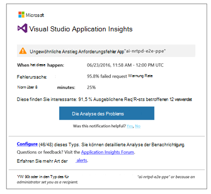
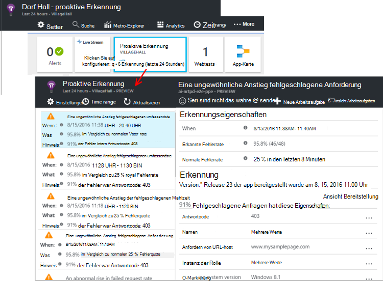

<properties 
    pageTitle="Proaktive Diagnose Anwendung Erkenntnisse | Microsoft Azure" 
    description="Application Insights führt automatische Tiefenanalyse des app-Telemetrie und potenziellen Problemen warnt." 
    services="application-insights" 
    documentationCenter="windows"
    authors="rakefetj" 
    manager="douge"/>

<tags 
    ms.service="application-insights" 
    ms.workload="tbd" 
    ms.tgt_pltfrm="ibiza" 
    ms.devlang="na" 
    ms.topic="article" 
    ms.date="08/15/2016" 
    ms.author="awills"/>

#  Proaktive Diagnose Anwendung Einblicke

 Proaktive Diagnose gewarnt automatisch von Performanceproblemen in der Webanwendung. Intelligente Analyse der app [Visual Studio Application Insights](app-insights-overview.md)sendet Telemetriedaten ausführt. Wenn ein plötzlicher Anstieg Fehlerraten oder ungewöhnliche Muster in Client oder Server vorhanden ist, erhalten Sie eine Warnung. Diese Funktion benötigt keine Konfiguration. Er arbeitet, sendet die Anwendung ausreichend Telemetrie.

Proaktive Erkennung Alerts können Sie die e-Mails, sowohl proaktive Erkennung Blade zugreifen.

## Überprüfen Sie die proaktive Erkennung

Entdecken Sie die Erkennung auf zwei Arten:

* **Eine e-Mail** von Anwendung. Hier ist ein Beispiel:

    

    Klicken Sie auf große Schaltfläche, um weitere Details im Portal zu öffnen.

* **Die proaktive Erkennung nebeneinander** auf Ihre app Übersicht angezeigt, der letzten. Klicken Sie um eine Liste der letzten anzuzeigen.

Wählen Sie eine Warnung, um seine Details anzuzeigen.

## Welche Probleme erkannt werden?

Es gibt drei Arten von Erkennung:

* [Proaktive Rate Fehlerdiagnose](app-insights-proactive-failure-diagnostics.md). Wir verwenden Computer zur erwarteten Satz von fehlgeschlagenen Anfragen für Ihre Anwendung mit laden und anderen Faktoren. Wenn die Fehlerrate außerhalb erwartet wird, wird eine Warnung gesendet.
* [Proaktive Performance-Diagnose](app-insights-proactive-performance-diagnostics.md). Wir suchen ungewöhnliche Muster Antwortzeiten und Fehler täglich. Wir analysieren diese Probleme mit Eigenschaften wie Standort, Browser, Client-Betriebssystem Serverinstanz und Tageszeit.
* [Azure Cloud Services](https://azure.microsoft.com/blog/proactive-notifications-on-cloud-service-issues-with-azure-diagnostics-and-application-insights/). Sie erhalten Alarme, wenn Ihre Anwendung in Azure Cloud Services gehostet und eine Rolleninstanz Startfehler häufige Wiederverwendung oder Laufzeit abstürzen.

(Links zu Hilfethemen in jeder Benachrichtigung gelangen Sie zu der relevanten Artikel.)

## Nächste Schritte

Diese Diagnose-Tools helfen Ihnen Telemetriedaten aus Ihrer Anwendung überprüfen:

* [Metrik-explorer](app-insights-metrics-explorer.md)
* [Suchexplorer](app-insights-diagnostic-search.md)
* [Analytics - leistungsfähige Abfragesprache](app-insights-analytics-tour.md)

Proaktive Diagnose ist vollkommen automatisch. Aber vielleicht möchten Sie einige weitere Alerts einrichten?

* [Manuell konfigurierte metrische alerts](app-insights-alerts.md)
* [Verfügbarkeit von Webtests](app-insights-monitor-web-app-availability.md) 

