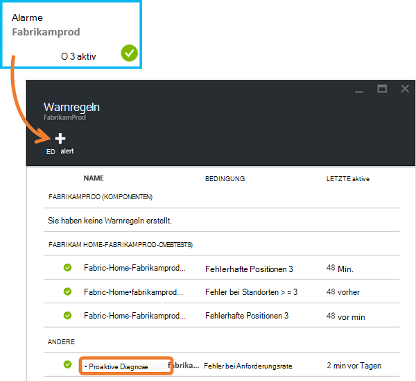
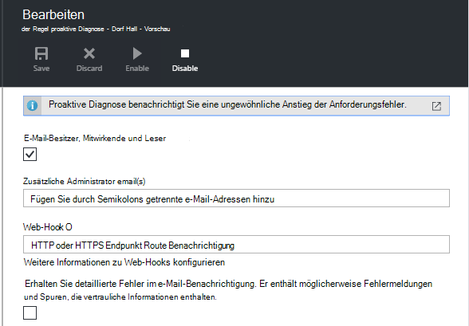
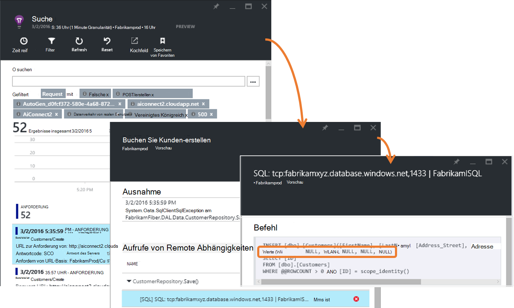
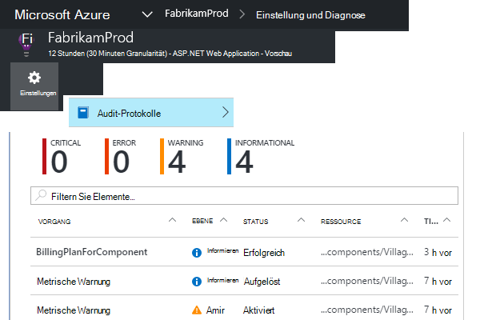
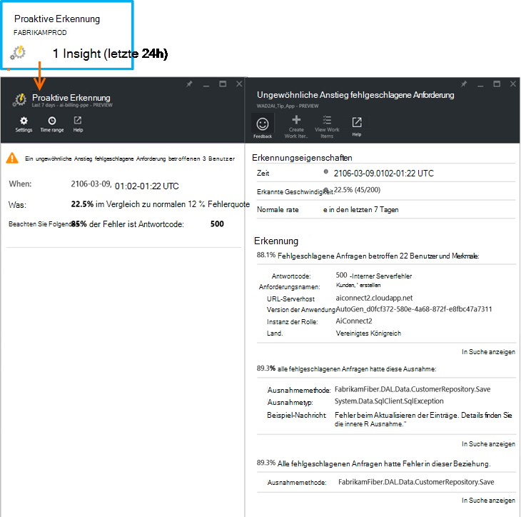

<properties 
    pageTitle="Proaktive Rate Fehlerdiagnostik Anwendung Erkenntnisse | Microsoft Azure" 
    description="Hinweis auf ungewöhnliche ändert bei fehlgeschlagenen Anfragen zu Ihrer Anwendung und Diagnose bietet. Es ist keine Konfiguration erforderlich." 
    services="application-insights" 
    documentationCenter=""
    authors="yorac" 
    manager="douge"/>

<tags 
    ms.service="application-insights" 
    ms.workload="tbd" 
    ms.tgt_pltfrm="ibiza" 
    ms.devlang="na" 
    ms.topic="article" 
    ms.date="10/12/2016" 
    ms.author="awills"/>
 
# Proaktive Rate Fehlerdiagnose

[Visual Studio Application Insights](app-insights-overview.md) benachrichtigt Sie automatisch in Echtzeit Wenn Ihrer Anwendung einen ungewöhnlichen Anstieg der Fehler auftritt. Es erkennt einen ungewöhnlichen Anstieg der HTTP-Anfragen, die als Fehler gemeldet. Diese sind in der Regel mit Antwortcodes im 400 und 500-Bereiche. Analyse der Merkmale der fehlgeschlagenen Anfragen und zugehörige Telemetrie dient zum Selektieren und das Problem diagnostizieren, in der Benachrichtigung. Es gibt auch Links zu Application Insights-Portal für die weitere Diagnose. Die Funktion benötigt Setup keine Konfiguration, wie Computer lernalgorithmen normalen Fehlerrate vorherzusagen.

Diese Funktion ist für Java und ASP.NET Web-apps in der Cloud oder auf Ihren eigenen Servern gehostet. Es funktioniert auch für jede Anwendung, die Anforderung Telemetrie generiert – ruft z. B. eine Worker-Rolle haben, die [TrackRequest()](app-insights-api-custom-events-metrics.md#track-request). 

Nach [Anwendung Einblicke für Ihr Projekt](app-insights-overview.md)einrichten und Ihre app generiert bestimmte Mindestbetrag Telemetrie, proaktiven Fehler-Diagnose dauert 24 Stunden erhalten das normale Verhalten Ihrer Anwendung ist eingeschaltet und kann alarmieren bereitgestellt.

Hier ist eine Beispiel-Warnung. 

> [AZURE.NOTE] Standardmäßig empfangen Sie eine kürzere Format als in diesem Beispiel. Aber Sie können [detaillierte Format wechseln](#configure-alerts).

Beachten Sie, dass Sie erkennen:

* Im Vergleich zu normalen Anwendungsverhalten Ausfallrate.
* Wie viele Benutzer betroffen sind – also wie viel Gedanken machen.
* Ein charakteristisches Muster Fehler zugeordnet. In diesem Beispiel ist bestimmten Antwortcode, Anforderungsnamen (Betrieb) und Anw.-Version. Das erfahren sofort Sie, wo Sie beginnen im Code. Wirkender könnte einem bestimmten Browser oder einem Client-Betriebssystem.
* Die Ausnahme, Protokoll Spuren und Abhängigkeit Fehler (Datenbanken oder andere externen Komponenten), die scheinbar dadurch fehlgeschlagenen Anfragen zugeordnet werden.
* Verknüpfung zu relevante Suchergebnisse Telemetriedaten in Application Insights.

## Vorteile der proaktiven Alarme

Normale [metrikwarnungen](app-insights-alerts.md) sagen Sie möglicherweise ein Problem. Aber proaktive Fehlerdiagnostik Diagnosearbeiten Sie viel Analyse Andernfalls müssten Sie selbst ausführen. Erhalten Sie die Ergebnisse sorgfältig verpackt, hilft Ihnen, die die Ursache des Problems schnell.

## Funktionsweise

In Echtzeit proaktive Diagnose überwacht Rate der empfangenen Telemetriedaten aus Ihrer app und insbesondere die fehlgeschlagene Anforderung. Diese Metrik zählt die Anzahl der Anfragen, für die die `Successful request` -Eigenschaft ist false. Standardmäßig `Successful request== (resultCode < 400)` (sofern Sie benutzerdefinierten Code, [Filter geschrieben haben](app-insights-api-filtering-sampling.md#filtering) oder [TrackRequest](app-insights-api-custom-events-metrics.md#track-request) Anrufe generieren). 

Die Leistung Ihrer Anwendung hat eine normale Verhalten. Einige Abfragen werden als andere anfälliger für Fehler. und die gesamte Fehlerrate kann als Last. Proaktive Fehlerdiagnose verwendet Computer diese Anomalien zu lernen. 

Wie Telemetrie Anwendung Einblicke in Ihrer Anwendung stammen, vergleicht proaktive Fehlerdiagnose das aktuelle Verhalten mit dem in den letzten Tagen angezeigt. Im Vergleich zu früheren Leistung ein ungewöhnliche Anstieg Fehler festgestellt wird, wird eine Analyse ausgelöst.

Auslösen eine Analyse führt der Dienst eine clusteranalyse für die fehlgeschlagene Anforderung, um Muster Werte ermitteln, die den Fehler kennzeichnen. Im obigen Beispiel wurde die Analyse entdeckt, dass den meisten Fehlern eine bestimmte Ergebniscode Anforderungsnamen, Host Server URL und Rolleninstanz. Dagegen wurde die Analyse festgestellt Client Betriebssystem Eigenschaft mehrere Werte verteilt und so ist nicht aufgeführt.

Wenn Ihr Dienst mit dieser Telemetrie instrumentiert, findet der Analysator Ausnahme und ein Abhängigkeit, die sie mit Beispiel alle diese Anfragen zugeordnet Ablaufverfolgungsprotokolle identifizierten Anfragen im Cluster zugeordnet sind.

Das Analyseergebnis wird Sie als Warnung gesendet, wenn Sie nicht konfiguriert haben.

Wie [benachrichtigt, die Sie manuell,](app-insights-alerts.md)können überprüfen Sie den Status der Warnung und Alarme Blatt der Anwendung Einblicke Ressource konfiguriert werden. Aber im Gegensatz zu anderen Alerts brauchen oder proaktive Fehlerdiagnostik konfigurieren. Wenn Sie möchten, können Sie deaktivieren oder ändern seine e-Mail-Zieladressen.

## Konfigurieren Sie Warnhinweise 

Sie können proaktive Diagnose deaktivieren, ändern Sie die e-Mail-Empfänger, eine Webhook erstellen oder entscheiden Sie sich für weitere Warnhinweise.

Öffnen Sie die Seite Alerts. Proaktive Diagnose Alarme, die manuell festgelegt wird und Sie sehen, ob es derzeit in Alarmzustand versetzt.

Klicken Sie auf die Warnung konfigurieren.

Beachten Sie, dass proaktive Diagnose deaktivieren, aber nicht löschen (oder ein anderes).

#### Detaillierte Warnung

Bei Auswahl von "Erhalten detaillierte Analyse" enthält die e-Mail weitere Diagnoseinformationen. Manchmal werden Sie können zur Problemdiagnose direkt aus den Daten in der e-Mail. 

Ein geringes Risiko, dass detaillierte Warnung vertrauliche Informationen enthält liegt Ausnahme und Trace Nachrichten enthält. Allerdings würde nur dies Code kann vertrauliche Informationen in Nachrichten. 

## Selektieren und Diagnose einer Warnung

Eine Warnung gibt an, dass ein ungewöhnliche Anstieg der fehlgeschlagene Anforderung erkannt wurde. Es ist wahrscheinlich, dass ein Problem mit Ihrer Anwendung oder Umgebung.

Aus dem Prozentsatz der Anfragen und Anzahl der betroffenen Benutzer können Sie entscheiden, wie wichtig das Problem ist. Im obigen Beispiel die Fehlerrate 22,5 % verglichen mit normalen 1 %, gibt an, dass etwas geht. Auf der anderen Seite wurden nur 11 Benutzer betroffen. Wäre es Ihrer Anwendung, möchten Sie möglicherweise beurteilen, wie schwerwiegend ist.

In vielen Fällen werden Sie von Anforderungsnamen, Ausnahme, Abhängigkeit Fehler verfolgen Daten und das Problem diagnostizieren. 

Es gibt einige andere Hinweise. Beispielsweise entspricht die Fehlerrate Abhängigkeit in diesem Beispiel Exception-Rate (89,3 %). Dies ist die Ausnahme direkt aus Abhängigkeit Fehler – geben Sie eine klare Vorstellung davon, wo Sie beginnen im Code entsteht.

Um weiter zu untersuchen, die Links in jedem Abschnitt direkt zu einer [Seite](app-insights-diagnostic-search.md) der relevanten, Ausnahme, Abhängigkeit oder Spuren gefiltert gelangen Sie. Oder Öffnen der [Azure-Portal](https://portal.azure.com), Application Insights-Ressource für Ihre Anwendung navigieren und Blade Fehler öffnen.

In diesem Beispiel auf den Link 'Detailansicht Abhängigkeit Fehler' Anwendung Einblicke Suche Blade in der SQL-Anweisung die Ursache öffnet: Null zur Pflichtfelder und Validierung speichern nicht bestanden Vorgang.

## Überprüfen der letzten

Überprüfen Sie Alerts im Portal öffnen Sie **Einstellungen, Audit-Protokolle**.

Klicken Sie auf eine Warnung, um dessen Details anzuzeigen.

Oder klicken Sie auf **proaktive Erkennung** gleich der letzten Warnung:

## Was ist der Unterschied...

Proaktive Rate Fehlerdiagnostik ergänzt andere ähnliche Anwendung Erkenntnisse jedoch unterschiedliche Features. 

* [Metrik-Alerts](app-insights-alerts.md) sind Sie und können eine Vielzahl von Metriken wie CPU-Auslastung Anforderung Raten, Seitenladezeiten, und überwachen. Sie können Sie z. B. warnen Sie ggf. Weitere Ressourcen hinzufügen. Dagegen reichen proaktive Fehlerdiagnostik kleine wichtige Metriken (derzeit nur fehlgeschlagene Anforderungsrate), benachrichtigen Sie in Echtzeit Weise nach Web app Fehler anfordern, steigt im Vergleich zu Web app normales Verhalten soll.

    Proaktive Rate Fehlerdiagnostik passt den Schwellenwert auf Rahmenbedingungen.

    Proaktive Fehlerdiagnostik Rate arbeiten die Diagnose für Sie. 
* [Proaktive Performance-Diagnose](app-insights-proactive-performance-diagnostics.md) verwendet auch Computer Intelligenz auf ungewöhnliche Muster in metrischen und ist von Ihnen keine Konfiguration erforderlich. Aber im Gegensatz zur proaktiven Rate Fehlerdiagnose, proaktive Performance Diagnose dient zu Segmenten der Nutzung vielfältiger, die schlecht bedient werden - z. B. bestimmte Seiten für einen bestimmten Browser. Die Analyse täglich, und jedes Ergebnis gefunden wird, wird wahrscheinlich weniger dringende als eine Warnung. Dagegen die Analyse für proaktive Fehlerdiagnose erfolgt kontinuierlich eingehenden Telemetriedaten und Sie innerhalb von Minuten benachrichtigt, wenn Server Fehlerraten höher als erwartet sind.

## Wenn Sie eine proaktive Fehler Rate Diagnose Benachrichtigung

*Warum haben diese Warnung erhalten?*

*   Wir festgestellt einen ungewöhnlichen Anstieg Anforderungsfehler gegenüber normale Grundlinie des vorherigen Zeitraums. Nach der Analyse der Fehler und zugeordneten Telemetrie Erachtens ein Problem, das Sie untersuchen sollten. 

*Bedeutet die Meldung ein Problem sind?*

*   Versuchen wir, Warnung app Störung oder Beeinträchtigung, obwohl nur Sie die Semantik und die Auswirkung auf die Anwendung oder der Benutzer verstehen.

*Sehen euch Meine Daten?*

*   Nein. Der Dienst ist vollständig automatisiert. Nur erhalten die Benachrichtigungen. Ihre Daten sind [Privat](app-insights-data-retention-privacy.md).

*Müssen diese Benachrichtigung abonnieren?* 

*   Nein. Jede Anwendung sendende Anforderung Telemetrie hat diese Warnungsregel.

*Kann ich kündigen oder stattdessen die Benachrichtigungen Kollegen?*

*   Ja, In Warnregeln, proaktive Diagnose Regel konfigurieren klicken. Sie können die Warnung deaktivieren oder ändern Empfänger für die Benachrichtigung. 

*Verlust die e-Mail. Wo finde ich die Benachrichtigung im Portal?*

*   In den Überwachungsprotokollen. Klicken, Audit-Protokolle und eine Warnung darauf, das Vorkommen mit begrenzten Detailansicht.

*Der Alarme einige der bekannten Probleme und sollen nicht angezeigt.*

*   Wir haben unsere Rückstand Warnung unterdrücken.

## Nächste Schritte

Diese Diagnose-Tools helfen Ihnen Telemetriedaten aus Ihrer Anwendung überprüfen:

* [Metrik-explorer](app-insights-metrics-explorer.md)
* [Suchexplorer](app-insights-diagnostic-search.md)
* [Analytics - leistungsfähige Abfragesprache](app-insights-analytics-tour.md)

Proaktive Erkennung sind vollkommen automatisch. Aber vielleicht möchten Sie einige weitere Alerts einrichten?

* [Manuell konfigurierte metrische alerts](app-insights-alerts.md)
* [Verfügbarkeit von Webtests](app-insights-monitor-web-app-availability.md) 

