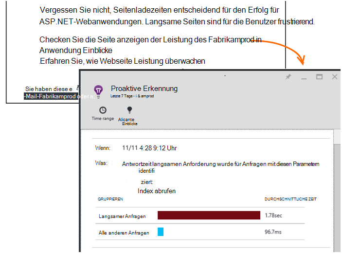

<properties 
    pageTitle="Anwendung Einblicke: Proaktive Performance Diagnose | Microsoft Azure" 
    description="Application Insights Tiefe Analyse des app-Telemetrie und warnt Sie potenzielle Probleme." 
    services="application-insights" 
    documentationCenter="windows"
    authors="antonfrMSFT" 
    manager="douge"/>

<tags 
    ms.service="application-insights" 
    ms.workload="tbd" 
    ms.tgt_pltfrm="ibiza" 
    ms.devlang="na" 
    ms.topic="article" 
    ms.date="08/31/2016" 
    ms.author="awills"/>

#  Proaktive Performance-Diagnose

*Anwendung Informationen ist in der Vorschau.*

[Visual Studio Application Insights](app-insights-overview.md) Tiefe Analyse des app-Telemetrie und können warnen Sie potenzielle Leistungsprobleme. Dies ist wahrscheinlich lesen, da Sie eines unserer proaktiven Alarme per e-Mail erhalten. 

Diese Funktion benötigt keine Installation und ist automatisch aktiviert, wenn Ihre Anwendung ausreichend Telemetrie generiert.

## Was sind proaktive Performance-Diagnose?

Proaktive Performance Diagnose entdeckt ungewöhnliche Muster Performance in Ihrer Anwendung anhand von Telemetriedaten Ihre app Anwendung Erkenntnisse sendet. 

Insbesondere sucht Leistungsprobleme, die nur bestimmte Benutzer bzw. wirken sich nur auf Benutzer in einigen Fällen.

Beispielsweise können sie Sie benachrichtigen, wenn Ihre app-Seiten sehr viel langsamer auf als andere Browser geladen oder Anfragen von einem bestimmten Server langsamer bereitgestellt werden. Es kann auch Probleme mit Eigenschaften ermitteln, z. B. langsame Seite in einem geografischen Bereich zu bestimmten Tageszeiten lädt.

Anomalien wie diese sind schwer zu erkennen, wenn Sie die Daten überprüfen, jedoch als Sie vielleicht denken. Oft sie nur Flächen, wenn Ihre Kunden beschweren. Zu diesem Zeitpunkt ist es zu spät: die betroffenen Benutzer bereits zur Konkurrenz wechseln.

Derzeit betrachten unsere Algorithmen Seitenladezeiten Anforderung Antwortzeiten am Server und Reaktionszeiten Abhängigkeit.  

Sie müssen alle Grenzwerte oder Regeln konfigurieren. Maschinelles lernen und Data Mining-Algorithmen, zum ungewöhnliche Muster erkennen. 

Wir sind sehr gespannt auf Ihr Feedback. Lassen Sie uns bitte wie dadurch Verbesserung proaktive Erkennung und welche weiteren Funktionen hinzufügen möchten. Feedback senden ein Lächeln/Stirnrunzeln im Portal bereitstellen oder schicken Sie eine e-Mail an AppInsightsML@microsoft.com. 

## Der proaktive Warnung

* *Warum haben diese e-Mail erhalten?*
 * Proaktive Erkennung analysiert Telemetrie, die Ihrer Anwendung an Application Insights gesendet und ein Leistungsproblem in Ihrer Anwendung. 
* *Bedeutet die Meldung ein Problem sind?*
 * Nein. Es ist lediglich ein Vorschlag etwas mehr genau betrachten möchten. 
* *Was soll ich tun?*
 * [Betrachten Sie die Daten](#responding-to-an-alert). Verwenden Sie Metrik-Explorer Überprüfen der Leistung und einen Drilldown ausführen, um weitere Kennzahlen. Mithilfe einer Suche auf bestimmte Ereignisse herausfiltern, mit denen Sie ermitteln die Ursache. 
* *Sehen euch Meine Daten?*
 * Nein. Der Dienst ist vollständig automatisiert. Nur erhalten die Benachrichtigungen. Ihre Daten sind [Privat](app-insights-data-retention-privacy.md).

## Der Prozess der Erkennung

* *Welche Performance Anomalien festgestellt werden?*
 * Muster, die Sie es zeitaufwändig überprüfen selbst finden. Z. B. Leistungseinbußen in eine bestimmte Kombination von Ort, Uhrzeit und Plattform.
* *Analysieren Sie alle Daten vom Application Insights?*
 * Derzeit nicht. Derzeit analysieren wir Anforderung Reaktionszeit und Reaktionszeit Abhängigkeit Seite laden. Analyse der zusätzliche Statistiken kommt bald. 
* *Kann ich meinen eigenen Anomalie Duplikaterkennungsregeln erstellen?*
 * Noch nicht. Können Sie:
 * [Alarme einrichten](app-insights-alerts.md) , die Sie informieren, wenn eine Metrik einen Schwellenwert überschreitet.)
 * Eine [Datenbank](app-insights-code-sample-export-sql-stream-analytics.md) oder [PowerBI](app-insights-export-power-bi.md) oder [andere](app-insights-code-sample-export-telemetry-sql-database.md) Tools, wo Sie sie selbst analysieren können [Telemetrie exportieren](app-insights-export-telemetry.md) .
* *Wie oft wird die Analyse ausgeführt?*
 * Wir führen die Analyse täglich Telemetriedaten vom Vortag.
* * So ersetzt diese [Metrik Alerts](app-insights-alerts.md)?
 * Nein.  Wir verpflichten uns nicht jedes Verhalten erkennen, die Sie ungewöhnliche sollten.

## Wie zu Fragen

Öffnen Sie den Diagnosebericht e-Mail oder aus Anomalien.

* **Wenn** enthält die Zeit, die das Problem erkannt wurde.
* Beschreibt, **welche**
 * Das Problem erkannt wurde;
 * Die Eigenschaften der Gruppe von Ereignissen, die wir gefunden angezeigt Problemverhalten.
* Die Tabelle vergleicht festgelegten schlechter durchschnittliche Verhalten anderer Ereignisse.

Klicken Sie auf die Links öffnen Metrik-Explorer, und suchen Sie relevante Berichte, auf die Eigenschaften des langsamen Leistung ein gefiltert.

Zeitraum und Filter Telemetriedaten zu ändern.

## Wie kann ich die Leistung verbessern?

Langsame und fehlgeschlagene Antworten sind eines der größten Ärgernisse für Website-Benutzer aus Ihrer eigenen Erfahrung wissen. So ist es wichtig, die Probleme zu beheben.

### Selektierung

Zunächst ist es wichtig? Wenn eine Seite ist immer langsam geladen, aber nur 1 % der Benutzer Ihrer Website schon ansehen, und vielleicht haben Sie Wichtigeres zu denken. Auf der anderen Seite könnte nur 1 % der Benutzer öffnen Ausnahmen immer löst jedoch Wert sein.

Beachten Sie, dass es nicht die ganze Geschichte verwenden Sie Auswirkungsaussage der e-Mail als allgemeine Richtlinie. Sammeln Sie weitere Beweise zu bestätigen.

Betrachten Sie die Parameter des Problems. Ist Geography-abhängige [Verfügbarkeitstests](app-insights-monitor-web-app-availability.md) einschließlich Region einrichten: einfach möglicherweise Netzwerkprobleme in diesem Bereich. 

### Langsame Seite Diagnose 

Wo liegt das Problem? Der Server reagiert langsam ist Seite sehr lange, oder muss des Browsers eine Menge Arbeit an?

Öffnen Sie Blatt metrische Browser. [Segmentierte des Browsers Seitenladezeit](app-insights-javascript.md#explore-your-data) angezeigt, die Zeit wird. 

* Wenn **Anforderungszeit senden** hoch ist, der Server reagiert langsam oder die Anforderung wurde nach voller Daten. Die [Leistungsmetriken](app-insights-web-monitor-performance.md#metrics) Reaktionszeiten zu betrachten. 
* Richten Sie [Abhängigkeit verfolgen](app-insights-dependencies.md) , ob die langsame externe Dienste oder die Datenbank ist.
* Wenn **Antwort empfangen überwiegt** sind der Seite und der abhängigen Parts - JavaScript, CSS, Bilder usw. (aber nicht asynchron geladen) lang. Richten Sie eine [Verfügbarkeit testen](app-insights-monitor-web-app-availability.md)und müssen Sie die Option abhängige Teile geladen. Wenn Sie einige Ergebnisse erhalten, öffnen Sie die Details eines und erweitern Sie, um die Ladezeiten von verschiedenen Dateien finden Sie unter.
* **Client-Verarbeitungszeit** schlägt Skripts langsam ausgeführt werden. Wenn die Ursache nicht offensichtlich ist, hinzufügen Sie einige Timing Code und die Zeiten in TrackMetric aufrufen.

### Langsame Seiten verbessern

Ist eine Web voller Ratschläge zur Verbesserung der Serverantworten und Seitenladezeiten, damit wir nicht alles wiederholen. Hier sind einige Tipps, denen Sie wahrscheinlich bereits wissen, nur um Sie:

* Durch große Dateien laden langsam: Skripts und andere Teile asynchron geladen. Verwenden Sie Skripts bündeln. Unterteilen Sie die Hauptseite in Widgets, die ihre Daten separat laden. Nur altes HTML für Tabellen nicht senden: mithilfe eines Skripts Daten als JSON oder andere Kompaktformat anfordern und füllen Sie die Tabelle. Es gibt gute Frameworks alle helfen. (sie ziehen auch große Skripts des Kurses.)
* Langsame Server abhängig: Betrachten Sie die Standorte der Komponenten. Wenn Azure verwenden, stellen Sie beispielsweise sicher, dass der Webserver und der Datenbank in derselben Region. Rufen Abfragen mehr Informationen als nötig? Würden Sie Zwischenspeichern oder die Batchverarbeitung Hilfe?
* Kapazitätsprobleme: Betrachten Sie servermetriken Reaktionszeiten und Anforderung zählt. Antwortzeiten unverhältnismäßig mit Anfrage zählt peak, ist es wahrscheinlich, dass Ihre Server gestreckt werden. 

## E-Mail-Benachrichtigungen

* *Müssen diesen Dienst abonnieren, um Benachrichtigungen zu erhalten?*
 * Nein. Unsere Bot regelmäßig überwacht die Daten aller Benutzer der Anwendung Einblicke und Benachrichtigung sendet, wenn Probleme entdeckt.
* *Kann ich kündigen oder stattdessen die Benachrichtigungen Kollegen?*
 * Klicken Sie auf Abmelden, Warnung oder e-Mail. 
 
    Sie haben gerade den gesendet haben [Schreibzugriff auf Application Insights-Ressource](app-insights-resources-roles-access-control.md).

    Sie können auch der Empfängerliste Einstellungen proaktive Erkennung Blatt bearbeiten.
* *Ich möchte diese Nachrichten überflutet werden.*
 * Sie werden nur einmal pro Tag mit der wichtigsten wir noch berichtet über noch nicht. Sie erhalten nicht wiederholt eine Nachricht.
* *Wenn ich etwas tun, erhalte ich eine Erinnerung?*
 * Nein, Sie erhalten eine Meldung über jedes Problem nur einmal. 
* *Verlust die e-Mail. Wo finde ich die Benachrichtigung im Portal?*
 * Klicken Sie in der Anwendung Einblicke Übersicht Ihrer App **Proaktive Erkennung** . Es werden Sie Anträge auf 7 Tagen finden können.

## Nächste Schritte

Diese Diagnose-Tools helfen Ihnen Telemetriedaten aus Ihrer Anwendung überprüfen:

* [Metrik-explorer](app-insights-metrics-explorer.md)
* [Suchexplorer](app-insights-diagnostic-search.md)
* [Analytics - leistungsfähige Abfragesprache](app-insights-analytics-tour.md)

Proaktive Erkennung sind vollkommen automatisch. Aber vielleicht möchten Sie einige weitere Alerts einrichten?

* [Manuell konfigurierte metrische alerts](app-insights-alerts.md)
* [Verfügbarkeit von Webtests](app-insights-monitor-web-app-availability.md) 

