<properties
    pageTitle="Versionsinformationen für Visual Studio-Erweiterung für Entwickler Analytics"
    description="Die neuesten Updates für Visual Studio-Tools für Entwickler Analytics."
    services="application-insights"
    documentationCenter=""
    authors="acearun"
    manager="douge"/>
<tags
    ms.service="application-insights"
    ms.workload="tbd"
    ms.tgt_pltfrm="ibiza"
    ms.devlang="na"
    ms.topic="article"
    ms.date="06/09/2016"
    ms.author="acearun"/>

# Versionshinweise für Entwickler Analysetools
Neuigkeiten: Anwendung Einblicke und HockeyApp Analysen in Visual Studio.
## Version 7.0
### Visual Studio Application Insights Trends
Visual Studio Application Insights ist ein neues Tool in Visual Studio, mit deren Hilfe Sie die Funktionsweise Ihrer Anwendung mit der Zeit zu analysieren. Wählen Sie zunächst, **Application Insights** -Symbolleisten-Schaltfläche oder Anwendung Einblicke Suchfenster **Telemetrie Trends untersuchen**. Oder im Menü **Ansicht** auf **Andere Fenster**und klicken Sie dann auf **Anwendung Einblicke Trends**. Wählen Sie eine der fünf allgemeine Abfragen zu beginnen. Sie können unterschiedliche Datensätze basierend auf telemetrietypen, Zeiträume und andere analysieren. Um Anomalien in den Daten zu suchen, wählen Sie eine Anomalie Optionen in der Dropdown-Liste **Ansicht** aus. Filteroptionen am unteren Fensterrand erleichtern die bestimmte Teilmengen der Telemetrie weiter.

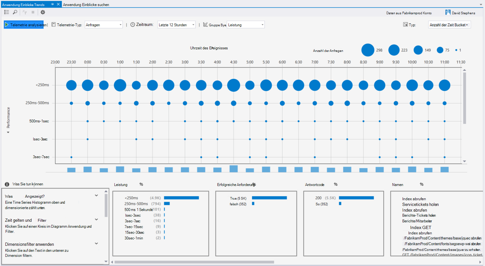

### Ausnahmen CodeLens
Ausnahme Telemetrie wird nun im CodeLens angezeigt. Wenn Verbindung Projekt Service Application Insights sehen Sie die Anzahl der Ausnahmen, die in jeder Methode Produktion in den letzten 24 Stunden aufgetreten sind. Von CodeLens springen Sie zu Suche Ausnahmen genauer untersuchen.

### ASP.NET Core-support
Application Insights jetzt unterstützt ASP.NET Core RC2 Visual Studio. Sie können neue ASP.NET Core RC2 Projekte im Dialogfeld **Neues Projekt** wie in der folgenden Abbildung Application Insights hinzufügen. Oder ein vorhandenes Projekt hinzufügen, mit der rechten Maustaste im Projektmappen-Explorer des Projekts und klicken Sie dann auf **Hinzufügen Anwendung Einblicke Telemetrie**.

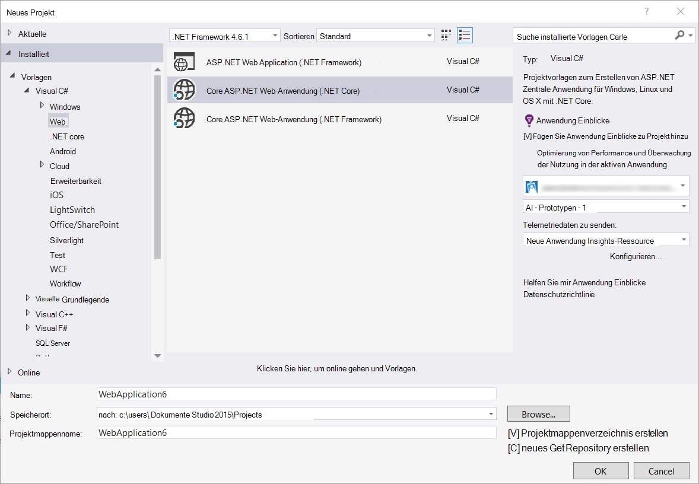

ASP.NET 5 RC1 und ASP.NET Core RC2 Projekte können neue Unterstützung im Fenster Diagnose-Tools. Sehen Sie Ereignisse wie Anfragen und Ausnahmen Anwendung Einblicke aus Ihrer Anwendung ASP.NET beim Debuggen lokal auf Ihrem PC. Klicken Sie auf jedes Ereignis **Suchen** Drilldown für Weitere Informationen.

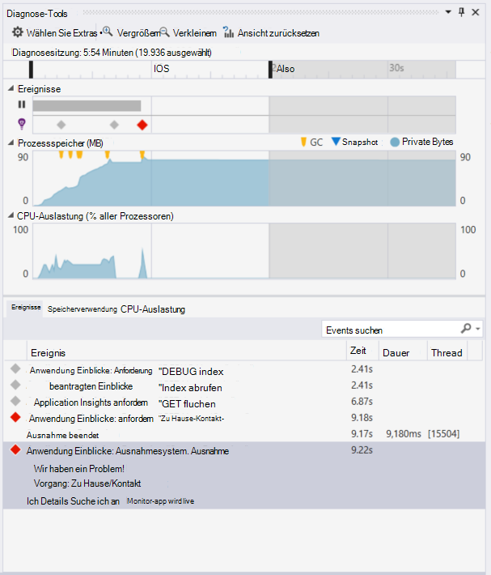

### HockeyApp für universelle Windows-apps
HockeyApp bietet neben Beta-Verteilung und Bewertung symbolicated Absturzberichte für universelle Windows-apps. Wir machen es einfacher HockeyApp SDK hinzufügen: mit der rechten Maustaste auf das Projekt universelle Windows und dann auf **"Hockey" App - Crash Analytics aktivieren**. Dieses SDK installiert Absturz Auflistung richtet und HockeyApp Ressource in die Cloud Hochladen Ihrer Anwendung HockeyApp Dienst ohne Vorschriften.

Neue Features:

* Wir haben die Anwendung Einblicke Suchvorgänge schneller und intuitiver. Jetzt werden Zeiträume und Detail-Filter automatisch angewendet wie Sie auswählen.
* Auch in Anwendung Einblicke Suche besteht jetzt die Möglichkeit zum Code direkt aus der Anforderung Telemetrie springen.
* Wir haben die HockeyApp-Erfahrung verbessert.
* Diagnose-Tools wird Produktion Telemetriedaten Ausnahmen angezeigt.

## Version 5.2
Wir freuen Einführung HockeyApp Szenarien in Visual Studio. Die erste Integration ist im Beta-Verteilung der universelle Windows und Windows Forms-apps in Visual Studio.

Beta-Verteilung Laden Sie frühe Versionen von apps auf HockeyApp für die Verteilung an eine ausgewählte Teilmenge der Kunden oder Tester. Beta-Verteilung, kombiniert mit HockeyApp Absturz Datensammlung und Bewertung, kann Ihnen wertvolle Informationen über Ihre Anwendung vor einer umfassenden Veröffentlichung. Diese Informationen, um Probleme können mit Ihrer Anwendung damit vermeiden oder zukünftige Problemen niedrigen app-Bewertungen Negative Bewertung, und minimieren.

Überprüfen Sie, wie einfach ist es hochladen für Beta-Verteilung von Visual Studio erstellt.
### Universelle Windows-apps
Das Kontextmenü für einen Projektknoten universelle Windows app enthält jetzt eine Option zum Hochladen von Builds auf HockeyApp.

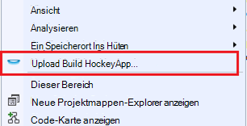

Wählen Sie das Element und HockeyApp Upload wird angezeigt. Sie benötigen ein HockeyApp Konto Builds hochladen. Wenn Sie ein neuer Benutzer sind, kein Problem. Erstellen eines Kontos ist ein einfacher Prozess.

Wenn Sie verbunden sind, wird das Dateiupload-Formular im Dialogfeld angezeigt.

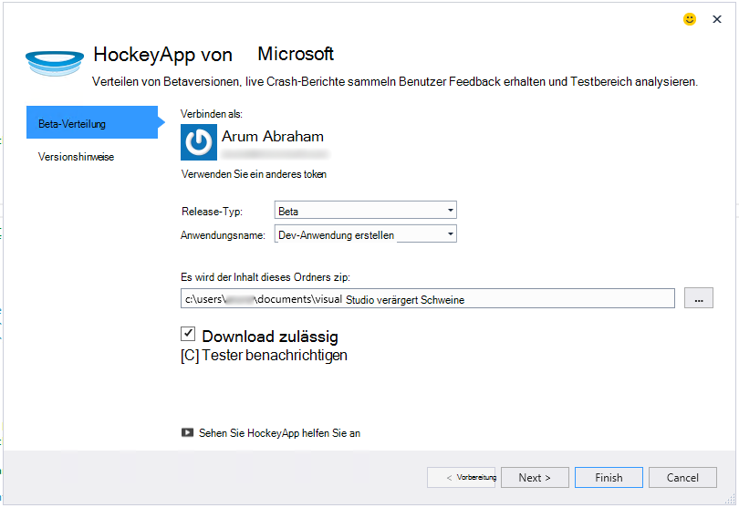

Wählen Sie den Inhalt hochzuladen (.appxbundle oder .appx-Datei), und wählen Sie Release-Optionen im Assistenten. Optional können Sie auf der nächsten Seite Versionsinformationen hinzufügen. Wählen Sie den Upload zu **Beenden** .

Wenn der Upload abgeschlossen ist, erscheint eine Mitteilung HockeyApp Bestätigung mit einem Link zur app im Portal HockeyApp.

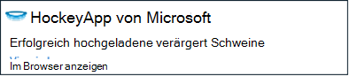

Das wars! Einen Build für Beta-Verteilung mit nur wenigen Klicks haben soeben hochgeladen.

Sie können die Anwendung zahlreiche HockeyApp Portal verwalten. Dazu einladen von Benutzern anzeigen Crash-Berichte und Feedback ändern details auf.

[HockeyApp Knowledge Base](http://support.hockeyapp.net/kb/app-management-2) Weitere Informationen zu app-Verwaltung anzeigen

### Apps für Windows Forms
Das Kontextmenü für ein Windows Form-Projektknoten enthält jetzt eine Option zum Hochladen von Builds auf HockeyApp.

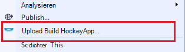

Dies in universelle Windows-app ähnelt HockeyApp-Dialogfeld hochladen.

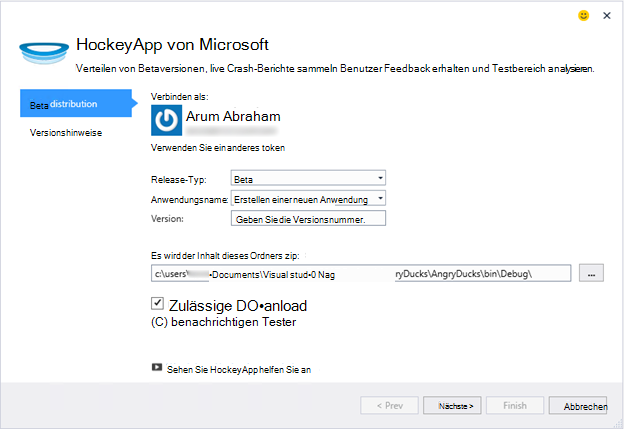

Beachten Sie ein neues Feld mit diesem Assistenten zur Angabe der Version der Anwendung. Für universelle Windows-apps wird die Informationen aus dem Manifest gefüllt. Windows Forms-apps leider nicht, eine Entsprechung für diese Funktion. Sie müssen sie manuell angeben.

Der Rest des Flusses ähnelt universelle Windows-apps: Wählen Sie erstellen und Freigeben von Optionen, Version hochladen, und im HockeyApp Portal verwalten.

So einfach ist das. Versuchen Sie es, und teilen Sie uns Ihre Meinung.
## Version 4.3
### Suche Telemetriedaten aus lokalen Debugsitzungen
In dieser Version können Sie nun für die Debugsitzung von Visual Studio generierten Anwendung Einblicke Telemetrie suchen. Zuvor können Sie Suche nur, wenn Ihre app Anwendung zum registriert. Jetzt muss die app nur Application Insights-SDK installiert, um die Suche nach lokalen Telemetrie.

Haben Sie eine Anwendung ASP.NET Application Insights-SDK, gehen Sie folgendermaßen vor um Suche verwenden.

1. Debuggen der Anwendung.
2. Öffnen Sie Anwendung Einblicke Suche folgendermaßen:
    - Klicken Sie im Menü **Ansicht** auf **Andere Fenster**und integrierten Sie **Anwendung Einblicke**.
    - Klicken Sie auf die Symbolleistenschaltfläche **Application Insights** .
    - Im Projektmappen-Explorer erweitern Sie **ApplicationInsights.config**und klicken Sie dann auf **Suche Debug-Sitzung Telemetrie**.
3. Wenn Sie Einblicke Anwendung angemeldet haben, wird das Fenster Suchen im Debugmodus Sitzung Telemetrie geöffnet.
4. Klicken Sie auf **Suchen** , um Ihre lokalen Telemetrie anzuzeigen.

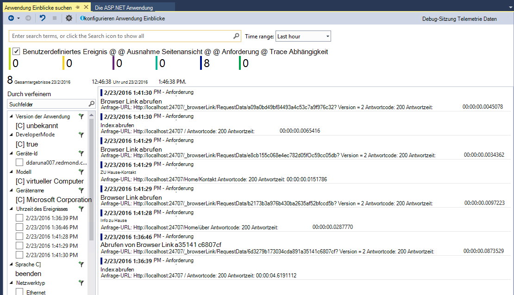

## Version 4.2
In diesem Release haben wir Funktionen zur Suche nach Daten im Kontext der Ereignisse, die Möglichkeit, weitere Ereignisse und mühelos Erlebnis Anwendung Einsichten von Protokolldaten an Code zu springen. Diese Erweiterung wird monatlich aktualisiert. Haben Sie Feedback oder Feature Anfragen senden, aidevtools@microsoft.com.
### Protokollierung auf keine Erfahrung
Wenn Sie bereits über NLog, log4net oder System.Diagnostics.Tracing verwenden, müssen Sie verschieben all Ihre Spuren Anwendung Einblicke kümmern. In dieser Version haben wir die Anwendung Einblicke Protokollierung Adapter mit der normalen Konfiguration integriert.
Haben Sie bereits eine dieser Protokollierung Frameworks konfiguriert, beschreibt im folgenden Abschnitt zu.
**Wenn Sie bereits Anwendung Einblicke hinzugefügt haben:**
1. Mit der rechten Maustaste des Projektknoten klicken Sie auf **Anwendung Einblicke**und **Application Insights konfigurieren**klicken. Vergewissern Sie, dass Sie den richtigen Adapter im Konfigurationsfenster hinzufügen.
2. Auch beim Erstellen der Projektmappe Hinweis oben angezeigten Popupmenü Fenster rechts und klicken Sie auf **Konfigurieren**.

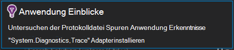

Wenn Sie Protokollierung Adapter installiert haben, führen Sie die Anwendung und stellen Sie sicher, dass die Daten auf der Registerkarte Diagnose-Tools wie folgt angezeigt:

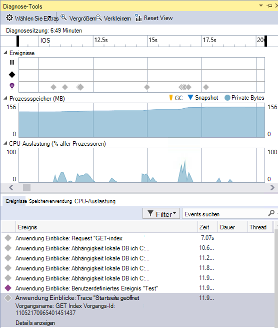

### Wechseln zu oder suchen Sie den Code, in dem die Ereigniseigenschaft Telemetrie ausgegeben
Mit der neuen Version Benutzer kann auf einen beliebigen Wert im Detail und sucht nach einer übereinstimmenden Zeichenfolge in der aktuellen geöffneten Projektmappe. Ergebnisse in Visual Studio angezeigt Liste "Suchergebnisse", wie unten dargestellt:

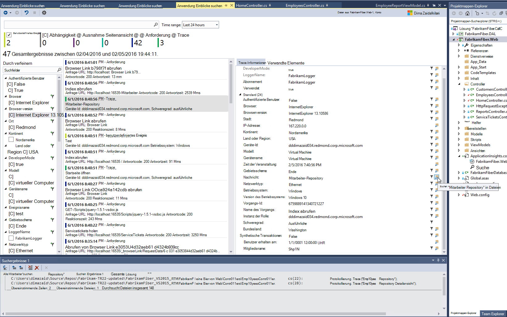

### Neues Suchfenster für Wenn Sie nicht angemeldet sind
Wir haben das Aussehen der Anwendung Einblicke Suchfenster können Sie Daten suchen, während Ihre Anwendung in der Produktion wird verbessert.

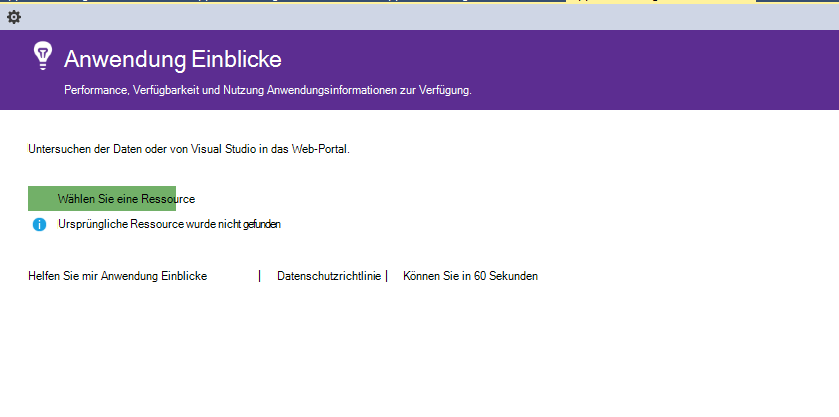

### Alle Telemetrie Ereignisse mit dem Ereignis verknüpft
Wir haben eine neue Registerkarte mit vordefinierten Abfragen für alle Daten der Telemetrie, Benutzer, neben der Registerkarte Ereignisdetails anzeigen hinzugefügt. Beispielsweise hat eine Anforderung ein Feld namens **Vorgangs-ID** Jedes Ereignis im Zusammenhang mit dieser Anforderung hat den gleichen Wert für die **Vorgangs-ID** Wenn eine Ausnahme auftritt, während der Vorgang die Anforderung verarbeitet wird, erhält die Ausnahme gleichen Vorgangs-ID wie die Anforderung zu erleichtern. Wenn ein Antrag suchen, klicken Sie auf **Alle Telemetrie für diesen Vorgang** , um eine neue Registerkarte öffnen, die neue Suchergebnisse angezeigt.

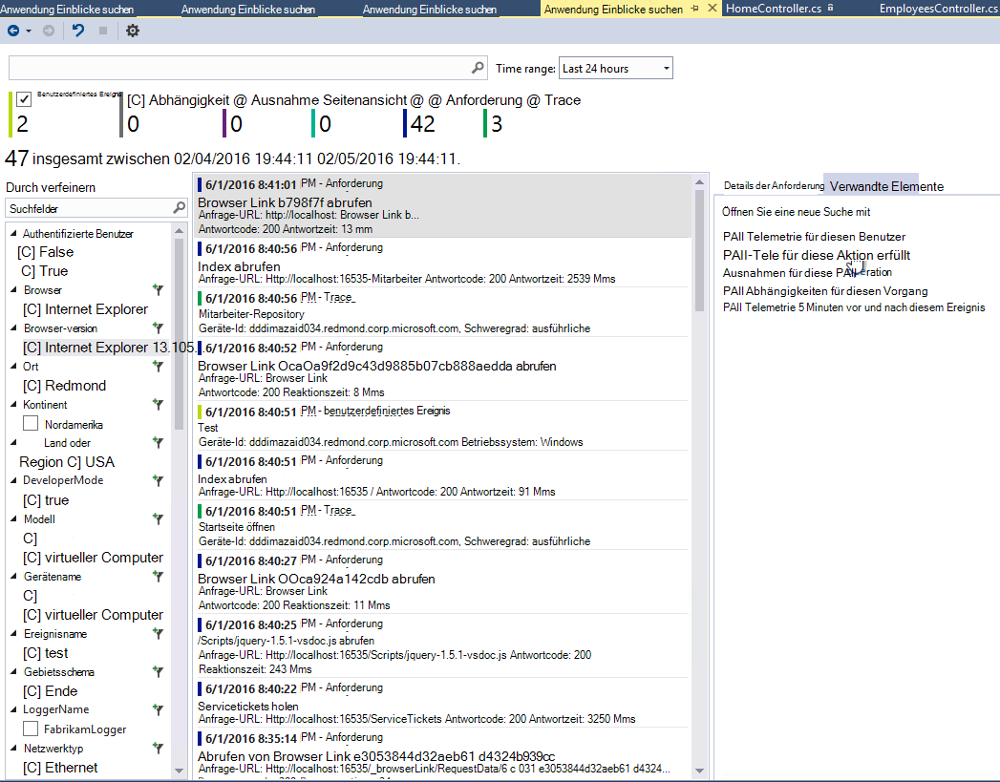

### Weiterleiten und Geschichte Suche
Jetzt können Sie zwischen Suchergebnissen wechseln.

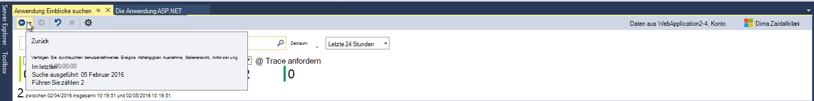

## Version 4.1
Diese Version enthält eine Reihe neuer Features und Updates. Sie müssen Update 1 installieren Sie diese Version installiert haben.

### Eine Ausnahme zu Methode im Quellcode springen
Wenn Sie Ausnahmen in Ihrer Produktion app im Suchfenster Anwendung Einblicke anzeigen, springen Sie an die Methode im Code, wo die Ausnahme auftritt. Sie müssen nur das richtige Projekt geladen und Application Insights übernimmt den Rest! (Erfahren Sie mehr über das Fenster Anwendung Einblicke Suchen Siehe die Versionshinweise für Version 4.0 in den folgenden Abschnitten.)

Wie funktioniert es? Auch wenn eine Projektmappe geöffnet ist, können Sie Applications Einblicke suchen. Der Stack Trace Bereich zeigt eine und viele Elemente im Stapelrahmen sind nicht verfügbar.

Wenn Informationen verfügbar ist, einige Elemente möglicherweise Links aber Informationen Projektmappenelement werden angezeigt.

Wenn Sie auf den Hyperlink klicken, werden Sie an die ausgewählte Methode im Code wechseln. Möglicherweise ein Unterschied in der Versionsnummer, aber das Feature, um die richtige Version des Codes zu kommen in späteren Versionen.

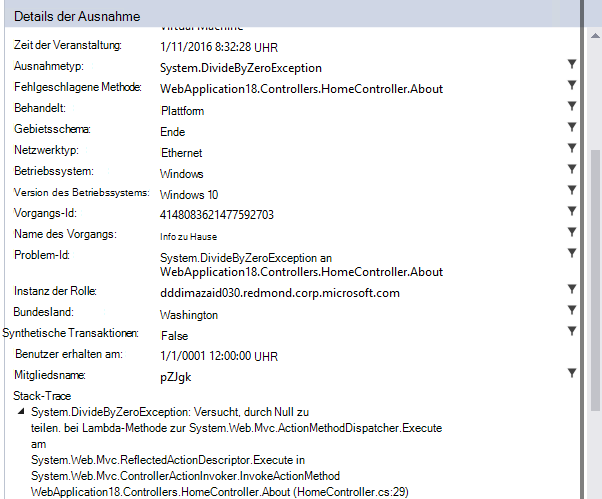

### Erleben Sie neue Einstiegspunkte für die Suche im Projektmappen-Explorer
Jetzt können Sie Projektmappen-Explorer suchen zugreifen.

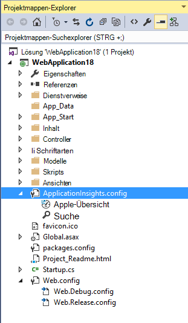

### Wird bei der Veröffentlichung ist abgeschlossen
Ein Dialogfeld wird angezeigt, wenn das Projekt online veröffentlicht, damit Ihre Anwendung Statistikdaten Produktion anzeigen können.

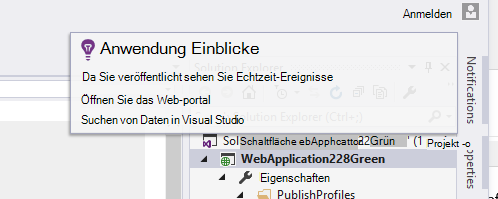

## Version 4.0

### Suche Anwendung Einblicke Daten in Visual Studio
Wie die Suchfunktion jetzt in Visual Studio können Sie filtern Application Insights-Portal und Suche Ereignistypen Eigenschaftswerte und Text und einzelne Ereignisse zu untersuchen.

### Daten von Ihrem lokalen Computer Diagnosetools

Sie können Ihre Telemetrie neben anderen debugging auf Visual Studio-Diagnosetools anzeigen. Nur ASP.NET 4.5 unterstützt.

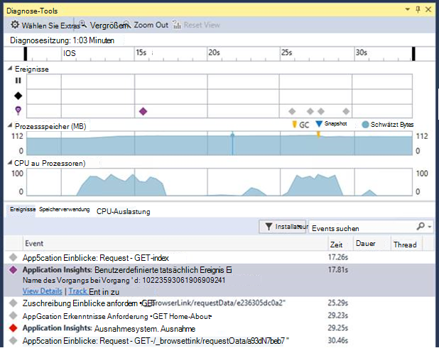

### Projekt ohne Anmeldung bei Azure fügen Sie SDK hinzu

Sie müssen nicht mehr Anwendung Einblicke Pakete zum Projekt oder über das Dialogfeld **Neues Projekt** im Projekt-Kontextmenü hinzufügen in Azure anmelden. Wenn Sie sich anmelden können, wird das SDK installiert und konfiguriert Telemetrie an das Portal vor dem senden. Wenn Sie sich nicht anmelden können, das SDK zum Projekt hinzugefügt und Telemetrie für diagnostische Hub generiert. Sie können es später konfigurieren soll.

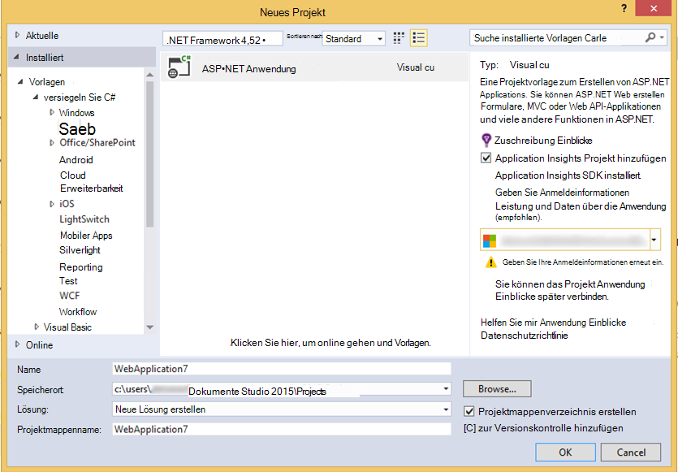

### Unterstützung für Geräte

Bei *Connect();* 2015 wir [angekündigt](https://azure.microsoft.com/blog/deep-diagnostics-for-web-apps-with-application-insights/) , dass unsere mobile Developer Experience für Geräte HockeyApp. HockeyApp können Sie Builds Beta-Testern verteilen sammeln und analysieren alle Abstürze von Ihrer app und Feedback direkt über Ihre Kunden sammeln.
HockeyApp unterstützt Ihre app auf welcher Plattform Sie wahlweise, erstellen, iOS, Android, Windows oder eine plattformübergreifende Lösung wie Xamarin, Cordova oder Einheit sein.

In zukünftigen Versionen der Anwendung Einblicke Erweiterung werden wir mehr Integrationsoptionen zwischen HockeyApp und Visual Studio vorstellen. Jetzt können Sie mit HockeyApp beginnen durch die NuGet-Referenz hinzufügen. Finden Sie die [Dokumentation](http://support.hockeyapp.net/kb/client-integration-windows-and-windows-phone) für Weitere Informationen.
