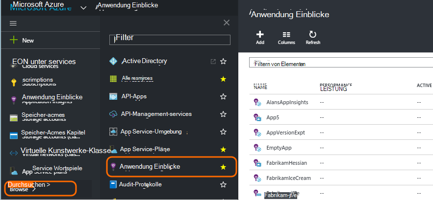
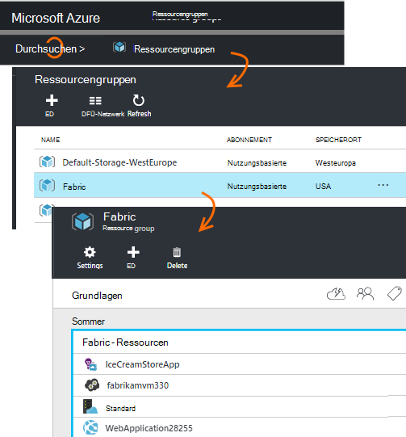
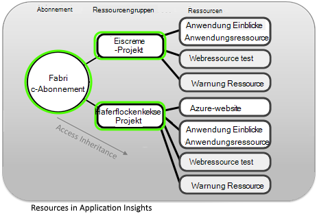
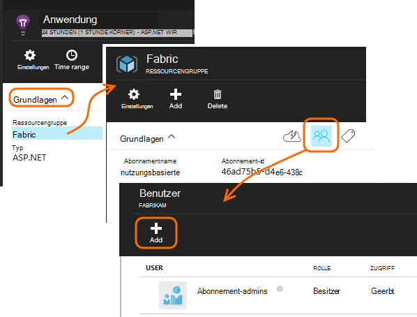
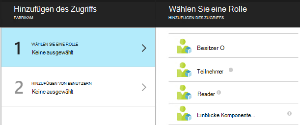
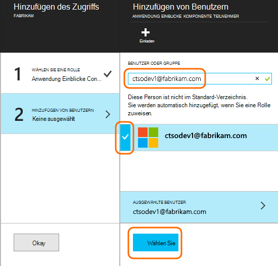

<properties
    pageTitle="Ressourcen, Rollen und Zugriffskontrolle Anwendung Erkenntnisse"
    description="Besitzer, Mitwirkende und Leser Ihrer Organisation Erkenntnisse."
    services="application-insights"
    documentationCenter=""
    authors="alancameronwills"
    manager="douge"/>

<tags
    ms.service="application-insights"
    ms.workload="tbd"
    ms.tgt_pltfrm="ibiza"
    ms.devlang="na"
    ms.topic="article"
    ms.date="05/07/2016"
    ms.author="awills"/>

# Ressourcen, Rollen und Zugriffskontrolle Anwendung Erkenntnisse

Sie können steuern, wer hat und Zugriff auf Ihre Daten in Visual Studio [Application Insights]aktualisieren[start], [Rollenbasierte Zugriffskontrolle in Microsoft Azure](../active-directory/role-based-access-control-configure.md)mit.

> [AZURE.IMPORTANT] Benutzer, die **Ressourcengruppe oder Abonnement** die Anwendungsressource gehört-nicht in die Ressource selbst weisen Sie Zugriff zu. Zuweisen der **Anwendung Einblicke Komponente** Beitragendenrolle. Einheitliche Steuerung des Zugriffs auf Webtests und Warnungen mit der Anwendungsressource wird sichergestellt. [Erfahren Sie mehr](#access).

## Ressourcen, Gruppen und Abonnements

Zunächst einige Definitionen:

* **Ressource** – eine Instanz eines Dienstes Microsoft Azure. Application Insights-Ressource erfasst, analysiert und Telemetriedaten von der Anwendung gesendet wird.  Andere Typen von Azure Ressourcen zählen webapps, Datenbanken und VMs.

    Um alle Ressourcen anzuzeigen, wechseln Sie zu [Azure-Portal][portal]anmelden, und klicken Sie auf Durchsuchen.

    

* [**Ressourcengruppe** ] [ group] -jede Ressource gehört zu einer Gruppe. Eine Gruppe ist eine bequeme Möglichkeit, verwandte Ressourcen, insbesondere für Zugriffskontrolle. Z. B. in einer Ressourcengruppe konnte Web App Application Insights-Ressource die Anwendung überwachen und eine Speicherressource exportierten Daten ablegen.

    

* [**Abonnement**](https://manage.windowsazure.com) - Anwendung Einblicke oder andere Azure-Ressourcen verwenden, melden Sie sich bei Azure-Abonnement. Jede Ressourcengruppe gehört ein Azure-Abonnement, wo Sie Ihr preispaket und, ist ein Abonnement Organisation wählen Sie die Mitglieder und deren Zugriffsberechtigungen.
* [**Microsoft-Konto** ] [ account] -Benutzername und Kennwort für die Microsoft Azure-Abonnements, XBox Live, Outlook.com und anderen Microsoft-Diensten anmelden.

## Steuern des Zugriffs in der Ressourcengruppe

Es ist wichtig zu verstehen, dass neben der Ressource für Ihre Anwendung erstellten gibt es separate ausgeblendete Ressourcen oder Webtests. Sie sind der gleichen [Ressourcengruppe](#resource-group) Anwendung zugeordnet. Sie können auch andere Azure-Dienste dort Speicher oder Websites eingefügt haben.

Zum Steuern des Zugriffs auf diese Ressourcen wird daher empfohlen:

* Steuern des Zugriffs auf die **Ressource oder Abonnement** .
* **Einblicke Komponente** Teilnehmerrolle Benutzern zuweisen. Dadurch können sie Webtests, Alarme und Application Insights Ressourcen ohne Zugriff auf andere Dienste in der Gruppe bearbeiten.

## Ein anderer Benutzer zugreifen

Sie müssen Besitzerrechte für das Abonnement oder die Ressourcengruppe.

Der Benutzer muss ein [Microsoft-Konto][account], oder der Zugriff auf ihre [Organisation Microsoft-Konto](..\active-directory\sign-up-organization.md). Sie können für Personen und Benutzergruppen definiert in Azure Active Directory zugreifen.

#### Navigieren Sie zu der Ressourcengruppe

Den Benutzer hinzufügen.

Sie können sich oder den Benutzer zum Abonnement hinzufügen.

#### Wählen Sie eine Rolle

Rolle | In der Ressourcengruppe
---|---
Besitzer | Kann alles, einschließlich Zugriff ändern
Teilnehmer | Können alles, einschließlich aller Ressourcen
Anwendung Einblicke Komponente Teilnehmer | Kann Anwendung Einblicke Ressourcen Webtests und Alerts bearbeiten
Reader | Anzeigen können, aber nichts ändern

"Bearbeiten" enthält, erstellen, löschen und aktualisieren:

* Ressourcen
* Webtests
* Alarme
* Kontinuierliche exportieren

#### Wählen Sie den Benutzer

Wenn der Benutzer im Verzeichnis nicht können Sie alle Benutzer mit einem Microsoft-Konto einladen.
(Wenn sie Dienste wie Outlook.com, OneDrive, Windows Phone oder XBox Live verwenden, haben sie ein Microsoft-Konto.)

## Benutzer und Rollen

* [Rollenbasierte Zugriffskontrolle in Azure](../active-directory/role-based-access-control-configure.md)

<!--Link references-->

[account]: https://account.microsoft.com
[group]: ../resource-group-overview.md
[portal]: https://portal.azure.com/
[start]: app-insights-overview.md
