<properties 
    pageTitle="Exemplarische Vorgehensweise: Überwachen von Microsoft Dynamics CRM-Anwendung Einblicke" 
    description="Erhalten Sie von Microsoft Dynamics CRM Online-Anwendung Einblicke mit Telemetrie. Exemplarische Vorgehensweise zur Installation Abrufen von Daten, Visualisierung und Export." 
    services="application-insights" 
    documentationCenter=""
    authors="mazharmicrosoft" 
    manager="douge"/>

<tags 
    ms.service="application-insights" 
    ms.workload="tbd" 
    ms.tgt_pltfrm="ibiza" 
    ms.devlang="na" 
    ms.topic="article" 
    ms.date="11/17/2015" 
    ms.author="awills"/>
 
# Exemplarische Vorgehensweise: Aktivieren der Telemetrie für Microsoft Dynamics CRM Online-Anwendung Einblicke mit

Dieser Artikel beschreibt, wie Daten aus [Microsoft Dynamics CRM Online](https://www.dynamics.com/) zu mit [Visual Studio Application Insights](https://azure.microsoft.com/services/application-insights/). Wir gehen erfassen Daten und Visualisierung von Daten durch den Vorgang der Anwendung Application Insights-Skript hinzufügen.

>[AZURE.NOTE] [Die Beispielprojektmappe durchsuchen](https://dynamicsandappinsights.codeplex.com/).

## Neue oder vorhandene CRM Online-Instanz Application Insights hinzufügen 

Überwachen die Anwendung wird die Anwendung Application Insights-SDK hinzufügen. Das SDK sendet Telemetrie an [Application Insights-Portal](https://portal.azure.com)können unsere leistungsstarken Analyse und Diagnose-Tools, oder exportieren Sie die Daten in den Speicher.

### Erstellen Sie eine Ressource Anwendung Einblicke in Azure

1. [Ein Konto in Microsoft Azure](http://azure.com/pricing)zu erhalten. 
2. [Azure-Portal](https://portal.azure.com) anmelden und eine neue Anwendung Einblicke Ressource hinzufügen. Dies ist, wo die Daten verarbeitet und angezeigt werden.

    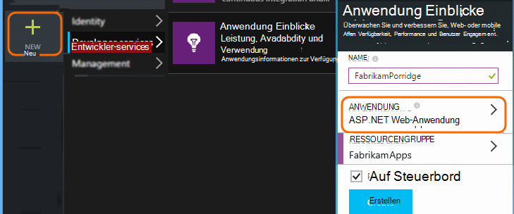

    Wählen Sie den Anwendungstyp ASP.NET.

3. Öffnen Sie die Registerkarte Schnellstart und das Skript Code.

    

**Die Codepage geöffnet lassen** zwar die nächste Schritt in einem anderen Browserfenster. Sie benötigen den Code schnell. 

### Erstellen Sie eine Webressource JavaScript in Microsoft Dynamics CRM

1. Öffnen Sie Ihr CRM Online-Instanz und Anmeldung mit Administratorrechten an.
2. Öffnen von Microsoft Dynamics CRM Einstellungen, Anpassungen des Systems

    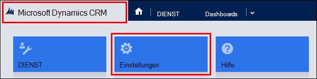
    
    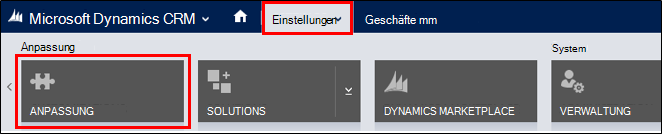

    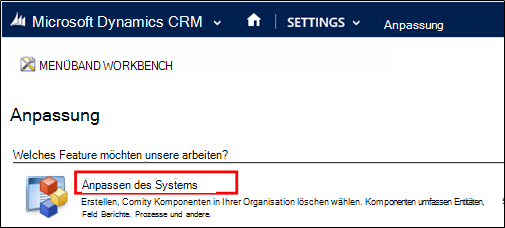

3. Erstellen Sie eine JavaScript-Ressource.

    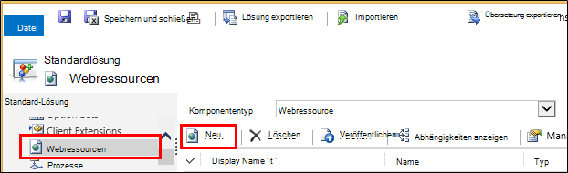

    Geben sie einen Namen und wählen Sie **Skript (JScript)** öffnen Sie Text-Editor.

    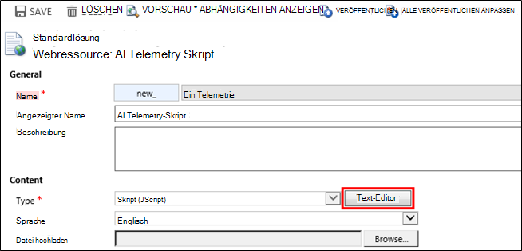
    
4. Kopieren Sie den Code von Anwendung. Beim Kopieren unbedingt Script-Tags ignoriert. Siehe Screenshot unten:

    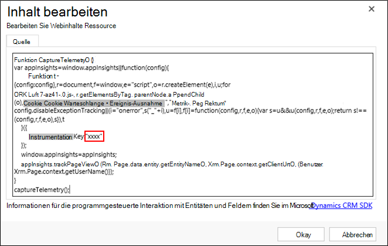

    Der Code enthält instrumentationsschlüssel, der die Anwendungsressource Einblicke identifiziert.

5. Speichern und veröffentlichen.

    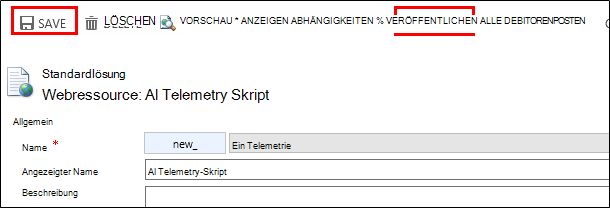

### Instrument-Formulare

1. Öffnen Sie das Formular in Microsoft CRM Online

    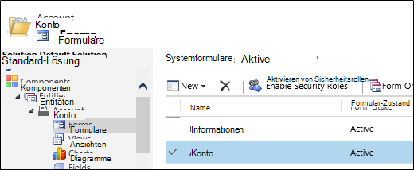

2. Öffnen Sie das Formular Eigenschaften

    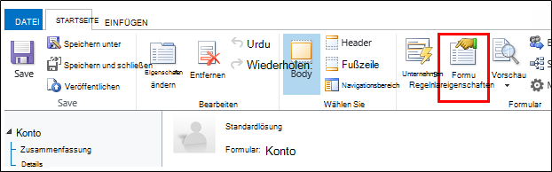

3. Fügen Sie JavaScript-Webressource, die Sie erstellt haben

    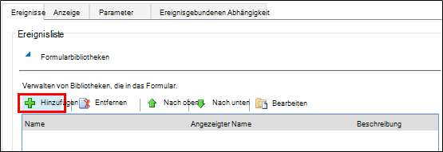

    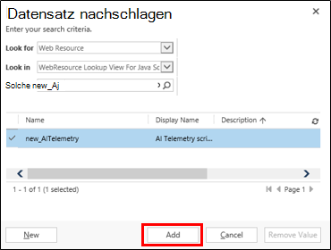

4. Speichern Sie und veröffentlichen Sie der Form angepasst.

## Metriken erfasst

Sie haben jetzt Telemetrie Erfassung für das Formular eingerichtet. Wenn es verwendet wird, werden Daten für die Anwendung Einblicke Ressource gesendet.

Hier sind Beispiele für Daten, die Sie sehen.

#### Anwendungszustands

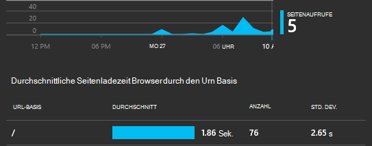

Browser-Ausnahmen:

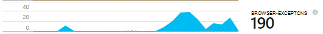

Klicken Sie auf das Diagramm, um mehr Details zu sehen:

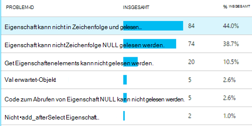

#### Verwendung

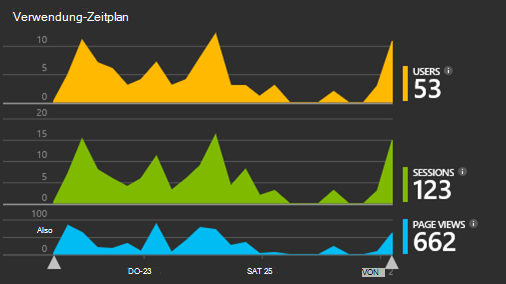

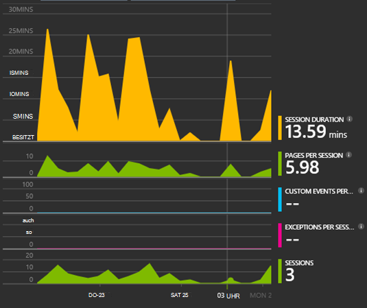

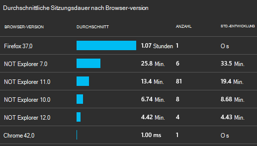

#### Browser

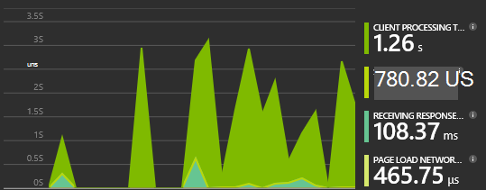

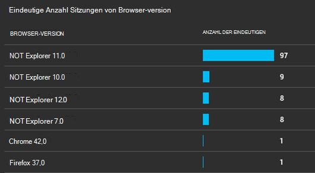

#### GeoLocation

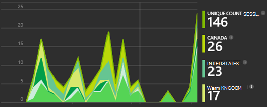

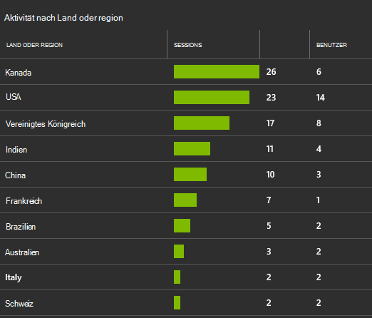

#### Anforderung innen anzeigen

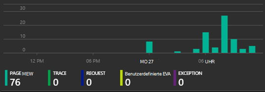

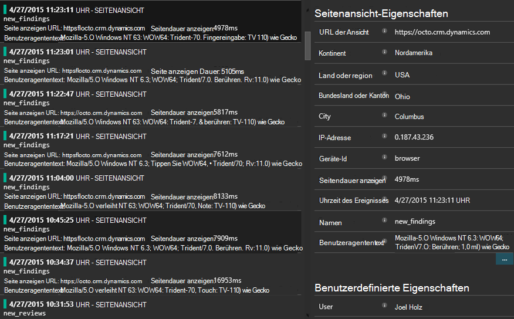

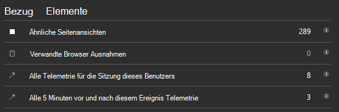

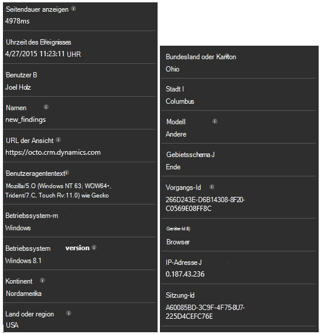

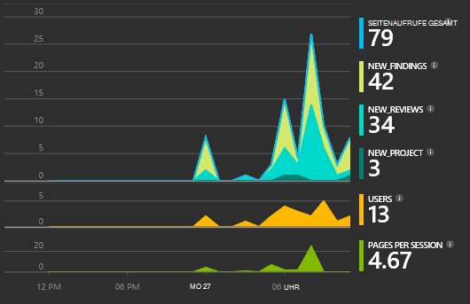

## Beispielcode

[Den Beispielcode durchsuchen](https://dynamicsandappinsights.codeplex.com/).

## Power BI

Sie können tiefere Analyse, wenn [die Daten nach Microsoft Power BI exportieren](app-insights-export-power-bi.md).

## Microsoft Dynamics CRM-Beispielprojektmappe

[Hier ist der Beispielprojektmappe in Microsoft Dynamics CRM implementiert] (https://dynamicsandappinsights.codeplex.com/).

## Weitere Informationen

* [Was ist Application Insights?](app-insights-overview.md)
* [Anwendung Einblicke für Webseiten](app-insights-javascript.md)
* [Beispiele und exemplarische Vorgehensweisen](app-insights-code-samples.md)

 
