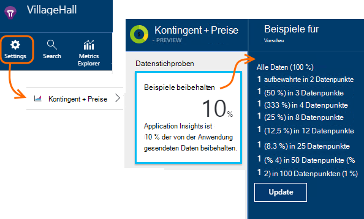

<properties 
    pageTitle="Telemetrie Sampling Anwendung Erkenntnisse | Microsoft Azure" 
    description="Wie Sie das Volumen der Telemetrie gesteuert." 
    services="application-insights" 
    documentationCenter="windows"
    authors="vgorbenko" 
    manager="douge"/>

<tags 
    ms.service="application-insights" 
    ms.workload="tbd" 
    ms.tgt_pltfrm="ibiza" 
    ms.devlang="na" 
    ms.topic="article" 
    ms.date="08/30/2016" 
    ms.author="awills"/>

#  <a name="sampling-in-application-insights"></a>Stichproben in Anwendung Einblicke

*Anwendung Informationen ist in der Vorschau.*


Sampling ist ein Feature in [Visual Studio Application Insights](app-insights-overview.md) empfohlen, Telemetrie Datenverkehr und Storage reduziert gleichzeitig eine statistisch korrekte Analyse der Daten. Der Filter wählt Elemente beziehen, um zwischen Elementen dabei Diagnostik navigieren können.
Wenn metrische zählt im Portal angezeigt werden, sind sie renormalisiert um die Probenahme Auswirkung auf die Statistiken zu berücksichtigen.

Sampling verringert den Datenverkehr, hilft Ihnen in monatlichen Datenträgerkontingente und Drosselung vermeiden.

## <a name="in-brief"></a>Kurz gesagt:

* Probenahme 1 *n* Datensätze beibehalten und verwirft den Rest. Beispielsweise kann eine Abtastrate von 20 % 1: 5 Ereignisse aufbewahrt. 
* Probenahme geschieht automatisch, wenn die Anwendung viele Telemetrie in ASP.NET Web Server apps sendet.
* Sie können auch festlegen, Probenahme manuell in das Portal Preisseite; oder im SDK ASP.NET in der config-Datei auch den Netzwerkverkehr reduzieren.
* Benutzerdefinierte Ereignisse protokollieren möchten sicherstellen, dass eine Reihe von Ereignissen beibehalten oder zusammen verworfen und stellen Sie sicher, dass sie den gleichen OperationId Wert.
* Probenahme Divisor *n* in jedem Datensatz der Eigenschaft gemeldet `itemCount`, die Suche unter dem Anzeigenamen "Anzahl" oder "Ereignisanzahl" angezeigt wird. Bei Stichproben nicht, `itemCount==1`.
* Analytics Abfragen sollte [der Probenahme berücksichtigt](app-insights-analytics-tour.md#counting-sampled-data). Insbesondere statt lediglich Datensätze werden gezählt, verwenden Sie `summarize sum(itemCount)`.


## <a name="types-of-sampling"></a>Probenahmen


Es gibt drei alternative Probenahmeverfahren:

* **Adaptive Sampling** passt die Menge der Telemetriedaten aus dem SDK in Ihrer Anwendung ASP.NET gesendet. Standardmäßig vom SDK V 2.0.0-beta3. Derzeit nur ASP.NET serverseitige Telemetrie. 
* **Feste Rate-Sampling** reduziert die Telemetrie als ASP.NET-Server und vom Browser des Benutzers gesendet. Die Rate festlegen. Client und Server synchronisiert die Probenahme so, Suche in Anfragen bis Seitenansichten navigieren.
* **Erfassung-Stichproben** reduziert die Telemetrie vom Application Insights-Dienst mit einer Geschwindigkeit, die Sie festlegen. Telemetrie Datenverkehr reduziert, aber hilft Ihnen in Ihre monatliche Kontingent. 

Adaptive oder feste Rate-Sampling ist in Betrieb Einnahme Sampling deaktiviert.

## <a name="ingestion-sampling"></a>Aufnahme-sampling

Diese Form der Probenahme arbeitet an der Stelle, wo Telemetrie Webserver, Browser und Geräte den Anwendung Einblicke Endpunkt erreicht. Obwohl es Telemetrie Datenverkehr aus Ihrer Anwendung reduziert, es reduzieren verarbeitet und gespeichert (und für) Anwendung Einsichten.

Verwenden Sie diesen Probenahme, wenn Ihre app häufig über das monatliche Kontingent geht und nicht die Möglichkeit eines SDK-basierte Typen der Probenahme. 

Legen Sie die Sampling-Rate der Kontingente und Blade:



Wie andere Sampling behält der Algorithmus verwandte telemetrieelemente. Beispielsweise wenn Sie Telemetrie Suche überprüfen, werden Sie Anmeldung für eine bestimmte Ausnahme gefunden. Metrik wie Anforderung zählt und Exception-Rate korrekt gespeichert.

Stichprobenkontrollen verworfen werden Datenpunkte sind nicht verfügbar in jeder Anwendung Einblicke Feature wie [Fortlaufende exportieren](app-insights-export-telemetry.md).

Erfassung-Stichproben funktioniert nicht während der SDK-basierten adaptive oder -Rate-Sampling ist. Ist die Abtastrate im SDK unter 100 % wird Einnahme Sampling-Rate, die festgelegt werden ignoriert.

> [AZURE.WARNING] Der Wert auf der Kachel gibt Einnahme Probenahme festgelegte Wert. Es darstellen nicht die tatsächliche Abtastrate, wenn SDK Probenahme in Betrieb ist.


## <a name="adaptive-sampling-at-your-web-server"></a>Adaptive Probenahme auf dem Webserver

Adaptive Sampling steht für Application Insights SDK für ASP.NET V 2.0.0-beta3 und höher und ist standardmäßig aktiviert. 


Adaptive Sampling wirkt sich auf die Menge der Telemetriedaten aus Ihrer Serveranwendung Application Insights-Dienst gesendet. Das Volume wird automatisch angepasst, um die angegebene maximale Datenübertragungsrate Datenverkehr einhalten.

Es funktioniert nicht bei niedrigen Telemetrie, also eine Anwendung debuggen, oder eine Website mit geringer Auslastung nicht betroffen.

Um das Ziel-Volume zu erreichen, werden einige Telemetrie generiert verworfen. Aber wie andere Sampling Algorithmus verwandte telemetrieelemente. Beispielsweise wenn Sie Telemetrie Suche überprüfen, werden Sie Anmeldung für eine bestimmte Ausnahme gefunden. 

Metrik wie Anforderung zählt und Exception-Rate zum Ausgleich der Sampling-Rate angepasst, sodass sie etwa Werte im Metrik-Explorer anzeigen.

**Aktualisieren des Projekts NuGet** Pakete *die neueste Vorabversion von Anwendung Einblicke* : mit der rechten Maustaste im Projektmappen-Explorer des Projekts, wählen Sie NuGet-Pakete verwalten, **Vorabversion enthalten** und nach Microsoft.ApplicationInsights.Web suchen. 

Im [ApplicationInsights.config](app-insights-configuration-with-applicationinsights-config.md)können Sie mehrere Parameter in der `AdaptiveSamplingTelemetryProcessor` Knoten. Die Zahlen sind die Standardwerte:

* `<MaxTelemetryItemsPerSecond>5</MaxTelemetryItemsPerSecond>`

    Der Ziel-Bitrate, die der Anpassungsalgorithmus auf **auf jedem Server**. Wenn Ihrer Anwendung auf vielen Hosts ausgeführt wird, verringern Sie diesen Wert so in die Ziel-Bitrate an Application Insights-Portal.

* `<EvaluationInterval>00:00:15</EvaluationInterval>` 

    Das Intervall mit der Stichtagskurs Telemetrie neu ausgewertet wird. Auswertung erfolgt als einen gleitenden Durchschnitt. Möglicherweise möchten dieses Intervall verkürzen, wenn Ihre Telemetrie plötzliche Ausbrüche ist.

* `<SamplingPercentageDecreaseTimeout>00:02:00</SamplingPercentageDecreaseTimeout>`

    Wenn Prozentsatz ändern, wie schnell nach dürfen wir Sampling Prozentsatz um weniger Daten verringern.

* `<SamplingPercentageIncreaseTimeout>00:15:00</SamplingPercentageIncreaseTimeout>`

    Wenn Prozentsatz ändern, wie schnell nach dürfen wir Sampling Erhöhung um weitere Daten zu erfassen.

* `<MinSamplingPercentage>0.1</MinSamplingPercentage>`

    Probenahme Prozentsatz variiert ist was Mindestwert dürfen wir festgelegt.

* `<MaxSamplingPercentage>100.0</MaxSamplingPercentage>`

    Probenahme Prozentsatz variiert lautet der Maximalwert dürfen wir festgelegt.

* `<MovingAverageRatio>0.25</MovingAverageRatio>` 

    Der aktuellste Wert bei der Berechnung des gleitenden Durchschnitts die Gewichtung zugewiesen. Verwenden Sie einen Wert gleich oder kleiner als 1. Kleinere Werte ändern der Algorithmus auf plötzliche.

* `<InitialSamplingPercentage>100</InitialSamplingPercentage>`

    Der Wert zugewiesen, wenn die Anwendung gerade gestartet wurde. Reduzieren Sie nicht beim Debuggen. 

### <a name="alternative-configure-adaptive-sampling-in-code"></a>Alternative: Konfigurieren von adaptive Sampling in code

Anstatt Stichproben in der config-Datei, können Sie Code verwenden. Dadurch können Sie an eine Rückruffunktion, die aufgerufen wird, wenn die Sampling-Rate neu ausgewertet wird. Z. B. können Sie herausfinden, welche Samplingrate verwendet wird.

Entfernen Sie die `AdaptiveSamplingTelemetryProcessor` aus der Konfigurationsdatei.


*C#*

```C#

    using Microsoft.ApplicationInsights;
    using Microsoft.ApplicationInsights.Extensibility;
    using Microsoft.ApplicationInsights.WindowsServer.Channel.Implementation;
    using Microsoft.ApplicationInsights.WindowsServer.TelemetryChannel;
    ...

    var adaptiveSamplingSettings = new SamplingPercentageEstimatorSettings();

    // Optional: here you can adjust the settings from their defaults.

    var builder = TelemetryConfiguration.Active.TelemetryProcessorChainBuilder;
    
    builder.UseAdaptiveSampling(
         adaptiveSamplingSettings,

        // Callback on rate re-evaluation:
        (double afterSamplingTelemetryItemRatePerSecond,
         double currentSamplingPercentage,
         double newSamplingPercentage,
         bool isSamplingPercentageChanged,
         SamplingPercentageEstimatorSettings s
        ) =>
        {
          if (isSamplingPercentageChanged)
          {
             // Report the sampling rate.
             telemetryClient.TrackMetric("samplingPercentage", newSamplingPercentage);
          }
      });

    // If you have other telemetry processors:
    builder.Use((next) => new AnotherProcessor(next));

    builder.Build();

```

([Erfahren Sie mehr über telemetrieprozessoren](app-insights-api-filtering-sampling.md#filtering).)


<a name="other-web-pages"></a>
## <a name="sampling-for-web-pages-with-javascript"></a>Probenahmeverfahren für Webseiten mit JavaScript

Sie können Webseiten für Sampling-Rate von jedem Server konfigurieren. 

Wenn Sie [Webseiten für Application Insights konfigurieren](app-insights-javascript.md), ändern Sie den Ausschnitt von Application Insights-Portal erhalten. (In ASP.NET apps geht der Ausschnitt in der Regel in _Layout.cshtml.)  Fügen Sie eine Zeile wie `samplingPercentage: 10,` vor der instrumentationsschlüssel:

    <script>
    var appInsights= ... 
    }({ 


    // Value must be 100/N where N is an integer.
    // Valid examples: 50, 25, 20, 10, 5, 1, 0.1, ...
    samplingPercentage: 10, 

    instrumentationKey:...
    }); 
    
    window.appInsights=appInsights; 
    appInsights.trackPageView(); 
    </script> 

Der Prozentsatz Sampling wählen Sie Prozentsatz 100/N liegt, wobei N eine ganze Zahl ist.  Derzeit Probenahme unterstützt keine anderen Werte.

Aktivieren Sie auch Sampling-Rate auf dem Server, synchronisiert Clients und Server, Suche in zwischen verknüpften Seitenansichten und Anfragen navigieren können.


## <a name="fixed-rate-sampling-for-aspnet-web-sites"></a>Sampling-Rate für ASP.NET Websites

Festpreis Sampling-verringert den Datenverkehr von Ihrem Webserver und Webbrowser. Im Gegensatz zu adaptive Sampling reduziert Telemetrie Festpreis entschieden Sie. Er synchronisiert darüber hinaus Client- und Server-Sampling damit verwandte Elemente - z. B. beibehalten werden, betrachten Sie eine Seitenansicht suchen, verwandte Antrag Sie finden.

Sampling-Algorithmus behält verwandte Elemente. Für jede HTTP-Anforderung Ereignis er und seine verwandten Ereignisse verworfen oder übertragen. 

Metriken Explorer werden wie Anzahl der Anforderung und Ausnahme Faktor Ausgleich für die Sampling-Rate multipliziert, damit etwa korrekt sind.

1. **Aktualisieren des Projekts NuGet-Pakete** auf *die neueste Vorabversion von Application Insights* . Klicken Sie das Projekt im Projektmappen-Explorer, wählen Sie NuGet-Pakete verwalten, **Vorabversion enthalten** und nach Microsoft.ApplicationInsights.Web suchen. 

2. **Adaptive Sampling deaktivieren**: [ApplicationInsights.config](app-insights-configuration-with-applicationinsights-config.md)entfernen oder kommentieren der `AdaptiveSamplingTelemetryProcessor` Knoten.

    ```xml

    <TelemetryProcessors>
    <!-- Disabled adaptive sampling:
      <Add Type="Microsoft.ApplicationInsights.WindowsServer.TelemetryChannel.AdaptiveSamplingTelemetryProcessor, Microsoft.AI.ServerTelemetryChannel">
        <MaxTelemetryItemsPerSecond>5</MaxTelemetryItemsPerSecond>
      </Add>
    -->
    

    ```

2. **Aktivieren Sie Sampling-Rate-Modul.** [ApplicationInsights.config](app-insights-configuration-with-applicationinsights-config.md)dieser Ausschnitt hinzufügen:

    ```XML

    <TelemetryProcessors>
     <Add  Type="Microsoft.ApplicationInsights.WindowsServer.TelemetryChannel.SamplingTelemetryProcessor, Microsoft.AI.ServerTelemetryChannel">

      <!-- Set a percentage close to 100/N where N is an integer. -->
     <!-- E.g. 50 (=100/2), 33.33 (=100/3), 25 (=100/4), 20, 1 (=100/100), 0.1 (=100/1000) -->
      <SamplingPercentage>10</SamplingPercentage>
      </Add>
    </TelemetryProcessors>

    ```

> [AZURE.NOTE] Der Prozentsatz Sampling wählen Sie Prozentsatz 100/N liegt, wobei N eine ganze Zahl ist.  Derzeit Probenahme unterstützt keine anderen Werte.


### <a name="alternative-enable-fixed-rate-sampling-in-your-server-code"></a>Alternative: Aktivieren Sie Sampling-Rate in Ihrem Servercode


Anstatt den Sampling-Parameter in der Konfigurationsdatei können Sie Code verwenden. 

*C#*

```C#

    using Microsoft.ApplicationInsights.Extensibility;
    using Microsoft.ApplicationInsights.WindowsServer.TelemetryChannel;
    ...

    var builder = TelemetryConfiguration.Active.GetTelemetryProcessorChainBuilder();
    builder.UseSampling(10.0); // percentage

    // If you have other telemetry processors:
    builder.Use((next) => new AnotherProcessor(next));

    builder.Build();

```

([Erfahren Sie mehr über telemetrieprozessoren](app-insights-api-filtering-sampling.md#filtering).)


## <a name="when-to-use-sampling"></a>Beim Sampling verwenden?

Adaptive Sampling wird automatisch aktiviert, verwenden ASP.NET SDK Version 2.0.0-beta3 oder höher. Egal welche SDK-Version Sie verwenden, können Sie Einnahme Probenahme (bei uns).

Probenahmeverfahren benötigen für die meisten kleinen und mittleren keine. Sammeln von Daten für alle Benutzeraktivitäten werden diagnostische Informationen und genaue Statistiken abgerufen. 

 
Die Hauptvorteile der Probenahme sind:

* Anwendung Einblicke Service setzt ("Drosseln") Datenpunkte sendet Ihre app hohe Telemetrie kurz Zeitintervall. 
* Das [Kontingent](app-insights-pricing.md) Datenpunkte für die Preisstufe einhalten. 
* Um den Netzwerkverkehr aus der Auflistung der Telemetrie reduzieren. 

### <a name="which-type-of-sampling-should-i-use"></a>Welche Art der Probenahme sollte ich verwenden?


**Verwenden Sie Einnahme Probenahme, wenn:**

* Sie gehen oft über Ihre monatliche Kontingent Telemetrie.
* Sie verwenden eine Version des SDK, das Sampling - Beispiel unterstützt Java SDK oder Versionen von ASP.NET vor 2.
* Viele Telemetrie bekommen von Web-Browser des Benutzers.

**Verwenden Sie die sampling-Rate, wenn:**

* Verwenden Sie Application Insights SDK für ASP.NET Web Services, Version 2.0.0 oder höher und
* Soll synchronisierte Probenahme zwischen Client und Server, wenn Sie Ereignisse in die [Suche](app-insights-diagnostic-search.md)untersuchen, zwischen verwandten Ereignisse auf dem Client und Server Seitenansichten wie HTTP-Anfragen navigieren können.
* Sie sind für Ihre Anwendung geeigneten Stichprobe Prozentsatz sicher. Präzise Metriken zu hoch werden sollte, aber unterhalb der Preise Kontingent und Drosselung Grenzwerte überschreitet. 


**Verwenden Sie adaptive Sampling:**

Andernfalls empfehlen wir adaptive Sampling. Dies wird standardmäßig in ASP.NET Server SDK, Version 2.0.0-beta3 oder höher. Es reduzieren nicht bis zu einem bestimmten Mindestsatz Netzwerkverkehr, damit es kaum Website beeinträchtigt.


## <a name="how-do-i-know-whether-sampling-is-in-operation"></a>Wie weiß ich, ob Sampling ist?

Zur Ermittlung der tatsächlichen Samplingrate egal, wo sie angewendet wurde, verwenden Sie eine [Abfrage Analytics](app-insights-analytics.md) wie diese:

    requests | where timestamp > ago(1d)
  	| summarize 100/avg(itemCount) by bin(timestamp, 1h) 
  	| render areachart 

In jedem Datensatz beibehalten `itemCount` gibt die Anzahl der ursprünglichen Datensätze darstellt, gleich 1 + die Anzahl der verworfenen Rekorde. 


## <a name="how-does-sampling-work"></a>Funktionsweise der Probenahme

Feste Rate und adaptive Probenahme sind eine Funktion des SDK in ASP.NET Versionen 2.0.0 ab. Einnahme Sampling ist ein Feature des Diensts Anwendung Einblicke und kann in Betrieb sein, wenn das SDK nicht Sampling ausführen. 

Sampling-Algorithmus entscheidet der Telemetrie Gegenstände und welche zu (ob im SDK oder im Application Insights-Dienst). Die Probenahme Entscheidung basiert auf mehrere Regeln, die zusammenhängende Datenpunkte intakt, gleichzeitig eine Diagnose Erfahrung Anwendung Erkenntnisse, die nutzbare und sogar mit reduzierten Daten zuverlässig beibehalten wollen. Beispielsweise sendet eine fehlerhafte Anforderung Ihre app zusätzliche telemetrieelemente (wie Ausnahme Spuren dieser Anforderung angemeldet), teilt Probenahme nicht diese Anforderung und andere Telemetrie. Es hält oder zusammen fällt. Daher beim Betrachten von Anforderungsdetails in Application Insights sehen immer die Anforderung sowie die zugehörigen Telemetrie Sie. 

Für Programme, die "Benutzer" definieren (also meist ASP.NET-Webanwendungen), Probenahme Entscheidung basiert auf den Hash der Benutzer-ID, d.h. alle Telemetrie für einen bestimmten Benutzer beibehalten oder gelöscht wird. Für die Anwendungstypen, die Benutzer (z. B. Webdienste) definieren die Probenahme Entscheidung die Vorgangs-Id der Anforderung basiert. Schließlich erfasst Telemetrie-Elemente, die weder Benutzer noch Vorgangs-Id (z. B. Telemetrie gemeldet von asynchronen Threads ohne HTTP-Kontext) festlegen Sampling einfach einen Prozentsatz der telemetrieelemente jedes Typs. 

Bei Telemetrie zurück passt Application Insights-Dienst die Metrik, um den gleichen Prozentsatz Stichproben, der zum Zeitpunkt der Auflistung verwendete Ausgleich für fehlende Datenpunkte. Daher bei der Telemetrie Anwendung Erkenntnisse sehen Benutzer statistisch korrekte Approximationen, die Nähe reelle Zahlen.

Die Genauigkeit der Angleichung hängt konfigurierten Sampling-Prozentsatz. Außerdem erhöht die Genauigkeit für Applikationen, die eine große Datenmenge in der Regel ähnliche Anfragen von vielen Benutzern behandelt. Auf der anderen Seite ist Sampling für Applikationen mit eine erhebliche Last nicht erforderlich, diesen während des Aufenthalts in das Kontingent ohne Datenverlust von drosseln ihre Telemetrie normalerweise senden können. 

Beachten Sie, dass Anwendung Einblicke Beispiel nicht Metriken und Sessions Telemetrie-Typen, da für solche Verringerung der Genauigkeit sehr unerwünscht sein kann. 

### <a name="adaptive-sampling"></a>Adaptive sampling

Adaptive Sampling Fügt eine Komponente, die die aktuelle Übertragungsrate des SDK überwacht und Sampling Prozentsatz um innerhalb der Hoechstsatz Ziel passt. Die Anpassung wird in regelmäßigen Abständen neu berechnet und basiert auf einen veränderlichen Durchschnitt der ausgehenden Übertragungsrate.

## <a name="sampling-and-the-javascript-sdk"></a>Probenahme und JavaScript-SDK

Die clientseitige (JavaScript) SDK beteiligt Sampling-Rate zusammen mit dem serverseitigen SDK. Instrumentierten Seiten nur senden clientseitige Telemetrie denselben Benutzer für die Server-Seite der "Sample in" entschieden Diese Logik sollen Benutzer über Client und Server Seiten Integrität. Aus bestimmten Telemetrie Elements im Application Insights finden Sie daher alle Telemetrie anderen für diesen Benutzer oder Sitzung. 

*Meine Client- und serverseitige Telemetrie Beispielen nicht koordiniert wie oben beschrieben.*

* Überprüfen Sie, ob Sie die Sampling-Rate auf Server und Client aktiviert.
* Stellen Sie sicher, dass die SDK-Version 2.0 oder höher.
* Überprüfen Sie, ob Sie den gleichen Prozentsatz Sampling Client und Server.


## <a name="frequently-asked-questions"></a>Häufig gestellte Fragen 

*Warum ein einfaches erfassen"X Prozent der einzelnen Telemetrie" sampling ist nicht?*

 *  Während dieser Stichprobenverfahren sehr präzise in metrischen Approximationen bieten würde, würde es Möglichkeit zum Korrelieren von Daten pro Benutzer und Sitzung Anforderung für Diagnose unterbrochen. Daher funktioniert besser mit "alle Telemetrie Artikel X Prozent des app-Benutzer", oder "alle Telemetrie für X Prozent der app Anfragen" sampling Logik. Für nicht zugeordnete Anfragen (z.B. Hintergrund asynchrone Verarbeitung) Telemetrie Artikel wieder ist auf "X Prozent aller Elemente für jeden Telemetrie erfassen." 

*Zeit kann der Probenahme Prozentsatz ändern?*

 * Ja, wechselt adaptive Sampling schrittweise Sampling Prozentsatz basierend auf aktuell festgestellte Menge der Telemetriedaten.

 

*Wenn Sampling-Rate verwendet wird, wie erkenne ich, welche Sampling Prozentsatz sind am besten für meine Anwendung?*

* Eine Möglichkeit ist mit adaptive Sampling, herauszufinden was bewerten lässt sich (siehe obige Frage), und wechseln in festverzinslichen Stichprobe mit dieser Rate. 

    Andernfalls müssen Sie raten. Analysieren Sie der aktuellen Verwendung Telemetrie AI und schätzen Sie die Menge der gesammelten Telemetriedaten beobachten Sie Beschränkung vorliegt. Diese drei Eingaben mit der ausgewählten Tarif vorschlagen, wie viel Sie die gesammelten Telemetriedaten reduzieren möchten. Zunahme der Benutzeranzahl oder andere Verschiebung in der Telemetrie kann Ihre Schätzung ungültig.

*Was geschieht, wenn konfiguriere Sampling Prozentsatz zu gering?*

* Probenahme zu niedrigen Prozentsatz (über-aggressive Sampling) reduziert die Genauigkeit der Approximationen Application Insights versucht die Visualisierung der Daten für die Reduzierung der Daten-Volume auszugleichen. Außerdem kann Diagnose Erfahrung auswirken wie einige selten ausfallen oder langsamen Anfragen, aufgenommen werden.

*Was geschieht, wenn ich Sampling Prozentsatz hoch konfigurieren?*

* Eine unzureichende Verringerung der gesammelten Telemetriedaten führt hoch Sampling Prozentsatz (nicht aggressiv genug) konfigurieren. Treten möglicherweise noch Datenverlust Telemetrie verknüpft-Drosselung und die Kosten für Application Insights möglicherweise höher als geplant veralteten Abgaben.

*Auf welchen Plattformen kann ich Probenahme verwenden?*

* Das SDK nicht Sampling ausführen kann Sampling der Erfassung automatisch für alle Telemetrie ab einer bestimmten Lautstärke auftreten. Dies würde beispielsweise funktionieren Ihre app verwendet einen Java-Server oder verwenden eine ältere Version von ASP.NET SDK.

* Verwenden Sie ASP.NET SDK, Version 2.0.0 und höher (hosted in Azure oder auf Ihrem eigenen Server), Sie adaptive sampling standardmäßig, aber Sie können feste Rate wie oben beschrieben. Sampling-Rate synchronisiert Browser SDK automatisch Ereignisse (Beispiel). 

*Es gibt bestimmte seltene Ereignisse soll immer angezeigt. Wie kann ich sie nach Sampling-Modul?*

 * Initialisieren Sie eine separate Instanz des TelemetryClient mit neuen TelemetryConfiguration (nicht Standard aktiv). Verwenden Sie, seltene Ereignisse senden.


## <a name="next-steps"></a>Nächste Schritte

* [Filter](app-insights-api-filtering-sampling.md) bieten mehr strikte Kontrolle über was Ihren SDK sendet.
