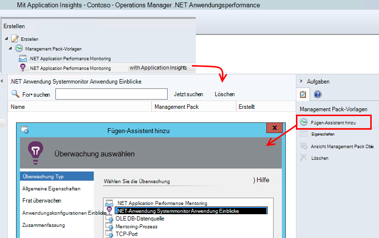
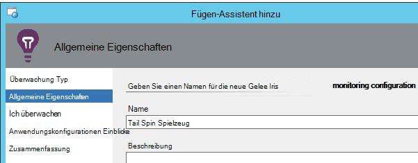
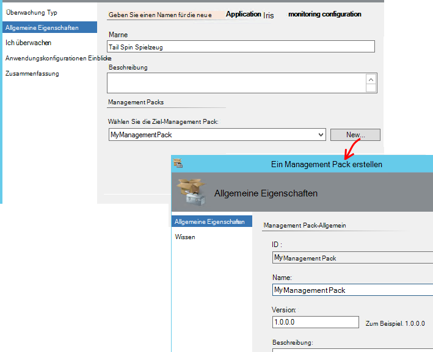
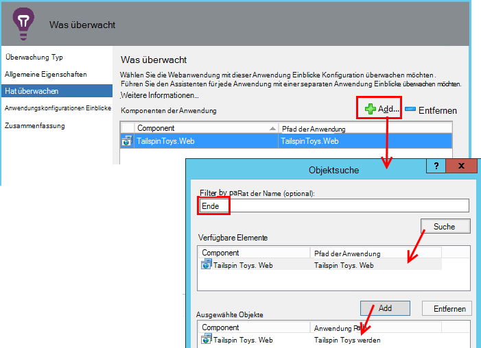
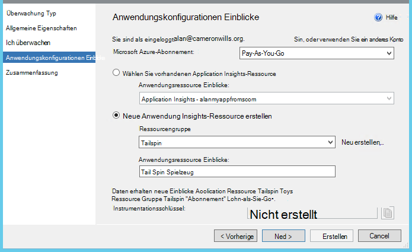
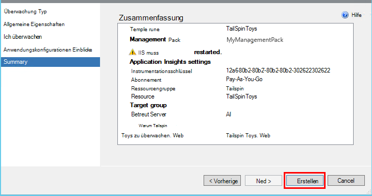
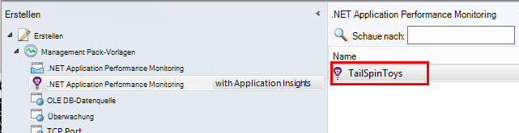
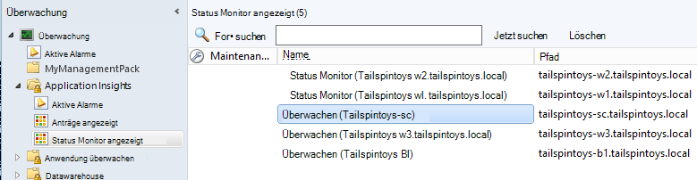

<properties 
    pageTitle="SCOM Integration Anwendung Einblicke | Microsoft Azure" 
    description="Wenn Sie SCOM verwenden, Leistung und diagnose von Problemen Anwendung zum. Umfassende Dashboards, intelligente Alarme leistungsstarken Diagnoseprogramme und Analyesabfragen." 
    services="application-insights" 
    documentationCenter=""
    authors="alancameronwills" 
    manager="douge"/>

<tags 
    ms.service="application-insights" 
    ms.workload="tbd" 
    ms.tgt_pltfrm="ibiza" 
    ms.devlang="na" 
    ms.topic="article" 
    ms.date="08/12/2016" 
    ms.author="awills"/>
 
# Application Performance Monitoring in SCOM Anwendung Erkenntnisse über

Wenn Sie System Center Operations Manager (SCOM) zur Verwaltung von Servern verwenden, können Sie Leistung überwachen und Diagnostizieren von Leistungsproblemen mit Hilfe von [Visual Studio Application Insights](app-insights-asp-net.md). Application Insights überwacht die Webanwendung-Anfragen ausgehende REST und SQL-Aufrufe, Ausnahmen und Protokoll Spuren. Bietet Dashboards metrische Diagramme und intelligente Alarme sowie diagnostische mächtige und analytische Abfragen über diese Telemetrie. 

Sie können zur Überwachung der Anwendung Einblicke mit einer SCOM Management Pack.

## Bevor Sie beginnen

Wir übernehmen:

* Sie SCOM kennen und SCOM 2012 R2 2016 Verwendung oder zum Verwalten der IIS-Webserver.
* Sie haben bereits auf Ihren Servern eine Anwendung installiert, die Anwendung zum überwachen möchten.
* App-Framework-Version ist .NET 4.5 oder höher.
* Sie haben Zugriff auf ein Abonnement in [Microsoft Azure](https://azure.com) und [Azure-Portal](https://portal.azure.com)anmelden können. Ihre Organisation möglicherweise ein Abonnement und hinzufügen Ihr Microsoft-Konto.

(Das Entwicklungsteam möglicherweise [Application Insights-SDK](app-insights-asp-net.md) in Web app erstellen. Diese Instrumentierung Buildzeit gibt ihnen größere Flexibilität beim Schreiben benutzerdefinierter Telemetrie. Es spielt keine Rolle: Sie können die Schritte beschriebenen mit oder ohne integrierte SDK.)

## (Einmal) Installieren Sie Application Insights Management pack

Auf dem Computer, auf dem Sie Operations Manager ausgeführt:

2. Deinstallieren Sie alte Version des Management Packs:
 1. Öffnen Sie in Operations Manager Management Packs-Verwaltung. 
 2. Löschen Sie die alte Version.
1. Downloaden Sie und installieren Sie das Management Pack aus dem Katalog.
2. Starten Sie Operations Manager.

## Ein Management Pack erstellen

1. Öffnen Sie in Operations Manager **Authoring** **.NET mit Application Insights** **Add Monitoring Wizard**und wählen Sie **.NET mit Application Insights**erneut aus.

    

2. Name der Konfiguration nach Ihrer app. (Sie haben eine app gleichzeitig instrumentieren.)
    
    

3. Erstellen Sie auf der gleichen Seite des Assistenten ein neues Management Pack, oder wählen Sie eine Anwendung Einblicke zuvor erstellte Pack.

     (Application Insights [Management Pack](https://technet.microsoft.com/library/cc974491.aspx) ist eine Vorlage, von der eine Instanz erstellt. Sie können dieselbe Instanz später wiederverwenden.)

    

4. Wählen Sie eine Anwendung, die Sie überwachen möchten. Die Suchfunktion durchsucht unter auf den Servern installierten apps.

    

    Das Feld im Bereich optionale Überwachung dienen an eine Teilmenge Ihrer Server möchten Sie die Anwendung in allen Servern überwachen.

5. Auf der nächsten Seite des Assistenten müssen Sie zuerst Ihre Microsoft Azure anmelden Anmeldeinformationen.

    Auf dieser Seite Wählen Sie Application Insights Ressource an Telemetriedaten analysiert und angezeigt werden. 

 * Wenn die Anwendung während der Entwicklung für Application Insights konfiguriert wurde, wählen Sie die vorhandene Ressource aus
 * Erstellen Sie andernfalls eine neue Ressource mit dem Namen der Anwendung. Gibt es andere des gleichen Systems Komponenten apps, platzieren Sie sie in derselben Ressourcengruppe zu Access Telemetriedaten einfacher zu verwalten.

    Sie können diese Einstellung später ändern.

    

6. Führen Sie den Assistenten.

    
    
Wiederholen Sie diesen Vorgang für jede Anwendung, die Sie überwachen möchten.

Benötigen Sie später ändern, öffnen Sie die Eigenschaften des Monitors Authoring-Fenster erneut.

## Überprüfen, überwachen

Der Monitor sucht Ihre app auf jedem Server installiert haben. Die Anwendung feststellt wird Application Einblicke Status Monitor zum Überwachen der Anwendung konfiguriert. Gegebenenfalls werden zuerst Status Monitor auf dem Server installiert.

Sie können überprüfen, welche Instanzen von der Anwendung gefunden hat:

## Ansicht Telemetrie Anwendung Erkenntnisse

[Azure-Portal](https://portal.azure.com)wechseln Sie zu der Ressource für Ihre Anwendung. [Tabellen mit Telemetrie](app-insights-dashboards.md) vom app. (Wenn sie auf der Seite noch noch nicht einrichten angezeigt, klicken Sie auf Livestream Metriken.)

## Nächste Schritte

* [Richten Sie ein Dashboard](app-insights-dashboards.md) zu kombinieren die wichtigsten Diagramme Überwachung dieser und anderen apps.
* [Erfahren Sie mehr über Metriken](app-insights-metrics-explorer.md)
* [Einrichten von alerts](app-insights-alerts.md)
* [Diagnose von Performance-Problemen](app-insights-detect-triage-diagnose.md)
* [Leistungsstarke Analyseabfragen](app-insights-analytics.md)
* [Verfügbarkeit von Webtests](app-insights-monitor-web-app-availability.md)
