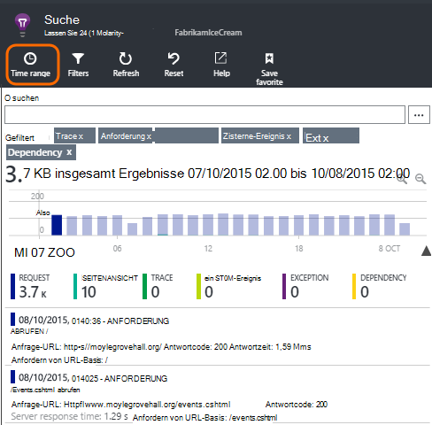
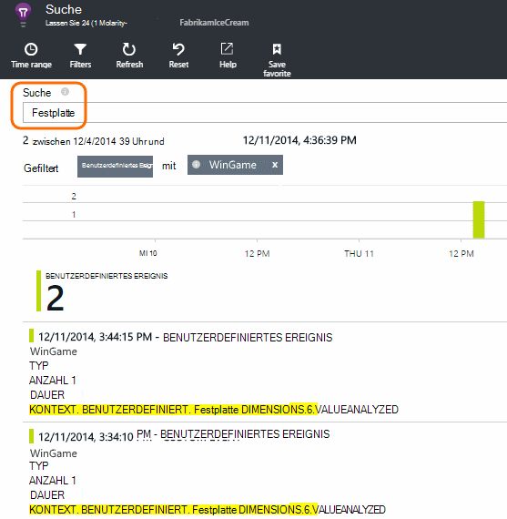
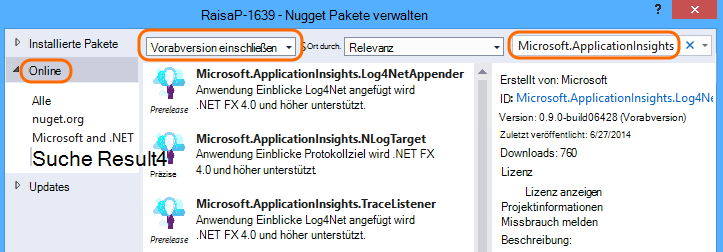
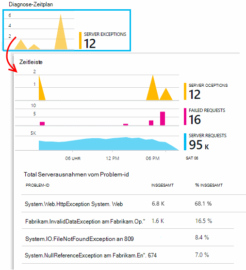

<properties 
    pageTitle="Protokolle, Ausnahmen und benutzerdefinierte Diagnose für ASP.NET Anwendung Erkenntnisse" 
    description="Diagnose bei ASP.NET webapps Anfragen, Ausnahmen und Trace, NLog oder Log4Net generierten Protokolle suchen." 
    services="application-insights" 
    documentationCenter=""
    authors="alancameronwills" 
    manager="douge"/>

<tags 
    ms.service="application-insights" 
    ms.workload="tbd" 
    ms.tgt_pltfrm="ibiza" 
    ms.devlang="na" 
    ms.topic="article" 
    ms.date="04/08/2016" 
    ms.author="awills"/>
 
# Protokolle, Ausnahmen und benutzerdefinierte Diagnose für ASP.NET Anwendung Erkenntnisse

[Application Insights] [ start] enthält eine leistungsstarke [Diagnosesuche] [ diagnostic] Tool, mit dem Sie zu Bohren Telemetrie Application Insights-SDK von der Anwendung gesendet. Viele Ereignisse wie Benutzer Seitenansichten werden automatisch vom SDK gesendet.

Sie können auch Code zum Senden benutzerdefinierter Ereignisse, ausnahmeberichte und Traces schreiben. Und wenn Sie bereits eine protokollierungsframework wie log4J, log4net, NLog oder System.Diagnostics.Trace verwenden, sammeln Sie die Protokolle in die Suche einbezogen. Dies erleichtert das Protokoll Spuren mit Benutzeraktionen, Ausnahmen und anderen Ereignissen zu korrelieren.

## Bevor Sie benutzerdefinierte Telemetrie schreiben

Wenn Sie noch nicht [Anwendung Einblicke für das Projekt eingerichtet][start], jetzt.

Wenn Sie die Anwendung ausführen, es einige Telemetriedaten senden, die im Diagnose einschließlich Anfragen vom Server Zeigt Seite Ansichten auf dem Client angemeldet und unerwarteter Ausnahmen.

Öffnen Sie diagnostische Suche Telemetriedaten angezeigt, die das SDK automatisch sendet.

Die Details variieren von einer Anwendung zu. Sie können über jedes einzelne Ereignis genauer zu klicken.

## Probenahme 

Wenn Ihre Anwendung große Datenmengen sendet und Application Insights SDK für ASP.NET Version 2.0.0-beta3 oder höher verwenden, kann adaptive Sampling-Funktion ausgeführt werden und nur einen Teil der Telemetrie. [Erfahren Sie mehr über Sampling.](app-insights-sampling.md)

##Benutzerdefinierte Ereignisse

Benutzerdefinierte Ereignisse zeigen sowohl [Diagnose] Suche[ diagnostic] und [Metrik Explorer][metrics]. Sie können diese Geräte, Webseiten und Server-Anwendung senden. Sie können verwendet werden, zu Diagnosezwecken und [Verwendungsmuster kennen][track].

Ein benutzerdefiniertes Ereignis hat einen Namen, und führen Sie, mit numerischen Filtern Eigenschaften auch.

JavaScript-Client

    appInsights.trackEvent("WinGame",
         // String properties:
         {Game: currentGame.name, Difficulty: currentGame.difficulty},
         // Numeric measurements:
         {Score: currentGame.score, Opponents: currentGame.opponentCount}
         );

C# auf server

    // Set up some properties:
    var properties = new Dictionary <string, string> 
       {{"game", currentGame.Name}, {"difficulty", currentGame.Difficulty}};
    var measurements = new Dictionary <string, double>
       {{"Score", currentGame.Score}, {"Opponents", currentGame.OpponentCount}};

    // Send the event:
    telemetry.TrackEvent("WinGame", properties, measurements);

VB auf server

    ' Set up some properties:
    Dim properties = New Dictionary (Of String, String)
    properties.Add("game", currentGame.Name)
    properties.Add("difficulty", currentGame.Difficulty)

    Dim measurements = New Dictionary (Of String, Double)
    measurements.Add("Score", currentGame.Score)
    measurements.Add("Opponents", currentGame.OpponentCount)

    ' Send the event:
    telemetry.TrackEvent("WinGame", properties, measurements)

### Die Anwendung ausführen und die Ergebnisse anzuzeigen.

Öffnen Sie diagnostische Suche.

Wählen Sie benutzerdefiniertes Ereignis und ein bestimmtes Ereignis.

Filtern der Daten nach einem Eigenschaftswert einen Suchbegriff eingeben.  

Drilldown in ein einzelnes Ereignis detaillierten Eigenschaften anzeigen.

##Seitenaufrufe

Seite anzeigen Telemetrie per Aufruf trackPageView() in [JavaScript-Ausschnitt, in Ihre Webseiten einfügen][usage]. Sein Hauptzweck ist dazu die Anzahl der Seitenaufrufe, die auf der Übersichtsseite angezeigt.

In der Regel heißt es einmal in jede HTML-Seite, aber Sie können weitere Aufrufe - z. B. Wenn Sie eine einseitige Anwendung und eine neue Seite protokolliert, wenn der Benutzer weitere Daten abruft.

    appInsights.trackPageView(pageSegmentName, "http://fabrikam.com/page.htm"); 

Manchmal ist es sinnvoll, Eigenschaften anfügen, die Sie als Filter im Diagnose Suche verwenden können:

    appInsights.trackPageView(pageSegmentName, "http://fabrikam.com/page.htm",
     {Game: currentGame.name, Difficulty: currentGame.difficulty});

##Trace Telemetrie

Trace Telemetrie ist Code, der ausdrücklich erstellen Diagnoseprotokolle einfügen. 

Beispielsweise könnten Sie Aufrufe wie folgt einfügen:

    var telemetry = new Microsoft.ApplicationInsights.TelemetryClient();
    telemetry.TrackTrace("Slow response - database01");

####  Installieren Sie einen Adapter für die protokollierungsframework

Suchen Sie mit einem Protokollierung - generierten Protokolle log4Net, NLog oder System.Diagnostics.Trace. 

1. Wenn Sie log4Net oder NLog verwenden möchten, installieren Sie es in Ihrem Projekt. 
2. Im Projektmappen-Explorer mit der rechten Maustaste des Projekts, und wählen Sie **NuGet-Pakete verwalten**.
3. Wählen Sie Online >, wählen Sie **Include Prerelease** und suchen Sie nach "Microsoft.ApplicationInsights"

    

4. Wählen Sie das entsprechende Paket - eines:
  + Microsoft.ApplicationInsights.TraceListener (für System.Diagnostics.Trace Anrufe aufzeichnen)
  + Microsoft.ApplicationInsights.NLogTarget
  + Microsoft.ApplicationInsights.Log4NetAppender

NuGet-Paket installiert die erforderlichen Assemblys und ändert auch web.config oder app.config.

#### Diagnoseprotokoll Aufrufe einfügen

Verwenden von System.Diagnostics.Trace wäre ein normaler Aufruf:

    System.Diagnostics.Trace.TraceWarning("Slow response - database01");

Bevorzugen Sie log4net oder NLog:

    logger.Warn("Slow response - database01");

Die Anwendung im Debugmodus ausführen oder bereitstellen.

Nachrichten in Diagnosesuche werden angezeigt, wenn der Ablaufverfolgungsfilter auswählen.

### Ausnahmen

Abrufen von ausnahmeberichten Anwendung Erkenntnisse bietet leistungsstarke zumal fehlgeschlagenen Anfragen und Ausnahmen zu navigieren, und Lesen Sie den Ausnahmestapel aufführt.

In einigen Fällen müssen Sie [einige Codezeilen einfügen] [ exceptions] um sicherzustellen, dass Ihre Ausnahmen werden automatisch abgefangen wird.

Sie können auch explizit Code zum Ausnahme Telemetrie schreiben:

JavaScript

    try 
    { ...
    }
    catch (ex)
    {
      appInsights.TrackException(ex, "handler loc",
        {Game: currentGame.Name, 
         State: currentGame.State.ToString()});
    }

C#

    var telemetry = new TelemetryClient();
    ...
    try 
    { ...
    }
    catch (Exception ex)
    {
       // Set up some properties:
       var properties = new Dictionary <string, string> 
         {{"Game", currentGame.Name}};

       var measurements = new Dictionary <string, double>
         {{"Users", currentGame.Users.Count}};

       // Send the exception telemetry:
       telemetry.TrackException(ex, properties, measurements);
    }

VB

    Dim telemetry = New TelemetryClient
    ...
    Try
      ...
    Catch ex as Exception
      ' Set up some properties:
      Dim properties = New Dictionary (Of String, String)
      properties.Add("Game", currentGame.Name)

      Dim measurements = New Dictionary (Of String, Double)
      measurements.Add("Users", currentGame.Users.Count)
  
      ' Send the exception telemetry:
      telemetry.TrackException(ex, properties, measurements)
    End Try

Die Eigenschaften und Maße sind optional, jedoch sind nützlich zum Filtern und zusätzlichen Informationen hinzufügen. Haben Sie eine Anwendung, die mehrere Spiele ausführen können, können Sie alle ausnahmeberichte, die für ein bestimmtes Spiel finden. Sie können so viele Elemente wie jedes Wörterbuch hinzufügen.

#### Ausnahmen anzeigen

Sehen Sie eine Zusammenfassung der Ausnahmen auf die Übersicht gemeldet, und Sie können durch Klicken, um weitere Details anzuzeigen. Zum Beispiel:

[]

Klicken Sie auf alle Ausnahmetypen zu bestimmten vorkommen:

[]

Sie können auch diagnostische Suche direkt öffnen, Ausnahmen filtern und wählen Sie den Ausnahmetyp, den Sie anzeigen möchten.

### Nicht behandelte Ausnahmen Reporting

Anwendung Einblicke Berichte nicht behandelte Ausnahmen, kann von Geräten [Webbrowser][usage], oder Webserver, ob von [Statusmonitor] instrumentiert[ redfield] oder [Anwendung Einblicke SDK][greenbrown]. 

Es ist jedoch nicht immer dazu in einigen Fällen, da .NET Framework Ausnahmen abfängt.  Um sicherzustellen, dass alle Ausnahmen angezeigt, müssen Sie daher einen kleinen Ausnahmehandler schreiben. Das beste Verfahren hängt von der Technologie ab. Siehe [Ausnahme Telemetrie für ASP.NET] [ exceptions] Weitere Informationen. 

### Mit den build

Beim Lesen von Diagnoseprotokollen dürfte Quellcode geändert wird, da live Code bereitgestellt wurde.

Es empfiehlt sich daher eine Eigenschaft jeder Ausnahme oder Trace Buildinformationen wie die URL der aktuellen Version abgelegt. 

Anstatt die Eigenschaft separat für jede Ausnahme Aufruf, können Sie die Informationen im Standardkontext festlegen. 

    // Telemetry initializer class
    public class MyTelemetryInitializer : ITelemetryInitializer
    {
        public void Initialize (ITelemetry telemetry)
        {
            telemetry.Properties["AppVersion"] = "v2.1";
        }
    }

In der app-Initialisierung wie Global.asax.cs:

    protected void Application_Start()
    {
        // ...
        TelemetryConfiguration.Active.TelemetryInitializers
        .Add(new MyTelemetryInitializer());
    }

###Server Webanfragen

Anforderung Telemetrie automatisch gesendet, wenn [Statusmonitor Webserver installieren][redfield], oder [Anwendung Einblicke zum Webprojekt hinzufügen][greenbrown]. Er führt auch Anforderung und Antwort Zeit Diagramme im Metrik-Explorer und auf der Seite Übersicht.

Wenn Sie zusätzliche Ereignisse senden möchten, können Sie die TrackRequest()-API.

## Fragen & Antworten

### Eine Fehlermeldung "instrumentationsschlüssel darf nicht leer sein"

Sieht aus wie das Protokollierung Adapter Nuget-Paket installiert, ohne Anwendung Einblicke.

Im Projektmappen-Explorer mit der rechten Maustaste `ApplicationInsights.config` , und wählen Sie **Update Application Insights**. Sie erhalten einen Dialog, der lädt Azure anmelden und Application Insights-Ressource erstellen oder eine vorhandene erneut verwenden. Das sollte es beheben.

### Wie viele Daten gespeichert?

Bis zu 500 Ereignisse pro Sekunde bei jeder Anwendung. Ereignisse werden sieben Tage lang aufbewahrt.

### Meine Ereignisse oder Spuren nicht angezeigt

Wenn Ihre Anwendung große Datenmengen sendet und Application Insights SDK für ASP.NET Version 2.0.0-beta3 oder höher verwenden, kann adaptive Sampling-Funktion ausgeführt werden und nur einen Teil der Telemetrie. [Erfahren Sie mehr über Sampling.](app-insights-sampling.md)

## Nächste Schritte

* [Verfügbarkeit und Reaktionsfähigkeit Tests einrichten][availability]
* [Problembehandlung][qna]

<!--Link references-->

[availability]: app-insights-monitor-web-app-availability.md
[diagnostic]: app-insights-diagnostic-search.md
[exceptions]: app-insights-asp-net-exceptions.md
[greenbrown]: app-insights-asp-net.md
[metrics]: app-insights-metrics-explorer.md
[qna]: app-insights-troubleshoot-faq.md
[redfield]: app-insights-monitor-performance-live-website-now.md
[start]: app-insights-overview.md
[track]: app-insights-api-custom-events-metrics.md
[usage]: app-insights-web-track-usage.md

 
