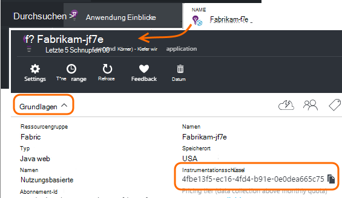

<properties 
    pageTitle="Separate Anwendung Einblicke Ressourcen für Entwicklung, Test und Produktion" 
    description="Überwachen der Leistung und Auslastung Ihrer Anwendung in verschiedenen Stadien der Entwicklung" 
    services="application-insights" 
    documentationCenter=""
    authors="alancameronwills" 
    manager="douge"/>

<tags 
    ms.service="application-insights" 
    ms.workload="tbd" 
    ms.tgt_pltfrm="ibiza" 
    ms.devlang="na" 
    ms.topic="article" 
    ms.date="05/04/2016" 
    ms.author="awills"/>

# Trennen Application Insights-Ressourcen

Telemetriedaten aus verschiedenen Komponenten und Versionen der Anwendung für unterschiedliche Anwendung Einblicke Ressourcen gesendet oder eine zusammengefasst? Dieser Artikel beschäftigt bestenfalls Methoden und Techniken erforderlichen.

Zunächst sehen wir uns die Frage. Die Daten in der Anwendung gespeichert und Anwendung Einblicke in Microsoft Azure *Ressource*verarbeitet. Jede Ressource wird durch einen *instrumentationsschlüssel* (iKey) identifiziert. Application Insights-SDK in Ihrer Anwendung der Schlüssel bereitgestellt, sodass die Daten senden können, die richtige Ressource erfasst. Der Schlüssel kann im Code oder im ApplicationInsights.config bereitgestellt werden. Ändern Sie den Schlüssel im SDK, können Sie Daten auf andere Ressourcen verweisen. 

In einem einfachen Fall beim Erstellen von Code für eine neue Anwendung erstellen Sie auch eine neue Ressource in Application Insights. In Visual Studio wird das Dialogfeld *Neues Projekt* für Sie.

Es ist eine große Website kann auf mehrere Server-Instanz bereitgestellt werden.

In komplexeren Szenarios müssen Sie eine System, das mehrere Komponenten - z. B. eine Website und eine Back-End-Prozessor aus. 

## Separate iKeys verwenden

Hier sind einige allgemeinen Richtlinien:

* Unabhängig voneinander einsetzbar Anwendungseinheit kommen, die auf mehrere Server skaliert werden Instanzen unabhängig von anderen Komponenten waagerechte ausgeführt wird, wird Sie normalerweise, die eine einzelne Ressource - zuordnen möchten, ist haben es einen einzelnes instrumentationsschlüssel (iKey).
* Gründe für das Verwenden von separaten iKeys dagegen gehören:
 - Lesbarkeit separate Metriken aus separaten Komponenten.
 - Trennen Sie geringem Telemetrie von umfangreicher, so dass Drosselung Kontingente und Probenahme ein Stream die andere nicht.
 - Separate Alarme exportieren und Artikelvarianten funktionieren.
 - Verteilt [Grenzen](app-insights-pricing.md#limits-summary) wie Telemetrie Kontingent Drosselung und Web Count testen.
 - Code in der Entwicklung und Test sollte eine separate iKey als Produktion Stempel an.  

Application Insights Portal Erfahrungen dienen diese Richtlinien beachten. Beispielsweise anzeigen Server Segmente auf Serverinstanz machen der Annahme, Telemetrie über eine logische Komponente mehrere Serverinstanzen stammen kann.

## Einzelne iKey

Wo Sie Telemetrie mehrere Komponenten auf einem einzigen iKey senden:

* Die Telemetrie, die das Segment und Filter für die Komponentenidentität ermöglicht, fügen Sie eine Eigenschaft hinzu. Die Rollen-ID ist Telemetrie von Server-Instanzen, aber in anderen Fällen automatisch können Sie [Telemetrie Initialisierung](app-insights-api-filtering-sampling.md#add-properties) verwenden, um die Eigenschaft hinzuzufügen.
* SDKs Anwendung Einblicke in die verschiedenen Komponenten gleichzeitig aktualisieren. Telemetrie für eine iKey sollten mit der gleichen Version des SDK stammen.

## Separate iKeys

Wo haben Sie mehrere iKeys für die verschiedenen Komponenten der Anwendung:

* Erstellen Sie ein [Dashboard](app-insights-dashboards.md) einen Überblick über die wichtigsten Telemetrie aus der logischen Anwendung von den anderen Komponenten kombiniert. Dashboards können freigegeben werden, damit eine einzelne logische Systemansicht von verschiedenen Teams verwendet werden kann.
* Organisieren von [Ressourcengruppen](app-insights-resources-roles-access-control.md) auf Teamebene. Zugriffsberechtigungen werden von Ressourcengruppe zugewiesen und darunter Berechtigungen Alarme einrichten. 
* Verwenden Sie [Azure-Ressourcen-Manager Vorlagen und Powershell](app-insights-powershell.md) Artefakte wie Warnregeln verwalten und Webtests.

## Separate iKeys für Entwicklung/Test und Produktion

Zum vereinfachen den Schlüssel automatisch geändert, wenn die Anwendung freigegeben wird, fest iKey im Code nicht im ApplicationInsights.config

### Dynamische Instrumentierung Schlüssel

Legen Sie den Schlüssel in eine Initialisierungsmethode, wie global.aspx.cs in einem ASP.NET:

*C#*

    protected void Application_Start()
    {
      Microsoft.ApplicationInsights.Extensibility.
        TelemetryConfiguration.Active.InstrumentationKey = 
          // - for example -
          WebConfigurationManager.AppSettings["ikey"];
      ...

In diesem Beispiel werden Ikeys für die verschiedenen Ressourcen in verschiedenen Versionen der Webkonfigurationsdatei platziert. Austausch der Webkonfigurationsdatei -, Sie als Teil des Skripts Release - tauschen die Zielressource.

### Webseiten

Der iKey dient auch Ihre app-Webseiten im [Skript aus dem Schnellstart Blade hat](app-insights-javascript.md). Anstatt Code es buchstäblich in das Skript über den Serverzustand generieren. In einer ASP.NET app:

*JavaScript in Razor*

    <script type="text/javascript">
    // Standard Application Insights web page script:
    var appInsights = window.appInsights || function(config){ ...
    // Modify this part:
    }({instrumentationKey:  
      // Generate from server property:
      "@Microsoft.ApplicationInsights.Extensibility.
         TelemetryConfiguration.Active.InstrumentationKey"
    }) // ...

## Eine weitere Anwendung Insights-Ressource erstellen
  
Wenn Sie Telemetrie für unterschiedliche Komponenten oder für anderen Zeitstempel (Test/Dev/Produktion) derselben Komponente trennen möchten, müssen Sie eine neue Anwendung Einblicke erstellen.

Fügen Sie im [portal.azure.com](https://portal.azure.com)eine Anwendung Insights-Ressource:

* **Anwendungstyp** wirkt sich auf Blade-Übersicht und in [metrischen Explorer](app-insights-metrics-explorer.md)verfügbaren Eigenschaften finden Sie auf. Wenn Ihre app-Typ nicht angezeigt wird, wählen Sie eine Web-Typen für Webseiten.
* **Ressourcengruppe** ist eine benutzerfreundliche Möglichkeit zum Verwalten von Eigenschaften wie [Zugriffskontrolle](app-insights-resources-roles-access-control.md). Sie können separate Ressourcengruppen für Entwicklung, Test und Produktion.
* **Abonnement** ist Dein Konto in Azure.
* **Speicherort** ist, in dem Ihre Daten gespeichert. Zurzeit kann er geändert werden. 
* **Hinzufügen zum Dashboard** stellt Schnellzugriff Kacheln für die Ressource auf der Azure-Startseite. 

Erstellen der Ressource dauert einige Sekunden. Dies wird ein Warnhinweis angezeigt.

(Sie können ein [PowerShell-Skript](app-insights-powershell-script-create-resource.md) zum Erstellen einer Ressource automatisch schreiben.)

## Die Instrumentation Schlüssel

Instrumentationsschlüssel identifiziert die Ressource, die Sie erstellt haben. 

Sie benötigen die Instrumentation Schlüssel aller Ressourcen, die app Daten senden.

 
