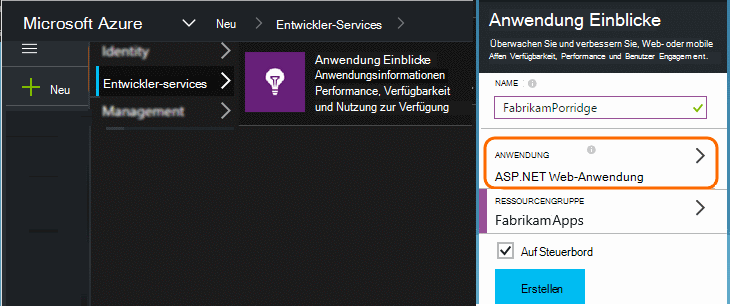
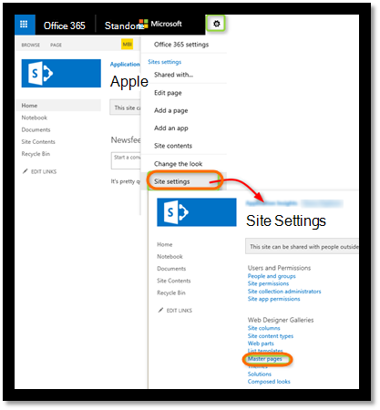
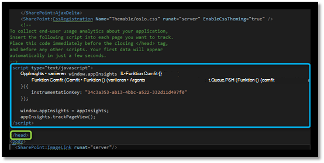
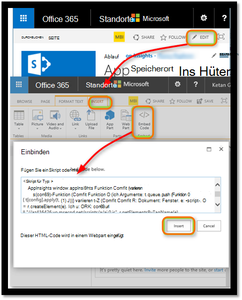
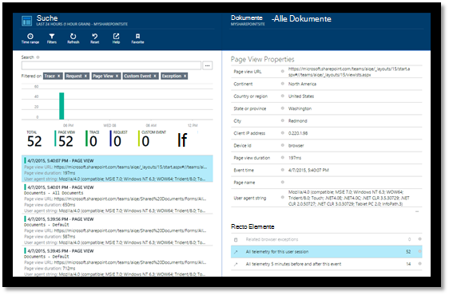
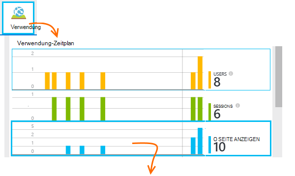
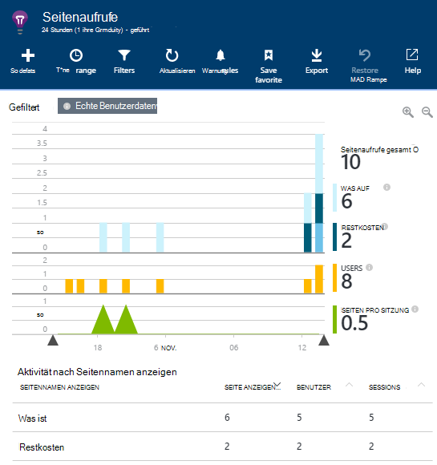
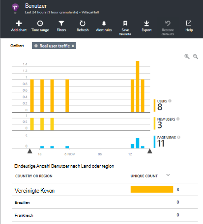
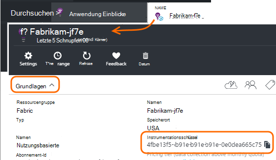

<properties 
    pageTitle="Eine SharePoint-Website-Anwendung zum Überwachen" 
    description="Starten Sie eine neue Anwendung mit einer neuen Instrumentation überwachen" 
    services="application-insights" 
    documentationCenter=""
    authors="alancameronwills" 
    manager="douge"/>

<tags 
    ms.service="application-insights" 
    ms.workload="tbd" 
    ms.tgt_pltfrm="ibiza" 
    ms.devlang="na" 
    ms.topic="article" 
    ms.date="03/24/2016" 
    ms.author="awills"/>

# <a name="monitor-a-sharepoint-site-with-application-insights"></a>Eine SharePoint-Website-Anwendung zum Überwachen


Visual Studio Application Insights überwacht Verfügbarkeit, Performance und Nutzung von apps. Hier erfahren Sie, wie für eine SharePoint-Website festgelegt.


## <a name="create-an-application-insights-resource"></a>Erstellen einer Application Insights-Ressource


Erstellen Sie in [Azure-Portal](https://portal.azure.com)eine neue Application Insights-Ressource. Wählen Sie den Anwendungstyp ASP.NET.




Das Blade öffnet findet Leistung und Daten über Ihre app Sie finden. Zu nächsten zurückkehren, Azure anmelden, sollten Sie Sie auf dem Startbildschirm eine Kachel suchen. Alternativ klicken Sie auf Durchsuchen, um danach zu suchen.
    


## <a name="add-our-script-to-your-web-pages"></a>Unser Skript zu Webseiten hinzufügen

Rufen Sie in Quick Start des Skripts für Webseiten:


Legen Sie das Skript direkt vor dem &lt;/head&gt; Tag jeder Seite, die Sie verfolgen möchten. Wenn Ihre Website eine Masterseite verfügt, setzen Sie das Skript vorhanden. Beispielsweise ein ASP.NET MVC-Projekt Sie würde platzieren Sie es in View\Shared\_Layout.cshtml

Das Skript enthält den Instrumentation, die Telemetrie für Ihre Anwendung Einblicke Ressource verweist.

### <a name="add-the-code-to-your-site-pages"></a>Fügen Sie den Code der Seiten

#### <a name="on-the-master-page"></a>Auf der Masterseite

Wenn die Masterseite der Website bearbeiten können, die für jede Seite in der Website bereitstellen überwachen.

Die Masterseite checken Sie aus und bearbeiten sie mit SharePoint Designer oder einen anderen Editor.




Fügen Sie den Code direkt vor der </head> Tag. 




#### <a name="or-on-individual-pages"></a>Oder einzelne Seiten

Um eine begrenzte Anzahl von Seiten zu überwachen, fügen Sie das Skript separat auf jeder Seite hinzu. 

Ein Webpart einfügen und den Codeausschnitt in sie einbetten.





## <a name="view-data-about-your-app"></a>Anzeigen von Daten über Ihre app

Die Anwendung erneut.

Zurück zu der Anwendung Blade in [Azure-Portal](https://portal.azure.com).

Ersten erscheint in suchen. 



Klicken Sie auf Aktualisierung nach wenigen Sekunden, wenn mehr Daten erwarten.

Klicken Sie auf **Verwendungsanalysen** zu Diagrammen, Sitzung und Seitenansichten Blatt (Übersicht):



Klicken Sie auf Diagramme - beispielsweise Seitenansichten sehen:



Oder Benutzer:





## <a name="capturing-user-id"></a>Erfassen von Benutzer-Id


Codeausschnitt Standardwebseite nicht die Benutzer-Id von SharePoint erfassen, aber Sie können dies mit einer kleinen Änderung.


1. Kopieren Sie Ihre app instrumentationsschlüssel von Essentials Dropdown in Application Insights. 


    

2. Instrumentationsschlüssel im folgenden Ausschnitt "XXXX" ersetzen. 
3. Betten Sie das Skript in Ihrer SharePoint-Anwendung anstelle der Ausschnitt aus dem Portal erhalten Sie ein.


```


<SharePoint:ScriptLink ID="ScriptLink1" name="SP.js" runat="server" localizable="false" loadafterui="true" /> 
<SharePoint:ScriptLink ID="ScriptLink2" name="SP.UserProfiles.js" runat="server" localizable="false" loadafterui="true" /> 
  
<script type="text/javascript"> 
var personProperties; 
  
// Ensure that the SP.UserProfiles.js file is loaded before the custom code runs. 
SP.SOD.executeOrDelayUntilScriptLoaded(getUserProperties, 'SP.UserProfiles.js'); 
  
function getUserProperties() { 
    // Get the current client context and PeopleManager instance. 
    var clientContext = new SP.ClientContext.get_current(); 
    var peopleManager = new SP.UserProfiles.PeopleManager(clientContext); 
     
    // Get user properties for the target user. 
    // To get the PersonProperties object for the current user, use the 
    // getMyProperties method. 
    
    personProperties = peopleManager.getMyProperties(); 
  
    // Load the PersonProperties object and send the request. 
    clientContext.load(personProperties); 
    clientContext.executeQueryAsync(onRequestSuccess, onRequestFail); 
} 
     
// This function runs if the executeQueryAsync call succeeds. 
function onRequestSuccess() { 
var appInsights=window.appInsights||function(config){
function s(config){t[config]=function(){var i=arguments;t.queue.push(function(){t[config].apply(t,i)})}}var t={config:config},r=document,f=window,e="script",o=r.createElement(e),i,u;for(o.src=config.url||"//az416426.vo.msecnd.net/scripts/a/ai.0.js",r.getElementsByTagName(e)[0].parentNode.appendChild(o),t.cookie=r.cookie,t.queue=[],i=["Event","Exception","Metric","PageView","Trace"];i.length;)s("track"+i.pop());return config.disableExceptionTracking||(i="onerror",s("_"+i),u=f[i],f[i]=function(config,r,f,e,o){var s=u&&u(config,r,f,e,o);return s!==!0&&t["_"+i](config,r,f,e,o),s}),t
    }({
        instrumentationKey:"XXXX"
    });
    window.appInsights=appInsights;
    appInsights.trackPageView(document.title,window.location.href, {User: personProperties.get_displayName()});
} 
  
// This function runs if the executeQueryAsync call fails. 
function onRequestFail(sender, args) { 
} 
</script> 


```


## <a name="next-steps"></a>Nächste Schritte

* [Webtests](app-insights-monitor-web-app-availability.md) , die die Verfügbarkeit Ihrer Site überwachen.

* [Anwendung Einblicke](app-insights-overview.md) für andere app.


<!--Link references-->


 