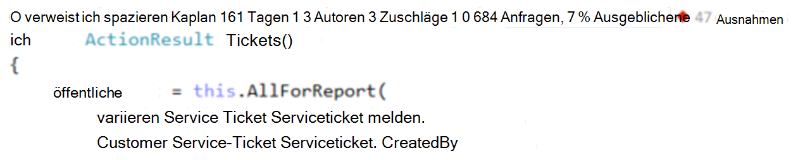
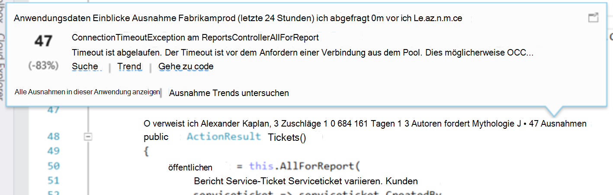
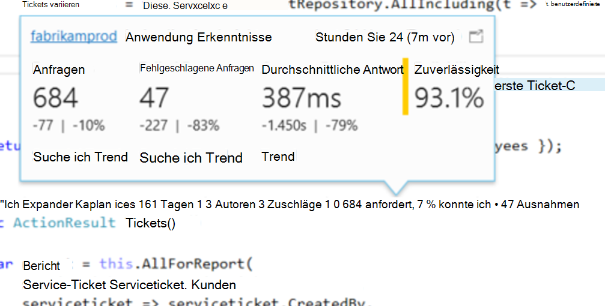

<properties 
    pageTitle="Anwendung Einblicke Telemetrie in Visual Studio CodeLens | Microsoft Azure" 
    description="Schneller Zugriff auf Ihre Anwendung Einblicke Anforderung und Ausnahme Telemetrie mit CodeLens in Visual Studio." 
    services="application-insights" 
    documentationCenter=".net"
    authors="numberbycolors" 
    manager="douge"/>

<tags 
    ms.service="application-insights" 
    ms.workload="tbd" 
    ms.tgt_pltfrm="ibiza" 
    ms.devlang="na" 
    ms.topic="get-started-article" 
    ms.date="08/30/2016" 
    ms.author="daviste"/>
    
# Anwendung Einblicke Telemetrie in Visual Studio CodeLens

Methoden im Code Ihrer Anwendung mit Telemetriedaten zu Laufzeitausnahmen gekennzeichnet werden und Reaktionszeiten anfordern. Installation von [Visual Studio Anwendung Einblicke](app-insights-overview.md) in Ihrer Anwendung erscheint die Telemetrie in Visual Studio [CodeLens](https://msdn.microsoft.com/library/dn269218.aspx) - Notizen am Anfang jeder Funktion Verwendungsnachweis Sie sehen Informationen wie die Anzahl die Funktion platziert verwiesen wird oder die letzte Person, die sie bearbeitet.

> [AZURE.NOTE] Einblicke in CodeLens Anwendung ist in Visual Studio 2015 Update 3 und höher, oder mit der neuesten Version der [Entwicklertools Analytics-Erweiterung](https://visualstudiogallery.msdn.microsoft.com/82367b81-3f97-4de1-bbf1-eaf52ddc635a). CodeLens ist in die Enterprise und Professional-Editionen von Visual Studio verfügbar.

## Wo finden Anwendung Statistikdaten

Suchen Sie nach Application Insights Telemetrie CodeLens Indikatoren des öffentlichen Anforderungsmethoden Ihrer Web-Anwendung. CodeLens Indikatoren werden Methode und anderen Deklarationen in C# und Visual Basic-Code angezeigt. Wenn Anwendung Statistikdaten für eine Methode verfügbar ist, sehen Sie Indikatoren für Anfragen und Ausnahmen wie "100 anfordert, %1 fehlgeschlagen" oder "10 Ausnahmen." Klicken Sie auf einen Indikator CodeLens für weitere Details. 

> [AZURE.TIP] Application Insights anfordern und Ausnahme Indikatoren können ein paar Sekunden zu laden, nachdem andere CodeLens angezeigt.

## Ausnahmen CodeLens

Der Ausnahme CodeLens Indikator zeigt die Anzahl der am häufigsten auftretenden Ausnahmen in Ihrer Anwendung während dieses Zeitraums beim Verarbeiten der Anforderung von der Methode bedient 15 in den vergangenen 24 Stunden aufgetretenen Ausnahmen.

Um weitere Details anzuzeigen, klicken Sie auf Ausnahmen CodeLens Indikator:

* Die prozentuale Änderung Anzahl von Ausnahmen in den letzten 24 Stunden gegenüber der vorherigen 24 Stunden
* Wählen Sie **Gehe zu Code** Navigieren auf den Quellcode für die Funktion der Ausnahme
* Wählen Sie **Suchen** alle Instanzen dieser Ausnahme Abfragen, die in den letzten 24 Stunden aufgetreten sind
* Wählen Sie **Trend** eine Visualisierung Trend Vorkommen dieser Ausnahme in den letzten 24 Stunden anzeigen
* Wählen Sie **alle Ausnahmen in dieser Anwendung** alle Ausnahmen Abfragen, die in den letzten 24 Stunden aufgetreten sind
* Wählen Sie **Durchsuchen Ausnahme Trends** an Trend Visualisierung für alle Ausnahmen, die in den letzten 24 Stunden aufgetreten sind. 

> [AZURE.TIP] Finden Sie unter "0 Ausnahmen" im CodeLens, aber Sie wissen, dass Ausnahmen sollte, überprüfen Sie, dass die richtige Anwendung Einblicke Ressource CodeLens aktiviert ist. Wählen Sie eine andere Ressource mit der rechten Maustaste auf das Projekt im Projektmappen-Explorer, und wählen Sie **Anwendung Einblicke > Telemetrie Quelle wählen Sie**. CodeLens wird nur angezeigt, 15 die meisten häufig auftretende Ausnahmen in Ihrer Anwendung in den letzten 24 Stunden, wenn eine Ausnahme 16. ist oder weniger, wird "0 Ausnahmen." Ausnahmen von ASP.NET Ansichten erscheint nicht auf der Kontroller-Methoden, die diese Ansichten generiert.

> [AZURE.TIP] Wenn Sie sehen "? Ausnahmen"im CodeLens, müssen Sie Visual Studio Azure-Konto zugeordnet oder Azure Anmeldeinformationen abgelaufen. In beiden Fällen klicken Sie auf "? Ausnahmen"und wählen Sie **ein Konto hinzufügen** , Ihre Anmeldeinformationen einzugeben.

## CodeLens-Anfragen

Die Anforderung CodeLens Indikator zeigt die Anzahl der HTTP-Anfragen, die wurde von einer Methode in den letzten 24 Stunden plus Anteil dieser fehlgeschlagenen Anfragen bearbeitet.

Um weitere Details anzuzeigen, klicken Sie auf Anfragen CodeLens Indikator:

* Die Absolute und prozentuale Änderung Anzahl von Anfragen, fehlgeschlagenen Anfragen und durchschnittliche Reaktionszeit während der letzten 24 Stunden vor 24 Stunden
* Die Zuverlässigkeit der Methode Prozentsatz der Anfragen, die nicht in den letzten 24 Stunden fehlgeschlagen
* Wählen Sie **Suche** nach Anfragen oder fehlgeschlagenen Anfragen (fehlgeschlagenen) Anfragen Abfragen, die in den letzten 24 Stunden aufgetreten
* Wählen Sie **Trend** Trend Visualisierung für Anfragen, fehlgeschlagenen Anfragen oder durchschnittliche Antwortzeit in den letzten 24 Stunden anzeigen.
* Wählen Sie den Namen der Application Insights-Ressource links oben auf der CodeLens Detailansicht ändern die Ressource CodeLens aus der Datenquelle ist.

## Nächste Schritte

||
|---|---
|**[Arbeiten mit Anwendung Einblicke in Visual Studio](app-insights-visual-studio.md)** Suchen Sie Telemetrie Daten Sie CodeLens und konfigurieren Sie Einblicke Anwendung. In Visual Studio. |
|**[Weitere Daten hinzufügen](app-insights-asp-net-more.md)** Verwendung Verfügbarkeit abhängig, Ausnahmen zu überwachen. Integrieren Sie Spuren von Protokollierung Frameworks. Schreiben Sie benutzerdefinierter Telemetrie. | 
|**[Arbeiten mit Application Insights-portal](app-insights-dashboards.md)** Exportieren von Dashboards, Diagnose- und analytische Werkzeuge, Alarme live Abhängigkeit Übersicht Ihrer Anwendung und Telemetrie. |
