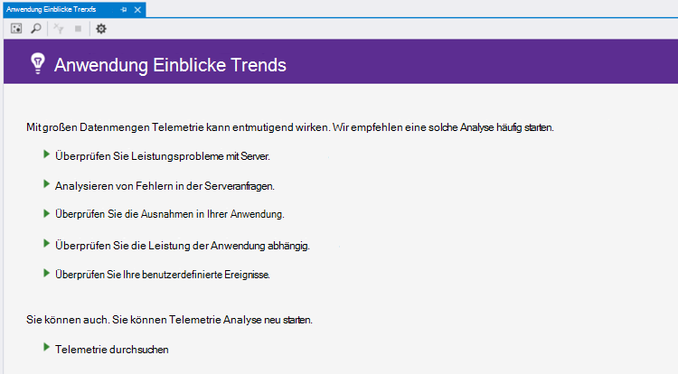
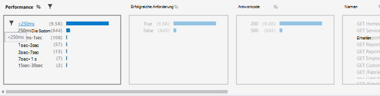
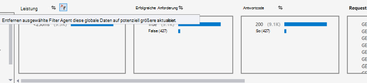
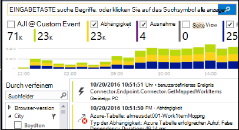

<properties 
    pageTitle="Analysieren von Trends in Visual Studio | Microsoft Azure" 
    description="Analysieren Sie, visualisieren Sie und untersuchen Sie Trends bei der Telemetrie Anwendung Einblicke in Visual Studio." 
    services="application-insights" 
    documentationCenter=".net"
    authors="numberbycolors" 
    manager="douge"/>

<tags 
    ms.service="application-insights" 
    ms.workload="tbd" 
    ms.tgt_pltfrm="ibiza" 
    ms.devlang="na" 
    ms.topic="get-started-article" 
    ms.date="10/25/2016" 
    ms.author="daviste"/>
    
# Analysieren von Trends in Visual Studio

Anwendung Einblicke Trends Tool Visualisierung Ändern Ihrer Anwendung wichtig Telemetrie-Ereignisse im Laufe der Zeit Probleme und Anomalien erkennen helfen. Durch Verknüpfen ausführliche Diagnoseinformationen, können Trends Sie Ihrer Anwendung verbessern, ermitteln Sie die Ursachen von Ausnahmen und Einblicke in Ihre benutzerdefinierte Ereignisse aufdecken.

> [AZURE.NOTE] Anwendung Einblicke Trends ist in Visual Studio 2015 Update 3 und höher oder mit [Analytics Entwicklertools Erweiterung](https://visualstudiogallery.msdn.microsoft.com/82367b81-3f97-4de1-bbf1-eaf52ddc635a) , Version 5.209 und höher.

## Geöffnete Anwendung Einblicke Trends

Öffnen Sie das Fenster Anwendung Einblicke Trends

* Wählen Sie die Symbolleistenschaltfläche Anwendung Einblicke **Telemetrie Trends untersuchen**oder
* Wählen Sie im Kontextmenü Projekt **Anwendung Einblicke > Telemetrie Trends untersuchen**, oder
* Wählen Sie in der Visual Studio-Menüleiste **Ansicht > andere Fenster > Anwendung Einblicke Trends**.

Sie sehen eine Aufforderung, eine Ressource auswählen. **Wählen Sie eine Ressource**ein Azure-Abonnement melden Sie an klicken und wählen Sie eine Anwendung Insights-Ressource aus der Liste für die Telemetrie Trends analysieren möchten.

## Wählen Sie eine Trendanalyse

Zunächst eine allgemeine fünf Trendanalysen jedes analysieren Daten in den letzten 24 Stunden auswählen:

* **Untersuchen von Leistungsproblemen mit Server** - Anfragen zu Ihrem Dienst gruppiert Reaktionszeiten
* **Analyse Fehler in Ihrem Serveranfragen** - Anfragen zu Ihrem Dienst gruppiert HTTP-Antwortcode
* **Untersuchen Sie Ausnahmen in Ihrer Anwendung** - Ausnahmen von Ihrem Dienst gruppiert Ausnahmetyp
* **Überprüfen Sie die Leistung Ihrer Anwendung Abhängigkeiten** - Dienste von Ihrem Dienst gruppiert Reaktionszeiten
* **Benutzerdefinierte Ereignisse überprüfen** - benutzerdefinierte Ereignisse für Ihren Dienst eingerichteten gruppiert nach Typ.

Diese vorgefertigten Analysen sind später über die **gängigen Telemetrie Analyse anzeigen** -Schaltfläche in der linken oberen Ecke des Fensters Trends.

## Visualisieren Sie Trends in der Anwendung

Anwendung Einblicke Trends erstellt eine Time Series Visualisierung aus Ihrer Anwendung Telemetrie. Jedes Mal Serie Visualisierung zeigt eine Telemetrie, gruppiert nach einer Eigenschaft, Telemetrie über einige Zeitbereich. Sie möchten beispielsweise Serveranfragen gruppiert nach Land, aus dem sie, in den letzten 24 Stunden stammt, anzeigen. In diesem Beispiel würde jeder Blase Visualisierung Anzahl Serveranfragen für einige Land während einer Stunde darstellen.

Verwenden Sie die Steuerelemente am oberen Rand des Fensters anpassen, welche Telemetrie anzuzeigen. Zunächst wählen Sie die Telemetrie in der Sie interessiert:

* **Telemetrie Typ** - Anfragen, Ausnahmen, Depdendencies oder benutzerdefinierte Ereignisse
* **Zeitraum** - zwischen der letzten 30 Minuten der letzten 3 Tage
* **Group By** - Ausnahme Typ, Problem-ID, Land und mehr.

Klicken Sie auf **Telemetrie analysieren** , um die Abfrage auszuführen.

So navigieren zwischen Blasen in der Visualisierung:

* Klicken Sie auf eine Blase aktualisiert die Filter am unteren Fensterrand während eines bestimmten Zeitraums aufgetretenen Ereignisse zusammenfassen
* Doppelklicken Sie auf eine Blase zu navigieren Sie zu der Suchfunktion alle einzelnen Telemetrie-Ereignisse, die während dieses Zeitraums aufgetreten sind
* STRG-Taste eine Deduplizierung in der Visualisierung auswählen.

> [AZURE.TIP] Trends und Suche tools tragen Sie die Ursachen der Probleme in Ihrem Dienst unter Tausenden von Telemetrie-Ereignisse zu ermitteln. Beispielsweise wenn Ihre Kunden Ihre app beachten Nachmittag langsamer wird, beginnen Sie mit. Analysieren von Anfragen zu Ihrem Dienst in den letzten mehrere Stunden Reaktionszeit gruppiert. Ist eine ungewöhnlich große Cluster langsam Anfragen anzeigen Dann doppelklicken Sie Blase zu dem Such-Tool die Ereignisse gefiltert. Suche können Inhalt diese Anfragen durchsuchen und navigieren Sie zu der Code zur Behebung des Problems.

## Filter

Weitere Trends Filter Steuerelemente am unteren Rand des Fensters zu ermitteln. Um einen Filter anzuwenden, klicken Sie auf seinen Namen. Sie können schnell zwischen verschiedenen Filtern Trends ermitteln, die in einer bestimmten Dimension der Telemetrie versteckt. Wenden Sie einen Filter in einer Dimension, wie Ausnahmetyp bleiben Filter in anderen Dimensionen geklickt werden kann, obwohl sie grau angezeigt. Un-Filter anzuwenden, klicken sie erneut auf. Halten Sie die STRG-Taste gedrückt, um mehrere Filter in derselben Dimension auszuwählen.

Wenn Sie mehrere Filter übernehmen? 

1. Den ersten Filter anwenden. 
2. Klicken Sie **übernehmen ausgewählten Filter und Abfrage erneut** durch den Namen der Dimension des ersten Filter. Dadurch wird der Telemetrie nur Ereignisse erneut abfragen, die den ersten Filter entsprechen. 
3. Einen zweiten Filter anwenden. 
4. Wiederholen Sie den Vorgang zu Trends in bestimmten Teilmengen der Telemetrie. Beispielsweise Namen Anfragen "Zu Hause/Index" _und_ von Deutschland _und_ kam, die ein 500-Antwort empfangen. 

Un-Filter anwenden, klicken **Entfernen ausgewählten Filter und Abfrage erneut** für die Dimension.

## Hier Anomalien

Trends Tool kann Bläschen Ereignisse hervorheben, die abweichenden im Vergleich zu anderen Blasen in dieselbe Zeitreihe sind. Wählen Sie in der Dropdownliste Typ **Zahlen Zeit Bucket (Highlight Anomalien)** oder **Prozentsätze Zeit Bucket (Highlight Anomalien)**. Anomale werden rote Blasen Anomalien gelten als Bläschen zählt/Prozentsätze von mehr als 2,1 Mal die Standardabweichung der Anzahl/Prozentsätze in der Vergangenheit zwei Zeiträume (48 Std. beim Anzeigen der letzten 24 Stunden usw.).

> [AZURE.TIP] Hervorhebung Anomalien ist hilfreich zum Suchen von Ausreißern in Time Series von Bläschen, die andernfalls suchen entsprechend Größe angepasst.  

## Nächste Schritte

||
|---|---
|**[Arbeiten mit Anwendung Einblicke in Visual Studio](app-insights-visual-studio.md)** Suchen Sie Telemetrie Daten Sie CodeLens und konfigurieren Sie Einblicke Anwendung. In Visual Studio. |
|**[Weitere Daten hinzufügen](app-insights-asp-net-more.md)** Verwendung Verfügbarkeit abhängig, Ausnahmen zu überwachen. Integrieren Sie Spuren von Protokollierung Frameworks. Schreiben Sie benutzerdefinierter Telemetrie. | 
|**[Arbeiten mit Application Insights-portal](app-insights-dashboards.md)** Exportieren von Dashboards, Diagnose- und analytische Werkzeuge, Alarme live Abhängigkeit Übersicht Ihrer Anwendung und Telemetrie. |
